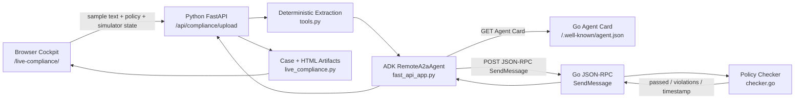

# Architecture: Contract Compliance Multi-Agent Team

This document describes the executable architecture in the repo today. The live demo is a local cross-language system:

- Browser cockpit served by Python at `/live-compliance/`
- Python FastAPI service on `127.0.0.1:8000`
- Go A2A compliance service on `:8888`
- ADK `RemoteA2aAgent` handoff through the Go Agent Card and A2A JSON-RPC `SendMessage`

The Go service is deterministic by design. It is not an LLM agent; it enforces policy thresholds that need repeatable audit behavior.

## Runtime Flow



## Live Request Path

1. The browser selects a bundled contract fixture from `sample-contracts/`.
2. The browser fetches fixture text from `/api/compliance/sample-contracts/{filename}`.
3. The browser posts the text, active policy values, and simulator settings to `/api/compliance/upload`.
4. Python extracts contract fields with deterministic parsing in `tools.py`.
5. Python classifies risk and builds an A2A data payload.
6. Python creates a focused `RemoteA2aAgent` in `fast_api_app.py`.
7. ADK resolves the Go Agent Card from `GO_AGENT_CARD_URL`.
8. ADK sends A2A JSON-RPC `SendMessage` to the Go service.
9. Go decodes the data part, applies deterministic policy checks, and returns a completed A2A task.
10. Python stores the case state, generates HTML artifacts, and returns the UI-visible payload.

## A2A Payload Shape

Python builds the UI-visible request envelope in `build_go_message_payload(...)`:

```json
{
  "jsonrpc": "2.0",
  "id": "case-{case_id}",
  "method": "SendMessage",
  "params": {
    "metadata": {
      "task_id": "{case_id}"
    },
    "message": {
      "messageId": "case-{case_id}-request",
      "taskId": "{case_id}",
      "role": "ROLE_USER",
      "parts": [
        {
          "data": {
            "schema_version": "contract-compliance.a2a.v1",
            "case_id": "{case_id}",
            "contract": {
              "contract_value": 250000.0,
              "contractor_name": "ACME CLOUD SOLUTIONS",
              "insurance_coverage": 2000000.0,
              "liability_limit": "$1,000,000.00",
              "term_length_years": 2,
              "auto_renewal": false,
              "has_termination_clause": true
            },
            "policy": {
              "max_contract_value": 500000.0,
              "required_insurance_minimum": 1000000.0,
              "max_term_years": 5,
              "required_termination_clause": true,
              "prohibited_clauses": ["unlimited liability", "auto-renewal > 3yr"]
            }
          },
          "mediaType": "application/json"
        }
      ]
    }
  }
}
```

Go returns a completed A2A task whose status message contains a data part:

```json
{
  "passed": false,
  "violations": [
    "Contract value $850000.00 exceeds company framework limit of $500000.00"
  ],
  "verdict_timestamp": "2026-06-03T00:00:00Z"
}
```

## State Outcomes

The live cockpit maps Go results into three visible outcomes:

| Outcome | Trigger |
|:---|:---|
| `APPROVED` | Go returns `passed: true`. |
| `REVIEW_READY` | Go returns `passed: false` with policy violations. |
| `MANUAL_REVIEW` | Go is unavailable or simulator mode is `Crashed (503)`. |

The richer enum in `state_schema.py` still includes intermediate states used by the fuller ADK reference path, but the cockpit completes the healthy path in one API call.

## Trust Boundaries

Browser:

- Chooses bundled sample contracts.
- Sends policy override values.
- Never calls the Go service directly.

Python service:

- Enforces file extension and 5MB upload limits.
- Rejects binary PDF uploads; bundled `.pdf` files are text fixtures.
- Resolves sample and artifact paths with basename and root-bound checks.
- Calls only the configured Go Agent Card URL.
- Fails closed to `MANUAL_REVIEW` when the Go handoff fails.

Go service:

- Serves an Agent Card at `/.well-known/agent.json`.
- Accepts JSON-RPC POST requests.
- Handles current `SendMessage` plus legacy `tasks/send` and `tasks/get`.
- Applies deterministic policy rules from `default_policy.json` or request policy overrides.

## Key Files

| File | Role |
|:---|:---|
| `python-extraction-agent/app/static/live-compliance/index.html` | Browser cockpit. |
| `python-extraction-agent/app/fast_api_app.py` | API routes, ADK handoff, case response. |
| `python-extraction-agent/app/tools.py` | Deterministic extraction and risk classification. |
| `python-extraction-agent/app/live_compliance.py` | Case state, events, artifact generation. |
| `python-extraction-agent/app/agent.py` | Fuller ADK `SequentialAgent` reference. |
| `go-compliance-agent/internal/agentcard/card.go` | Agent Card. |
| `go-compliance-agent/internal/handler/task_handler.go` | A2A JSON-RPC handler. |
| `go-compliance-agent/internal/compliance/checker.go` | Deterministic policy checker. |
| `go-compliance-agent/internal/policies/default_policy.json` | Default policy thresholds. |
