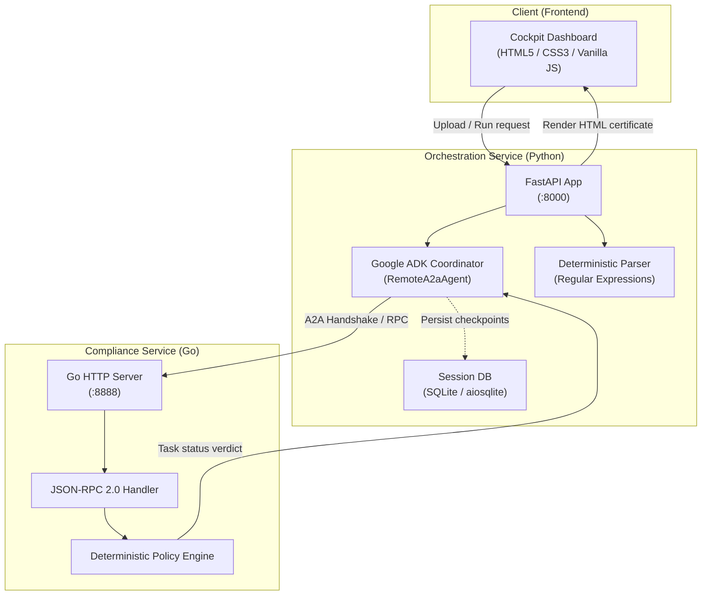
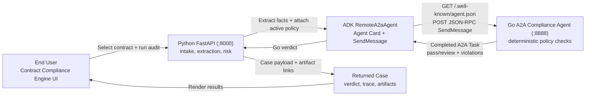

# 📑 Contract Compliance Multi-Agent Team (ADK & A2A)

**Authors**

* [Shubham Saboo](https://github.com/Shubhamsaboo)
* [Eric Dong](https://github.com/gericdong)

This Contract Compliance Engine demonstrates key principles for architecting cross-language, auditable compliance agents. The project contains a Python FastAPI service built with Google ADK for intake, deterministic extraction, and the `RemoteA2aAgent` handoff, plus a Go A2A compliance service that enforces policy rules with repeatable code.

The live demo UI gives contract reviewers a polished cockpit for selecting sample vendor agreements, running compliance audits, watching the Python-to-Go A2A handoff, simulating remote-agent failure modes, and opening generated compliance artifacts outside the raw ADK console.


## Overview

Most agent demos overuse LLMs for every step, including places where deterministic code is a better engineering choice. Contract compliance is one of those places. If the policy says vendor agreements cannot exceed `$500,000`, cannot run longer than `5` years, and must include an exit clause, those checks should be auditable and repeatable.

This repository demonstrates that split of responsibility:

- **Python FastAPI + ADK** handles intake, deterministic extraction, risk classification, session state, artifacts, and the focused `RemoteA2aAgent` handoff.
- **Go A2A compliance agent** exposes an Agent Card and validates extracted contract fields through JSON-RPC `SendMessage`.
- **Contract Compliance Engine UI** shows the full pipeline: contract selection, generated artifacts, live A2A payload, Go verdict, trace spans, simulator controls, and the active compliance policy summary.

The core lesson:

> LLMs are useful for ambiguity. Deterministic agents should enforce hard policy.

The Go service is not an LLM agent. It is a deterministic policy agent exposed through an A2A-compatible interface.

## System Architecture & Technology Stack



### Core Components & Technologies

* **Frontend Dashboard (HTML5 / CSS3 / JavaScript)**: A rich, interactive user interface featuring code syntax highlighting, live state trace timelines, real-time payload visualizers, and an integrated policy overrides editor.
* **Orchestration Service (Python 3.13 / FastAPI / Google ADK)**:
  * **FastAPI**: Serves the cockpit UI, manages upload end-points, and simulates service latencies/outages.
  * **Google ADK (Agent Development Kit)**: Orchestrates the multi-agent execution pipeline and abstracts remote service communication via `RemoteA2aAgent`.
  * **SQLite / aiosqlite**: Stores session logs, execution traces, and agent-state checkpoints.
* **Compliance Validator Service (Go / JSON-RPC 2.0)**:
  * **Go Standard Library (`net/http`)**: High-performance HTTP server that exposes the A2A Agent Card config (`/.well-known/agent.json`).
  * **JSON-RPC 2.0**: The protocol layer used for agent-to-agent communication (supporting `SendMessage`, `tasks/send`, and `tasks/get`).
  * **Go Policy Checker**: Performs synchronous, auditable compliance validation against company thresholds.

## Quick Start

Terminal 1, start the Go A2A compliance agent:

```bash
cd go-compliance-agent
go run cmd/server/main.go
```

Terminal 2, start the Python FastAPI cockpit:

```bash
cd python-extraction-agent
uv sync
uv run uvicorn app.fast_api_app:app --host 127.0.0.1 --port 8000
```

Open the live cockpit:

```text
http://127.0.0.1:8000/live-compliance/
```

This live cockpit path does **not** require a Gemini API key. The extraction fixtures and Go policy checks are deterministic so the demo stays reproducible.

Docker Compose is also available:

```bash
docker-compose up --build
```

## How To Use The Demo

1. Open `/live-compliance/`.
2. Select one of the bundled vendor contracts.
3. Keep **A2A Simulator Mode** on `Healthy` for the normal path.
4. Click **Run Pipeline Audit**.
5. Watch **Agent Exchange** populate with the Python-to-Go `SendMessage` handoff.
6. Open the generated artifacts:
   - legal parameters sheet
   - Go compliance certificate

The UI sends real contract text and active policy settings to Python. Python extracts deterministic contract facts, ADK performs the A2A handoff, and Go returns an auditable policy verdict.

## Sample Outcomes

| Contract | Expected Result | Why |
|:---|:---|:---|
| `standard-vendor-agreement.pdf` | Pass | Value, insurance, term, liability, renewal, and exit terms are within policy. |
| `high-risk-liability-contract.pdf` | Review | Unlimited liability language is prohibited by the Go policy checker. |
| `non-compliant-contract.pdf` | Review | Value, insurance, term, auto-renewal, liability, and exit-safety rules fail. |

The files in `sample-contracts/` are plain-text fixtures with `.pdf` names. That keeps the demo inspectable without hiding behavior behind PDF parsing.

## What Actually Runs



The executable cockpit uses `python-extraction-agent/app/fast_api_app.py` for the live browser path. `python-extraction-agent/app/agent.py` remains as a fuller ADK `SequentialAgent` reference for extract -> comply -> report.

For the detailed topology and sequence diagram, see [ARCHITECTURE.md](./ARCHITECTURE.md).

## Active Policy

The live cockpit summarizes the active Go policy as:

```text
Value Cap: $500k
Term Limit: 5 yrs
Insurance: $1M+
Rules: Exit clause, no unlimited liability, no >3yr renewal
```

Those values are not decorative. The UI sends them as `custom_policies`; FastAPI includes them inside the A2A data part; Go uses them as the effective policy for that audit.

## Key Files

| File | Purpose |
|:---|:---|
| `python-extraction-agent/app/static/live-compliance/index.html` | Live Contract Compliance Engine UI. |
| `python-extraction-agent/app/fast_api_app.py` | FastAPI upload API, sample routes, live ADK `RemoteA2aAgent` handoff. |
| `python-extraction-agent/app/tools.py` | Deterministic extraction and risk classification. |
| `python-extraction-agent/app/live_compliance.py` | Case state, event stream, and generated HTML artifacts. |
| `go-compliance-agent/internal/agentcard/card.go` | Go Agent Card at `/.well-known/agent.json`. |
| `go-compliance-agent/internal/handler/task_handler.go` | JSON-RPC `SendMessage`, `tasks/send`, and `tasks/get` handlers. |
| `go-compliance-agent/internal/compliance/checker.go` | Deterministic policy checker. |
| `go-compliance-agent/internal/policies/default_policy.json` | Default compliance policy. |

## Test Commands

Run Python unit tests:

```bash
cd python-extraction-agent
uv run pytest tests/unit -v
```

Run Go tests:

```bash
cd go-compliance-agent
go test -v ./...
```

Manual smoke test:

```bash
curl http://127.0.0.1:8888/.well-known/agent.json
```

Then run the live cockpit and confirm:

- the Agent Exchange panel shows `SendMessage`
- the A2A payload includes `jsonrpc: "2.0"`
- the Go verdict appears in the UI
- the generated compliance certificate artifact renders


