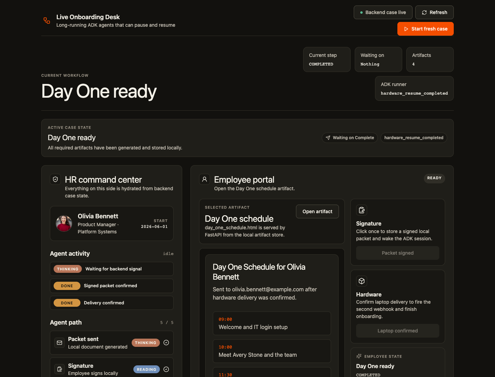
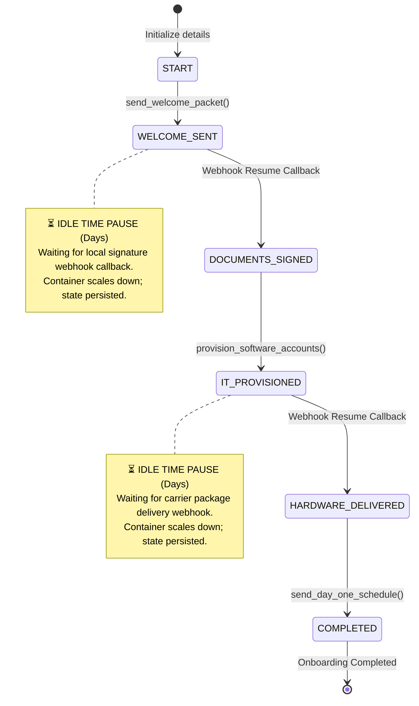

# 👔 Long Running AI Agent Team for New Hire Onboarding

This **HR New Hire Onboarding Coordinator Agent** demonstrates key principles for architecting agents to handle time-agnostic, multi-day workflows. The project contains a ReAct agent powered by [Gemini Flash-Lite](app/agent.py#L67) and built on top of the Google Agent Development Kit (ADK). The agent guides new hires through a structured onboarding state machine and includes a polished live demo UI for showing pause/resume behavior outside the raw ADK web console.



---

## 📖 Overview

Most chatbot tutorials rely on dumping massive conversation history JSON blobs into a vector database to "remember" past turns. However, over multi-day workflows, this unstructured approach introduces severe prompt context pollution, high token costs, and reasoning hallucinations.

To build reliable background agents, we design a **durable, lightweight agent memory schema**. By grounding the [Onboarding Coordinator Agent](app/agent.py#L65) in a strict enum-based state machine, we guarantee the agent maintains its logical reasoning chain across weeks of delay, without relying on raw chat logs. The coordinator coordinates human-in-the-loop task progression and automated system provisioning, ensuring that every onboarding step is completed in order and preventing checkpoints from being bypassed.

---

## 🖥️ Live Onboarding Demo

The repository now includes a production-style React demo served by FastAPI at:

```bash
http://127.0.0.1:8000/live-onboarding/
```

The demo is intentionally built as a two-sided onboarding cockpit:

- **HR command center:** shows backend case state, ADK activity, state-machine progress, local artifacts, and event history.
- **Employee portal:** lets the employee inspect the generated packet, sign it, confirm laptop delivery, and view the resulting artifacts.

The important demo behavior is honest:

- The UI does **not** optimistically advance the workflow.
- Clicking **Sign packet** waits for the backend ADK resume turn to complete before the signed packet/state appears.
- Clicking **Confirm laptop delivered** waits for the hardware ADK resume turn to complete.
- After hardware completion, the employee portal shows the **Hardware delivery receipt** first, then automatically transitions to the **Day One schedule**.
- Local HTML artifacts are real files generated by the FastAPI backend and served through `/api/live-onboarding/cases/{case_id}/artifacts/{artifact_id}`.

This keeps the app demo-friendly while still proving the long-running ADK pattern: the agent pauses at external events, resumes from webhook-like actions, and only moves forward when the backend state has actually changed.

### Demo Flow

1. Start a fresh case.
2. Review the unsigned onboarding packet.
3. Click **Sign packet**.
4. Wait for the ADK signature resume to finish.
5. Review the signed packet.
6. Click **Confirm laptop delivered**.
7. Wait for the ADK hardware resume to finish.
8. See the hardware receipt, then the Day One schedule.

### Run the Live Demo Locally

Authenticate with Google Cloud Application Default Credentials first:

```bash
gcloud auth application-default login
gcloud config set project <your-project-id>
```

Install and run the FastAPI app:

```bash
uv sync
uv run uvicorn app.fast_api_app:app --host 127.0.0.1 --port 8000
```

Then open:

```bash
http://127.0.0.1:8000/live-onboarding/
```

If you change the React frontend, rebuild the static assets:

```bash
cd frontend/live-onboarding
npm install
npm run build
```

The build writes directly into `app/static/live-onboarding`, which is what FastAPI serves.

---

## 🔄 Core Design Patterns: Architecting for Time

To transition from building stateless chatbots to reliable background agents, this repository demonstrates three architectural paradigm shifts:

| Stateless Chatbot Pattern | Durable Background Agent Pattern (This Repo) | Why It Matters |
| :--- | :--- | :--- |
| **Stateless memory** (dumps raw JSON logs or chat histories into vector DBs). | **Durable memory schema** (grounded enums serialized to SQLite/Cloud SQL). | Eliminates prompt context pollution, token bloat, and reasoning hallucinations over multi-week wait times. |
| **Active polling / blocked threads** (keeps loops running or actively polls APIs). | **Event-driven dormancy gates** (dormant scale-to-zero wait state resumed via webhooks). | Conserves compute resources; agent sleep state persists durably at rest until external events trigger wake-up. |
| **Monolithic single-agent** (all tools stuffed into one system instruction). | **Multi-agent delegation** (HR coordinator delegates IT setups to specialized subagents). | Decouples complex workflows, keeps prompts targeted, and preserves the logical reasoning chain. |

---

### 🔄 Onboarding State Machine & Idle Time Pause Gates

This coordinator does not run in a single thread or block execution. It employs **durable dormancy gates** during long periods of **"Idle Time"**—specifically when waiting for signatures or shipping delivery carrier callbacks.



---

## 🏗️ Project Structure

A clear understanding of the workspace layout and files:

```
new-hire-onboarding/
├── app/                                      # Core Agent Application
│   ├── agent.py                              # Main agent logic, model config, & system prompt
│   ├── tools.py                              # Automated tools (emails, IT provisioning, hardware tracking)
│   ├── state_schema.py                       # OnboardingStep enum definition
│   ├── resume_handler.py                     # Callback webhooks to transition states (signatures, delivery)
│   ├── live_onboarding.py                    # Live demo case state, local artifact generation, and API helpers
│   ├── fast_api_app.py                       # FastAPI server exposing agent and custom endpoints
│   ├── agent_runtime_app.py                  # Dedicated Reasoning Engine App wrapper for Agent Runtime
│   ├── static/live-onboarding/               # Built React app served by FastAPI
│   └── app_utils/                            # Shared utilities (telemetry, feedback typing)
├── frontend/live-onboarding/                 # React + Vite source for the live onboarding UI
├── tests/                                    # Test Suites
│   ├── unit/                                 # Basic unit and logic tests
│   ├── integration/                          # Local stream and E2E FastAPI server tests
│   └── eval/                                 # Performance evaluations using Golden Sets
├── pyproject.toml                            # Poetry/uv project description & dependencies
└── GEMINI.md                                 # AI-assisted development instruction playbook
```

### Key Symbols and Modules
*   **State Definitions:** Defined in [OnboardingStep](app/state_schema.py#L15)
*   **Agent Instantiation:** Created in [root_agent](app/agent.py#L65) using the `gemini-3.1-flash-lite` model.
*   **FastAPI App Setup:** Configured in [fast_api_app.py](app/fast_api_app.py)
*   **Webhook Resume Flow:** Implemented in [OnboardingResumeHandler](app/resume_handler.py#L24)
*   **Live Demo State and Artifacts:** Implemented in [live_onboarding.py](app/live_onboarding.py)

---

## 🚀 Features and Steps

1.  **`START`**
    *   **Action:** Collects new hire's full name, personal email, and official start date.
    *   **Tool:** Calls [send_welcome_packet](app/tools.py#L18).
2.  **`WELCOME_SENT`**
    *   **Action:** Pauses for signature. Webhook callback triggers document signing verification.
    *   **Transition Handler:** [receive_signed_documents_callback](app/resume_handler.py#L29).
3.  **`DOCUMENTS_SIGNED`**
    *   **Action:** Collects desired corporate username prefix.
    *   **Tool:** Calls [provision_software_accounts](app/tools.py#L44) to set up corporate email and Slack.
4.  **`IT_PROVISIONED`**
    *   **Action:** Collects a laptop hardware tracking ID (e.g., `HW-12345`).
    *   **Tool/Callback:** Calls [check_hardware_delivery](app/tools.py#L72) or invokes [receive_hardware_delivery_callback](app/resume_handler.py#L50).
5.  **`HARDWARE_DELIVERED`**
    *   **Action:** Finishes hardware step and generates personalized start itinerary.
    *   **Tool:** Calls [send_day_one_schedule](app/tools.py#L102).
6.  **`COMPLETED`**
    *   **Action:** Onboarding is finished! Prints the completed agenda and congratulates the new employee.

---

## ⚙️ Prerequisites

Ensure you have the following installed:
- **uv**: Python package manager — [Install UV](https://docs.astral.sh/uv/getting-started/installation/)
- **agents-cli**(https://google.github.io/agents-cli/): The official command-line interface for the **Gemini Enterprise Agent Platform**. It manages project scaffolding, local interactive playgrounds (`agents-cli playground`), golden evaluations, and reasoning engine deployments. Install it globally using:
  ```bash
  uv tool install google-agents-cli
  ```
- **Google Cloud SDK**: Authenticated to Google Cloud — [Install Gcloud](https://cloud.google.com/sdk/docs/install)

---

## 🛠️ Local Development Commands

| Command | Purpose |
| :--- | :--- |
| `agents-cli install` | Installs the project dependencies via `uv` |
| `agents-cli playground` | Runs the agent in an interactive local chat sandbox |
| `uv run uvicorn app.fast_api_app:app --host 127.0.0.1 --port 8000` | Runs the FastAPI app and live onboarding UI |
| `cd frontend/live-onboarding && npm run build` | Builds the React UI into `app/static/live-onboarding` |
| `agents-cli lint` | Validates code structure and checks styling formatting |
| `uv run pytest tests/unit` | Runs deterministic live onboarding state and artifact tests |
| `uv run pytest tests/integration` | Runs streaming integration tests & E2E fastapi server validations |
| `.venv/bin/adk eval ./app <evalset.json>` | Runs direct local python evaluation runner bypassing system package registries |

---

## 📊 Evaluation & Validation Loop

The agent's state machine transitions are validated using formal golden evaluation sets:

- **Evaluation Set Config:** [eval_config.json](tests/eval/eval_config.json)
- **Golden Standard Cases:** [onboarding_eval.json](tests/eval/evalsets/onboarding_eval.json)
- **Golden Idle-Time Delay Cases:** [idle_time_delay_eval.json](tests/eval/evalsets/idle_time_delay_eval.json)

Run evaluation metrics locally (using the direct virtualenv runner to avoid credential/conflict overrides):
```bash
.venv/bin/adk eval ./app tests/eval/evalsets/idle_time_delay_eval.json --config_file_path tests/eval/eval_config.json
```

---

## ☁️ Infrastructure & Deployment

1.  **Setup Google Cloud Project Config:**
    ```bash
    gcloud config set project <your-project-id>
    ```
2.  **Deploy to Agent Runtime:**
    This project's deployment target is scaffolded and pre-configured for **Agent Runtime** (Agent Engines):
    ```bash
    agents-cli deploy
    ```
    Agent Runtime automatically hosts the server, manages persistent sessions out-of-the-box, and natively integrates trace spans with **Cloud Trace** for real-time ambient monitoring.
3.  **Enhance Project Infrastructure:**
    To add CI/CD runners (GitHub Actions/Cloud Build) or adapt configurations:
    ```bash
    agents-cli scaffold enhance
    ```

---

## 📡 Observability

This agent includes built-in telemetry pre-configured in [telemetry.py](app/app_utils/telemetry.py). It leverages OpenTelemetry to export trace spans, API logs, and model execution metadata directly to **Cloud Trace**, **Cloud Logging**, and **BigQuery**.
