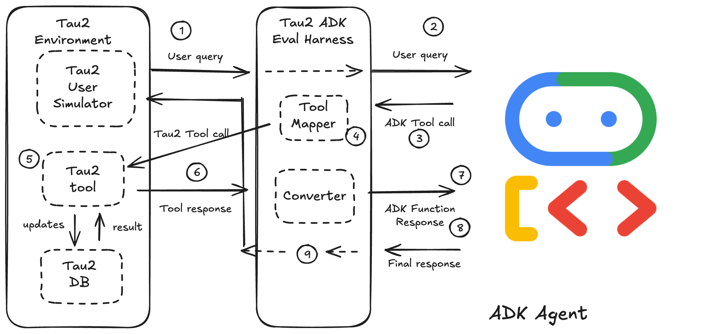

# Tau2 ADK Evaluation Harness

A lightweight evaluation harness for running agents built with Google's Agent Development Kit (ADK) against the [Tau2 Bench](https://github.com/sierra-research/tau2-bench) benchmark.

## Overview

This project bridges the gap between two powerful agent frameworks:

*   **Google's Agent Development Kit (ADK)** provides a robust, asynchronous, event-driven framework for building production-ready agents.
*   **Tau2 Bench** is a sophisticated benchmark for evaluating conversational agents in complex, stateful environments that simulate real-world customer service scenarios.

The harness acts as an **adapter**, allowing you to take an agent developed with the ADK and evaluate its performance using Tau2's realistic user simulators, stateful environments, and objective evaluation metrics.

### How It Works

The harness sits between the ADK agent and the Tau2 ecosystem, orchestrating the conversation and translating calls between the two frameworks. The diagram below illustrates the flow of information during a single turn where the agent decides to use a tool.



Here is a step-by-step walkthrough of what happens during this process:

1.  **The User Speaks:** The **Tau2 User Simulator**, following its instructions for the current task, generates an initial user utterance (e.g., "I need to find a flight from SFO to JFK tomorrow").

2.  **Harness Forwards to ADK Agent:** The **Harness** receives the message, formats it into an ADK `Content` object, and passes it to your **ADK Agent** to process.

3.  **ADK Agent Decides to Use a Tool:** Your agent's LLM analyzes the user's request. Based on its instructions and the available tool definitions (e.g., `adk_find_flights`), it decides to call a tool. The ADK framework emits this decision as a `FunctionCall` event.

4.  **Harness Intercepts and Translates the Tool Call:** The **Harness** intercepts this `FunctionCall` event. Instead of executing the dummy ADK function, it passes the tool name and arguments to the internal **Tool Mapper**. The mapper translates them into the corresponding Tau2 tool name and argument format (e.g., `adk_find_flights` becomes `search_direct_flight`).

5.  **Harness Executes the *Real* Tool:** The harness executes the *translated* tool call against the stateful **Tau2 Environment**.

6.  **Tau2 Environment Returns a Result:** The Tau2 Environment processes the request (e.g., queries its internal flight database) and returns a raw result (e.g., a list of Pydantic `Flight` objects).

7.  **Harness Forwards the Result to the ADK Agent:** The **Harness** receives the raw result from the Tau2 Environment. It formats this result into an ADK `FunctionResponse` object, typically by serializing it to a dictionary or JSON string that the ADK agent's LLM can understand. This is sent back to the agent to inform its next step.

8.  **ADK Agent Formulates a Response:** Your **ADK Agent**'s LLM processes the tool result and generates a natural language response for the user (e.g., "I found three available flights for you...").

9.  **Harness Delivers Response to the User:** The **Harness** captures this final text response and passes it back to the **Tau2 User Simulator**, completing the turn. The user simulator then evaluates the agent's response and generates its own reply, continuing the conversation.

In essence, the harness acts as a **universal translator and middle-man for tool execution**, allowing two separate systems to communicate and function together seamlessly for evaluation purposes.

## Features

**Key Features:**
*   **Dynamic Agent Loading:** Point the harness to your ADK agent file and variable.
*   **Runtime Policy Injection:** Automatically injects the Tau2 domain policy into your ADK agent's instructions for each task.
*   **Extensible Tool Mapping:** A simple, centralized mapping system in `harness/tool_mapper.py` translates tool and argument names between the ADK and Tau2 frameworks.
*   **Full Trajectory Capture:** Captures the complete conversation in Tau2's data format for reliable evaluation.
*   **Sample Agent Included:** Comes with a working sample agent for the `airline` domain to get you started immediately.

## Prerequisites

1.  **Python 3.8+**
2.  A working installation of **Tau2 Bench**. This harness relies on its environment and evaluation libraries. Please follow the [Tau2 Bench installation guide](https://github.com/sierra-research/tau2-bench#installation) first.
3.  **API Keys:** The harness and the underlying frameworks use LLMs. You must provide API keys in a `.env` file in the project's root directory.

    Create a file named `.env` and add your keys:
    ```bash
    # .env file
    GOOGLE_API_KEY="your-google-api-key"
    OPENAI_API_KEY="your-openai-api-key"
    # ... and any other keys for your desired LLM provider
    ```

## Installation

1.  Clone the repository:
    ```bash
    git clone <repository_url>
    cd tau2-adk-harness
    ```

2.  Install the required Python packages:
    ```bash
    pip install -r requirements.txt
    ```

## Quick Start

You can run an evaluation on the included sample agent against the Tau2 `airline` domain.

```bash
python run_evaluation.py \
  --domain airline \
  --adk_agent_path sample_adk_agent/my_agent/agent.py:root_agent \
  --user-llm gemini-2.5-flash \
  --num-tasks 1
```

**Command Breakdown:**
*   `--domain airline`: Specifies the Tau2 domain to run against.
*   `--adk_agent_path ...`: Provides the path to the ADK agent file and the variable name of the agent instance (`file:variable`).
*   `--user-llm ...`: The LLM to power the Tau2 user simulator. A powerful model like Gemini 1.5 Pro or GPT-4 is recommended for realistic user behavior.
*   `--num-tasks 1`: Runs only the first task for a quick test.

## How to Use the Harness

### 1. Evaluating Your Own ADK Agent

To evaluate your custom ADK agent, follow these steps:

1.  **Ensure your agent is defined in a Python file.** For example, `my_company/agents/booking_agent.py` might contain a variable `flight_booker_agent = Agent(...)`.

2.  **Map your agent's tools to Tau2's tools.** Open `harness/tool_mapper.py` and add or update the mapping for the domain you are targeting. For example, if your agent's tool for finding flights is named `search_for_flights`, you would map it to Tau2's `search_direct_flight` in the `airline` domain config.

3.  **Run the evaluation script,** pointing it to your agent:
    ```bash
    python run_evaluation.py \
      --domain airline \
      --adk_agent_path my_company/agents/booking_agent.py:flight_booker_agent \
      --user-llm gemini-2.5-flash
    ```

### 2. Adding Support for a New Tau2 Domain

Extending the harness to support another Tau2 domain (e.g., `telecom`) is straightforward:

1.  **Inspect the Tau2 Domain's Tools:** Use the Tau2 CLI to see the available tools and their signatures for the new domain:
    ```bash
    tau2 domain telecom
    ```
    This will open a ReDoc page with the domain's policy and tool API documentation.

2.  **Update the Tool Mapper:** Open `harness/tool_mapper.py` and add a new entry to the `DOMAIN_CONFIGS` dictionary.

    ```python
    # harness/tool_mapper.py

    def map_telecom_arguments(adk_tool_name: str, adk_args: dict) -> dict:
        # Add logic here if ADK argument names differ from Tau2's
        # For example: map 'phoneNumber' to 'phone_number'
        if 'phoneNumber' in adk_args:
            adk_args['phone_number'] = adk_args.pop('phoneNumber')
        return adk_args

    DOMAIN_CONFIGS = {
        "airline": {
            # ... existing airline config
        },
        "telecom": {
            "tool_map": {
                # ADK Tool Name : Tau2 Tool Name
                "adk_get_customer_by_phone": "get_customer_by_phone",
                "adk_suspend_line": "suspend_line",
                # ... other telecom tool mappings
            },
            "arg_mapper": map_telecom_arguments
        }
    }
    ```

3.  **Create your ADK agent** with the tool signatures you defined (e.g., `adk_get_customer_by_phone`) and run the evaluation against the `telecom` domain.
