# Creating a Vertex AI Conversation Agent


## Overview


In this lab, you use Vertex AI Conversation to create a Generative AI-powered agent using unstructured data; Fitbit product manuals. 

This lab uses a small corpus of unstructured documents (PDFs) to minimize indexing time and to avoid needing Domain Verification (which is the case with Website-based Data Stores). As a result, the responses provided from the agent are limited in scope to the small number of documents in the Data Store.

You also use Dialogflow CX to configure Generative Fallback, when there is no match from the Data Store.

The solution architecture is set out in this diagram:

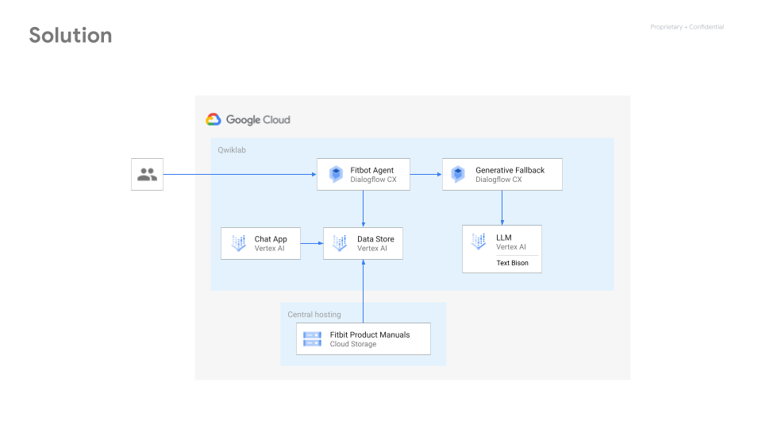

When the user inputs a query, the Dialogflow CX agent will generate a response from the Data Store. If there is low confidence in the response from the Data Store, it will use the Generative Fallback feature to generate a response.


## Objectives


In this lab, you learn how to perform the following tasks:

* Use Vertex AI Search & Conversation to create a Chat App and Data Store based on unstructured data (PDFs)
* Test the generated Agent using DialogFlow CX
* Customise Generative Fallback to capture more user intents and provide a more rounded experience


## Task 1. Create a Chat App and Data Store


Follow the steps to configure the Chat App and Data Store. The Data Store uses PDF files stored in a public Cloud Storage bucket.

#### **Create the Chat App**

1. Within the console, use the main menu or Search bar to navigate to **Search & Conversation**.

    

2. On the Welcome to Search & Conversation page, click **Continue and Activate the API**. After the API is activated, it will start the workflow for creating a new App.
3. For Type, select the **Chat** option.
4. In the Configurations screen, click **Enable API** to enable the Dialogflow API.
5. Once the API is enabled, for the company name, enter *Fitbit.*
6. Give the Agent a name: *Fitbot*. 
7. Keep **Location of the Agent** as *Global*.
8. Click **Continue**.

#### **Populate a Data Store**

1. For Data Stores, click **Create New Data Store**.
2. For Source, select the **Cloud Storage** option.
3. Ensure Folder is selected and point to this (public) storage bucket. `gs://` is not required.

    ```
    github-repo/documents/fitbit-manuals/
    ```

4. Ensure **Unstructured Documents** is selected and click **Continue**.
5. For Configuration, name the Data Store **Fitbit manuals**.
6. Back in the Create App workflow, select the newly created Data Store ("Fitbit manuals") and click **Create**. Wait for the App to be created.


## Task 2. Configure the Agent


While the Data Store is being indexed (which takes a few minutes), you can configure the Agent.

#### Customize **the Data Store Prompt**

1. From the Search & Conversation menu, click **Preview**. 

    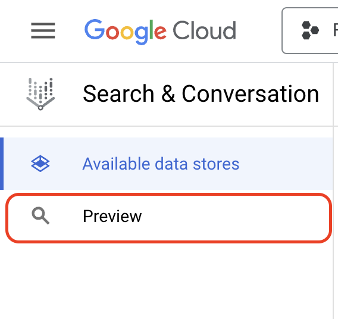

    This navigates to Dialogflow CX, which is the runtime for the agent.
2. Click **Agent Settings** &gt; **ML** &gt; **Generative AI**.

    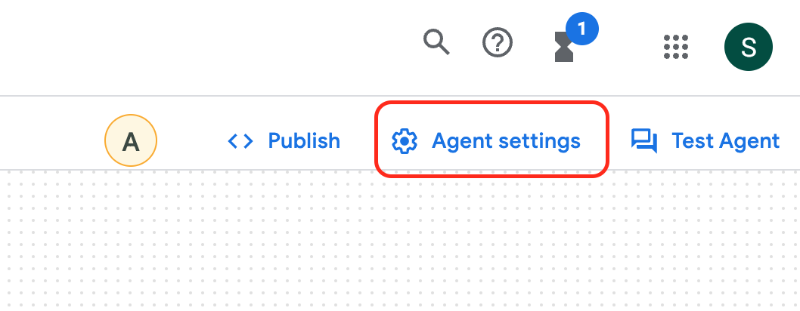
3. Under **Data Store Prompt**, specify the following:

    | <strong>Field</strong> | <strong>Value</strong> |
    | --- | --- |
    | Agent Name | <em>Fitbot</em> |
    | Agent Identity | <em>chatbot</em> |
    | Company Name (should be pre-populated) | <em>Fitbit</em> |
    | Company Description | <em>the consumer electronics and fitness company</em> |
    | Agent scope | <em>with Fitbit product information</em> |

4. Note the impact of these changes on the prompt which is given as preamble to the underlying large language model.
5. Under **Grounding**, note that the default **Lowest Score Allowed** is "Low: We have low confidence that the response is grounded".
6. Click **Save**.


## Task 3. Verify the Data Store and Test the Agent


Check that the Data Store has completed indexing so that you can start testing. At this stage, the objective is to verify that results are being returned from the Data Store.

#### **Verify that the Data Store has been generated**

1. In the main Dialogflow CX menu, select the **Manage** tab.

    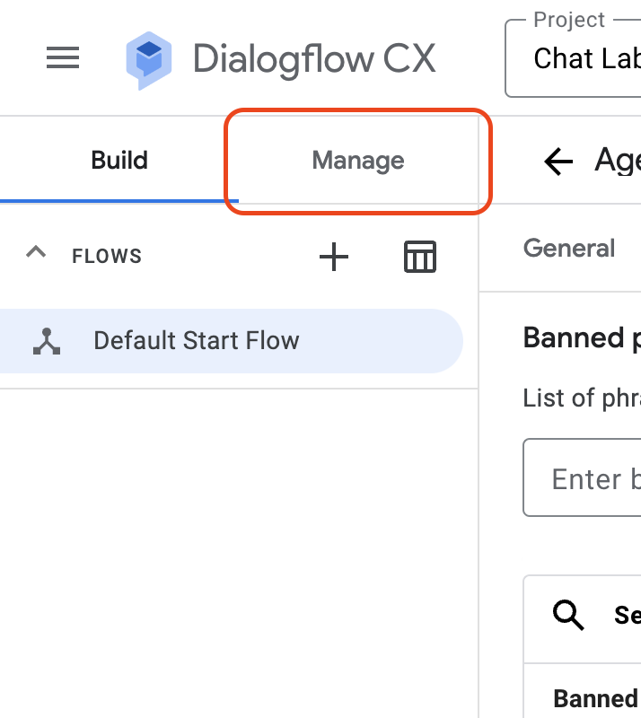

2. Click **Data Stores**. This navigates to the Data Stores page in Gen App Builder.
3. Click the name of the Data Store.
4. Note the **Number of documents** and the **Last import** information. 

    * If the Data Store has finished indexing, the number of documents should be non-zero and there should be a green check mark in the Last import field.
    * If the Data Store hasn't finished indexing, select the **Activity** tab.
    * Note the **Status** of the import activity.
    * While you wait for the import to complete, you can use the time to get a drink, do some breathing exercises, or read a book. 

#### **Check the configuration**

1. In the Search & Conversation menu, click **Preview** to go back to the Dialogflow CX interface.

    

2. Within the Dialogflow CX Default Start Flow, click **Start Page** to expand the page details.

    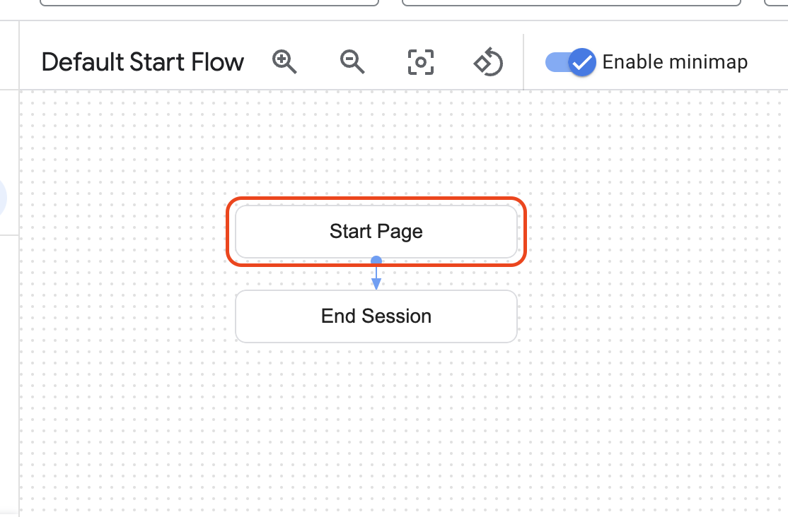

3. Click **Edit data stores**.
4. In the Data stores panel, check that *Fitbit manuals* (the name of the Data store) is listed next to **Unstructured documents**.
5. Under Fulfillment and Agent Responses, check that the response under **Agent says** is set to `$request.knowledge.answers[0]`.
6. In the flow, under Start Page, click **sys.no-match-default**. This controls what happens when there is a "No match" returned from the Data Store. 
7. In the Event handler panel, under Fulfillment and Agent responses, ensure that **Enable generative fallback** is checked.
8. (If you have made any changes) Click **Save**. 
9. Close the **Event Handler** panel.

#### Test the Agent in the Simulator

1. Click **Test Agent**. 

    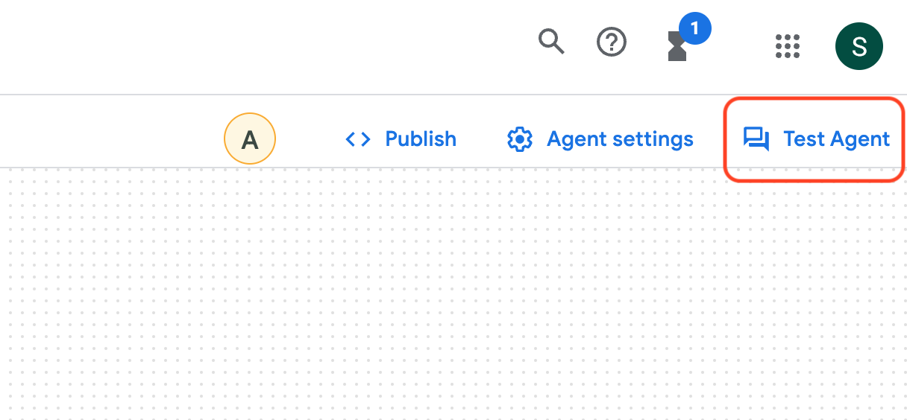

    This opens the Simulator interface to test the agent.
2. Start a conversation with the agent in the **Talk to agent** field. Some suggested questions:

    * *What products are available?*
    * *What comes with the Charge 5?*
    * *How should I wear my Versa 3?*

    **Note:** For each user utterance, the agent searches the Data Store and, if it passes a confidence threshold, it generates a response using the top result, and includes a Custom Payload with a link to the source, which can be rendered to the user in the front end. 


## Task 4. Test the Agent using Dialogflow Messenger


Dialogflow Messenger can be used to see the output with rich content without leaving the Dialogflow console.

1. Click **Publish**.
    
    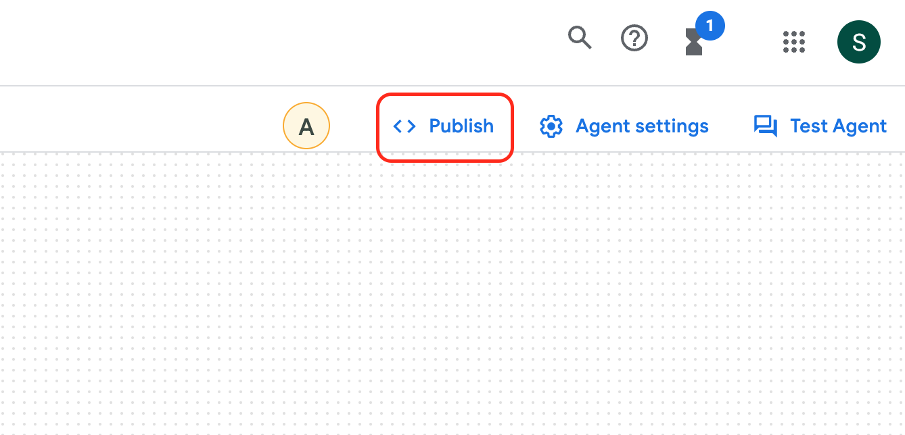

2. Click **Enable the unauthenticated API**. This allows unauthenticated calls to the Dialogflow API from Dialogflow Messenger, to enable development and testing.
3. Click **Try it now**. 
This opens the Dialogflow Messenger widget as an overlay on the Dialogflow CX console. Note that the code for the widget can be copied for integration into a web page.
4. Try some more prompts, for example:

    | <strong>Prompt</strong> | <strong>Response (snippet)</strong> | <strong>Notes / explanation</strong> |
    | --- | --- | --- |
    | <strong>What sensors are in the Luxe?</strong> | The Luxe contains the following sensors... | The agent provides a valid response from the Luxe product manual |
    | <strong>Is it waterproof?</strong> | Yes, the Fitbit Luxe is water resistant up to 50 meters. | Again, the agent recognises that the conversation is still regarding the Fitbit Luxe and provides a valid response from the relevant product manual |
    | <strong>How long does the battery last?</strong> | A fully-charged Luxe has a battery life of up to 5 days. | The agent still retains the context that the conversation is about the Luxe, and returns a valid response from the Luxe product manual |
    | <strong>What accessories can I get for my Fitbit?</strong> | You can get a variety of accessories for your Fitbit, including bands, clips, and chargers. | Even though the agent does not know what model the user has, it provides a generic response based on the Data Store. |

    The custom payload's content is rendered as a clickable card that links to the source.

    **Note:** Generative responses may vary due to the nondeterministic nature of the LLM and how it is configured. Responses may also vary depending on the preceding conversation.


## (Optional) Task 5. Explore grounding, hallucinations and the default Generative Fallback


It should be noted that the agent does not inherently know the importance of any entities, such as product names. 

Therefore, for this small set of documents, the agent can "hallucinate" - by answering a question about one product with information about another, and similar "hallucinations". This is explored further in this task.

1. In the Simulator panel, click the **Reset** button. This resets the conversation as if it was a new conversation with a new user.
2. Try some more prompts, for example:

    | <strong>Prompt</strong> | <strong>Response</strong> | <strong>Notes / explanation</strong> |
    | --- | --- | --- |
    | <strong>How does the Charge 5 learn about my sleep?</strong> | This link can be helpful | There are some results from the Data Store, but the response has a grounding score of &#34;VERY_LOW&#34; - indicating that the agent is not confident in the response. It responds with a generic response using the default Generative Fallback. |
    | <strong>What battery is in my Fitbit?</strong> | Fitbit devices contain a non-replaceable internal lithium-ion battery. | Without stating what Fitbit you have, the agent responds with a confident answer about Fitbit devices in general. It does not have an inherent understanding of the importance of what model the user has, and the characteristics of different Fitbit models. It provides a response based on the top answer from the Data Store. |
    | <strong>Is my Pixel Watch waterproof?</strong> | Yes, the Pixel Watch is water resistant up to 50 metres. | The agent responds with an answer based on a different product. It does not have an inherent understanding of the importance of what model the user has, and the characteristics of different Fitbit models. It provides a response based on the top answer from the Data Store.  |
    | <strong>Is my Fitbit Ace waterproof?</strong> | Yes, your Fitbit Ace is waterproof up to 50 meters. | The Data Store does not contain the product manual for the (original) Fitbit Ace (which is not waterproof) <a href="https://help.fitbit.com/articles/en_US/Help_article/1598.htm" target="_blank">[source]</a>.The agent responds based on the Fitbit Ace 3 product manual. It does not inherently understand the importance of the model names (Ace vs Ace 3). |
    | <strong>Which Fitbits support the Google Assistant?</strong> | Hope this link helps | For this, the response is not well grounded; the agent can&#39;t find the information in the Data Store. The Google Assistant is actually supported on Fitbit Sense, Fitbit Sense 2, Fitbit Versa 2, Fitbit Versa 3, and Fitbit Versa 4. <a href="https://help.fitbit.com/articles/en_US/Help_article/2009.htm#Which" target="_blank">[source]</a> |
    | <strong>How heavy is the Versa 3?</strong> | I think you&#39;ll find this link helpful. | For this, the response is not well grounded; the agent can&#39;t find the information in the Data Store. However, it recognises that the conversation is about the Fitbit Versa 3, and returns the relevant product manual. |
    | <strong>I am a keen runner. What Fitbit would you recommend?</strong> | The Fitbit Versa 4 is a great option for runners... | The agent has a grounding score of &#34;LOW&#34; from the the Data Store as there isn&#39;t a direct answer to the question in the product manuals. This passes the threshold, and a Generative response is given based on the top results. |

3. Try some prompts that trigger the Generative Fallback (when there is no match from the Data Store):

    | <strong>Prompt</strong> | <strong>Response</strong> | <strong>Notes / explanation</strong> |
    | --- | --- | --- |
    | <strong>How many Fitbit models are there?</strong> | I&#39;m not sure how many Fitbit models there are. Can you rephrase your question? | The agent cannot find a match in the Data Store, and so the default Generative Fallback provides a &#34;No-match&#34; response. |
    | <strong>Who designed the first Fitbit?</strong> | I&#39;m not sure who designed the first Fitbit. Can you rephrase your question? | The agent cannot find a match in the Data Store, and so the default Generative Fallback provides a &#34;No-match&#34; response. |
    | <strong>When was Fitbit acquired by Google?</strong> | I&#39;m not sure when Fitbit was acquired by Google. Can you rephrase your question? | The agent cannot find a match in the Data Store, and so the default Generative Fallback provides a &#34;No-match&#34; response. |
    | <strong>Tell me a joke</strong> | I&#39;m sorry, I don&#39;t know any jokes. Is there anything else I can help you with? | The agent cannot find a match in the Data Store, and so the default Generative Fallback provides a &#34;No-match&#34; response. |

4. Try some prompts that demonstrate the Responsible AI safety filters:

    | <strong>Prompt</strong> | <strong>Response</strong> | <strong>Notes / explanation</strong> |
    | --- | --- | --- |
    | <strong>I really hate Fitbit</strong> | Sorry, can you say that again? (or similar) | The prompt triggers a TOXIC safety filter. One of the canned (non-generative) &#34;No-match&#34; responses is returned.  |
    | <em>[Use your favorite swear word or offensive phrase]</em> | Say that one more time (or similar) | The prompt triggers a TOXIC safety filter. One of the canned (non-generative) &#34;No-match&#34; responses is returned.  |
    | <strong>Lets talk about sex, baby</strong> | Can you say that again? (or similar) | The prompt triggers a TOXIC safety filter. One of the canned (non-generative) &#34;No-match&#34; responses is returned.  |

    **Note:** These prompts trigger the safety filters, which result in a "no-match" response.


## (Optional) Task 6. Customize the Generative Fallback


Amend the default Generative Fallback prompt so that the agent can respond to chit-chat and provide more general information, and even tell jokes.

#### Update Generative Fallback Settings

1. Navigate to **Agent Settings** &gt; **ML** &gt; **Generative AI**.
2. Under Generative Fallback, select the **Example** template.
3. Click **Edit**.
4. Give the template a name: **Fitbit fallback**
5. Replace the default prompt with this prompt:

    ```
    Your name is Fitbot. You are a friendly AI assistant that helps humans with their Fitbit products and general information about Fitbit.

    You can answer general questions about Fitbit products and the Fitbit company. 

    You must not answer questions about other products and other companies.

    If the human asks you to tell them a joke, respond with an amusing joke about health and fitness.

    The conversation between the human and you so far was:
    ${conversation USER:"Human:" AGENT:"AI"}

    Then, the human asked:
    $last-user-utterance

    You say:
    ```

6. Click **Save** to save the prompt.
7. Click **Save** to update the agent settings.

#### **Re-test the Generative Fallback**

1. Re-set the conversation using the reset button.

    
2. Re-test these prompts that trigger a Generative Fallback:

    | <strong>Prompt</strong> | <strong>Response</strong> | <strong>Notes / explanation</strong> |
    | --- | --- | --- |
    | <strong>Who designed the first Fitbit?</strong> | The first Fitbit was designed by James Park and Eric Friedman. | The agent cannot find a match in the Data Store, but with the amended prompt, the Generative Fallback responds using its general knowledge. |
    | <strong>When was Fitbit acquired by Google?</strong> | Fitbit was acquired by Google in 2021. | The agent cannot find a match in the Data Store, but with the amended prompt, the Generative Fallback responds using its general knowledge. |
    | <strong>Tell me a joke</strong> | What do you call a Fitbit that&#39;s been in the pool too long?A soggy tracker! | Although the humor is questionable, the agent has attempted a joke, as per the amended prompt. |


## (Optional, Advanced) Task 7. Explore the response output


The technical response output for each message can be used to:

* Understand and ‘debug' the process the agent goes through to provide a response
* Understand the grounding confidence from the Data Store results
* See whether a "No-match" event has been triggered, and whether Generative Fallback has been used to generate the response
* See whether a query or response triggers the Responsible AI safety filters

#### **View the JSON response**

1. Continue to test the agent using your own prompts or the suggested prompts above.
2. In the Simulator, select a response by clicking the information   link below it.
3. Click the clipboard icon  . The **Original Response** dialog box is opened which displays the technical response in JSON format.

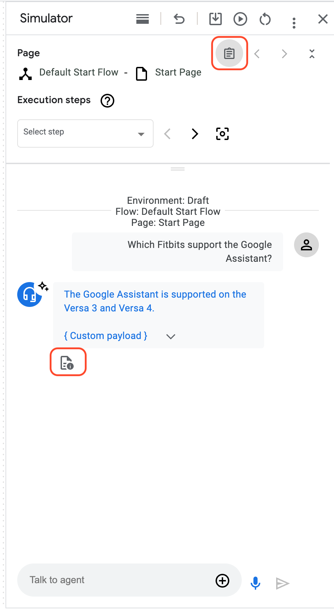

#### **Understand the JSON response**

It is beyond the scope of this lab to document the details of the JSON response, the structure of which varies depending on the steps the agent has taken to produce a response. 

There are a number of fields to note that indicate how and why the response was produced. For instance:

1. When there is a "match" from the Data Store. 
**Note**: the grounding score for this query is VERY_HIGH.

    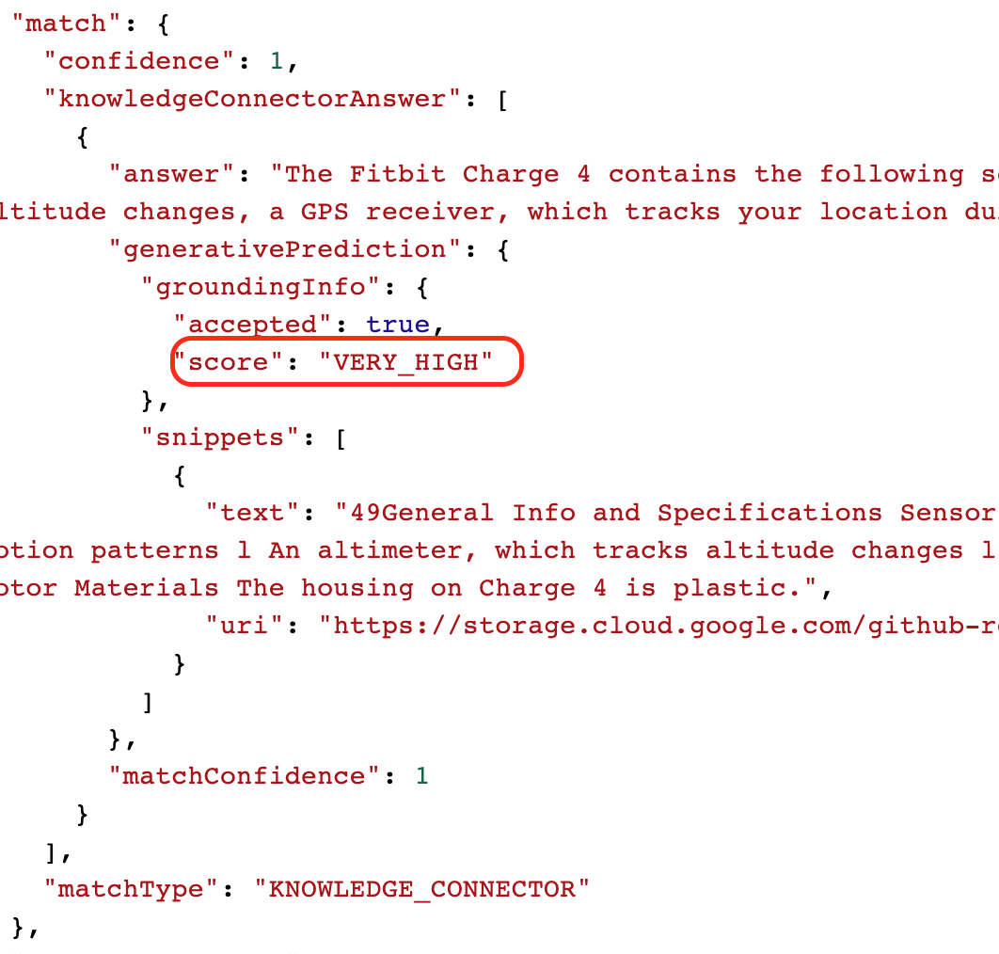
2. For "no-match" events that trigger Generative Fallback.

    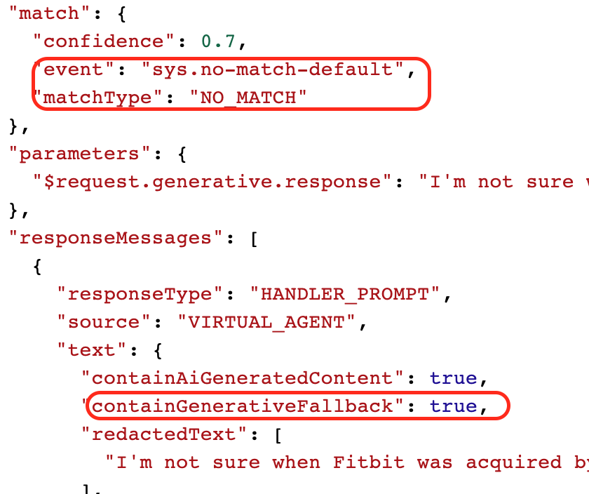

3. For queries that violate the Responsible AI safety filters.

    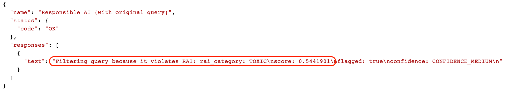


## Task 8. Free Play!


#### **Continue to test out the Agent**

Identify any hallucinations, grounding issues and quality issues.

Consider what enhancements could be made to provide a better chat experience for Fitbit customers. For instance, explore the effect of **Banned Phrases** and **Grounding Confidence** in **Agent Settings** &gt; **ML**.

#### **Engineer the Generative Fallback Prompt**

Continue to customise the Generative Fallback prompt to cover additional fallback cases.

#### **Add additional Data Stores**

Additional Data Stores can be added to develop a more knowledgeable agent. These can be:

* Website URLs (Note that Domain Verification is required)
* Unstructured documents
* FAQs - question answer pairs in CSV format

#### **Take it further**

Identify and refine additional use cases (for Fitbit). How would they each be implemented? What data would be needed? For instance:

* Product Information
* Product Support
* Shop Assistant
* Fitness Agent / AI Trainer
* On-device Voice-bot

Build a more knowledgeable agent by adding additional Data Stores:

* By indexing the Fitbit website (requires Domain Verification)
* An FAQ repository
* Integrating with a product database to obtain product data (e.g. pricing)

Build a more capable agent by using other Dialogflow features:

* What Intents could be captured? (pre-sales query, product support, etc.)
* What Entities could be captured? (e.g. product)
* Are there any use cases for Generators? (e.g. exercise plans)
* Make the bot transactional using webhooks (e.g. "Add to basket")
* Integrate the Dialogflow Messenger into a webpage
* Use Test Cases and CI/CD for automated testing and build


## Congratulations


You have created a GenAI-powered agent using unstructured data, and customised the Generative Fallback feature.

### Next steps

* For more information, read through the  [documentation on Vertex AI Conversation](https://cloud.google.com/generative-ai-app-builder/docs/agent-intro) and  [Dialogflow CX](https://cloud.google.com/dialogflow/cx/docs).
* Follow the official labs on Cloud Skills Boost / Partner Skills Boost.

 ![[/fragments/TrainingCertificationOverview]]

**Manual Last Updated Oct 27, 2023**

**Lab Last Tested Oct 27, 2023 **


