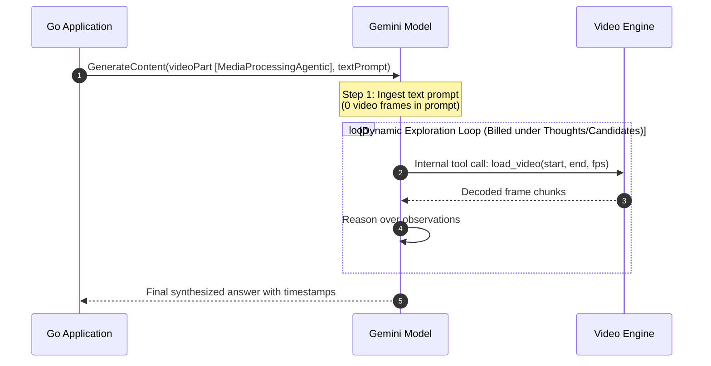

# Gemini Agentic Video Understanding: Go Developer's Guide

A comprehensive, code-first guide to building production applications, microservices, and pipelines with Gemini Agentic Video understanding in idiomatic Go using the official Google Gen AI SDK (`google.golang.org/genai`).

---

## Table of Contents

1. [Architectural Overview](#1-architectural-overview)
2. [Client Initialization & Authentication](#2-client-initialization--authentication)
3. [Core Video Ingestion Mechanics](#3-core-video-ingestion-mechanics)
4. [Reasoning & Thinking Configuration](#4-reasoning--thinking-configuration)
5. [Multi-Video Comparative Synthesis](#5-multi-video-comparative-synthesis)
6. [Multi-Turn Stateful Video Dialogue](#6-multi-turn-stateful-video-dialogue)
7. [Streaming Video Exploration](#7-streaming-video-exploration)
8. [Token Accounting & Cost Telemetry](#8-token-accounting--cost-telemetry)
9. [Production Engineering Best Practices](#9-production-engineering-best-practices)
10. [Concurrent Benchmarking & Goroutines](#10-concurrent-benchmarking--goroutines)

---

## 1. Architectural Overview

Agentic Video Understanding transforms how multimodal models process video:

- **Static Ingestion (Traditional)**: Decodes all video frames upfront at 1 FPS (~300 tokens per second of video). An hour of video costs ~1,000,000 tokens before reasoning begins.
- **Agentic Navigation (Native Gemini 3.8 / 3.7 / 3.6)**: The model receives **0 video frames** in the initial prompt. It is equipped with an internal `load_video` tool that dynamically seeks, scrubs, and inspects video timestamps on demand in an autonomous **Think ➔ Act ➔ Observe** loop.



### Clean Architecture Boundary
In this codebase, the didactic engine is completely decoupled from terminal styling:

```
internal/
├── client/     # Pure Go: Google Cloud auth & genai.NewClient
├── runner/     # Pure Go: Single-video, multi-video, and multi-turn execution
├── telemetry/  # Pure Go: Token metric calculation and cost deltas
├── catalog/    # Pure Go: Scenario definitions
└── ui/         # Presentation layer: Lipgloss banners, badges, and tables (CLI only)
```

You can copy `internal/runner`, `internal/client`, and `internal/telemetry` directly into headless HTTP services, gRPC backends, or Cloud Functions without dragging in any CLI presentation dependencies.

---

## 2. Client Initialization & Authentication

The Google Gen AI SDK supports three client backends:
1. **Enterprise Agent Platform (`genai.BackendEnterprise`)**: Google Cloud enterprise environments.
2. **Vertex AI / Agent Platform (`genai.BackendVertexAI`)**: Google Cloud Agent Platform and Vertex AI workloads.
3. **Gemini Developer API (`genai.BackendGeminiAPI`)**: API-key driven developer access.

### Production Client Factory

```go
package client

import (
	"context"
	"fmt"
	"os"
	"strings"

	"google.golang.org/genai"
)

type Config struct {
	Backend  string
	Project  string
	Location string
	APIKey   string
}

// NewClient initializes a Google Gen AI Client with the selected backend.
func NewClient(ctx context.Context, cfg Config) (*genai.Client, error) {
	clientCfg := &genai.ClientConfig{}

	switch strings.ToLower(cfg.Backend) {
	case "enterprise":
		if cfg.Project == "" {
			return nil, fmt.Errorf("project ID is required for Enterprise backend; set --project or GOOGLE_CLOUD_PROJECT")
		}
		clientCfg.Backend = genai.BackendEnterprise
		clientCfg.Project = cfg.Project
		clientCfg.Location = cfg.Location
	case "vertex":
		if cfg.Project == "" {
			return nil, fmt.Errorf("project ID is required for Vertex AI / Agent Platform backend; set --project or GOOGLE_CLOUD_PROJECT")
		}
		clientCfg.Backend = genai.BackendVertexAI
		clientCfg.Project = cfg.Project
		clientCfg.Location = cfg.Location
	case "gemini":
		clientCfg.Backend = genai.BackendGeminiAPI
		apiKey := cfg.APIKey
		if apiKey == "" {
			apiKey = os.Getenv("GEMINI_API_KEY")
		}
		if apiKey == "" {
			apiKey = os.Getenv("GOOGLE_API_KEY")
		}
		if apiKey == "" {
			return nil, fmt.Errorf("API key required for Gemini API backend; set GEMINI_API_KEY or GOOGLE_API_KEY")
		}
		clientCfg.APIKey = apiKey
	default:
		return nil, fmt.Errorf("unsupported backend %q; use 'enterprise', 'vertex', or 'gemini'", cfg.Backend)
	}

	return genai.NewClient(ctx, clientCfg)
}
```

---

## 3. Core Video Ingestion Mechanics

### Step 1: Create Video Part from URI
Videos are referenced by URI rather than transferring raw binary payloads:
- **YouTube Videos**: `https://www.youtube.com/watch?v=...` or `https://www.youtube.com/shorts/...`
- **Google Cloud Storage (GCS)**: `gs://bucket-name/path/to/video.mp4` or `https://storage.googleapis.com/bucket-name/...`

```go
videoPart := genai.NewPartFromURI("https://www.youtube.com/watch?v=LzExSq9DU9w", "video/mp4")
```

### Step 2: Configure Media Processing Mode
Toggle between agentic dynamic exploration and legacy static ingestion:

```go
// Option A: Dynamic timeline navigation (recommended for long-form & timestamp queries)
videoPart.MediaProcessing = genai.MediaProcessingAgentic

// Option B: Legacy static 1 FPS ingestion (all frames pre-decoded upfront)
videoPart.MediaProcessing = genai.MediaProcessingStatic
```

### Step 3: Enforce Content Sequencing
> [!IMPORTANT]
> **Parts Ordering Rule**: The video part **must always precede** the text prompt part in the user content payload. This ensures Gemini's attention heads bind the multimodal video reference before interpreting prompt instructions.

```go
contents := []*genai.Content{
	genai.NewContentFromParts([]*genai.Part{
		videoPart,                                      // 1. Video part first
		genai.NewPartFromText("Identify key timestamps"), // 2. Text prompt second
	}, genai.RoleUser),
}
```

---

## 4. Reasoning & Thinking Configuration

Agentic video requires reasoning to plan and execute internal `load_video` navigation calls. Reasoning is configured via `ThinkingConfig`:

```go
genConfig := &genai.GenerateContentConfig{
	ThinkingConfig: &genai.ThinkingConfig{
		ThinkingLevel: genai.ThinkingLevelMedium, // Options: Low, Medium, High
	},
}
```

### Recommended Thinking Levels
| Level | Constant | Recommended For |
| :--- | :--- | :--- |
| **High** | `genai.ThinkingLevelHigh` | Rapid visual motion, subtle visual anomalies, complex trail-cam events, short-form clips. |
| **Medium** | `genai.ThinkingLevelMedium` | Long-form presentation Q&A, earnings calls, multi-video comparisons. *(Default)* |
| **Low** | `genai.ThinkingLevelLow` | Simple factual retrieval with low reasoning complexity. |

> [!NOTE]
> `ThinkingLevelMinimal` is not supported on `gemini-3.7-flash` and returns an API validation error.

### Model Architecture & Generation Selection
| Model Generation | Recommended Use Case | Agentic Video Characteristics |
| :--- | :--- | :--- |
| **`gemini-3.8-flash`** | Interactive chat, latency-sensitive triage, short-form clips | **Fastest timeline navigation** (up to 2.1x faster wall-clock speed). Optimized speculative frame fetching and lower reasoning token budgets. |
| **`gemini-3.7-flash`** | Long-form presentation Q&A, detailed transcript cross-referencing | **Deep reasoning**. Balances thorough internal `load_video` seeks with comprehensive, granular timestamp citations. *(Default)* |
| **`gemini-3.6-flash`** | Baseline batch workloads, cost-constrained pipelines | **Cost-effective baseline**. Established first-generation agentic navigation tool implementation. |

---

## 5. Multi-Video Comparative Synthesis

You can compare multiple videos in a single prompt without exceeding context window limits. Because Agentic mode does not pre-ingest frames, combining multiple long videos stays well within token budgets:

```go
func CompareVideos(ctx context.Context, client *genai.Client, video1URI, video2URI, prompt string) (*genai.GenerateContentResponse, error) {
	// Video 1: Agentic
	part1 := genai.NewPartFromURI(video1URI, "video/mp4")
	part1.MediaProcessing = genai.MediaProcessingAgentic

	// Video 2: Agentic (or Static)
	part2 := genai.NewPartFromURI(video2URI, "video/mp4")
	part2.MediaProcessing = genai.MediaProcessingAgentic

	// Assemble parts: all videos first, followed by text prompt
	contents := []*genai.Content{
		genai.NewContentFromParts([]*genai.Part{
			part1,
			part2,
			genai.NewPartFromText(prompt),
		}, genai.RoleUser),
	}

	config := &genai.GenerateContentConfig{
		ThinkingConfig: &genai.ThinkingConfig{
			ThinkingLevel: genai.ThinkingLevelMedium,
		},
	}

	return client.Models.GenerateContent(ctx, "gemini-3.7-flash", contents, config)
}
```

---

## 6. Multi-Turn Stateful Video Dialogue

In conversational applications (chatbots, video assistants), **you do not need to re-upload or re-attach the video part** in subsequent turns. The Gemini model preserves its navigated timeline exploration state in the conversation history:

```go
func RunVideoChat(ctx context.Context, client *genai.Client, videoURI string, questions []string) error {
	config := &genai.GenerateContentConfig{
		ThinkingConfig: &genai.ThinkingConfig{
			ThinkingLevel: genai.ThinkingLevelMedium,
		},
	}

	var history []*genai.Content

	for i, question := range questions {
		var userTurn *genai.Content

		if i == 0 {
			// Turn 1: Attach video part + initial question
			videoPart := genai.NewPartFromURI(videoURI, "video/mp4")
			videoPart.MediaProcessing = genai.MediaProcessingAgentic

			userTurn = genai.NewContentFromParts([]*genai.Part{
				videoPart,
				genai.NewPartFromText(question),
			}, genai.RoleUser)
		} else {
			// Turn 2+: Text question only (video context preserved in history)
			userTurn = genai.NewContentFromText(question, genai.RoleUser)
		}
		history = append(history, userTurn)

		resp, err := client.Models.GenerateContent(ctx, "gemini-3.7-flash", history, config)
		if err != nil {
			return fmt.Errorf("turn %d: %w", i+1, err)
		}

		fmt.Printf("Turn %d Answer:\n%s\n\n", i+1, resp.Text())

		// Append model response to conversation history
		history = append(history, genai.NewContentFromText(resp.Text(), genai.RoleModel))
	}

	return nil
}
```

---

## 7. Streaming Video Exploration

For interactive user experiences, use `GenerateContentStream` to stream the response as it arrives:

```go
func StreamVideoResponse(ctx context.Context, client *genai.Client, videoURI, prompt string) error {
	videoPart := genai.NewPartFromURI(videoURI, "video/mp4")
	videoPart.MediaProcessing = genai.MediaProcessingAgentic

	contents := []*genai.Content{
		genai.NewContentFromParts([]*genai.Part{
			videoPart,
			genai.NewPartFromText(prompt),
		}, genai.RoleUser),
	}

	config := &genai.GenerateContentConfig{
		ThinkingConfig: &genai.ThinkingConfig{
			ThinkingLevel: genai.ThinkingLevelMedium,
		},
	}

	iter, err := client.Models.GenerateContentStream(ctx, "gemini-3.7-flash", contents, config)
	if err != nil {
		return fmt.Errorf("initiating stream: %w", err)
	}

	for chunk, err := range iter {
		if err != nil {
			return fmt.Errorf("stream chunk: %w", err)
		}
		for _, cand := range chunk.Candidates {
			if cand.Content != nil {
				for _, part := range cand.Content.Parts {
					if part.Text != "" {
						fmt.Print(part.Text)
					}
				}
			}
		}
	}

	fmt.Println()
	return nil
}
```

---

## 8. Token Accounting & Cost Telemetry

### The Dynamic Frame Accounting Shift
When reading `resp.UsageMetadata`, developers are frequently surprised:
- **`PromptTokenCount`**: Reflects **only the text prompt** (~100–300 tokens). Video frames are **not** present here.
- **`ThoughtsTokenCount`**: Contains all video frames dynamically decoded by `load_video` during the timeline exploration loop.
- **`CandidatesTokenCount`**: Contains the final output text generated for the user.

```go
func LogTelemetry(usage *genai.GenerateContentResponseUsageMetadata, mode genai.MediaProcessing) {
	if usage == nil {
		return
	}

	fmt.Printf("Total Consumed Tokens:     %d\n", usage.TotalTokenCount)
	fmt.Printf("Prompt Input Tokens:       %d\n", usage.PromptTokenCount)
	fmt.Printf("Candidate Output Tokens:   %d\n", usage.CandidatesTokenCount)
	fmt.Printf("Reasoning Thoughts Tokens: %d\n", usage.ThoughtsTokenCount)

	if mode == genai.MediaProcessingAgentic {
		fmt.Printf("Note: Video frame tokens reside in ThoughtsTokenCount (dynamic load_video calls).\n")
	}
}

// Calculate token savings percentage using internal/telemetry:
// savingsPct := telemetry.TokenReductionPct(agenticTotal, staticTotal)
```

---

## 9. Production Engineering Best Practices

### 1. Enforce Context Timeouts
Agentic exploration on long-form videos (e.g. 1-hour recordings) can take 20–60 seconds of wall-clock time as the model seeks multiple segments:

```go
ctx, cancel := context.WithTimeout(parentCtx, 90*time.Second)
defer cancel()

resp, err := client.Models.GenerateContent(ctx, modelID, contents, genConfig)
if err != nil {
	if errors.Is(ctx.Err(), context.DeadlineExceeded) {
		// Handle graceful timeout
	}
	return err
}
```

### 2. Handle Transient Retries
For network or API quota errors (HTTP 429 / ResourceExhausted), integrate exponential backoff.

### 3. Graceful Degradation in Microservices
When returning video understanding results over REST/JSON:
```go
type VideoResponse struct {
	Answer       string        `json:"answer"`
	TotalTokens  int64         `json:"total_tokens"`
	PromptTokens int32         `json:"prompt_tokens"`
	Duration     time.Duration `json:"duration_ms"`
	Mode         string        `json:"mode"`
}
```
This keeps your HTTP services clean, fast, and completely decoupled from terminal presentation code.

---

## 10. Concurrent Benchmarking & Goroutines

One of Go's distinct superpowers over scripting environments is its lightweight concurrency model. Running comparative model or modality benchmarks (e.g. Agentic vs. Static) can be parallelized with zero thread overhead using **goroutines**, **`sync.WaitGroup`**, and **`sync.Mutex`**:

```go
// ExecuteConcurrentBenchmark executes Agentic and Static video queries in parallel goroutines.
func ExecuteConcurrentBenchmark(
	ctx context.Context,
	client *genai.Client,
	req runner.Request,
	callback runner.BenchmarkProgressCallback,
) runner.BenchmarkResult {
	start := time.Now()
	var res runner.BenchmarkResult
	var mu sync.Mutex
	var wg sync.WaitGroup

	agenticReq := req
	agenticReq.Mode = genai.MediaProcessingAgentic

	staticReq := req
	staticReq.Mode = genai.MediaProcessingStatic

	wg.Add(2)

	// Goroutine 1: Agentic Processing (~20-25s wall clock)
	go func() {
		defer wg.Done()
		agenticResult, agenticErr := runner.Execute(ctx, client, agenticReq)
		mu.Lock()
		res.AgenticResult = agenticResult
		res.AgenticError = agenticErr
		if callback != nil {
			callback(true, res.StaticResult != nil || res.StaticError != nil, agenticResult, res.StaticResult)
		}
		mu.Unlock()
	}()

	// Goroutine 2: Static 1-FPS Processing (~45-60s wall clock)
	go func() {
		defer wg.Done()
		staticResult, staticErr := runner.Execute(ctx, client, staticReq)
		mu.Lock()
		res.StaticResult = staticResult
		res.StaticError = staticErr
		if callback != nil {
			callback(res.AgenticResult != nil || res.AgenticError != nil, true, res.AgenticResult, staticResult)
		}
		mu.Unlock()
	}()

	// Wait for both pipelines to complete concurrently
	wg.Wait()
	res.TotalWallClock = time.Since(start)
	return res
}
```

### Why Concurrency Matters Here:
1. **Halves Benchmark Wall Clock**: Instead of waiting 25s + 50s = 75s sequentially, both pipelines execute simultaneously, finishing in ~45-50s max.
2. **Live Race Visibility**: Because Agentic finishes ~25s before Static, developers can witness the model reach its conclusion in real time while Static is still decoding frames.
3. **Headless & Composable**: The runner function has zero UI dependencies and can stream status events back to any caller (CLI ticker, HTTP server-sent events, or WebSocket).

