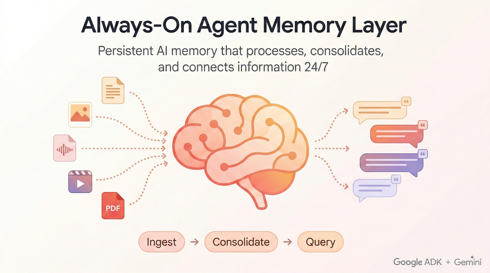

<p align="center">
  
</p>

# Always On Memory Agent

**An always-on AI memory agent built with [Google ADK](https://google.github.io/adk-docs/) + Gemini 3.1 Flash-Lite**

Most AI agents have amnesia. They process information when asked, then forget everything. This project gives agents a persistent, evolving memory that runs 24/7 as a lightweight background process, continuously processing, consolidating, and connecting information.

No vector database. No embeddings. Just an LLM that reads, thinks, and writes structured memory.

## The Problem

Current approaches to LLM memory fall short:

| Approach | Limitation |
|---|---|
| **Vector DB + RAG** | Passive. Embeds once, retrieves later. No active processing. |
| **Conversation summary** | Loses detail over time. No cross-reference. |
| **Knowledge graphs** | Expensive to build and maintain. |

The gap: No system actively consolidates information like a human brain does. Humans don't just store memories. During sleep, the brain replays, connects, and compresses information. This agent does the same thing.

## Architecture


Each agent has its own tools for reading/writing the memory store. The orchestrator routes incoming requests to the right specialist.

## How It Works

### 1. Ingest

Feed the agent **any file** — text, images, audio, video, or PDFs. The **IngestAgent** uses Gemini's multimodal capabilities to extract structured information from all of them:

```
Input: "Anthropic reports 62% of Claude usage is code-related.
        AI agents are the fastest growing category."
           │
           ▼
   ┌─────────────────────────────────────────────┐
   │ Summary:  Anthropic reports 62% of Claude   │
   │           usage is code-related...          │
   │ Entities: [Anthropic, Claude, AI agents]    │
   │ Topics:   [AI, code generation, agents]     │
   │ Importance: 0.8                             │
   └─────────────────────────────────────────────┘
```

**Supported file types (27 total):**

| Category | Extensions |
|---|---|
| Text | `.txt`, `.md`, `.json`, `.csv`, `.log`, `.xml`, `.yaml`, `.yml` |
| Images | `.png`, `.jpg`, `.jpeg`, `.gif`, `.webp`, `.bmp`, `.svg` |
| Audio | `.mp3`, `.wav`, `.ogg`, `.flac`, `.m4a`, `.aac` |
| Video | `.mp4`, `.webm`, `.mov`, `.avi`, `.mkv` |
| Documents | `.pdf` |

**Three ways to ingest:**
- **File watcher**: Drop any supported file in the `./inbox` folder. The agent picks it up automatically.
- **Dashboard upload**: Use the 📎 Upload button in the Streamlit dashboard.
- **HTTP API**: `POST /ingest` with text content.

### 2. Consolidate

The **ConsolidateAgent** runs on a timer (default: every 30 minutes). Like the human brain during sleep, it:

- Reviews unconsolidated memories
- Finds connections between them
- Generates cross-cutting insights
- Compresses related information

```
Memory #1: "AI agents are growing fast but reliability is a challenge"
Memory #2: "Q1 priority: reduce inference costs by 40%"
Memory #3: "Current LLM memory approaches all have gaps"
Memory #4: "Smart inbox idea: persistent AI memory for email"
                   │
                   ▼  ConsolidateAgent
   ┌─────────────────────────────────────────────┐
   │ Connections:                                │
   │   #1 ↔ #3: Agent reliability needs better   │
   │            memory architectures             │
   │   #2 ↔ #1: Cost reduction enables scaling   │
   │            agent deployment                 │
   │   #3 ↔ #4: Smart inbox is an application    │
   │            of reconstructive memory         │
   │                                             │
   │ Insight: "The bottleneck for next-gen AI    │
   │  tools is the transition from static RAG    │
   │  to dynamic memory systems"                 │
   └─────────────────────────────────────────────┘
```

### 3. Query

Ask any question. The **QueryAgent** reads all memories and consolidation insights, then synthesizes an answer with source citations:

```
Q: "What should I focus on?"

A: "Based on your memories, prioritize:
   1. Ship the API by March 15 [Memory 2]
   2. The agent reliability gap [Memory 1] could be addressed
      by the reconstructive memory approach [Memory 3]
   3. The smart inbox concept [Memory 4] validates the
      market need for persistent AI memory"
```

## Quick Start

### 1. Install

```bash
git clone https://github.com/Shubhamsaboo/always-on-memory-agent.git
cd always-on-memory-agent
pip install -r requirements.txt
```

### 2. Set your API key

```bash
export GOOGLE_API_KEY="your-gemini-api-key"
```

Get your API key from [Vertex AI Studio](https://vertexai.google.com/) or [Google AI Studio](https://aistudio.google.com/).

### 3. Start the agent

```bash
python agent.py
```

That's it. The agent is now running:
- Watching `./inbox/` for new files (text, images, audio, video, PDFs)
- Consolidating every 30 minutes
- Serving queries at `http://localhost:8888`

### 4. Feed it information

**Option A: Drop any file**
```bash
echo "Some important information" > inbox/notes.txt
cp photo.jpg inbox/
cp meeting.mp3 inbox/
cp report.pdf inbox/
# Agent auto-ingests within 5-10 seconds
```

**Option B: HTTP API**
```bash
curl -X POST http://localhost:8888/ingest \
  -H "Content-Type: application/json" \
  -d '{"text": "AI agents are the future", "source": "article"}'
```

### 5. Query

```bash
curl "http://localhost:8888/query?q=what+do+you+know"
```

### 6. Dashboard (optional)

```bash
streamlit run dashboard.py
# Opens at http://localhost:8501
```

The Streamlit dashboard connects to the running agent and provides a visual interface for:
- **Ingesting** text and uploading files (images, audio, video, PDFs)
- **Querying** memory with natural language
- **Browsing** and **deleting** stored memories
- **Consolidating** memories on demand

## API Reference

| Endpoint | Method | Description |
|---|---|---|
| `/status` | GET | Memory statistics (counts) |
| `/memories` | GET | List all stored memories |
| `/ingest` | POST | Ingest new text (`{"text": "...", "source": "..."}`) |
| `/query?q=...` | GET | Query memory with a question |
| `/consolidate` | POST | Trigger manual consolidation |
| `/delete` | POST | Delete a memory (`{"memory_id": 1}`) |
| `/clear` | POST | Delete all memories (full reset) |

## CLI Options

```bash
python agent.py [options]

  --watch DIR              Folder to watch (default: ./inbox)
  --port PORT              HTTP API port (default: 8888)
  --consolidate-every MIN  Consolidation interval (default: 30)
```

## Project Structure

```
always-on-memory-agent/
├── agent.py          # Always-on ADK agent (the real thing)
├── dashboard.py      # Streamlit UI (connects to agent API)
├── requirements.txt  # Dependencies
├── inbox/            # Drop any file here for auto-ingestion
├── docs/             # Logo assets (Gemini, ADK)
└── memory.db         # SQLite database (created automatically)
```

## Why Gemini 3.1 Flash-Lite?

This agent runs continuously. Cost and speed matter more than raw intelligence for background processing:

- **Fast**: Low-latency ingestion and retrieval, designed for continuous background operation
- **Cheap**: Negligible cost per session, making 24/7 operation practical
- **Smart enough**: Extracts structure, finds connections, synthesizes answers

## Built With

- [Google ADK](https://google.github.io/adk-docs/) (Agent Development Kit) for agent orchestration
- [Gemini 3.1 Flash-Lite](https://docs.cloud.google.com/vertex-ai/generative-ai/docs/models/gemini/3-1-flash-lite) for all LLM operations
- SQLite for persistent memory storage
- aiohttp for the HTTP API
- Streamlit for the dashboard

## License

MIT
