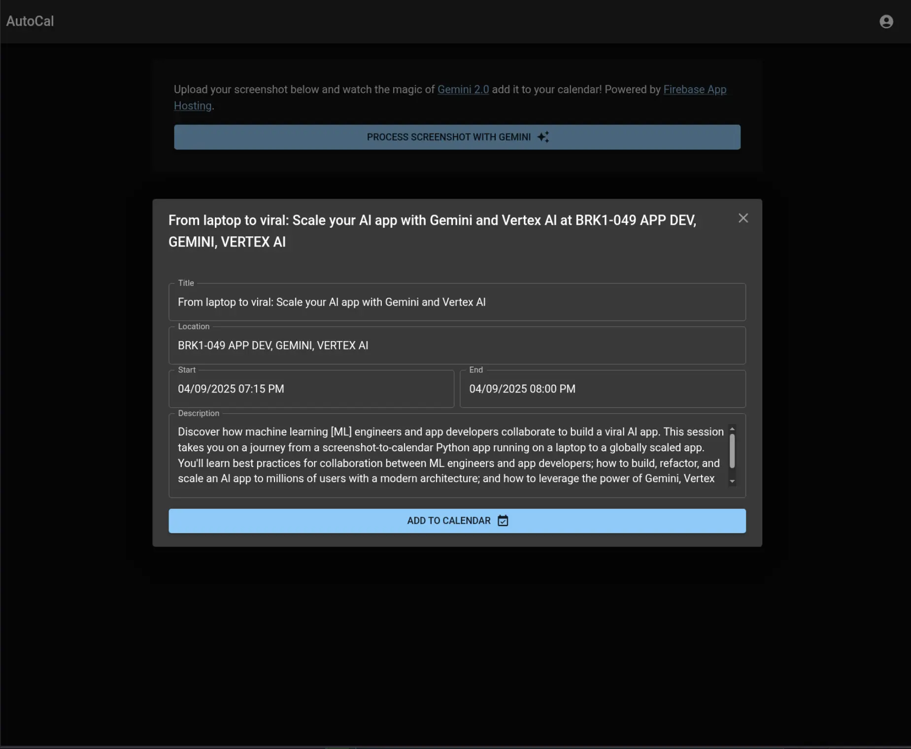
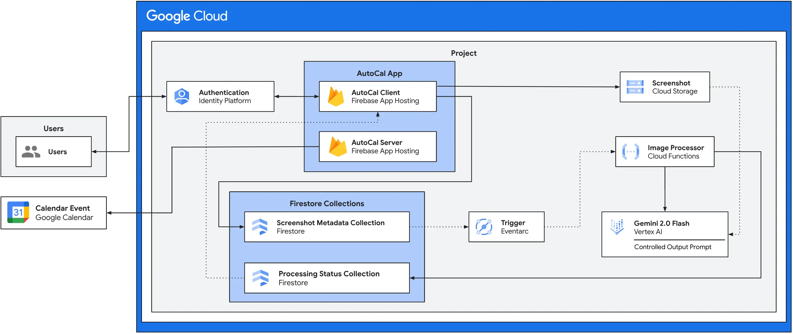

# AutoCal

|           |                                                                                               |
| --------- | --------------------------------------------------------------------------------------------- |
| Author(s) | [Stephanie Anani](https://github.com/stephanieanani), [Matt Day](https://github.com/mattsday) |

Screenshot to Calendar Magic with Gemini 2.0 Flash



AutoCal is a web application that leverages the power of Gemini 2.0 Flash to automatically extract event information from screenshots and add them to your calendar. It simplifies the process of scheduling by eliminating the need for manual data entry.

The app is event driven, using Firestore triggers to invoke Gemini 2.0 Flash in the backend, and snapshot listeners to update the frontend UI. It is designed to show the scalable combination of Python and JavaScript to build a high-scale web app.



## Project Structure

1. [frontend/](frontend) - a Next.js / MUI frontend for the user to interact with
2. [image-processor-function/](image-processor-function/) - a Python Cloud Function to process and handle images

## Getting Started

### Prerequisites

You will require a Google Cloud Project with billing enabled to use this app.

### Setup

#### Part 1 - Run Terraform

Terraform will provision much of the underlying infrastructure and dependencies.

The `terraform` directory includes all of the steps you will need to provision the infrastructure and app.

See [terraform/README.md](terraform/README.md) for instructions on how to do this.

#### Part 2 - Configure The App

You will need to create an OAuth 2 Web application in the Google Cloud console. You can do so here in the [Credentials](https://console.cloud.google.com/apis/credentials) page under "OAuth 2.0 Client IDs".

You will also need to create a 32-character secret key for use in Firestore to encrypt user sessions. You can generate this with OpenSSL if you have it:

```bash
openssl rand -hex 16
```

| Field                   | Requirement                                             |
| ----------------------- | ------------------------------------------------------- |
| `CLIENT_SECRET`         | The Client Secret from your OAuth 2.0 Web Application.  |
| `NEXT_PUBLIC_CLIENT_ID` | The Client ID from your OAuth 2.0 Web Application       |
| `ENCRYPTION_KEY`        | A 32-character string used to encrypt data in Firestore |

You can then configure Firebase App Hosting.

##### Update apphosting.yaml

Change `NEXT_PUBLIC_CLIENT_ID` to the value from above.

##### Deploy Secrets

The Client Secret and Encryption key should not be stored in files or checked into source control. Instead, use App Hosting's CLI to deploy them to secret manager

```sh
export PROJECT_ID=PROJECT_ID
firebase apphosting:secrets:set CLIENT_SECRET --project "${PROJECT_ID}"
firebase apphosting:secrets:set ENCRYPTION_KEY --project "${PROJECT_ID}"
```

#### Part 3 - Configure Firebase

You will need to update [frontend/libs/firebase/config.ts](frontend/libs/firebase/config.ts) to reflect your configuration, which you can find in [the Firebase console](https://console.firebase.google.com/) under Settings, "Your Apps".

For example:

```ts
export const firebaseConfig = {
  apiKey: "xxxx",
  authDomain: "xxxx",
  projectId: "xxxx",
  storageBucket: "xxxx",
  messagingSenderId: "xxxx",
  appId: "xxxx",
  measurementId: "xxxx",
};
```

**Important:** Ensure the `export` keyword is there.

#### Part 4 - Deploy the App to Firebase App Hosting

```sh
firebase apphosting:backends:create --project "${PROJECT_ID}" --location europe-west4
```

#### Part 5 - CORS Configuration

Finally, Google Cloud Storage uses [CORS](https://cloud.google.com/storage/docs/using-cors) to protect assets.

To update the configuration, take a note of your application URL created with Terraform and update [utils/cors/cors.json](utils/cors/cors.json). Then run the [cors.sh](utils/cors/cors.sh) script with the name of your firebase config bucket in the environment variable `BUCKET_NAME`.
