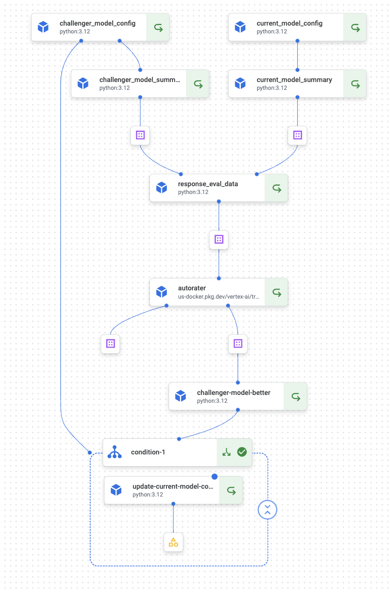

# [GenOps](https://cloud.google.com/blog/products/devops-sre/genops-learnings-from-microservices-and-traditional-devops?e=48754805) Champion Challenger Pipelines

Leverage Vertex AI pipeline and [Auto SxS](https://cloud.google.com/vertex-ai/generative-ai/docs/models/side-by-side-eval) to automate the process of evaluating and deploying new challenger candidate models against an existing Gen AI champion model, ensuring a controlled and efficient model update GenOps CI/CD workflow

## Key Benefits

- Controlled Model Deployment: Reduces risks associated with model updates by automating the evaluation and deployment process.
- Model Version Control & Lineage Tracking: Maintains a clear history of model versions and their performance. Enables rollback to previous model versions if needed.
- Vertex AI Pipelines Integration: Provides a visual representation of the workflow, facilitating monitoring and troubleshooting.
- Automation with Cloud Trigger: Eliminates manual intervention and allows for frequent, efficient model updates.
- Introduce human-in-the-loop: Add a human-in-the-loop component for human supervised model deployment

Google Cloud Services Used: Cloud Build, Vertex AI Pipelines, Auto SxS, Google Cloud Storage, BigQuery

## Workflow

- Prompt & Parameter Config: Prompt templates (including system instructions) along with model parameters are tracked in a 'config.json' file in a GCS bucket which can be used by dependent apps and also tracks model config.
- Evaluation Dataset: The ground truth eval dataset is stored in BigQuery, serving as the ground truth for comparing current champion and challenger model predictions.
- Vertex AI Pipeline orchestrates Kubeflow components to retrieve the champion/ challenger model configs from GCS bucket, run current and champion LLM responses against BQ ground truth dataset for Auto side-by-side to evaluate the champion and challenger responses
- Auto Side-by-Side wrapped Kubeflow Pipeline step: Judges champion model and challenger model responses against Input Instructions and creates judgement metrics and summary metrics with corresponding win rates for models.
- [Kubeflow Control Flow](https://www.kubeflow.org/docs/components/pipelines/user-guides/core-functions/control-flow/): Checks if the candidate challenger model win rate is greater than current champion model then:
- Before promoting the challenger model config, the champion model config is version controlled and then updated with winning model config params
- Cloud Build: Configure the Vertex AI Pipeline with Cloud Build
- Trigger Champion Challenger Vertex AI Pipeline with ([Git triggers](https://cloud.google.com/build/docs/triggers#github)) or trigger manually by running following in terminal/ [add triggers](https://cloud.google.com/build/docs/triggers):
  - `gcloud builds submit src --config=pipelinebuild.yaml`
- Add GCS [Pub Sub triggers](https://cloud.google.com/build/docs/automate-builds-pubsub-events#gcs_build_trigger) so that whenever challenger model config is updated, associated cloud build trigger can kickstart evaluation pipeline to evaluate whether the new candidate model is better and if champion model needs updating

### Champion Challenger Pipeline



### Pre-Requisites

This champion challenger pipeline is built-in context of a Summarisation app.

- Create pipeline GCS bucket `genops-eval-pipelines` if it doesn't exist

```BASH
PROJECT_ID="[your-project-id]"
LOCATION="us-central1"
PIPELINE_BUCKET_URI="gs://genops-eval-pipelines"
gsutil mb -l $LOCATION -p $PROJECT_ID $PIPELINE_BUCKET_URI
```

- Create `genops/model-config` GCS bucket if it doesn't exist to persist current and candidate model configs

```BASH
BUCKET_URI="gs://genops"
gsutil mb -l $LOCATION -p $PROJECT_ID $BUCKET_URI
```

- The pipeline example leverages current champion model for summarisation Associated model and other config parameters are stored in `summarization.json` with following schema in the GCS Bucket:

```json
{
  "model": "MODEL_NAME",
  "system_instruction": "Your system isntructions. ",
  "prompt_template": "Prompt template",
  "temperature": TEMPERATURE,
  "max_output_tokens": OUTPUT_TOKENS,
  "top_p": TOP_P
  }
```

- You can find sample config files under [sample_model_config](sample_model_config). Copy to the `genops` bucket using

```BASH
gsutil cp -r sample_model_config/summarization.json $BUCKET_URI/model-config/summarization.json
```

- After further exploration, data scientists can make a new `challenger_summarization.json` file available in this GCS Bucket, the config params for candidate models also follow the above schema; the above pipeline can be triggered.

```BASH
gsutil cp -r sample_model_config/challenger_summarization.json $BUCKET_URI/model-config/challenger_summarization.json
```

- You can use the following ddl to create BQ schema pipeline expects. At first create a dataset called `genops` in your BQ project in the same regions. Replace `[your-project-id]` placeholder with relevant project ID below.

```SQL
-- Ground Truth Dataset table summarizer_data containing raw text articles and golden summaries.

CREATE TABLE `[your-project-id].genops.summarizer_data`
(
  id INT64,
  article STRING,
  golden_summary STRING
);

-- Insert/Load your articles to be summarised along with (optional) golden summary

-- Champion model response against summarizer_data articles

CREATE TABLE `[your-project-id].genops.summarizer_champion_model`
(
  id INT64,
  prompt STRING,
  model_summary STRING
);

-- Challenger model response against summarizer_data articles

CREATE TABLE `[your-project-id].genops.summarizer_challenger_model`
(
  id INT64,
  prompt STRING,
  model_summary STRING
);

-- Champion Challenger response evaluation set for AutoSxS pipelines

CREATE TABLE `[your-project-id].genops.summarizer_champion_challenger_eval`
(
  id INT64,
  article STRING,
  current_model_summary STRING,
  challenger_model_summary STRING
);
```

- Trigger Cloud Build Pipeline:

```BASH
gcloud builds submit src --config=pipelinebuild.yaml
```
