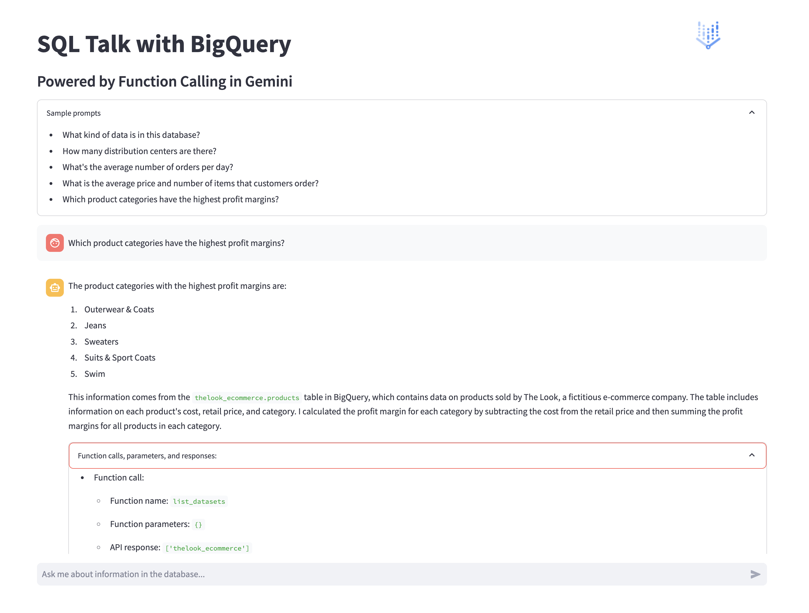

# SQL Talk: Natural Language to BigQuery with Gemini's Function Calling

## Overview

This app demonstrates the power of
[Gemini's function calling](https://cloud.google.com/vertex-ai/docs/generative-ai/multimodal/function-calling)
capabilities, enabling users to query and understand their BigQuery databases
using natural language. Forget complex SQL syntax – interact with your data
conversationally.

Function calling in Gemini lets developers create a description of a function in
their code, then pass that description to a language model in a request. The
response from the model includes the name of a function that matches the
description and the arguments to call it with.

Try using the demo app now! https://sql-talk-r5gdynozbq-uc.a.run.app/



## Usage

**Ask Questions:** Type questions about your data in a natural language format
such as:
- What kind of data is in this database?
- How many distribution centers are there?
- What's the average number of orders per day?
- What is the average price and number of items that customers order?
- Which product categories have the highest profit margins?

**Get Answers:** Gemini will process your prompt, generate appropriate SQL
queries and/or BigQuery commands, execute them on BigQuery, and return results
in plain language.

## Key Features

- Natural Language Interface: Ask questions in plain language; the app handles
  SQL generation
- Function Calling: Gemini uses tools you define to make real-time queries to
  the database
- Multi-Turn Conversations: Maintains context for in-depth explorations of the
  data
- BigQuery Integration: Uses the BigQuery Python SDK

## Technical Components

- Vertex AI
- Gemini Pro model, incl. function calling
- BigQuery Python Client
- Streamlit

## Prerequisites

- A Google Cloud Platform (GCP) project with billing enabled
- A BigQuery dataset (we used the
  [`thelook_ecommerce` public dataset](https://console.cloud.google.com/marketplace/product/bigquery-public-data/thelook-ecommerce))
- APIs for Vertex AI and BigQuery enabled
- Familiarity with Python and basic SQL concepts

## Run the app locally

1. Clone this repository
2. `cd` into the `gemini/function-calling/sql-talk-app` directory
3. Install dependencies with `pip install -r requirements.txt`
4. Run the app with `streamlit run app.py`
5. Navigate to the app in your browser at a URL similar to `http://localhost:8501`

## Steps to deploy the web app to Cloud Run

To deploy this app to Cloud Run, run the following command to have the app built
with Cloud Build and deployed to Cloud Run, replacing the `service-account` and
`project` values with your own values, similar to:

```
gcloud run deploy sql-talk --allow-unauthenticated --region us-central1 --service-account sql-talk@koverholt-devrel-355716.iam.gserviceaccount.com --source .
```

## Access the deployed app

After deploying your app, you should can visit the app URL, which should be
similar to:

https://sql-talk-r5gdynozbq-uc.a.run.app/

Congratulations, you've successfully deployed the SQL Talk demo app!

## Extending Functionality

You can also rewrite the functions and application code to try new things!
Consider adding tools to perform:

- Data visualization: Create charts/graphs to summarize the findings
- Other database integrations: Support for PostgreSQL, MySQL, etc.
- APIs: Connect to weather APIs, translation services, and more.

## Additional resources

You can continue learning about conversational AI and generative AI with
these guides and resources:

- [Documentation on function calling in Gemini](https://cloud.google.com/vertex-ai/docs/generative-ai/multimodal/function-calling)
- [Codelab on How to Interact with APIs Using Function Calling in Gemini](https://codelabs.developers.google.com/codelabs/gemini-function-calling)
- [Sample notebook for Function Calling with the Gemini API](https://github.com/GoogleCloudPlatform/generative-ai/blob/main/gemini/function-calling/intro_function_calling.ipynb)
