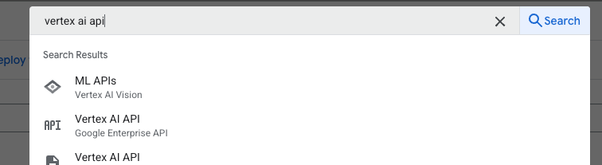

`app.py` demonstrates a simple implementation to solve for this use case.

## Getting Started

### Install Requirements

You'll want to install the requirements to get started. 

```bash
pip3 install -r requirements.txt
```

### Enable the Vertex AI API
To use the Vertex AI SDK and interact with the Gemini model, you need to ensure the **Vertex AI API** is enabled in your Google Cloud project.

1. In the Google Cloud Console, search for **Vertex AI API** in the search bar and select **Vertex AI API** from the results.
    
2. If the API is not enabled, click the **Enable** button.
    
## Launching the webapp

To launch the webapp, run the following command: 

```bash
streamlit run app.py
```

### Launching the webapp in Coud Shell Editor
If you are working in cloud shell editor, you'll need to run the following command to start the Streamlit application and make it locally accessible within your Cloud Shell environment:

```bash
streamlit run app.py --browser.serverAddress=localhost --server.enableCORS=false --server.enableXsrfProtection=false --server.port 8080
```

## Note: A more explicit way to define contents

The way  `contents` is defined in `app.py` works because the SDK is smart enough to understand that a list containing strings represents user text input, and it automatically formats it correctly for the model API.

However, the more **explicit and fundamental way to structure input involves using `types.Part` and `types.Content` objects**, looks like this:

```python 
user_message_parts = [types.Part.from_text(text=prompt)]
contents = [
    types.Content(
        role='user', # Indicates the content is from the user
        parts=user_message_parts, # A list, allowing multiple types of content
    ),
]
```

You might wonder **why use this more verbose method**? The explicit `types.Part` and `types.Content` structure becomes **necessary when your input is more complex than just simple text**. The most common scenario is when you need to send **multi-modal prompts**, such as combining text with an image. Read more about `contents` and parts in this [Vertex AI doc](https://cloud.google.com/vertex-ai/generative-ai/docs/model-reference/inference#contents).