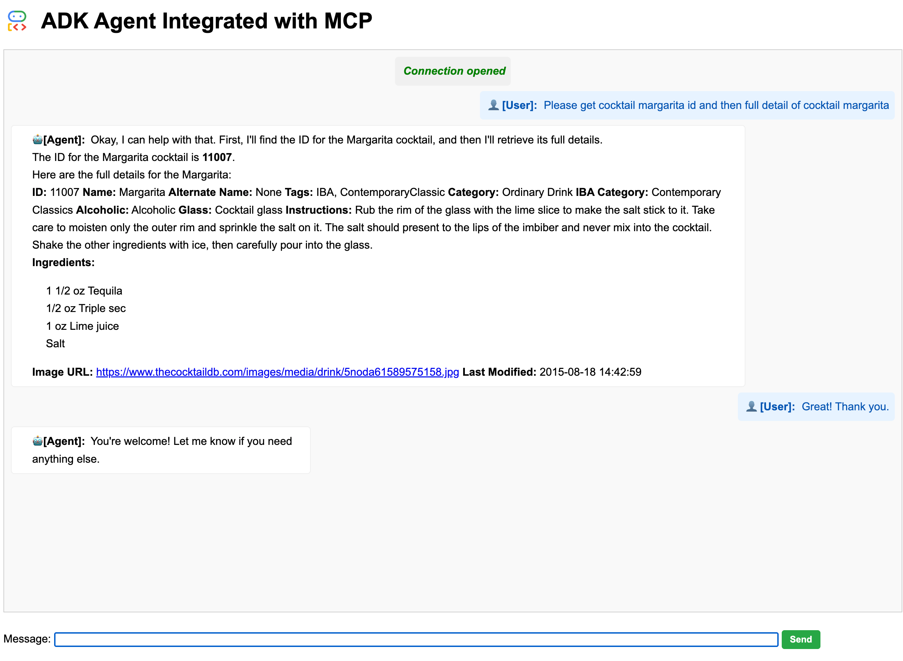

## An ADK Agent integrated with MCP Client
This web application was developed using Google's ADK (Agent Development Kit) and MCP (Model Context Protocol). Specifically, the Agent relies on the Google ADK. A local MCP server instance, established using custom server code designed for cocktail data management, facilitates data retrieval. The web application acts as an MCP client to fetch cocktail information via this local server.

Screenshot:  



  
This example demonstrates how you can chat with the app to retrieve cocktail details from [The Cocktail DB](https://www.thecocktaildb.com/) website using a local MCP server

### Create & Activate Virtual Environment (Recommended):

```
python -m venv .venv
source .venv/bin/activate
```
### Install ADK:

```
pip install google-adk fastapi
```
Project Structure

```
your_project_folder/  # Project folder
|── adk_mcp_app
    ├── main.py
    ├── .env
    ├── mcp_server
    │   └── cocktail.py
    ├── README.md
    └── static
        └── index.html
```
### Run the app
Start the Fast API: Run the following command within the `adk_mcp_app` folder


1. Create a .env file with the following contents:
```
# Choose Model Backend: 0 -> ML Dev, 1 -> Vertex
GOOGLE_GENAI_USE_VERTEXAI=1

# ML Dev backend config
GOOGLE_API_KEY=YOUR_VALUE_HERE

# Vertex AI backend config
GOOGLE_CLOUD_PROJECT="<your project id>"
GOOGLE_CLOUD_LOCATION="us-central1"
```

2. Set up values in `.env ` file  
   
If using Google API key:
```
GOOGLE_GENAI_USE_VERTEXAI=0
GOOGLE_API_KEY=YOUR_VALUE_HERE
```

If using Vertex AI Project ID:
```
GOOGLE_GENAI_USE_VERTEXAI=1
GOOGLE_CLOUD_PROJECT=YOUR_VALUE_HERE
GOOGLE_CLOUD_LOCATION="us-central1"
```

3.  Run the below command to start the app:

```
uvicorn main:app --reload
```

