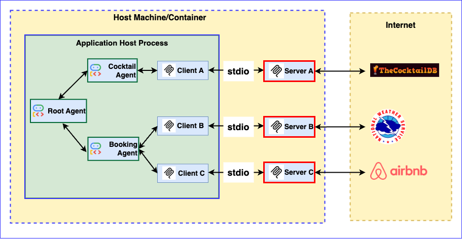
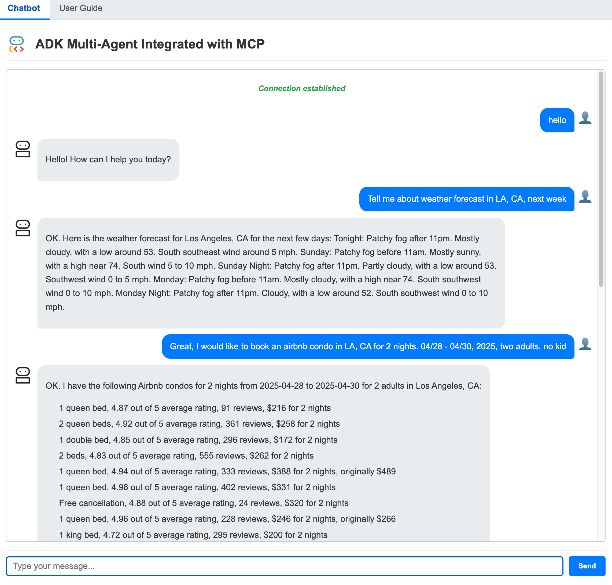

# ADK Multi-Agent MCP Client Application

## Overview

This document describes a web application demonstrating the integration of Google's Agent Development Kit (ADK) for multi-agent orchestration with Model Context Protocol (MCP) clients. The application features a root agent coordinating tasks between specialized agents that interact with various MCP servers to fulfill user requests.

### Architecture

The application utilizes a multi-agent architecture where a root agent delegates tasks to specialized agents (Cocktail and Booking) based on the user's query. These agents then interact with corresponding MCP servers.



### Application Screenshot



## Core Components

### Agents

The application employs three distinct agents:

1.  **Root Agent:** The main entry point that receives user queries, determines the required task(s), and delegates to the appropriate specialized agent(s).
2.  **Cocktail Agent:** Handles requests related to cocktail recipes and ingredients by interacting with the Cocktail MCP server.
3.  **Booking Agent:** Manages requests related to weather forecasts and AirBnB bookings by interacting with the Weather and AirBnB MCP servers.

### MCP Servers and Tools

The agents interact with the following MCP servers:

1.  **Cocktail MCP Server** (Local Code)
    * Provides 5 tools:
        * `search cocktail by name`
        * `list all cocktail by first letter`
        * `search ingredient by name`
        * `list random cocktails`
        * `lookup full cocktail details by id`
2.  **Weather MCP Server** (Local Code)
    * Provides 3 tools:
        * `get weather forecast by city name`
        * `get weather forecast by coordinates`
        * `get weather alert by state code`
3.  **AirBnB MCP Server** ([Public GitHub Repo](https://github.com/openbnb-org/mcp-server-airbnb) - Requires separate setup)
    * Provides 2 tools:
        * `search for Airbnb listings`
        * `get detailed information about a specific Airbnb listing`

## Example Usage

Here are some example questions you can ask the chatbot:

* `Please get cocktail margarita id and then full detail of cocktail margarita`
* `Please list a random cocktail`
* `Please get weather forecast for New York`
* `Please get weather forecast for 40.7128,-74.0060`
* `I would like to know information about an airbnb condo in LA, CA for 2 nights. 04/28 - 04/30, 2025, two adults, no kid`

## Setup and Deployment

### Prerequisites

Before running the application locally, ensure you have the following installed:

1.  **Node.js:** Required to run the AirBnB MCP server (if testing its functionality locally).
2.  **uv:** The Python package management tool used in this project. Follow the installation guide: [https://docs.astral.sh/uv/getting-started/installation/](https://docs.astral.sh/uv/getting-started/installation/)

### Running Locally

Follow these steps to run the FastAPI application on your local machine.

**1. Project Structure**

Ensure your project follows this structure:

```
Your_project_folder/
└── adk_multiagent_mcp_app/  # App folder
├── Dockerfile
├── main.py
├── .dockerignore        # Specifies files/dirs to ignore when building Docker image
├── .python-version      # Specifies Python version (e.g., 3.12)
├── .env                 # Environment variables (create based on template below)
├── mcp_server/
│   ├── cocktail.py      # Local Cocktail MCP server implementation
│   └── weather_server.py # Local Weather MCP server implementation
├── pyproject.toml       # Project dependencies and metadata
├── README.md            # This file
├── static/
│   ├── adk_multiagent.png
│   ├── app_screenshot.png
│   ├── index.html
│   ├── robot1.png
│   └── user_guide.md
└── uv.lock              # Lock file for reproducible dependencies
```

**2. Configure Environment Variables**

Create a `.env` file in the `adk_multiagent_mcp_app` directory with the following content. Replace placeholders with your actual values.

```dotenv
# Choose Model Backend: 0 -> ML Dev, 1 -> Vertex AI
GOOGLE_GENAI_USE_VERTEXAI=1

# --- ML Dev Backend Configuration (if GOOGLE_GENAI_USE_VERTEXAI=0) ---
# Obtain your API key from Google AI Studio or Google Cloud console
GOOGLE_API_KEY=YOUR_GOOGLE_API_KEY

# --- Vertex AI Backend Configuration (if GOOGLE_GENAI_USE_VERTEXAI=1) ---
# Your Google Cloud Project ID
GOOGLE_CLOUD_PROJECT="your-project-id"
# The location (region) for Vertex AI services
GOOGLE_CLOUD_LOCATION="us-central1"
```


**3. Start the Application Locally**

Navigate to the adk_multiagent_mcp_app directory in your terminal and run the application using uv:
```
uv run uvicorn main:app --reload
```
The application should now be accessible, typically at http://127.0.0.1:8000.

**4. Deploying to Cloud Run**  

Follow these steps to build and deploy the application as a containerized service on Google Cloud Run.

Set Environment Variables for Deployment

In your Cloud Shell or local terminal (with gcloud CLI configured), set the following environment variables:
```
# Define a name for your Cloud Run service
export SERVICE_NAME='adk-multiagent-mcp-app'

# Specify the Google Cloud region for deployment (ensure it supports required services)
export LOCATION='us-central1'

# Replace with your Google Cloud Project ID
export PROJECT_ID='your-project-id'
```

In Cloud Shell, execute the following command:

   ```bash
   gcloud run deploy $SERVICE_NAME \
     --source . \
     --region $LOCATION \
     --project $PROJECT_ID \
     --memory 4G \
     --allow-unauthenticated 
   ```

On successful deployment, you will be provided a URL to the Cloud Run service. You can visit that in the browser to view the Cloud Run application that you just deployed. 