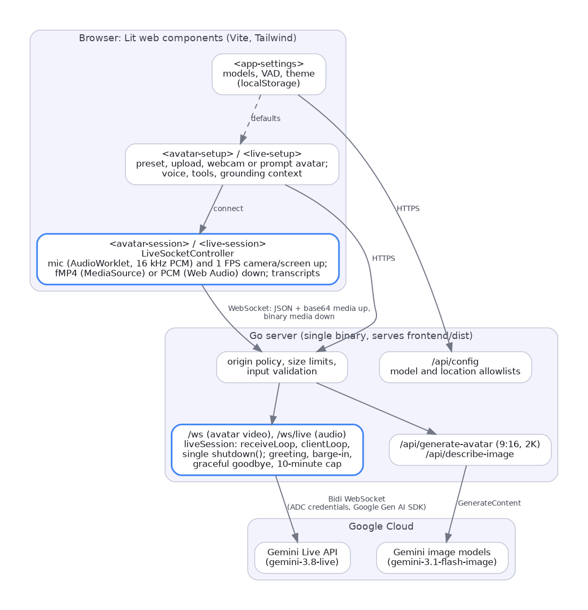

# Developer Guide

Architecture, wire protocol, and hard-won Gemini Live API patterns for
Gemini Live Studio (Go module `gemini-live-studio`).

For user instructions see the [User Guide](user_guide.md); for frontend
component rules see [Frontend components](frontend-components.md).

## Contents

- [Architecture](#architecture)
- [Wire protocol](#wire-protocol)
- [Conversational lifecycle](#conversational-lifecycle)
- [Media handling](#media-handling)
- [Model configuration quirks](#model-configuration-quirks)
- [Server-side function calling](#server-side-function-calling)
- [UI conventions](#ui-conventions)
- [Verifying model capabilities](#verifying-model-capabilities)

## Architecture

The app follows the **Go backend + Lit/Vite frontend** archetype. The backend is
a secure proxy and configurator for Gemini Live and Gemini Image.



```text
Browser (Lit)  ──WS /ws       (JSON control + base64 media up, binary fMP4 down)──▶  Go server
Browser (Lit)  ──WS /ws/live  (JSON control + base64 media up, binary PCM down)───▶  Go server
Go server      ──wss BidiGenerateContent (Google Gen AI SDK, ADC bearer token)──▶  Gemini Live API
```

The two endpoints share one session implementation (`live_session.go`) and
differ only in the requested response modality: `/ws` asks for `VIDEO` with an
`AvatarConfig` (a talking avatar whose audio is muxed into fragmented MP4),
`/ws/live` asks for `AUDIO` (24 kHz PCM) for voice-and-vision conversations
without an avatar.

### Why a backend at all

The **Switchboard Proxy** (backend-for-frontend) pattern exists for one reason:
never expose Google Cloud credentials to the browser. The frontend holds no API
key and no OAuth token. The Go process authenticates with Application Default
Credentials and owns the upstream WebSocket for the session's lifetime.

### Frontend (Lit WebComponents)

| Component                             | Responsibility                                                                                                                                                                                                                                                                 |
| ------------------------------------- | ------------------------------------------------------------------------------------------------------------------------------------------------------------------------------------------------------------------------------------------------------------------------------ |
| `Store` / `<app-settings>`            | Central state persisted to `localStorage`. Lets users override voices, welcome messages, system instructions, and per-session model/region.                                                                                                                                    |
| `<avatar-setup>` / `<live-setup>`     | Session setup: avatar (preset, upload, webcam, or prompt) or Live persona, voice, tools, and grounding context. Custom avatars are center-cropped to `9:16` at `720x1280`.                                                                                                     |
| `<avatar-session>` / `<live-session>` | The active session. `LiveSocketController` owns the WebSocket; media controllers capture 16 kHz PCM off-thread (`pcm-capture.ts`), sample camera or screen frames at 1 FPS, and play fMP4 (`MediaSource`) or PCM (Web Audio). Shared pieces live in `src/components/session/`. |

Shadow DOM is deliberately disabled (`createRenderRoot() { return this; }`) so
Tailwind's global style sheet cascades into components.

### Backend (Go)

| Route                       | Responsibility                                                               |
| --------------------------- | ---------------------------------------------------------------------------- |
| `GET /api/config`           | Serves the default and available models/locations to the UI.                 |
| `POST /api/generate-avatar` | Text-to-image and image-to-image avatar synthesis, forced to `9:16` at `2K`. |
| `POST /api/describe-image`  | Describes an uploaded image as grounding context.                            |
| `GET /ws`, `GET /ws/live`   | The Live session proxy (avatar video or audio). See below.                   |
| `GET /health`               | Liveness probe.                                                              |
| `/`                         | Static file server for the built frontend.                                   |

The session handler checks the browser origin, validates the session config,
establishes the `LiveConnect` session, injects the proactive greeting on
`SetupComplete`, translates frontend base64 payloads into `RealtimeInput`,
sniffs the fMP4 codec via `media_sniffer.go`, forwards video chunks as raw
binary, streams bidirectional transcripts, and manages race-free teardown.

A `clientManager` caches one `genai.Client` per location and rewrites the base
URL host between regional and `global` endpoints.

## Wire protocol

Browser ↔ Go server. Note the asymmetry: media flows **up** as base64 inside
JSON, but comes **down** as raw binary frames.

| Direction           | Frame type | Payload                                                                                                        |
| ------------------- | ---------- | -------------------------------------------------------------------------------------------------------------- |
| C→S (first message) | text JSON  | `InitialConfig` — avatar, voice, language, model, system instruction                                           |
| C→S                 | text JSON  | `{type: "audio"\|"video"\|"text"\|"control", action, data, mimeType}`                                          |
| S→C                 | **binary** | Raw fMP4 fragment                                                                                              |
| S→C                 | text JSON  | `session_info`, `media_config`, `transcript`, `input_transcript`, `output_transcript`, `interrupted`, `status` |

> **Gotcha:** do not gate inbound handling on WebSocket frame type when working
> directly against the Bidi API. Every `serverContent` message — including
> `turnComplete`, `interrupted`, and `inlineData` video — arrives inside a
> **binary**-typed frame. Filtering on `TextMessage` silently drops everything.

## Conversational lifecycle

### Proactive greetings

If you wait for the user to speak first, the avatar feels lifeless. Wait for
`msg.SetupComplete`, then immediately inject a hidden text prompt via
`SendRealtimeInput`. The avatar speaks the millisecond the connection opens.

### Handling interruptions (buffer flushing)

The client always has a few seconds of avatar media buffered. When the user
barges in, Gemini aborts generation and sends
`msg.ServerContent.Interrupted == true`.

The backend **must** relay this as `{"type": "interrupted"}`. The frontend must
then empty `bufferQueue` and call `sourceBuffer.abort()`. Skip this and the
avatar keeps playing stale buffered chunks after its "brain" has stopped —
severe UX desync.

### Transcript semantics: deltas vs. full strings

The two transcription streams behave differently, and this trips everyone up:

- **Input transcripts (user)** stream the _accumulated_ string. The frontend must
  **overwrite** the current bubble.
- **Output transcripts (avatar)** stream incremental _deltas_ (`"Hello"`,
  `" I am"`, `" Piper!"`). The frontend must **concatenate**.
- **Never filter on `Finished == true`** in the backend — you will drop ~99% of
  real-time chunks. Forward everything with an `isPartial` flag, flipping it
  false only on `Finished` or `Interrupted`.

### Graceful teardown: `terminateGate`

Closing the session on a user "End Session" is subtler than it looks.

**The race:** `Interrupted` and `TurnComplete` arrive as two _separate_ messages
roughly 140–150 ms apart. A naive `TurnComplete && !Interrupted` check on a
single message can never see both flags at once, so it always fires on the
interrupted turn's own wrap-up — closing the session before the goodbye has a
chance to generate. Every interruption produces exactly two `TurnComplete`
events: one for the aborted turn, one for the goodbye. `GenerationComplete`
never accompanies an interrupted turn's wrap-up, so `TurnComplete` alone is a
sufficient boundary signal.

**The fix:** two atomic flags, `terminating` and `pendingInterrupt`. On
`{type: "control", action: "terminate"}` set `terminating` and inject the
goodbye. If `Interrupted` arrives during goodbye generation, set
`pendingInterrupt`. On `TurnComplete`, compare-and-swap `pendingInterrupt` — if
it was set, this wraps the aborted turn, so ignore it. Only close when the
goodbye's own `TurnComplete` arrives.

Backstop timers are deliberately ordered: server 12 s < client 15 s, so the
server always wins and the client timer is a true fallback.

## Media handling

### Audio capture: `AudioWorkletNode`, not `ScriptProcessorNode`

`ScriptProcessorNode` is deprecated and runs on the main UI thread, causing
audible stutter. Use `pcm-capture.ts`, which registers an inline
`AudioWorkletProcessor` from a Blob URL. It buffers Float32 samples into
2048-sample Int16 chunks (~128 ms at 16 kHz) and posts them to the main thread
for little-endian conversion and base64 encoding.

### Video playback and fMP4 codec sniffing

The Live API streams fragmented MP4. **The codec varies by model:** Gemini 3.5
emits Baseline Profile Level 3.2 (`avc1.42C020`); earlier models emit Level 3.0
(`avc1.42E01E`).

Do not hardcode codec strings in the browser. `media_sniffer.go` inspects the
first binary fragment (`ftyp` and `avcC` boxes) via `SniffMP4` and emits
`{"type": "media_config", "mimeType": "video/mp4", "codecs": "..."}` exactly
once. The frontend passes that string straight to
`MediaSource.addSourceBuffer()`, with a fallback chain if
`isTypeSupported` rejects it.

> The WebSocket frame is a JSON envelope, not raw MP4 — the fMP4 bytes are
> base64 inside `serverContent.modelTurn.parts[].inlineData.data`.

### Realtime camera / vision input

During an active session, sample webcam frames at **1 FPS** to a `<canvas>`,
encode as base64 JPEG, and send `{"type": "video", "mimeType": "image/jpeg",
"data": ...}`. The backend pipes these to `SendRealtimeInput` using the
**`Video:`** field.

> **SDK trap:** `LiveSendRealtimeInputParameters{Media:}` serializes to the
> _legacy_ `mediaChunks` wire field and fails with
> `1007: Mime type 'image/jpeg' is not supported. Either use 'audio/pcm...'`.
> Use `{Video:}`, which serializes to the modern `video` field.

Decouple preview frame rate from upload frame rate: render the local
picture-in-picture preview at native FPS for smoothness while sampling upstream
at 1 FPS.

## Model configuration quirks

These are empirical, gathered by testing the Live API directly.

- **`AvatarConfig` is mandatory for `VIDEO`.** 3.x Live models require
  `AvatarConfig` whenever `ResponseModalities: ["VIDEO"]` is requested. Bare
  `AUDIO, VIDEO` without it returns `1007` (_"Avatar config is required for
  avatar mode"_).
- **`AUDIO` + `VIDEO` together is rejected** on
  `gemini-3.1-flash-live-preview-04-2026`: `1007 ... combination of response
modalities (AUDIO, VIDEO) is not supported`. Request `VIDEO` alone; audio
  arrives muxed in the MP4.
- **Proactivity is model-dependent.** `gemini-3.5-flash-lite-live-preview`
  accepts `proactivity.proactive_audio`; `gemini-3.5-flash-live-preview`
  rejects it (`1007: The 'proactive' feature is not supported for model
'gemini_live_rev25_thinker_talker'`). Raw `proactive_video: true` inside a
  `proactivity` setup frame is a separate field with different support.
- **`enable_affective_dialog` is not recognized** on Vertex Bidi:
  `1007: Unknown name "enable_affective_dialog" at 'setup'`. The Go SDK exposes
  the field, which makes it look available. It isn't.
- **Session resumption appears dormant.** `setup` accepts `session_resumption`,
  but `SessionResumptionUpdate` is not emitted, so there is no handle to resume
  with. Use `ContextWindowCompression` for session length instead — that _is_
  supported (note `trigger_tokens` is sent as a **string**).
- **Reference image constraints.** Custom avatar anchors must be `9:16`, minimum
  `704x1280`, and **PNG — not WebP** (identical pixels as WebP reliably return
  `1011 internal error` at 16:9). Crop locally with a `<canvas>` before upload;
  non-compliant bytes crash the live session rather than returning a clean
  error.
- **The API normalizes landscape to 1280×704** regardless of input aspect ratio.
- **Safety-filter failures happen after `setupComplete`.** A blocked avatar
  reference image returns `1008 policy violation: Avatar reference image was
blocked by safety policy` when animation starts, so handshake-only testing
  won't catch it; test with a real session that waits for video. The Carmen
  preset used to fail this way, but it passes on `gemini-3.8-live`.
- **Preset thumbnails come from gstatic**, not the Live API, as `<name>.png`;
  Carmen's is `carmen_2.png`. If a thumbnail is missing,
  `frontend/src/preset-image.ts` falls back to the preset's initial.

## Server-side function calling

The Live API prohibits built-in Code Execution but fully supports custom
`FunctionDeclarations`, enabling "agentic avatars" that run commands and speak
the results.

1. **Declare** tools in `LiveConnectConfig.Tools`.
2. **Route:** listen for `msg.ToolCall` in the `session.Receive()` loop, execute
   the tool, and package the result as a `genai.FunctionResponse`.
3. **Respond upstream** with `session.SendToolResponse()`. The model ingests the
   result and synthesizes speech describing it.
4. **Visualize:** simultaneously forward the raw tool-execution JSON to the
   frontend as a `tool_execution` event. Rendering a file tree or editor UI at
   the moment the avatar starts the verbal summary creates a synchronized
   multimodal effect.

A complete worked example lives in [`examples/local-code-assistant/`](../examples/local-code-assistant/).

## UI conventions

Design north star: **"Clear, Approachable Intelligence."**

- **No-line boundaries.** Avoid 1px solid borders. Use background shade shifts
  (`surface-container-low` vs `surface-container-highest`) and soft drop shadows.
- **Mobile adaptability.** Desktop uses a split pane (video left, transcripts
  right). Mobile collapses to an avatar-forward view with a floating tab
  switcher, hiding the transcript log to maximize the cinematic feel.
- **Typography.** `Google Sans Flex`, high contrast on interactive states.
  Primary CTAs use Google Blue (`#4285F4`) with white text.

## Verifying model capabilities

Preview models change without notice, and the SDK exposing a field does not mean
the backend accepts it. Verify against the live service rather than trusting
docs.

When upgrading to a new model version:

1. Set `GEMINI_LIVE_MODEL` / `GEMINI_IMAGE_MODEL` in `.env` and add the model to
   the allowlists in `models.go`.
2. Run a real session in both modes and confirm `setupComplete`, the first video
   fragment (avatar mode) or PCM chunk (audio mode), transcripts, interruption,
   and the goodbye on End Session.
3. Check model-dependent options (`ProactivityConfig`, context window
   compression, custom avatars) still pass.

> **Handshake success is not capability.** A check that only waits for
> `setupComplete` will report features as working that do nothing at inference
> time; session resumption was a false positive for exactly this reason.
> Assert on real behavior: a decoded video frame, a completed turn, a measured
> latency difference.
