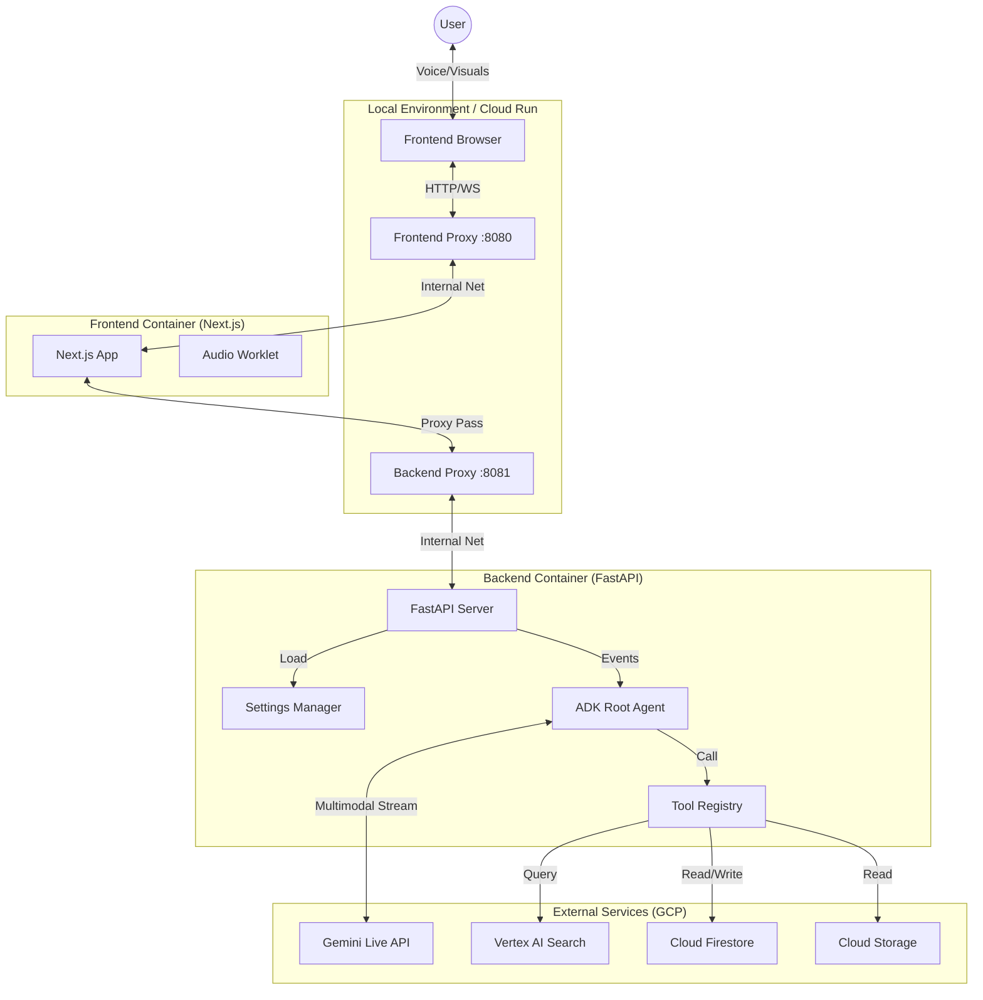

# Financial Advisor System Specification

**Status:** Living
**Version:** 1.2.0
**Last Updated:** 2025-12-10

## 1. System Overview

### 1.1 Executive Summary
The Financial Advisor is a real-time, voice-enabled conversational AI system. It leverages the **Gemini Multimodal Live API** to provide natural, low-latency voice interactions. The system integrates **Retrieval Augmented Generation (RAG)** to answer questions based on private financial documents and uses **Function Calling** to retrieve market data and render dynamic UI components on the client.

### 1.2 Key Capabilities
*   **Real-time Voice Streaming:** Bi-directional audio streaming via WebSockets (no intermediate STT/TTS).
*   **Interruption Handling:** Native **Voice Activity Detection (VAD)** allows the user to barge in and interrupt the model naturally.
*   **RAG:** semantic search over indexed PDF documents (e.g., "Investment Guides", "Market Outlooks") stored in Vertex AI Search.
*   **Tool Use:**
    *   **Market Data:** Fetches simulated stock/crypto prices via `get_market_summary_data`.
    *   **UI Rendering:** Agents can trigger client-side React components (`appointment_scheduler`, `financial_summary_visual`).
*   **Persona Persistence:** User profile and chat history are persisted in **Cloud Firestore**.

## 2. Architecture & Topology

### 2.1 Context Diagram



### 2.2 Component Breakdown
*   **Frontend (Next.js/React):** Responsible for audio capture (microphone), audio playback (speaker), and rendering dynamic UI widgets. It maintains the WebSocket connection to the backend.
*   **Backend (FastAPI):** Acts as the secure orchestrator. It manages the session, connects to the Gemini Live API, executes Tools, and performs RAG queries. It **never** exposes API keys to the client.
*   **Database (Firestore):** Stores persistent user data (profiles, account balances) and conversation history.

## 3. The Security Model

### 3.1 Authentication & "Double Proxy"
To ensure security parity between local development and production:
*   **Local Development:** Uses a **Double Proxy** pattern.
    *   **Frontend Proxy:** Forwards browser requests to the Next.js server.
    *   **Backend Proxy:** Authenticated tunnel that securely exposes the Cloud Run backend to the local frontend.
*   **Production:** Access is controlled via **Google Cloud IAM**. The Cloud Run services are deployed with `--no-allow-unauthenticated` (except for the frontend ingress where appropriate, or behind a Load Balancer).

### 3.2 Credential Isolation
*   **No Client-Side Secrets:** The Frontend **never** possesses API keys or Service Account credentials.
*   **Backend Identity:** The Backend runs as a specific **Service Account** (`financial-advisor-sa`).
*   **ADC:** The Backend uses **Application Default Credentials (ADC)** to authenticate with Vertex AI, Gemini, and Firestore. This eliminates the need for hardcoded keys in the source code.

## 4. Data & Audio Protocol

### 4.1 Audio Contract
The system adheres to a strict audio format required by the Gemini Live API:
*   **Sample Rate:** 16,000 Hz (16kHz)
*   **Bit Depth:** 16-bit
*   **Channels:** Mono (1 Channel)
*   **Format:** Linear PCM
*   **Endianness:** Little Endian

### 4.2 WebSocket Protocol
Messages are JSON objects.

**Client -> Server:**
*   **Audio:** `{ "realtime_input": { "media_chunks": [{ "mime_type": "audio/pcm", "data": "<base64>" }] } }` (Wrapped by ADK)
*   **Text:** `{ "client_content": { "turn_complete": true, "turns": [{"role": "user", "parts": [{"text": "Hello"}]}] } }`

**Server -> Client:**
*   **Audio:** Binary Frame (Raw PCM 16-bit).
*   **Control/UI:**
    ```json
    {
      "server_content": {
        "model_turn": {
           "parts": [ { "executable_code": { ... } } ] 
        }
      },
      "tool_response": { ... }
    }
    ```

## 5. Configuration Management

### 5.1 Strategy
Configuration is centralized and strictly typed:
*   **`taskfile.env`:** The single source of truth for environment variables (Project ID, Branding, Corpus ID).
*   **`src/backend/app_settings/settings.py`:** A Pydantic `BaseSettings` model that validates environment variables at startup.

### 5.2 Validation
The application **fails fast** on startup if critical configuration (like `VERTEX_AI__PROJECT_ID`) is missing, ensuring configuration integrity.

## 6. Deployment Strategy

### 6.1 Orchestration
All lifecycle commands are defined in `Taskfile.yaml`:
*   **Abstraction:** Developers run `task deploy:all` instead of complex `gcloud` commands.
*   **Consistency:** The Taskfile ensures that the same build args and flags are used every time.

### 6.2 Infrastructure
Defined in `Taskfile.yaml` (acting as Infrastructure-as-Code lite):
*   **Cloud Run:** Two services (`backend`, `frontend`).
*   **Firestore:** One database (`financial-advisor`).
*   **GCS:** One bucket for RAG documents.
*   **Vertex AI:** One Search App and Corpus.
