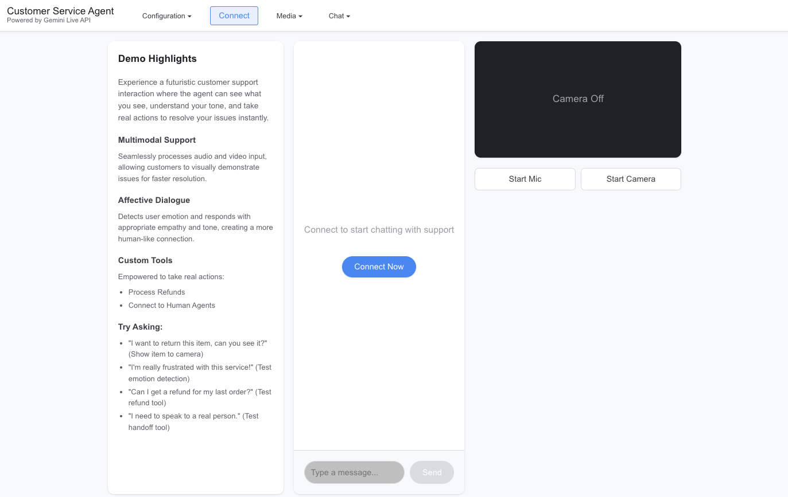

# Customer Service Agent Demo

A specialized React application demonstrating how to build a next-generation customer support agent using Gemini Live API. This demo showcases advanced features like multimodal input (video/audio), affective dialogue (emotion detection), and real-time tool use.



## Overview

This application simulates a futuristic customer support interaction where the agent can see what you see, understand your tone, and take real actions to resolve your issues instantly. It demonstrates:

1.  **Multimodal Understanding**: The agent can see items you show to the camera (e.g., for returns) and hear your voice.
2.  **Empathetic Response**: The agent detects your emotional state and adjusts its tone accordingly.
3.  **Action Taking**: The agent can execute tools to process refunds or transfer you to a human agent.

## Key Features

- **Multimodal Support**: Seamlessly processes audio and video input, allowing customers to visually demonstrate issues for faster resolution.
- **Affective Dialogue**: Detects user emotion and responds with appropriate empathy and tone, creating a more human-like connection.
- **Custom Tools**: Empowered to take real actions:
  - `process_refund`: Handles refund requests with transaction IDs.
  - `connect_to_human`: Transfers the call when issues are complex.
- **Real-time Interaction**: Low-latency voice interaction using Gemini Live API over WebSockets.

## Quick Start

### 1. Backend Setup

The Python backend handles authentication with Google Cloud.

```bash
# Install dependencies
pip install -r requirements.txt

# Authenticate with Google Cloud
gcloud auth application-default login

# Start the proxy server
python server.py
```

### 2. Frontend Setup

In a new terminal, start the React application:

Ensure you have Node.js and npm installed. If not, download and install them from [nodejs.org](https://nodejs.org/en/download/).

```bash
# Install Node modules
npm install

# Start development server
npm run dev
```

Open [http://localhost:5173](http://localhost:5173) to view the app.

## Configuration

1.  **Project ID**: Enter your Google Cloud Project ID in the "Configuration" dropdown.
2.  **Proxy URL**: Defaults to `ws://localhost:8080`.
3.  **Model ID**: Defaults to the latest Gemini Live preview model.
4.  **Gemini Behavior**: Configure voice, temperature, and enable/disable features like "Affective Dialog" or "Google Grounding".

## Project Structure

```
/
├── server.py           # WebSocket proxy & auth handler
├── src/
│   ├── App.jsx              # Main layout
│   ├── components/
│   │   └── LiveAPIDemo.jsx  # Main Customer Service Agent logic & UI
│   ├── utils/
│   │   ├── gemini-api.js    # Gemini WebSocket client
│   │   ├── media-utils.js   # Audio/Video processing
│   │   └── tools.js         # Tool definitions (Refund, Connect to Human)
└── public/
    └── audio-processors/    # Audio worklets
```
