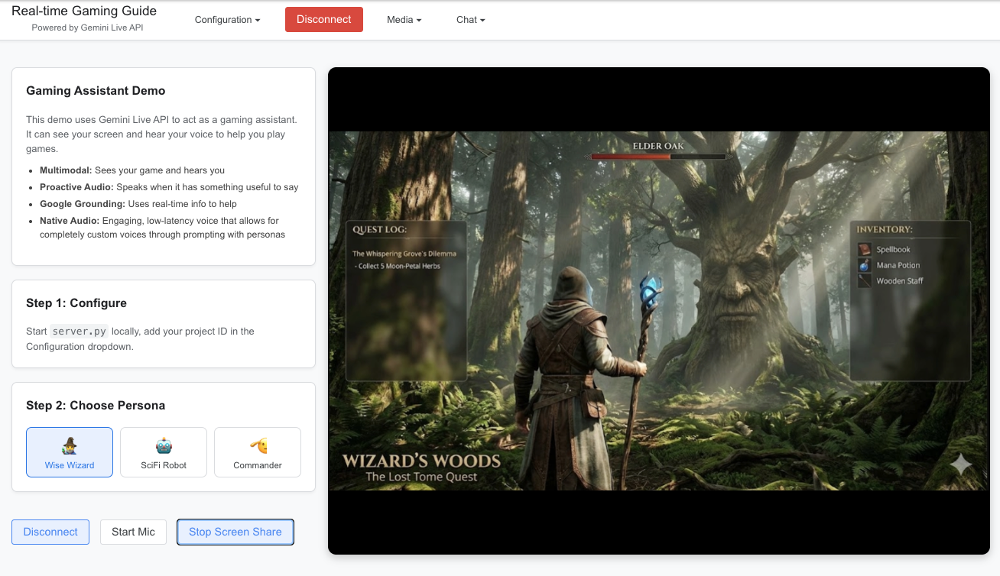

# Real-time Gaming Guide

| Author                                   |
| ---------------------------------------- |
| [Zack Akil](https://github.com/zackakil) |

A specialized React application demonstrating how to build a real-time AI gaming assistant using Gemini Live API. This demo showcases advanced features like multimodal understanding, proactive audio, and persona-based prompting.



## Overview

This application simulates a gaming companion that watches your gameplay and listens to your voice to provide relevant tips and guides. It demonstrates distinct persona-based interactions:

1.  **Multimodal Awareness**: The assistant sees your screen and hears your commentary to understand the game state.
2.  **Persona Switching**: Toggle between different personalities (Wise Wizard, SciFi Robot, Commander) to change the voice and style of assistance.
3.  **Proactive Assistance**: The assistant can speak spontaneously when you request help.

## Key Features

- **Persona System**: Dynamically injects system instructions to change the assistant's personality and voice.
- **Native Audio**: Leverages Gemini's native audio capabilities for low-latency, expressive voice interactions.
- **Multimodal Input**: Streams both screen capture and microphone audio to the model simultaneously.
- **Google Grounding**: Uses real-time information to provide up-to-date game knowledge.

## Quick Start

### 1. Backend Setup

The Python backend handles authentication with Google Cloud.

```bash
# Install dependencies
pip install -r requirements.txt

# Authenticate with Google Cloud
gcloud auth application-default login

# Start the proxy server
python server.py
```

### 2. Frontend Setup

In a new terminal, start the React application:

Ensure you have Node.js and npm installed. If not, download and install them from [nodejs.org](https://nodejs.org/en/download/).

```bash
# Install Node modules
npm install

# Start development server
npm run dev
```

Open [http://localhost:5173](http://localhost:5173) to view the app.

## Configuration

1.  **Project ID**: Enter your Google Cloud Project ID in the "Configuration" dropdown.
2.  **Proxy URL**: Defaults to `ws://localhost:8080`.
3.  **Persona**: Select a persona (Wizard, Robot, Commander) to start the session with a specific voice and style.

## Project Structure

```
/
├── server.py           # WebSocket proxy & auth handler
├── src/
│   ├── App.jsx              # Main layout and Persona logic
│   ├── components/
│   │   └── LiveAPIDemo.jsx  # Core Gemini API integration
│   ├── utils/
│   │   ├── gemini-api.js    # Gemini WebSocket client
│   │   └── media-utils.js   # Audio/Video processing
└── public/
    └── audio-processors/    # Audio worklets
```
