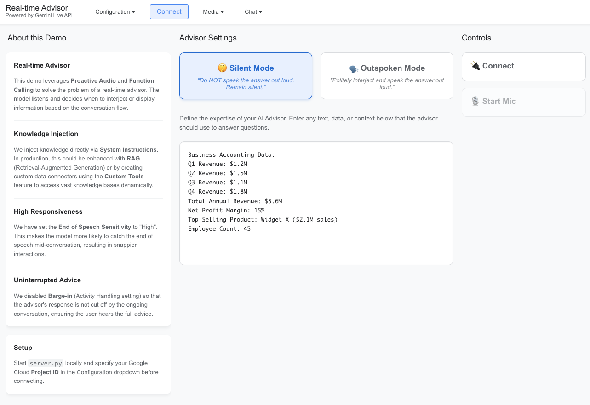

# Real-time Advisor Demo

| Author |
| --- |
| [Zack Akil](https://github.com/zackakil) |

A specialized React application demonstrating how to build a real-time AI advisor using Gemini Live API. This demo showcases advanced features like proactive audio, function calling, and precise interruption control.



## Overview

This application simulates a business advisor that listens to a conversation and provides relevant insights based on a provided knowledge base. It demonstrates two distinct interaction modes:

1.  **Silent Mode**: The advisor listens and pushes visual information (via a modal) without speaking, perfect for unobtrusive assistance.
2.  **Outspoken Mode**: The advisor politely interjects into the conversation to offer advice verbally, while also showing the visual data.

## Key Features

- **Dual Interaction Modes**: Toggle between "Silent" (visual only) and "Outspoken" (audio + visual) behavior using System Instructions.
- **Knowledge Injection**: Dynamically injects business data (revenue, employee counts, etc.) into the model's context via the UI.
- **Barge-in Control**: Demonstrates the `activity_handling` configuration to prevent the user from accidentally interrupting the advisor's response.
- **Tool Use**: Uses a custom `show_modal` tool to display structured information to the user.

## Quick Start

### 1. Backend Setup

The Python backend handles authentication with Google Cloud.

```bash
# Install dependencies
pip install -r requirements.txt

# Authenticate with Google Cloud
gcloud auth application-default login

# Start the proxy server
python server.py
```

### 2. Frontend Setup

In a new terminal, start the React application:

Ensure you have Node.js and npm installed. If not, download and install them from [nodejs.org](https://nodejs.org/en/download/).

```bash
# Install Node modules
npm install

# Start development server
npm run dev
```

Open [http://localhost:5173](http://localhost:5173) to view the app.

## Configuration

1.  **Project ID**: Enter your Google Cloud Project ID in the "Configuration" dropdown.
2.  **Proxy URL**: Defaults to `ws://localhost:8080`.
3.  **Knowledge Base**: Edit the text in the center column to change what the advisor knows.

## Project Structure

```
/
├── server.py           # WebSocket proxy & auth handler
├── src/
│   ├── App.jsx              # Main layout and Advisor logic
│   ├── components/
│   │   └── LiveAPIDemo.jsx  # Core Gemini API integration
│   ├── utils/
│   │   ├── gemini-api.js    # Gemini WebSocket client
│   │   └── media-utils.js   # Audio/Video processing
└── public/
    └── audio-processors/    # Audio worklets
```
