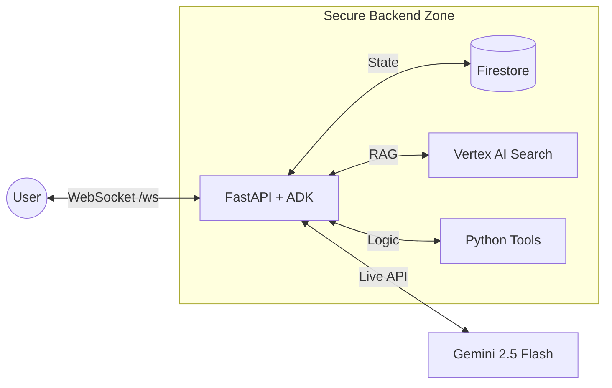

# Google Cloud Wealth Advisor

<div align="center">


**An enterprise-grade, voice-first AI financial advisor built with Gemini Live API + Agent Development Kit.**

[Overview](#-overview) • [Features](#-key-features) • [Quick Start](#-quick-start) • [Docs](#-documentation)

</div>

---

## 🔭 Overview

The **Google Cloud Wealth Advisor** is a reference implementation for building secure, stateful, and multimodal conversational agents. This project uses a **Server-Centric** (or "Thick Server") architecture, which is crucial for enterprise-grade financial applications requiring robust controls over data flow, security, and state management. For a detailed architectural deep dive, including a comparison with direct-to-LLM patterns, please refer to the [Architecture Deep Dive](docs/architecture.md).

It demonstrates how to build an agent that can:
1.  **Speak** naturally with users in real-time (using Gemini Live API).
2.  **See** and **Show** information using a synchronized React UI.
3.  **Remember** user context across sessions (Firestore).
4.  **Research** financial topics securely using internal documents (Vertex AI Search / RAG).


### System Design



## ✨ Key Features

*   **🗣️ Voice-First Interaction:** Low-latency (<500ms) conversational audio using Gemini's native audio capabilities.
*   **📊 Multimodal UI:** The agent doesn't just speak text; it pushes **Visuals** (Charts, Alerts, Forms) to the frontend to complement the conversation.
*   **🧠 RAG Integration:** The agent can "browse" a library of PDF financial documents (e.g., "Investment Guides") to answer specific questions accurately.
*   **💾 Session Persistence:** User profiles and conversation history are saved, allowing the agent to "remember" you next time.
*   **🛡️ Enterprise Ready:** Built with `uv` for dependency management, `Taskfile` for automation, and `Docker` for deployment.

## 🚀 Quick Start

### Prerequisites
*   **Python 3.12+** & **Node.js 18+**
*   **Google Cloud CLI** (`gcloud`) installed and authenticated.
*   **`uv`** (Python tool): `curl -LsSf https://astral.sh/uv/install.sh | sh`
*   **`task`** (Build tool): `sh -c "$(curl --location https://taskfile.dev/install.sh)" -- -d -b /usr/local/bin`

### 1. Install Dependencies
This command sets up both the Python virtual environment and Node.js modules.

```bash
task install
```

### 2. Run Locally
Starts the FastAPI backend (port 8000) and Next.js frontend (port 3000).

```bash
task dev
```

*   **Frontend:** [http://localhost:3000](http://localhost:3000)
*   **Backend Docs:** [http://localhost:8000/docs](http://localhost:8000/docs)

### 3. Deploy to Cloud (Optional)
Build containers and deploy to Cloud Run.

```bash
task docker:build
task docker:run
```

## 📚 Documentation

*   [**Architecture Deep Dive**](docs/architecture.md) - Protocol details, message formats, and component interaction.
*   [**Setup Guide**](docs/setup.md) - Detailed instructions for local dev, Google Cloud authentication, and troubleshooting.
*   [**Contribution Guide**](CONTRIBUTING.md) - How to help improve this project.

## 🛠 Troubleshooting Common Issues

*   **🎤 Microphone Permission Denied:** Ensure you are accessing the frontend via `localhost` or HTTPS. Browsers block audio on insecure HTTP origins.
*   **🔑 Authentication Error:** Run `gcloud auth application-default login` to refresh your local credentials.
*   **🔇 No Audio:** Check your system volume and ensure the backend logs show `audio/pcm` chunks being sent.
