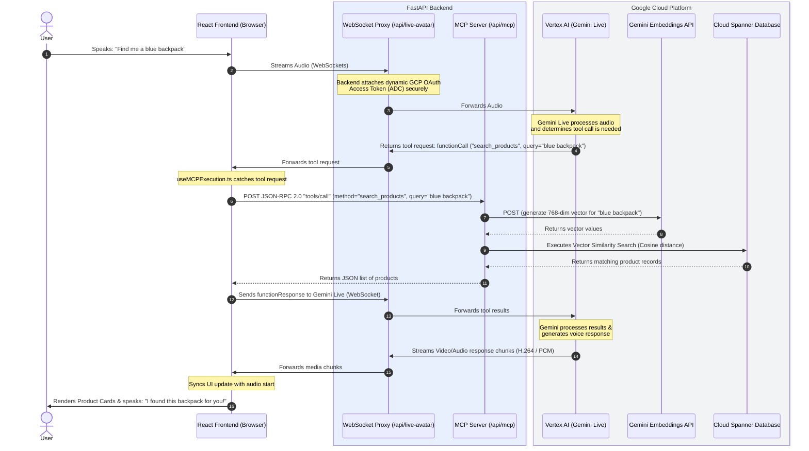

# Multimodal E-Commerce Live Shopping Assistant & Avatar

An intelligent, real-time multimodal shopping assistant and interactive avatar powered by Google's **Gemini Live** bidirectional streaming API (`BidiGenerateContent`), **Model Context Protocol (MCP)**, and **Cloud Spanner**.

---

## Table of Contents

- [Overview](#overview)
- [Key Features](#key-features)
- [Architecture](#architecture)
  - [Architecture Flow Diagram](#architecture-flow-diagram)
  - [Core Components](#core-components)
  - [Model Context Protocol (MCP) Tools](#model-context-protocol-mcp-tools)
  - [Secure WebSocket Proxy & Authentication](#secure-websocket-proxy--authentication)
- [Project Structure](#project-structure)
- [Prerequisites](#prerequisites)
- [Database Setup & Data Seeding](#database-setup--data-seeding)
  - [1. Configure Environment Variables](#1-configure-environment-variables)
  - [2. Provision Cloud Spanner Instance & Database](#2-provision-cloud-spanner-instance--database)
  - [3. Seed Synthetic Catalog Data](#3-seed-synthetic-catalog-data)
- [Running Locally](#running-locally)
  - [Option A: Dual-Process Development (Recommended)](#option-a-dual-process-development-recommended)
  - [Option B: Single Full-Stack Container / Local Build](#option-b-single-full-stack-container--local-build)
- [Deploying to Google Cloud Run](#deploying-to-google-cloud-run)
  - [Automated Deployment via deploy.sh](#automated-deployment-via-deploysh)
  - [Manual Deployment via gcloud](#manual-deployment-via-gcloud)
  - [Important Cloud Run Configuration Notes](#important-cloud-run-configuration-notes)

---

## Overview

This project showcases a next-generation conversational shopping experience:
- Shoppers can converse naturally using **real-time bidirectional audio & video** with an AI avatar.
- The assistant retrieves real catalog items from **Cloud Spanner** using **semantic vector search** via Gemini embeddings (`gemini-embedding-2`).
- As the user browses, the assistant can execute shopping actions (adding to cart, updating quantities, viewing reviews, checking out) via **Model Context Protocol (MCP)** tool execution.
- Store owners can switch brand identities dynamically (Target, Best Buy, Sephora, or custom retailers) with real-time UI theme generation powered by Gemini.

---

## Key Features

- **Gemini Live Multimodal Streaming:** Real-time bidirectional streaming over WebSockets for voice audio (PCM 24kHz) and video stream rendering (`mpegts.js`).
- **Semantic Vector Similarity Search:** Cloud Spanner queries executing `COSINE_DISTANCE` against 768-dimensional text embeddings and 1408-dimensional multimodal image embeddings.
- **Model Context Protocol (MCP) Server:** Standardized JSON-RPC 2.0 endpoints exposing tools for catalog queries, cart mutations, customer reviews, and theme updates.
- **Dynamic Retailer Theming:** Brand colors and typography dynamically generated by Gemini or selected from pre-set brand profiles, persisted in Spanner.
- **Admin Control Center (`/admin`):** Dashboard to switch active retailers, monitor background catalog seeding logs in real-time, and reset or truncate databases.
- **Synthetic Data Pipeline:** Automated pipeline using Gemini and Imagen to generate product images, metadata via Visual Question Answering (VQA), semantic embeddings, customer accounts, and order histories.
- **Responsive Web Views:** Optimized views including desktop storefront, dedicated architecture walkthrough (`/architecture`), and mobile-responsive layout (`/mobile`).

---

## Architecture

For a detailed walkthrough, refer to [architecture_walkthrough.md](file:///usr/local/google/home/ankurwahi/generative-ai/gemini/multimodal-live-api/shopping-avatar/ecommerce/doc/architecture_walkthrough.md).

### Architecture Flow Diagram



### Core Components

1. **React Frontend (`ecommerce/frontend`)**:
   - **Audio Worklets & Recording:** Captures mic audio, downsamples to 16-bit 24kHz mono PCM, and handles audio playback without blocking the main event loop.
   - **Background Web Worker (`networkWorker.ts`):** Maintains the WebSocket connection off the main UI thread.
   - **Tool Interceptor (`useMCPExecution.ts`):** Listens for `functionCall` events from Gemini Live, executes the corresponding tool via the backend MCP endpoint, and replies with `functionResponse`.
   - **Live Video Renderer (`AvatarDisplay1P.tsx`):** Decodes and renders live video chunks from the avatar pipeline using `mpegts.js`.

2. **FastAPI Backend (`ecommerce/backend`)**:
   - **WebSocket Proxy (`routes/websocket.py`):** Acts as a bridge between the browser and Google's `BidiGenerateContent` WebSocket endpoint. Authenticates requests server-side using Google Cloud Application Default Credentials (ADC).
   - **MCP Server (`routes/mcp.py`):** Implements JSON-RPC 2.0 tool handlers for catalog search, cart operations, review lookups, and brand re-theming.
   - **Catalog & Admin APIs (`routes/products.py`, `routes/admin.py`, `routes/config.py`):** Serves product listings, cached product images from GCS/local disk, theme configurations, and background data seeding controls.
   - **Static Host (`main.py`):** When built for production, FastAPI mounts the compiled React SPA from `frontend/dist` with SPA fallback routing.

3. **Cloud Spanner Database (`schema.sql`, `database.py`)**:
   - Tables for `products`, `customers`, `shopping_carts`, `orders`, `order_items`, `reviews`, and `retailer_settings`.
   - Stores 768-dimensional vector embeddings (`ARRAY<FLOAT32>`) in `products.embedding` for cosine distance vector search.
   - Interleaved tables (`order_items` under `orders`, `reviews` under `products`) for transactional consistency and low-latency joins.

### Model Context Protocol (MCP) Tools

The backend exposes the following tools to Gemini Live via `/api/mcp`:

| Tool | Description |
| :--- | :--- |
| `search_products` | Semantic vector search across product catalog with optional price filters. |
| `add_to_cart` | Verifies product inventory and adds items to the active session cart. |
| `get_cart` | Retrieves all items and line totals for the user's active shopping cart. |
| `update_cart_item` | Updates item quantities or removes items when quantity reaches 0. |
| `remove_from_cart` | Deletes a specific product line from the cart. |
| `checkout_cart` | Finalizes purchase, verifies inventory, creates order & line items in Spanner. |
| `get_product_details` | Returns detailed product information, stock levels, and review summaries. |
| `get_product_reviews` | Fetches customer reviews and star ratings for a specific product. |
| `change_theme` | Switches the active retailer, generating brand palettes and fonts dynamically. |

### Secure WebSocket Proxy & Authentication

Direct connections from the browser to Vertex AI would require exposing Google Cloud service account keys or OAuth tokens on the client. To eliminate this security risk:
- The React frontend establishes a WebSocket connection only with the local FastAPI backend (`/api/live-avatar`).
- The backend acquires a short-lived OAuth access token via `google-auth` / Application Default Credentials (ADC).
- The backend connects upstream to `wss://{region}-aiplatform.googleapis.com/.../BidiGenerateContent` and bi-directionally pipes audio, video, and tool signals between the client and Google.

---

## Project Structure

```
├── Dockerfile                         # Multi-stage Docker build (React build + FastAPI runtime)
├── deploy.sh                          # Cloud Run deployment script
├── ecommerce/
│   ├── backend/
│   │   ├── DataGenerator/
│   │   │   └── generate_data.py       # Synthetic catalog, image & embedding generator
│   │   ├── DatabaseSetup/
│   │   │   ├── clear_data.py          # Script to clear/truncate Spanner tables
│   │   │   └── setup_spanner.py       # Automated Spanner instance & schema provisioner
│   │   ├── routes/
│   │   │   ├── admin.py               # /admin endpoints & background seeding worker
│   │   │   ├── config.py              # Retailer configuration & theme generator
│   │   │   ├── mcp.py                 # Model Context Protocol JSON-RPC 2.0 endpoints
│   │   │   ├── products.py            # Product catalog & image caching endpoints
│   │   │   └── websocket.py           # Authenticated Gemini Live WebSocket proxy
│   │   ├── auth.py                    # GCP ADC Token Service
│   │   ├── config.py                  # Pydantic environment configuration loader
│   │   ├── database.py                # Spanner database queries & transactions
│   │   ├── main.py                    # FastAPI application entrypoint & static mount
│   │   ├── pyproject.toml             # Python dependencies
│   │   ├── schema.sql                 # Cloud Spanner DDL table schemas
│   │   └── services.py                # Client initializations (Spanner, GenAI)
│   ├── doc/
│   │   └── architecture_walkthrough.md # Detailed architecture & flow guide
│   └── frontend/
│       ├── src/
│       │   ├── api/                   # API and MCP clients
│       │   ├── components/            # UI components (AvatarDisplay, ProductCard, etc.)
│       │   ├── hooks/                 # Hooks for Gemini Live, Audio, Camera, MCP
│       │   ├── workers/               # Web workers for background WebSocket transport
│       │   ├── App.tsx                # Main storefront & client router
│       │   └── main.tsx               # Application bootstrap
│       ├── package.json               # Node.js dependencies
│       └── vite.config.ts             # Vite build & local dev proxy configuration
```

---

## Prerequisites

1. **Google Cloud Project**:
   - Enable the following APIs:
     ```bash
     gcloud services enable \
       aiplatform.googleapis.com \
       spanner.googleapis.com \
       storage.googleapis.com \
       run.googleapis.com
     ```
2. **Local Tooling**:
   - [Google Cloud CLI (`gcloud`)](https://cloud.google.com/sdk/docs/install)
   - Python 3.11 or 3.12 (with [uv](https://github.com/astral-sh/uv) or standard `pip`)
   - Node.js 20+ and `npm`
3. **GCP Authentication**:
   Authenticate local application default credentials:
   ```bash
   gcloud auth login
   gcloud auth application-default login
   ```
4. **Service Account & IAM Roles**:
   The service account attached to Cloud Run requires the following roles:

   | Role | Role ID | Description |
   | :--- | :--- | :--- |
   | **Cloud Spanner Database User** | `roles/spanner.databaseUser` | Creates Spanner sessions, runs catalog queries, and writes cart/order records. |
   | **Vertex AI User** | `roles/aiplatform.user` | Gemini Live streaming (`BidiGenerateContent`), vector embeddings, and dynamic theming. |
   | **Storage Object User** | `roles/storage.objectUser` | Reading product images and uploading generated images during catalog seeding. |
   | **Logs Writer** | `roles/logging.logWriter` | Writing application logs to Cloud Logging. |

   To grant these roles to your service account:
   ```bash
   SA_EMAIL="your-sa@<YOUR_PROJECT_ID>.iam.gserviceaccount.com"
   for role in roles/spanner.databaseUser roles/aiplatform.user roles/storage.objectUser roles/logging.logWriter; do
     gcloud projects add-iam-policy-binding <YOUR_PROJECT_ID> \
       --member="serviceAccount:${SA_EMAIL}" \
       --role="${role}"
   done
   ```

---

## Database Setup & Data Seeding

### 1. Configure Environment Variables

Create or update `ecommerce/backend/.env`:

```env
GOOGLE_GENAI_USE_VERTEXAI=true
GOOGLE_CLOUD_PROJECT=<YOUR_PROJECT_ID>
GOOGLE_CLOUD_LOCATION=us-central1
VERTEX_PROJECT_ID=<YOUR_PROJECT_ID>
VERTEX_LOCATION=us-central1
SPANNER_LOCATION=us-central1
SPANNER_INSTANCE=ecommerce-instance
SPANNER_DATABASE=catalog-db
GCS_BUCKET_NAME=<YOUR_GCS_IMAGE_BUCKET>
IMAGE_GENERATION_MODEL=gemini-2.5-flash-image
VQA_MODEL=gemini-2.5-flash
MULTIMODAL_EMBEDDING_MODEL=gemini-embedding-2
MULTIMODAL_EMBEDDING_LOCATION=global
GEMINI_LIVE_MODEL=gemini-3.5-live-preview
RETAILER="Retail"
```

### 2. Provision Cloud Spanner Instance & Database

Run the automated provisioning script to create the Spanner instance (100 Processing Units, Enterprise Edition) and apply `schema.sql`:

```bash
cd ecommerce/backend
python DatabaseSetup/setup_spanner.py
```

To delete the Spanner instance (caution: removes all data):
```bash
python DatabaseSetup/setup_spanner.py --delete
```

### 3. Seed Synthetic Catalog Data

Seed the database with products, synthetic images, embeddings, reviews, customers, and orders:

```bash
cd ecommerce/backend
python DataGenerator/generate_data.py --products 20 --customers 50 --orders 100
```

> [!TIP]
> You can also seed and manage catalog data directly from the browser UI by visiting `http://localhost:5173/admin` (or `http://localhost:8080/admin`).

---

## Running Locally

### Option A: Dual-Process Development (Recommended)

Run the backend and frontend separately to enable FastAPI auto-reload and Vite Hot Module Replacement (HMR).

#### 1. Start the FastAPI Backend

```bash
cd ecommerce/backend

# Install dependencies using uv (or standard pip)
pip install uv
uv pip install --system -r pyproject.toml

# Start Uvicorn server on port 8080
python -m uvicorn main:app --reload --host 0.0.0.0 --port 8080
```

The backend server will be running at `http://localhost:8080`.

#### 2. Start the Vite React Frontend

In a separate terminal window:

```bash
cd ecommerce/frontend

# Install dependencies
npm install

# Start Vite dev server
npm run dev
```

Open your browser at `http://localhost:5173`. The Vite development server automatically proxies all `/api` HTTP and WebSocket requests to `http://localhost:8080`.

### Option B: Single Full-Stack Container / Local Build

You can compile the frontend into the backend and serve everything from a single Uvicorn server:

```bash
# 1. Build frontend assets
cd ecommerce/frontend
npm install
npm run build

# 2. Launch FastAPI backend
cd ../backend
python -m uvicorn main:app --host 0.0.0.0 --port 8080
```

Navigate to `http://localhost:8080` to access the full application.

---

## Deploying to Google Cloud Run

The application is fully containerized using a multi-stage [Dockerfile](file:///usr/local/google/home/ankurwahi/generative-ai/gemini/multimodal-live-api/shopping-avatar/Dockerfile) that compiles the React frontend and packages it together with the FastAPI backend into a single image.

### Automated Deployment via deploy.sh

A deployment script is provided at the root of the repository. Before deploying, copy the sample environment file to `.env` and fill in your project details:

```bash
cp ecommerce/backend/.env.example ecommerce/backend/.env
# Edit ecommerce/backend/.env with your PROJECT_ID and GCS_BUCKET_NAME
```

Run the deployment script (optionally passing `SERVICE_ACCOUNT`):

```bash
# Ensure deploy.sh has execution permissions
chmod +x deploy.sh

# Run the deployment script with your service account
SERVICE_ACCOUNT="your-sa@<YOUR_PROJECT_ID>.iam.gserviceaccount.com" ./deploy.sh
```

The script will automatically read configuration from `ecommerce/backend/.env` and execute `gcloud run deploy`.

### Manual Deployment via gcloud

You can also deploy directly using `gcloud`:

```bash
gcloud run deploy cymbal-avatar \
  --source . \
  --region us-central1 \
  --project <YOUR_PROJECT_ID> \
  --service-account <YOUR_SERVICE_ACCOUNT> \
  --allow-unauthenticated \
  --min-instances 1 \
  --no-cpu-throttling \
  --set-env-vars "\
GOOGLE_CLOUD_PROJECT=<YOUR_PROJECT_ID>,\
GOOGLE_CLOUD_LOCATION=us-central1,\
VERTEX_PROJECT_ID=<YOUR_PROJECT_ID>,\
VERTEX_LOCATION=us-central1,\
SPANNER_INSTANCE=ecommerce-instance,\
SPANNER_DATABASE=catalog-db,\
MULTIMODAL_EMBEDDING_LOCATION=global"
```

### Important Cloud Run Configuration Notes

When deploying Gemini Live streaming applications to Cloud Run, two settings are essential:

1. **`--no-cpu-throttling` (CPU Always Allocated):**
   Required for WebSocket connections. When idle between audio packets, Cloud Run instances with CPU throttling enabled may delay packet processing or terminate active streaming connections.
2. **`--min-instances 1`:**
   Eliminates cold-start latency when users initiate live voice sessions with the avatar.
3. **Session Affinity (Optional for multi-instance):**
   If scaling to multiple instances, enable `--session-affinity` so WebSocket sessions remain pinned to the same container instance.
