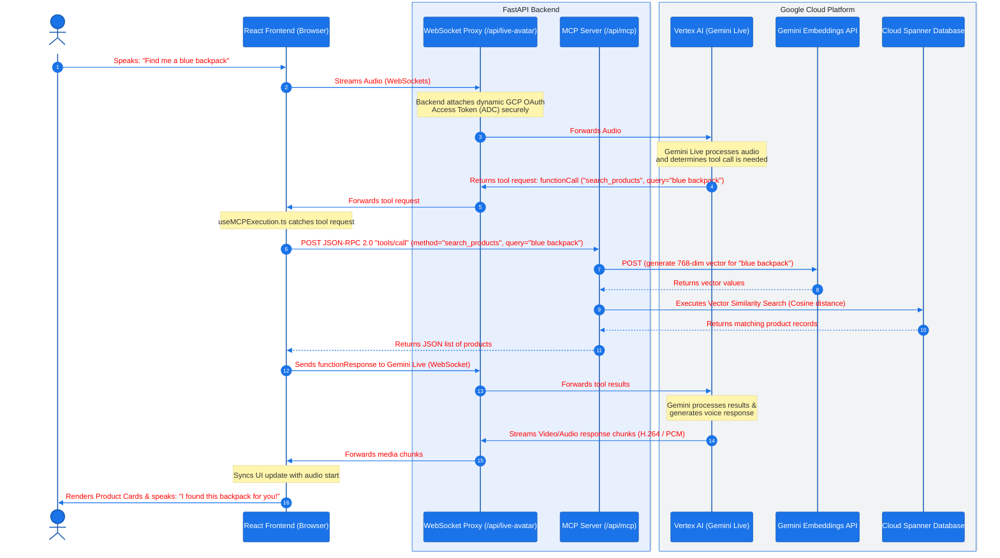

# Multimodal Avatar Architecture & MCP Integration Guide

This guide explains the architecture of the Multimodal Avatar application and how **FastAPI** integrates with **Model Context Protocol (MCP)** to connect the real-time AI assistant to private databases and catalog features.

---

## High-Level Architecture Diagram

The diagram below visualizes how the **React Frontend**, **FastAPI Backend**, **Vertex AI (Gemini Live)**, and **Cloud Spanner** communicate:



---

## Core Component & Code Explanations

### 1. React Frontend (The Orchestrator)
The client browser runs the user interface and coordinates the real-time experience:
* **Audio Recording & Encoding:** Captures mic input and posts PCM stream chunks via [useAudioRecorder.ts](file:///usr/local/google/home/ankurwahi/antigravity/gemini-live-multimodal-avatar/ecommerce/frontend/src/hooks/useAudioRecorder.ts).
* **Worker Thread Routing:** [networkWorker.ts](file:///usr/local/google/home/ankurwahi/antigravity/gemini-live-multimodal-avatar/ecommerce/frontend/src/workers/networkWorker.ts) runs the raw `@google/genai` WebSocket connections in a background thread to prevent blocking main UI rendering.
* **Tool Call Interception:** [useMCPExecution.ts](file:///usr/local/google/home/ankurwahi/antigravity/gemini-live-multimodal-avatar/ecommerce/frontend/src/hooks/useMCPExecution.ts) hooks into the socket handler. It catches Gemini's `functionCall` instructions, calls the backend MCP endpoints, and returns the response payload back to the WebSocket session.
* **Interactive Media Display:** [AvatarDisplay1P.tsx](file:///usr/local/google/home/ankurwahi/antigravity/gemini-live-multimodal-avatar/ecommerce/frontend/src/components/AvatarDisplay1P.tsx) listens to `'video-chunk-received'` events and renders the live-streamed virtual assistant (Vera) in an HTML5 `<video>` element using `mpegts.js`.

### 2. FastAPI Backend
The backend plays two distinct roles in the architecture:
* **Secure WebSocket Proxy ([websocket.py](file:///usr/local/google/home/ankurwahi/antigravity/gemini-live-multimodal-avatar/ecommerce/backend/routes/websocket.py)):**
  The client browser connects to `/api/live-avatar`. The proxy upgrades the request, obtains a secure GCP OAuth Access Token via [auth.py](file:///usr/local/google/home/ankurwahi/antigravity/gemini-live-multimodal-avatar/ecommerce/backend/auth.py), qualifies the requested model path server-side, and initiates the secure upstream connection to Vertex AI.
* **MCP JSON-RPC Server ([mcp.py](file:///usr/local/google/home/ankurwahi/antigravity/gemini-live-multimodal-avatar/ecommerce/backend/routes/mcp.py)):**
  Exposes local capabilities (catalog search, shopping cart management, checkout) over a standardized protocol.

### 3. Model Context Protocol (MCP)
Exposed at the `/api/mcp` endpoint in [mcp.py](file:///usr/local/google/home/ankurwahi/antigravity/gemini-live-multimodal-avatar/ecommerce/backend/routes/mcp.py):
1. **Tool Discovery (`tools/list`):** When the application starts, it queries the backend to see what tools are available. The server lists:
   * `search_products`: Search for products using semantic query text.
   * `add_to_cart`: Verify inventory and add items to a user's session cart.
   * `checkout_cart`: Finalize and place an order.
2. **Tool Execution (`tools/call`):** Matches incoming methods to local services:
   * Generating search vector embeddings via Vertex AI (`ai_client.models.embed_content`).
   * Executing database queries on Spanner ([database.py](file:///usr/local/google/home/ankurwahi/antigravity/gemini-live-multimodal-avatar/ecommerce/backend/database.py)) like `search_products`, `add_to_cart`, or `checkout_cart`.

---

## Step-by-Step Scenario: "Searching for a Product"

1. **User asks for a product:** The user says *"Show me coffee makers."*
2. **Gemini Live decides to use a tool:** Gemini Live processes the voice audio and realizes it cannot answer without checking the catalog. It outputs a `functionCall` event for the tool `search_products` with the argument `query="coffee makers"`.
3. **Frontend intercepts the call:** The frontend [useMCPExecution.ts](file:///usr/local/google/home/ankurwahi/antigravity/gemini-live-multimodal-avatar/ecommerce/frontend/src/hooks/useMCPExecution.ts#L35-L119) intercepts this request and calls [executeMCPTool](file:///usr/local/google/home/ankurwahi/antigravity/gemini-live-multimodal-avatar/ecommerce/frontend/src/api/tools.ts) which targets the backend's `/api/mcp` route.
4. **FastAPI performs Vector Search ([mcp.py:L83-110](file:///usr/local/google/home/ankurwahi/antigravity/gemini-live-multimodal-avatar/ecommerce/backend/routes/mcp.py#L83-L110)):**
   * The backend generates a 768-dimension vector embedding of the text `"coffee makers"` using Gemini's embedding model.
   * It queries **Cloud Spanner** using cosine similarity vector search ([database.py:L142-167](file:///usr/local/google/home/ankurwahi/antigravity/gemini-live-multimodal-avatar/ecommerce/backend/database.py#L142-L167)) to find the closest matching products in the database.
   * It returns the product catalog records as JSON.
5. **Results sent to Gemini:** The frontend sends these catalog records back to Gemini Live over the WebSocket connection.
6. **Voice and Visual Render:** Gemini reads the catalog data, starts speaking (e.g. *"Here is the AeroBrew Smart Coffee Maker"*), and streams the avatar video. Simultaneously, the frontend renders the product cards on the screen, matching the timing of the voice response.

---

## WebSockets & Backend Authentication Explained Simply

### 1. HTTP vs. WebSockets (Why we use WebSockets)
* **HTTP (Standard Web Requests):** Like sending letters. The browser sends a question, the server returns an answer, and they hang up. This has too much latency (delay) for real-time voice conversations.
* **WebSocket:** Like a telephone call. The browser and backend set up a single, permanent connection that stays open. Both sides can send data (audio, video, text) back and forth instantly at the same time.

### 2. The Security Problem (Why we need a Backend Proxy)
To connect to Google Vertex AI's Gemini Live API, the connection must be authenticated.
* **The Dangerous Way:** If we connect directly from the browser (React), we would have to send Google Cloud credentials or a private API key from the browser. Anyone could open the browser console (pressing F12), read the keys, and use them to access the company's Google Cloud project.
* **The Secure Way (The Proxy):** 
  * The browser only connects to **our backend server** (at `/api/live-avatar`).
  * The backend server uses **Application Default Credentials (ADC)**—a secure configuration built into our server environment that has access to Google Cloud. The backend generates a temporary, short-lived "OAuth Access Token" (access pass).
  * The backend then opens its own connection to Google Cloud, authenticates using that token, and **glues the two connections together**.
  * The browser never sees the access tokens or private API keys.

```
+------------------+                   +--------------------+                   +--------------------+
|  React Frontend  |  Local WebSocket  |  FastAPI Backend   |  Google WebSocket  | Vertex AI (Google) |
|     (Browser)    | ================= | (WebSocket Proxy)  | ================== | (Gemini Live API)  |
|                  |                   |  Attaches GCP Auth |                   |                    |
+------------------+                   +--------------------+                   +--------------------+
```
