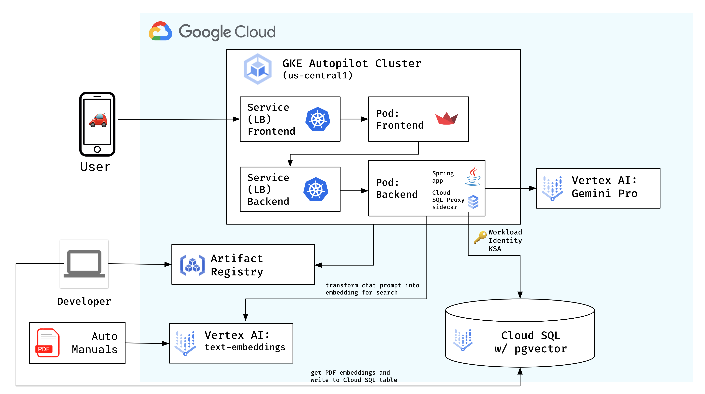

# Fix My Car

Fix My Car is a generative AI sample application designed to showcase **Retrieval-Augmented Generation (RAG)** on Google Cloud.
The app is an "auto owner's manual helper" that can help a car owner answer questions about their vehicle, without having to look through a lengthy manual. It was built with Java and Python ([Streamlit](https://streamlit.io/)), Google Kubernetes Engine (GKE), Gemini on Vertex AI, Vertex AI Search, and Cloud SQL.

## Getting started

This sample app has two flavors: one uses [Vertex AI Search](https://cloud.google.com/enterprise-search?hl=en), and the other uses [Cloud SQL (PostgreSQL)](https://cloud.google.com/sql?hl=en).

By default, both flavors use a mock owner's manual generated by [Gemini Pro 1.0](https://cloud.google.com/vertex-ai/generative-ai/docs/learn/models#gemini-models), for a mock vehicle, "Cymbal Starlight 2024". However, you are free to replace the PDF in `manuals/` with any publicly-available PDFs of your choice.

### Option 1 - Vertex AI Search

We recommend using the **Vertex AI Search** setup if:

- You want the fastest way to get started with RAG on GCP.
- You are okay to have the underlying vector embeddings abstracted away.

**[Click here to get started.](vertex-ai-search/)**

### Option 2 - Cloud SQL

We recommend using **Cloud SQL** if:

- You want to learn more about RAG and get more comfortable working with vector embeddings.
- You have existing data in a SQL database that you'd like to use for RAG, and want to learn how.

**[Click here to get started.](cloud-sql/)**

## Learn more

To learn more about Retrieval-Augmented Generation on Google Cloud, see:

- [Getting Started with Gen AI on Google Cloud - Grounding](https://cloud.google.com/docs/ai-ml/generative-ai#grounding)
- [Databases Retrieval App (SFO Airport Helper)](https://github.com/GoogleCloudPlatform/genai-databases-retrieval-app) (Cloud SQL or AlloyDB)
- [RAG Reference Architecture on Google Cloud with Vertex AI and AlloyDB](https://cloud.google.com/architecture/rag-capable-gen-ai-app-using-vertex-ai) + [Codelab](https://codelabs.developers.google.com/codelabs/genai-db-retrieval-app)
- [Blog post: Your RAGs powered by Google Search technology, part 1](https://cloud.google.com/blog/products/ai-machine-learning/rags-powered-by-google-search-technology-part-1), [part 2](https://cloud.google.com/blog/products/ai-machine-learning/rags-powered-by-google-search-technology-part-2)
- [On-demand webinar: Building RAG Applications with Google's AI Powered Databases](https://cloudonair.withgoogle.com/events/building-rag-applications-with-an-alloydb-database)
- [On-demand webinar: Accelerate Your Gen AI Journey: Build Gen AI applications in minutes with Google AI](https://cloudonair.withgoogle.com/events/accelerate-your-gen-ai-journey-build-gen-ai-applications-in-minutes-with-google-ai)
