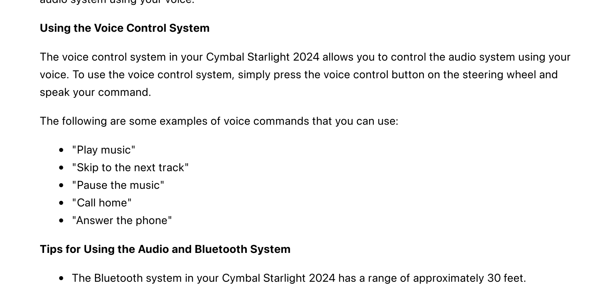
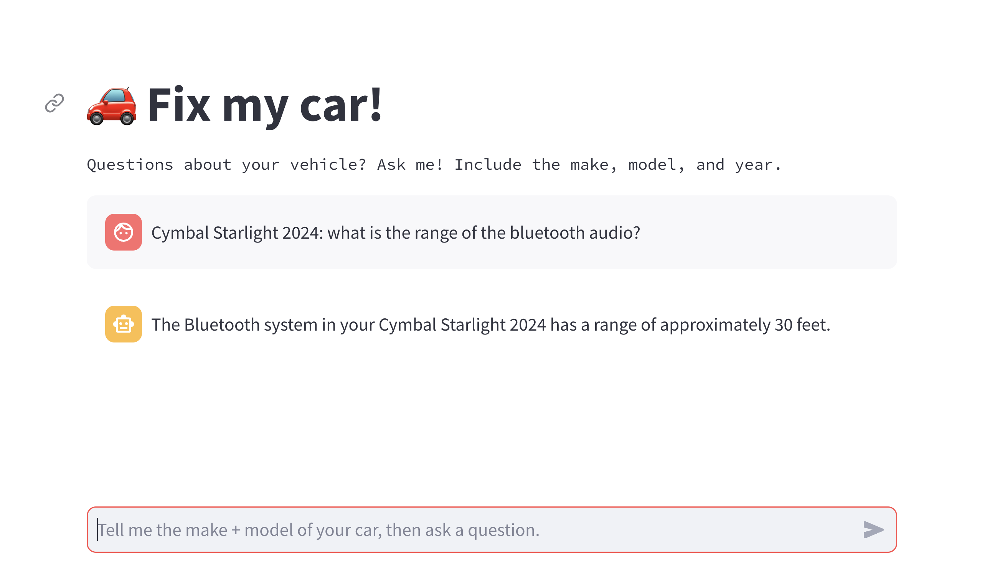

# Fix My Car with Cloud SQL

This guide walks through how to deploy the Fix My Car app to GKE, using Cloud SQL as the vector store.


## Prerequisites

To deploy this app, you will need:

- A [Google Cloud project](https://cloud.google.com/resource-manager/docs/creating-managing-projects#creating_a_project) with billing enabled.
- The [Google Cloud SDK (`gcloud`)](https://cloud.google.com/sdk/docs/install) installed and configured in your local environment (or use [Google Cloud Shell](https://cloud.google.com/sdk/docs/interactive-gcloud)). (Note: The gcloud SDK is already installed on Google Cloud Shell)
- [Docker Engine](https://docs.docker.com/engine/install/), OR an open-source tool like [Colima](https://github.com/abiosoft/colima) that can run `docker build` and `docker push`. (Note: Docker is already installed on Google Cloud Shell.)
- Java 18+, Maven 3.9.6+
- Python 3.9+

## Create an Artifact Registry repository.

This is where you'll store your container images for the Streamlit frontend and Java backend. [Containers](https://cloud.google.com/learn/what-are-containers) are packaged-up source code and dependencies that can be deployed to different environments.

1. Open the Google Cloud console. Open the search bar and type "Artifact Registry." Open the Artifact Registry console page.

2. Click **Create Repository.**

3. Name your repository `fixmycar`. Keep the default `Docker` option. Choose any region, eg. `us-central1`. Then click **Create.**

## Build and push container images.

1. From the Artifact Registry console, click your repository, **fixmycar.** Then click **Setup Instructions.**

2. Copy the authentication command, eg.

```bash
gcloud auth configure-docker \
    us-central1-docker.pkg.dev
```

3. Open your terminal or Cloud Shell. Paste the command and run it. This will authenticate your Docker client to your Artifact Registry repository.

_Expected output:_

```bash
{
  "credHelpers": {
    "us-central1-docker.pkg.dev": "gcloud"
  }
}
Adding credentials for: us-central1-docker.pkg.dev
```

4. Open the `dockerpush.sh` script in the root of this directory. Replace `PROJECT_ID` with your Google Cloud project ID.
5. Run the script to build and push the Frontend and Backend container images to Artifact Registry.

```bash
./dockerpush.sh
```

_Expected output_:

```
latest: digest: sha256:864589160d7c3f982472427ed008cc03cf244f5db61a0c7312caaaa670ee0e47 size: 1786
✅ Container build and push complete.
```

## Create a GKE Autopilot cluster

You will deploy these two container images ("frontend" and "backend") to [Google Kubernetes Engine (GKE).](https://cloud.google.com/kubernetes-engine/docs/concepts/kubernetes-engine-overview#how_works) GKE takes care of running these two servers on underlying compute resources.

1. Open the Google Cloud console. Open the search bar and type "Kubernetes Engine." Open the Kubernetes Engine console page. (If it prompts you to enable the API, click **Enable.**)

2. From the Kubernetes Engine console, click **Create** to open the cluster-creation wizard.

3. Keep all defaults (GKE Autopilot). Give your cluster any name you want, eg. `fixmycar`. Click **Create**.

This will take a few minutes to complete.

4. When your cluster is ready, click on the name of the cluster, and click **Connect.** Copy the "Command line Access" command, eg.

```bash
gcloud container clusters get-credentials fixmycar --region us-central1 --project my-project
```

5. Return to your terminal and paste that command, then run it.

_Expected output:_

```
Fetching cluster endpoint and auth data.
kubeconfig entry generated for fixmycar.
```

6. Test that you can reach your GKE cluster by running:

```bash
kubectl cluster-info
```

You should see something like:

```bash
Kubernetes control plane is running at https://34.69.121.152
...
```

### Create Cloud SQL PostgreSQL instance

1. Open the Cloud Console and search for "SQL." Click the console page.

2. Click **Create instance.**

3. Click **Choose PostgreSQL**.

4. Set your instance ID to `fixmycar`. Set your password to something secure. Write it down, since you'll create a Secret for it later.

5. Use PostgreSQL version **15**.

6. Downsize your instance to use **Enterprise** edition with the **Sandbox** tier. Keep all other settings as is.

7. Click **Create Instance.**

### Create a SQL table with vector embeddings

To initialize your vector database, we'll install the `pgvector` extension to Cloud SQL, then create a table to store the vector embeddings.

We've pre-generated a set of test vector embeddings to a CSV file located in `gs://github-repo/generative-ai/sample-apps/fixmycar/cymbal-starlight-2024.csv`. These were generated through the Vertex AI `text-embeddings-gecko:003` model. Optionally, you can see how we did this by viewing `pgvector/generate-embeddings.ipynb`. Here, we used [pdfplumber](https://github.com/jsvine/pdfplumber) to scan the PDF into raw text, then we used the [Langchain RecursiveCharacterTextSplitter](https://python.langchain.com/docs/modules/data_connection/document_transformers/recursive_text_splitter) to chunk the raw text, while keeping sentences and words together.

1. Download the CSV with the sample embeddings.

```bash
gsutil cp gs://github-repo/generative-ai/sample-apps/fixmycar/cymbal-starlight-2024.csv .
```

2. Enable the **SQL Admin API**: https://console.developers.google.com/apis/api/sqladmin.googleapis.com

3. Open a terminal and install the `psql` client, by following the instructions [here](https://www.postgresql.org/download/). If you're on macOS, [you can install the `psql` tool with `brew`](https://stackoverflow.com/questions/44654216/correct-way-to-install-psql-without-full-postgres-on-macos):

```
brew install libpq
```

3. Connect to your Cloud SQL instance.

```bash
gcloud sql connect fixmycar --user=postgres --quiet
```

_Expected output_

```bash
Allowlisting your IP for incoming connection for 5 minutes...done.
Connecting to database with SQL user [postgres].Password:
psql (16.2, server 15.5)
SSL connection (protocol: TLSv1.3, cipher: TLS_AES_256_GCM_SHA384, compression: off)
Type "help" for help.
postgres=>
```

6. Install the `pgvector` extension.

```sql
CREATE EXTENSION vector;
```

7. Create a new table. This table has a `text` column for the manual text, and a `vector` column for the embeddings matching that text. The vector is simply a list of 768 floats (decimal numbers). The reason is that the Vertex AI `text-embedding-gecko` model generates 768-dimensional embeddings.

```sql
CREATE TABLE fixmycar (id bigserial PRIMARY KEY, text VARCHAR(500), embedding vector(768));
```

8. Copy the CSV test embeddings into your table.

```sql
\copy fixmycar(text,embedding) FROM 'cymbal-starlight-2024.csv' DELIMITER ',' CSV
```

_Expected output_

```SQL
COPY 118
```

### Set up GKE Auth to Cloud SQL

Your backend server running in GKE will need to access both Cloud SQL and Vertex AI's Gemini API. To do this, we'll map the Kubernetes service account used by the backend pod, to a Google Cloud IAM service account with the right permissions. Here, the Kubernetes-to-GCP service account mapping provides the _authentication_ ("who are you?"), and the GCP service account's IAM roles provide _authorization_ ("what are you allowed to do?"). This setup is called [GKE Workload Identity.](https://cloud.google.com/kubernetes-engine/docs/concepts/workload-identity)

1. Set project ID env var.

```bash
export PROJECT_ID="your-gcp-project-id"
```

2. Run the setup script to configure auth.

```bash
./workload_identity.sh
```

_Expected output_

```
✅ Workload Identity setup complete.
```

### Deploy the app to GKE

1. Create a Kubernetes secret for your Postgres username and password.

```bash
kubectl create secret generic cloudsql-instance-credentials --from-literal=username=postgres --from-literal=password=your-password
```

_Expected output_

```bash
secret/cloudsql-instance-credentials created
```

2. Open the `kubernetes/frontend-deployment.yaml` file. Update the `image` field to use your project ID, for example:

```yaml
image: us-central1-docker.pkg.dev/project123/fixmycar/frontend:latest
```

3. Repeat step 2 for `kubernetes/backend-deployment-cloudsql.yaml`.

4. In `kubernetes/backend-deployment-cloudsql.yaml`, set the following additional env variables:

```yaml
- name: GCP_PROJECT_ID
  value: "your-project-id"
- name: INSTANCE_CONNECTION_NAME
  value: "your-cloud-sql-instance-connection"
```

Note that at the bottom of `backend-deployment-cloudsql.yaml`, we define a [sidecar proxy](https://cloud.google.com/sql/docs/mysql/connect-kubernetes-engine#run_the_in_a_sidecar_pattern) container running the Cloud SQL Proxy. Here, the proxy connects to Cloud SQL, allowing our Spring app to query the Cloud SQL database simply by using `localhost:5432` as the database host.

```yaml
- name: cloud-sql-proxy
  image: gcr.io/cloud-sql-connectors/cloud-sql-proxy:latest
  args:
    - "--port=5432"
    - "$(INSTANCE_CONNECTION_NAME)"
```

5. Deploy the app to your GKE cluster. This will create Deployments ("Pods", or running servers) for both the Streamlit frontend and Java backend. It will also create Services to expose both servers to the public Internet.

```
kubectl apply -f kubernetes/backend-deployment-cloudsql.yaml
kubectl apply -f kubernetes/backend-service.yaml
kubectl apply -f kubernetes/frontend-deployment.yaml
kubectl apply -f kubernetes/frontend-service.yaml
```

You may see a warning on Autopilot resource adjustments. This is normal; [GKE Autopilot is scaling up](https://cloud.google.com/kubernetes-engine/docs/concepts/autopilot-resource-requests#overview) its compute resources to run your workloads.

```
Warning: autopilot-default-resources-mutator:Autopilot updated Deployment default/fixmycar-frontend: adjusted resources to meet requirements for containers [fixmycar-frontend] (see http://g.co/gke/autopilot-resources)
```

### Test functionality

1. Get the status of your running GKE pods to ensure that the Frontend and Backend started up successfully.

```
kubectl get pods
```

Note - it may take ~3 minutes for your pods to move from `Pending` to `Running`, if you're deploying for the first time. (GKE is scaling up your cluster)

_Expected output_

```bash
NAME                                 READY   STATUS    RESTARTS   AGE
fixmycar-backend-59d575995b-kp98h    2/2     Running   0          5m
fixmycar-frontend-7b7ffc474f-6bqzs   1/1     Running   0          4m
```

2. Copy the external IP value of your frontend service.

```
kubectl get service fixmycar-frontend
```

_Expected output_

```
➜ kubectl get service fixmycar-frontend
NAME                TYPE           CLUSTER-IP       EXTERNAL-IP     PORT(S)        AGE
fixmycar-frontend   LoadBalancer   <ip-value>       <ip-value>      80:30519/TCP   4m13s
```

3. Open that IP address in a web browser. You should see a Streamlit frontend with a chat window.

4. Test a chat prompt based on an existing item in the manual, for instance, asking about Bluetooth audio:



**Prompt the Streamlit app:**

```
Cymbal Starlight 2024: What is the range of the bluetooth audio?
```

**Expected response**:



You can see what happened "under the hood" by viewing the backend server logs:

```
kubectl logs -l app=fixmycar-backend
```

_Expected output_:

```bash
fixmycar-backend-59d575995b-kp98h fixmycar-backend 2024-03-23T23:44:59.592Z  INFO 1 --- [nio-8080-exec-3] c.c.f.FixMyCarBackendController          : 🤖 Generated prompt embeddings of length: 768
fixmycar-backend-59d575995b-kp98h fixmycar-backend 2024-03-23T23:44:59.599Z  INFO 1 --- [nio-8080-exec-3] c.c.f.FixMyCarBackendController          : ⭐ Query: [0.014581554, -0.016977925, ...
fixmycar-backend-59d575995b-kp98h fixmycar-backend 2024-03-23T23:44:59.706Z  INFO 1 --- [nio-8080-exec-3] c.c.f.FixMyCarBackendController          : 🔍 Found 3 nearest neighbors
fixmycar-backend-59d575995b-kp98h fixmycar-backend 2024-03-23T23:44:59.706Z  INFO 1 --- [nio-8080-exec-3] c.c.f.FixMyCarBackendController          : 🔍 Neighbor: Cymbal Starlight 2024  music" "Call home" "Answer the phone" Tips for Using the Audio and Bluetooth System The Bluetooth system in your Cymbal Starlight 2024 has a range of approximately 30 feet. 18 / 22
fixmycar-backend-59d575995b-kp98h fixmycar-backend 2024-03-23T23:44:59.707Z  INFO 1 --- [nio-8080-exec-3] c.c.f.FixMyCarBackendController          : 🔍 Neighbor: Cymbal Starlight 2024  steps:. Make sure that the Bluetooth device is turned on and discoverable.. Press the Source button on the audio system and select Bluetooth.. The audio system will begin searching for Bluetooth devices.. Select your Bluetooth device from the list of available devices.. Enter the PIN code for your Bluetooth device (if prompted). Once your Bluetooth device is paired, you can stream music, make hands-free phone calls, and control the
fixmycar-backend-59d575995b-kp98h fixmycar-backend 2024-03-23T23:44:59.707Z  INFO 1 --- [nio-8080-exec-3] c.c.f.FixMyCarBackendController          : 🔍 Neighbor: Cymbal Starlight 2024  track Play/pause button Plays or pauses the current track Bluetooth Connectivity The Bluetooth system in your Cymbal Starlight 2024 allows you to connect your smartphone or other Bluetooth-enabled device to the audio system. This allows you to stream music, make hands-free phone calls, and control the audio system using your voice. Pairing a Bluetooth Device To pair a Bluetooth device with your Cymbal Starlight 2024, follow these steps:. Make
fixmycar-backend-59d575995b-kp98h fixmycar-backend 2024-03-23T23:44:59.707Z  INFO 1 --- [nio-8080-exec-3] c.c.f.FixMyCarBackendController          : 🔮 Gemini Prompt: You are a helpful car manual chatbot. Answer the car owner's question about their car. Human prompt: Cymbal Starlight 2024: what is the range of the bluetooth audio?,
fixmycar-backend-59d575995b-kp98h fixmycar-backend  Use the following grounding data as context. This came from the relevant vehicle owner's manual: Cymbal Starlight 2024  music" "Call home" "Answer the phone" Tips for Using the Audio and Bluetooth System The Bluetooth system in your Cymbal Starlight 2024 has a range of approximately 30 feet. 18 / 22
fixmycar-backend-59d575995b-kp98h fixmycar-backend Cymbal Starlight 2024  steps:. Make sure that the Bluetooth device is turned on and discoverable.. Press the Source button on the audio system and select Bluetooth.. The audio system will begin searching for Bluetooth devices.. Select your Bluetooth device from the list of available devices.. Enter the PIN code for your Bluetooth device (if prompted). Once your Bluetooth device is paired, you can stream music, make hands-free phone calls, and control the
fixmycar-backend-59d575995b-kp98h fixmycar-backend Cymbal Starlight 2024  track Play/pause button Plays or pauses the current track Bluetooth Connectivity The Bluetooth system in your Cymbal Starlight 2024 allows you to connect your smartphone or other Bluetooth-enabled device to the audio system. This allows you to stream music, make hands-free phone calls, and control the audio system using your voice. Pairing a Bluetooth Device To pair a Bluetooth device with your Cymbal Starlight 2024, follow these steps:. fixmycar-backend-59d575995b-kp98h fixmycar-backend 2024-03-23T23:45:00.708Z  INFO 1 --- [nio-8080-exec-3] c.c.f.FixMyCarBackendController          : 🔮 Gemini Response: The Bluetooth system in your Cymbal Starlight 2024 has a range of approximately 30 feet.
```

Here, you can see how the backend is converting the text prompt into embeddings, doing a search query to Cloud SQL (vector nearest-neighbors search), then augmenting the Gemini prompt using the results. The Gemini response is then sent back to the frontend, and that's what you're seeing as the chatbot response in the browser.
