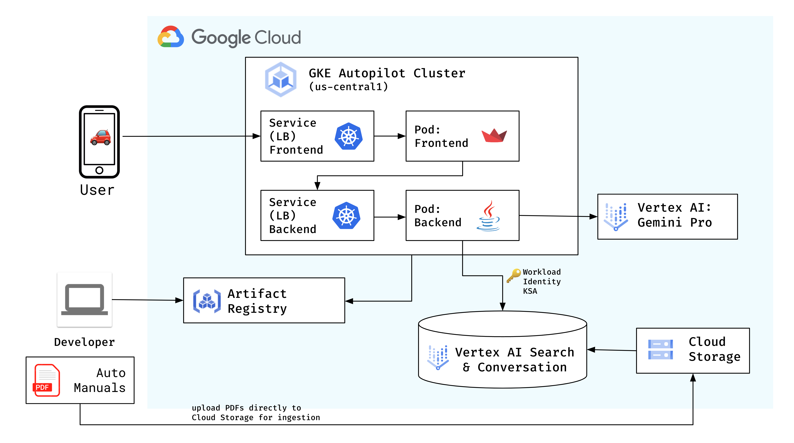
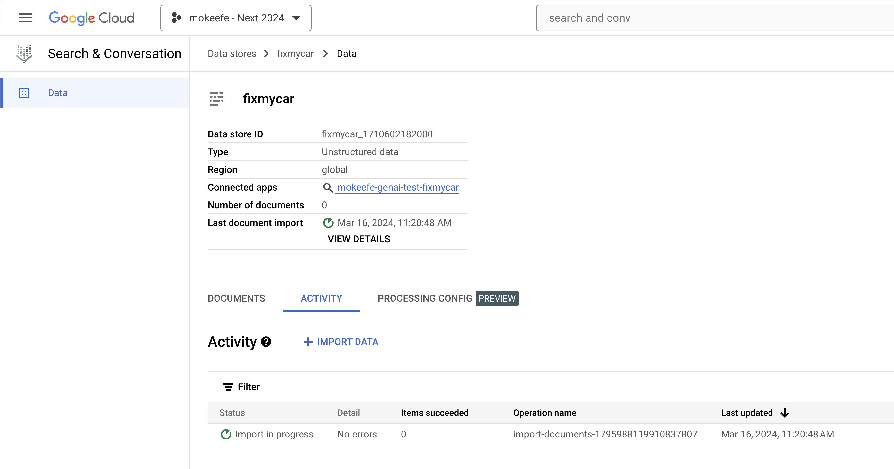
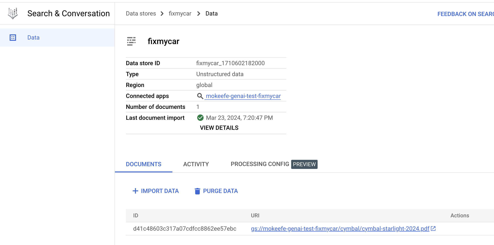
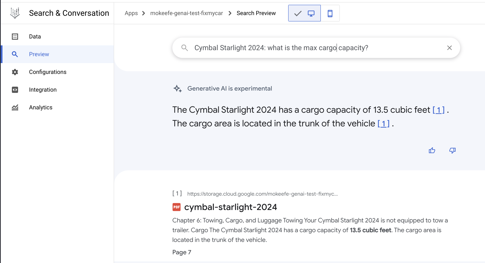
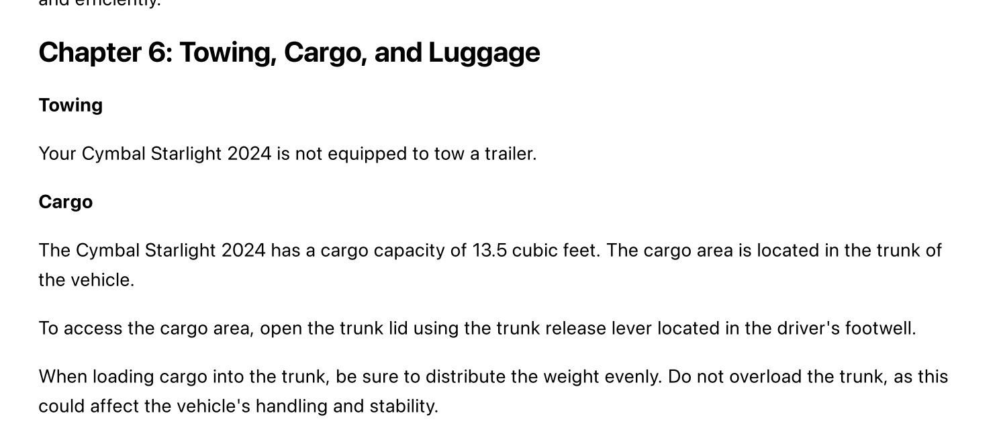

# Fix My Car - Vertex AI Search

This guide walks through how to deploy the Fix My Car app to GKE, using Vertex AI Search as the grounding data store.



## Prerequisites

To deploy this app, you will need:

- A [Google Cloud project](https://cloud.google.com/resource-manager/docs/creating-managing-projects#creating_a_project) with billing enabled.
- The [Google Cloud SDK (`gcloud`)](https://cloud.google.com/sdk/docs/install) installed and configured in your local environment (or use [Google Cloud Shell](https://cloud.google.com/sdk/docs/interactive-gcloud)). (Note: The gcloud SDK is already installed on Google Cloud Shell)
- [Docker Engine](https://docs.docker.com/engine/install/), OR an open-source tool like [Colima](https://github.com/abiosoft/colima) that can run `docker build` and `docker push`. (Note: Docker is already installed on Google Cloud Shell.)
- Java 18+, Maven 3.9.6+
- Python 3.9+

## Create an Artifact Registry repository.

This is where you'll store your container images for the Streamlit frontend and Java backend. [Containers](https://cloud.google.com/learn/what-are-containers) are packaged-up source code and dependencies that can be deployed to different environments.

1. Open the Google Cloud console. Open the search bar and type "Artifact Registry." Open the Artifact Registry console page.

2. Click **Create Repository.**

3. Name your repository `fixmycar`. Keep the default `Docker` option. Choose any region, eg. `us-central1`. Then click **Create.**

## Build and push container images.

1. From the Artifact Registry console, click your repository, **fixmycar.** Then click **Setup Instructions.**

2. Copy the authentication command, eg.

```bash
gcloud auth configure-docker \
    us-central1-docker.pkg.dev
```

3. Open your terminal or Cloud Shell. Paste the command and run it. This will authenticate your Docker client to your Artifact Registry repository.

_Expected output:_

```bash
{
  "credHelpers": {
    "us-central1-docker.pkg.dev": "gcloud"
  }
}
Adding credentials for: us-central1-docker.pkg.dev
```

4. Open the `dockerpush.sh` script in the root of this directory. Replace `PROJECT_ID` with your Google Cloud project ID.
5. Run the script to build and push the Frontend and Backend container images to Artifact Registry.

```bash
./dockerpush.sh
```

_Expected output_:

```
latest: digest: sha256:864589160d7c3f982472427ed008cc03cf244f5db61a0c7312caaaa670ee0e47 size: 1786
✅ Container build and push complete.
```

## Create a GKE Autopilot cluster

You will deploy these two container images ("frontend" and "backend") to [Google Kubernetes Engine (GKE).](https://cloud.google.com/kubernetes-engine/docs/concepts/kubernetes-engine-overview#how_works) GKE takes care of running these two servers on underlying compute resources.

1. Open the Google Cloud console. Open the search bar and type "Kubernetes Engine." Open the Kubernetes Engine console page. (If it prompts you to enable the API, click **Enable.**)

2. From the Kubernetes Engine console, click **Create** to open the cluster-creation wizard.

3. Keep all defaults (GKE Autopilot). Give your cluster any name you want, eg. `fixmycar`. Click **Create**.

This will take a few minutes to complete.

4. When your cluster is ready, click on the name of the cluster, and click **Connect.** Copy the "Command line Access" command, eg.

```bash
gcloud container clusters get-credentials fixmycar --region us-central1 --project my-project
```

5. Return to your terminal and paste that command, then run it.

_Expected output:_

```
Fetching cluster endpoint and auth data.
kubeconfig entry generated for fixmycar.
```

6. Test that you can reach your GKE cluster by running:

```bash
kubectl cluster-info
```

You should see something like:

```bash
Kubernetes control plane is running at https://34.69.121.152
...
```

## Upload auto manuals to Cloud Storage

1. Open the Cloud Console and search for "Cloud Storage." Click the console page.

2. Click **Create Bucket.**

3. Name your bucket something globally unique, eg. `<your-project-id>-fixmycar`. Keep all other default settings, then click **Create**. (You may see a notification about enforcing public access prevention - this is expected. Click "Confirm.")

4. Copy the full name of your bucket by clicking the "copy" icon.


5. Open your terminal. Set your bucket's name as an environment variable.

```
export BUCKET_NAME=<your-bucket-name>
```

6. Download the Cymbal Starlight 2024 manual from the public bucket.

```bash
gsutil cp gs://github-repo/generative-ai/sample-apps/fixmycar/cymbal-starlight-2024.pdf .
```

7. Upload the Cymbal Starlight 2024 owner's manual to your private Cloud Storage bucket.

```bash
gsutil -m cp -r cymbal-starlight-2024.pdf gs://$BUCKET_NAME
```

_Expected output_:

```bash
- [10/10 files][156.6 MiB/156.6 MiB] 100% Done
Operation completed over 10 objects/156.6 MiB.
```

## Set up Vertex AI Search

1. Open the Cloud Console and search for "Search and Conversation." Open the console page. If prompted, click **Activate API.**

2. Click **Create a new app**, then click type **Search**.

3. Keep "Enterprise edition features" and "Advanced LLM features"

4. Name your app **[PROJECT_ID]-fixmycar**, and set the ID to match. Set "Company Name" to `fixmycar`. Keep region `global`.

5. Click **Continue**. Then click **Create a new data store**.

6. In "Select Data Source," click **Cloud Storage.** Then browse to your Cloud Storage bucket's `manuals/` directory. Click **Continue**.


7. Set region `global`, and the Default Document Parser type to **[OCR Parser](https://cloud.google.com/generative-ai-app-builder/docs/parse-chunk-documents#parser-types).** Name your datastore `fixmycar`.


8. Click **Create** to create the data store.

9. Back in the application creation wizard, select the datastore you just created, then click **Create** to create your app.

## Test Vertex AI Search datastore

1. Back in the Data Stores page, click your new data store. Then click the **Activity** tab. You can view the status of your PDF processing here. Under the hood, Vertex AI Search is scanning your documents and converting them to vector embeddings. Then, it's storing those embeddings in the data store. **This may take around 10 minutes to complete.**



2. When your data store is ready, you should see a green check icon and the status: "Import completed."



3. You can test a search query directly from the console by clicking **Apps** on the left sidebar, then **Preview**. Type a query, for instance: `Cymbal Starlight 2024: Max cargo capacity`. A generated result should appear.



## Set up GKE auth to Vertex AI

Your GKE-based backend server needs to access Vertex AI Search and Vertex AI's Gemini API. To do this, we'll map the Kubernetes service account used by the backend pod, to a Google Cloud IAM service account with the right permissions. Here, the Kubernetes-to-GCP service account mapping provides the _authentication_ ("who are you?"), and the GCP service account's IAM roles provide _authorization_ ("what are you allowed to do?"). This setup is called [GKE Workload Identity.](https://cloud.google.com/kubernetes-engine/docs/concepts/workload-identity)

1. Run the setup script to configure auth.

```bash
./workload_identity.sh
```

_Expected output_

```
✅ Workload Identity setup complete.
```

## Deploy the app to GKE

1. Get ready to deploy the frontend and backend to Kubernetes Engine (GKE) by opening the `kubernetes/frontend-deployment.yaml` file.

2. Update the `image` field to use your project ID, for example:

```yaml
image: us-central1-docker.pkg.dev/project123/fixmycar/frontend:latest
```

3. Repeat step 2 for `kubernetes/backend-deployment-vertex-search.yaml`.

4. Update the GCP_PROJECT_ID env var in `backend-deployment-vertex-search.yaml` to use your project ID.

```
            - name: GCP_PROJECT_ID
              value: "your-project-id"
```

5. Lastly, update the `VERTEX_AI_DATASTORE_ID` env var in `backend-deployment-vertex-search.yaml` to use your Vertex AI Search Data Store ID. You can find this in the Console by clicking 'Data,' then copying the value of **Data Store ID**.

```
            - name: VERTEX_AI_DATASTORE_ID
              value: "your-datastore-id"
```

5. Deploy the app to your GKE cluster. This will create Deployments ("Pods", or running servers) for both the Streamlit frontend and Java backend. It will also create Services to expose both servers to the public Internet.

```bash
kubectl apply -f kubernetes/backend-deployment-vertex-search.yaml
kubectl apply -f kubernetes/backend-service.yaml
kubectl apply -f kubernetes/frontend-deployment.yaml
kubectl apply -f kubernetes/frontend-service.yaml
```

You may see a warning on Autopilot resource adjustments. This is normal; [GKE Autopilot is scaling up](https://cloud.google.com/kubernetes-engine/docs/concepts/autopilot-resource-requests#overview) its compute resources to run your workloads.

```
Warning: autopilot-default-resources-mutator:Autopilot updated Deployment default/fixmycar-frontend: adjusted resources to meet requirements for containers [fixmycar-frontend] (see http://g.co/gke/autopilot-resources)
```

## Test functionality.

1. Get the status of your running GKE pods to ensure that the Frontend and Backend started up successfully.

```
kubectl get pods
```

Note - it may take ~3 minutes for your pods to move from `Pending` to `Running`, if you're deploying for the first time. (GKE is scaling up your cluster)

_Expected output_

```bash
NAME                                 READY   STATUS    RESTARTS      AGE
fixmycar-backend-74fbb8c8b5-zbcmv    1/1     Running   0             3m
fixmycar-frontend-75ff59c776-h57r6   1/1     Running   0             2m
```

2. Copy the external IP value of your frontend service.

```
kubectl get service fixmycar-frontend
```

_Expected output_

```
➜ kubectl get service fixmycar-frontend
NAME                TYPE           CLUSTER-IP       EXTERNAL-IP     PORT(S)        AGE
fixmycar-frontend   LoadBalancer   <ip-value>       <ip-value>      80:30519/TCP   4m13s
```

3. Open that IP address in a web browser. You should see a Streamlit frontend with a chat window.

4. Test a chat prompt based on an existing item in the Cymbal Starlight owner's manual.

For instance, you can ask again about the max cargo capacity of the vehicle. This text is in our Vertex data store, so our app should be able to find this info for us.



**Prompt the Streamlit app:**

```
Cymbal Starlight 2024: What is the max cargo capacity?
```

_Expected chatbot response_:


The response should match the text from the manual.

You can see what happened "under the hood" by viewing the backend server logs:

```
kubectl logs -l app=fixmycar-backend
```

_Expected output_:

```bash
fixmycar-backend-77cb969894-cfvbq fixmycar-backend 2024-03-23T23:35:07.059Z  INFO 1 --- [nio-8080-exec-4] c.c.f.FixMyCarBackendController          : 🔍 Vertex AI Search results: Chapter 6: Towing, Cargo, and Luggage Towing Your Cymbal Starlight 2024 is not equipped to tow a trailer. Cargo The Cymbal Starlight 2024 has a cargo capacity of <b>13.5 cubic feet</b>. The cargo area is located in the trunk of the vehicle.
fixmycar-backend-77cb969894-cfvbq fixmycar-backend 2024-03-23T23:35:07.060Z  INFO 1 --- [nio-8080-exec-4] c.c.f.FixMyCarBackendController          : 🔮 Gemini Prompt: You are a helpful car manual chatbot. Answer the car owner's question about their car. Human prompt: Cymbal Starlight 2024: what is the max cargo capacity?,
fixmycar-backend-77cb969894-cfvbq fixmycar-backend  Use the following grounding data as context. This came from the relevant vehicle owner's manual: Chapter 6: Towing, Cargo, and Luggage Towing Your Cymbal Starlight 2024 is not equipped to tow a trailer. Cargo The Cymbal Starlight 2024 has a cargo capacity of <b>13.5 cubic feet</b>. The cargo area is located in the trunk of the vehicle.
fixmycar-backend-77cb969894-cfvbq fixmycar-backend 2024-03-23T23:35:07.762Z  INFO 1 --- [nio-8080-exec-4] c.c.f.FixMyCarBackendController          : 🔮 Gemini Response: The Cymbal Starlight 2024 has a cargo capacity of 13.5 cubic feet. The cargo area is located in the trunk of the vehicle.
```

Here, you can see how the backend is doing a search query to Vertex AI Search, then augmenting the Gemini prompt using the results. The Gemini response is then sent back to the frontend, and that's what you're seeing as the chatbot response in the browser.
