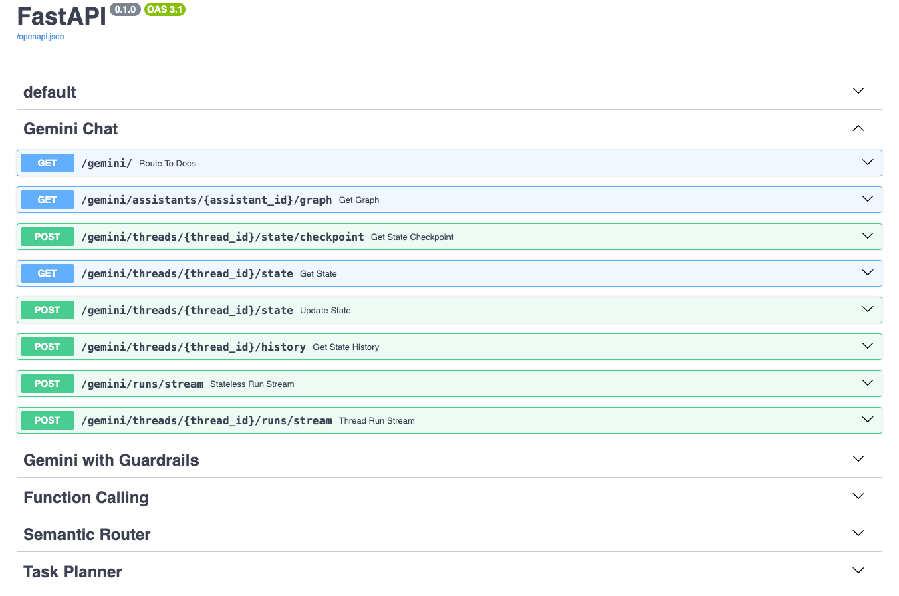
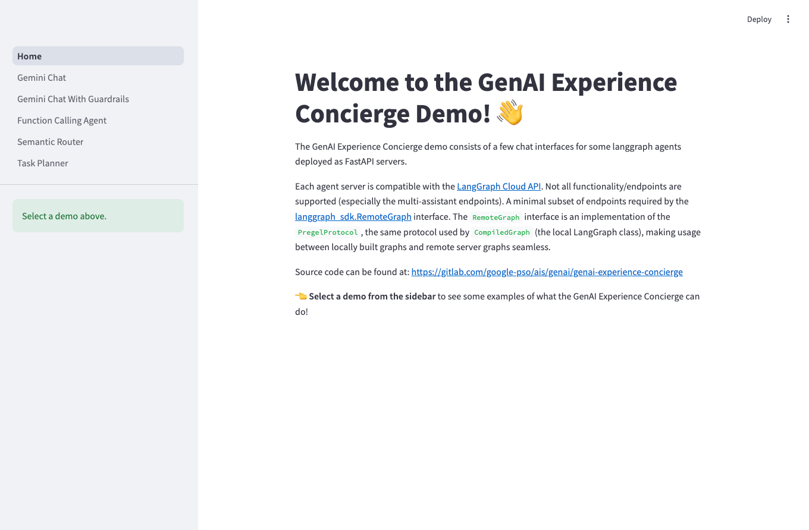
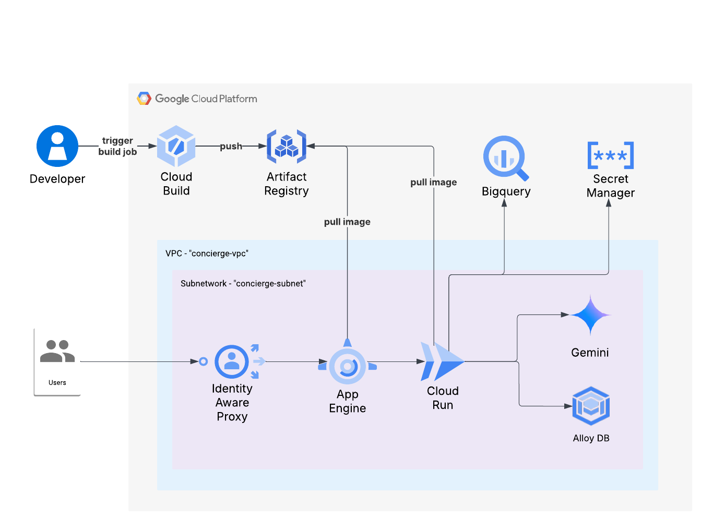

<!-- markdownlint-disable MD033 -->

# Gen AI Experience Concierge

## Introduction

Gen AI Experience Concierge is a collection of agent design pattern implementations. All design patterns are built using the LangGraph framework for agent orchestration and session management.

For more background on each agent architecture and standalone Jupyter notebook implementations, navigate to the [agent-design-patterns/](./agent-design-patterns/) folder.

We have also packaged these implementations as a "click-to-deploy" application that serves each LangGraph agent on FastAPI Server, compatible with the [LangGraph Cloud API spec](https://langchain-ai.github.io/langgraph/cloud/reference/api/api_ref.html), and hosts an IAP-protected frontend demo using Streamlit.

## Why use the LangGraph Cloud API spec?

The LangGraph Cloud API spec is used by the standard LangGraph client SDKs to interact with deployed agents. A minimal subset of endpoints required by the [langgraph_sdk.RemoteGraph](https://langchain-ai.github.io/langgraph/reference/remote_graph/) interface. The `RemoteGraph` interface supports the same protocol used by `CompiledGraph` (the local LangGraph class). Instead of designing custom routes for each new agent, you can rely on a consistent, predictable interface for interacting with LangGraph agents during development and deployment. This also benefits downstream teams (such as frontend developers) that need to invoke deployed agents. By supporting the LangGraph remote client, downstream teams only need to learn one client implementation and can quickly integrate newly deployed agents.

Currently, LangGraph only offers a solution for LangGraph Cloud API-compatible deployments on the managed LangGraph Platform. To enable this for self-hosted deployments, we wrote a small module ([source code](./langgraph-demo/backend/concierge/langgraph_server/)) to transform LangGraph agents into FastAPI routes. This doesn't support many of the premium features offered by the LangGraph Platform but is sufficient for using the `RemoteGraph` client.

To demonstrate the portability of this approach, the Streamlit frontend demo hosts 5 different chat agents with the only dependency being the standard `langgraph` package for calling the remote agents. The frontend implementations for each agent can be found in [this folder](./langgraph-demo/frontend/concierge_ui/pages).

## Quickstart Demo ✨

### Environment Setup

Clone the repo and ensure that the Google Application Default Credentials are configured. You can do this by running the following commands:

```bash
# Clone repo and navigate to project root directory
git clone https://github.com/GoogleCloudPlatform/generative-ai.git
cd gemini/sample-apps/genai-experience-concierge

# Set up Google Application Default Credentials
gcloud auth login
gcloud auth application-default login
```

### (Optional) Create the Cymbal Retail dataset

The function calling demo agent requires a BigQuery dataset to exist to query a fictional retail dataset. This is automatically created during demo deployment, but must be manually created if the demo project doesn't exist. To manually create these tables, you can run this command:

```bash
uv run --frozen concierge langgraph create-dataset --project-id $PROJECT_ID
```

### Start the agent backend server

To start the backend server, open a new terminal window, navigate to `langgraph-demo/backend` and run:

```bash
CONCIERGE_PROJECT=$PROJECT_ID uv run --frozen uvicorn concierge.server:app \
  --port 3000 \
  --reload
```

You can view the swagger documentation at [https://localhost:3000/docs](https://localhost:3000/docs). The docs include separate sections for each agent's router.

<div align="center" width="100%">
  
</div>

### Start the Streamlit frontend server

To start the frontend server, open a new terminal window, navigate to `langgraph-demo/frontend` and run:

```bash
uv run --frozen streamlit run concierge_ui/Home.py \
  --server.port 8080 \
  --server.runOnSave true
```

Navigate to [https://localhost:8080/](https://localhost:8080/) to use the Streamlit demos.

<div align="center" width="100%">
  
</div>

## End-to-End Deployment 🚀

The end-to-end deployment tool, `concierge langgraph deploy`, will create a new demo project, provision necessary infrastructure, and deploy the backend LangGraph server and frontend Streamlit app.

### Google Cloud Architecture

<div align="center" width="100%">
  
</div>

### Setup a seed project

The click-to-deploy LangGraph demo uses the [project-factory](https://registry.terraform.io/modules/terraform-google-modules/project-factory/google/latest) terraform module to automate the creation of a demo project and infrastructure provisioning. The module provides a helper script ([documentation](https://github.com/terraform-google-modules/terraform-google-project-factory?tab=readme-ov-file#script-helper)) to check that the seed project is configured correctly. It is recommended to run this script before running the deployment to ensure there won't be any errors.

### Configure the LangGraph demo deployment

Arguments to the CLI can either be provided on the command line or via a config file. An example config file might look like:

```yaml
langgraph:
  deploy:
    # Seed project to use for the terraform project factory.
    seed_project: seed-project-id
    # Target demo project to create.
    project_id: target-project-id
    # Billing account to attach to the target project.
    billing_account: 000000-000000-000000
    # Support email to appear in the OAuth consent screen.
    support_email: support@email.com
    # Terraform state bucket for infrastructure provisioning
    state_bucket: bucket-name
    # demo users that should have access to the deployed frontend demo.
    demo_users: ["group:test@email.com"]

    # (Optional) state bucket prefix
    state_bucket_prefix: concierge/langgraph
    # (Optional) organization ID to create the target project
    org_id: 000000000000
    # (Optional) folder ID to create the target project
    folder_id: 000000000000
```

### Deploy the LangGraph demo

Now that the seed project and configuration has been created, the demo can be deployed with the following command:

```bash
uv run --frozen concierge -f $CONFIG_YAML_FILE langgraph deploy
```

## Authors

[Enrique Chan](mailto:enriq@google.com): Project Lead

[Pablo Gaeta](mailto:pablogaeta@google.com): Engineer Lead

[Afshaan Mazagonwalla](mailto:afshaanmaz@google.com): Engineer

[Aadila Jasmin](mailto:aadilajasmin@google.com): Engineer

[Ahmad Khan](mailto:ahmadkh@google.com): Engineer

## Contributing

Contributions welcome! If you have any feedback or suggestions of agent design patterns to implement, please reach out to [genai-experience-concierge@google.com](mailto:genai-experience-concierge@google.com). See also the repo [Contributing Guide](https://github.com/GoogleCloudPlatform/generative-ai/blob/main/CONTRIBUTING.md).

## Disclaimer

This demo is not an officially supported Google product. The code in this repository is for demonstrative purposes only.