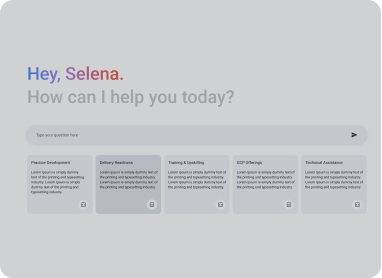

# Quickbot - Conversational App with Multiple Playbooks using Custom RAG & Agent Builder

Quickbot Conversational App Template is a powerful conversational application. It features a user-friendly frontend interface and a robust backend API that leverages a **custom Google Cloud Function for its Retrieval Augmented Generation (RAG) capabilities**. This works alongside Google Cloud's Agent Builder to manage conversational flows across **multiple, configurable playbooks**.

## Overview

This project allows users to interact with a conversational agent. The backend uses a custom Google Cloud Function (e.g., `process-query-for-rag`) for advanced information retrieval and generation. This RAG capability is integrated into conversational flows managed by a Vertex AI Conversation agent, which can orchestrate interactions across various playbooks. This README guides you through setting up the necessary cloud infrastructure (primarily the RAG Cloud Function) and then running the frontend, backend, and configuring the Agent Builder components.

## Demo

Watch how the Multi Playbook Template routes to specialized chatbots:



## Prerequisites

Before you begin, ensure you have the following installed:

*   **Docker and Docker Compose v2:** Essential for the containerized deployment.
    *   Verify your Docker Compose version with `docker compose version`. If you have an older `docker-compose` (with a hyphen), you might need to upgrade to use `docker compose` in the commands.
*   **Google Cloud SDK (`gcloud` CLI):** Required for manual backend setup, authentication, and interaction with Google Cloud services.
*   **Python 3.x:** For backend development (if not using Docker).
*   **Node.js and npm (or yarn):** For frontend development (if not using Docker).

## Getting Started

You have two main options to get the application running:

### Option 1: Using Docker Compose (Recommended for Quick Start)

This is the **simplest way to get the entire application (frontend and backend) up and running!** You just need to run `docker compose up` and you will be all set! But in order to do that, you may need to authenticate with gcloud. See the next steps:

1.  **Ensure Docker and Docker Compose v2 are installed and running.**

2.  **Authenticate with Google Cloud for Agent/Playbook Creation:**
    If you intend for the application (specifically the backend running in Docker) to create or interact with Google Cloud Agents and Playbooks, you need to provide Google Cloud credentials to the Docker container. The recommended way for local development is using Application Default Credentials (ADC).
    Run the following commands in your local terminal:
    ```bash
    gcloud auth application-default login
    gcloud config set project <your-project-id>
    gcloud auth application-default set-quota-project <your-project-id>

    # Verify your configuration
    gcloud auth list
    gcloud config list project
    ```
    This will create or update ADC on your local machine. The `docker-compose.yml` file is typically configured to mount these local credentials into the backend container, allowing it to authenticate.
    > **Windows Users:** The path to ADC might differ on Windows. You may need to adjust the commented-out volume mount paths for `gcloud` credentials in the `docker-compose.yml` file to ensure the backend container can access them.

3.  **Build Docker Images (with Agent & Playbook Setup Choice):**
    The Docker setup includes a build-time argument `IS_FIRST_DEPLOYMENT` to facilitate initial Google Cloud Vertex AI Conversation agent and playbook creation.

    *   **Automatic Default Setup (with Sample Playbook):**
        If you're running this for the first time and want a quick start with a sample playbook (and have authenticated as per step 2), build the Docker images with the `IS_FIRST_DEPLOYMENT` argument set to `"True"`:
        ```bash
        docker compose build --build-arg IS_FIRST_DEPLOYMENT="True"
        ```
        This configuration will automatically create a default agent and a sample playbook in your Google Cloud project. This sample playbook will provide a basic conversational flow to demonstrate the application's capabilities.

    *   **Custom Setup or Existing Agent/Playbook:**
        If you do not set `IS_FIRST_DEPLOYMENT="True"` during the build (or set it to any other value, or omit it), the application will not attempt to create the default agent and playbook. Instead, you'll need to:
        *   Configure the backend with environment variables to connect to an existing agent/playbook.
        *   Provide specific environment variables that instruct the backend on how to create a custom agent/playbook if desired.
        Refer to the "Environment Variables" section for backend configuration details. If you are using this path, you can build without the extra argument:
        ```bash
        docker compose build
        ```

4.  **Run the application:**
    After building the images (with or without the `IS_FIRST_DEPLOYMENT` arg as per your choice), start the services:
    ```bash
    docker compose up
    ```
    The frontend should typically be available at `http://localhost:4200` (or as configured) and the backend API at `http://localhost:8080`.

### Option 2: Manual Setup (for Development and Customization)

Follow these steps if you prefer to run the frontend and backend services manually on your local machine.

**A. Backend Setup**

1.  **Navigate to the `backend/` directory.**
    ```bash
    cd backend
    ```

2.  **Create a virtual environment and install dependencies:**
    ```bash
    # Check if you are already in an environment
    pip -V

    # If not, create and activate (for Linux/macOS)
    python3 -m venv .venv
    source .venv/bin/activate

    # Install requirements
    pip3 install -r requirements.txt
    ```
    > **VS Code Tip:** If VS Code doesn't recognize your virtual environment, press `Ctrl + Shift + P` (or `Cmd + Shift + P` on Mac), type "Python: Select Interpreter", choose "Enter interpreter path...", and then find and select `.venv/bin/python` inside your `backend` directory.

3.  **Setup Google Cloud (`gcloud`) credentials:**
    Ensure you're authenticated and your project is configured correctly.
    ```bash
    gcloud auth login # Login with your user account
    gcloud config set project <your-project-id>

    # For services using Application Default Credentials (ADC) locally
    gcloud auth application-default login
    # Optionally, set a quota project for ADC if not inherited
    gcloud auth application-default set-quota-project <your-project-id>

    # Verify configuration
    gcloud auth list
    gcloud config list project
    ```

4.  **Configure Environment Variables:**
    Backend configuration is managed via environment variables. Create a `.local.env` file in the `backend/` directory (you can copy from `.local.env.example` if one exists). This file should be added to `.gitignore`.

    *   **For Mac/Windows (or zsh console on Linux):**
        Source the variables directly (from the `backend/` directory):
        ```bash
        . ./.local.env
        ```
    *   **For Linux (bash):**
        Open `backend/.venv/bin/activate` and append the `export` commands from your `backend/.local.env` file after the `PATH` export section. For example:
        ```sh
        # ... existing activate script content ...
        _OLD_VIRTUAL_PATH="$PATH"
        PATH="$VIRTUAL_ENV/bin:$PATH"
        export PATH

        # Quickbot env variables (copied from .local.env)
        export ENVIRONMENT="development"
        export FRONTEND_URL="http://localhost:4200"
        export GCP_PROJECT_ID="<your-project-id>"
        export LOCATION_ID="global" # Or your specific region
        export AGENT_ID="<your-agent-id>" # Previously DATA_STORE_ID or similar
        export PLAYBOOK_ID="<your-playbook-id>" # Previously ENGINE_ID or similar
        export BIG_QUERY_DATASET="your_bq_dataset_for_conversation_analytics" # Updated purpose
        # ... other necessary variables for agent, playbook, etc. ...
        ```
    Verify the variables are set by running `env` in your activated terminal.

5.  **Run the setup script (if applicable):**
    This script might perform initial configurations like agent or playbook setup.
    ```bash
    # from the backend/ directory
    python3 setup.py
    ```

6.  **Run the backend application:**
    ```bash
    # from the backend/ directory
    uvicorn main:app --reload --port 8080
    ```

**B. Frontend Setup**

(These instructions assume a typical TypeScript/Angular frontend. Adjust as necessary based on your `frontend/README.md`.)

1.  **Navigate to the `frontend/` directory.**
    ```bash
    cd frontend
    ```
2.  **Install dependencies:**
    ```bash
    npm install
    ```
3.  **Environment Variables (if applicable):**
    The frontend might require its own environment configuration (e.g., via a `.env` file or Angular's `environment.ts` files for API endpoints). Check the `frontend/` directory or its `README.md` for specific instructions.
4.  **Run the frontend application:**
    ```bash
    npm start
    # Or, for many Angular projects:
    # ng serve
    ```
    The application will typically be available at `http://localhost:4200`.

## Project Structure (highlighting important parts)
```text
conversational-app-multi-playbook/
├── backend/                # Python backend (FastAPI/Uvicorn)
│   ├── .venv/              # Python virtual environment (gitignored)
│   ├── .local.env          # Local environment variables (gitignored)
│   ├── main.py             # Main application file
│   ├── requirements.txt    # Backend dependencies
│   ├── setup.py            # Backend setup script (e.g., for agent/playbook setup)
│   └── README.md           # Backend-specific instructions
├── frontend/               # TypeScript frontend (Angular)
│   ├── node_modules/       # Node.js dependencies (gitignored)
│   ├── src/                # Frontend source code
│   ├── package.json        # Frontend dependencies and scripts
│   ├── tsconfig.json       # TypeScript configuration
│   └── README.md           # Frontend-specific instructions
├── functions/              # Source code for Google Cloud Functions
│   └── create-intent/      # Example: Source for the RAG Cloud Function
│       └── ...
├── docker-compose.yml      # Docker Compose configuration for all services
└── README.md               # This file: Root project README
```

## Environment Variables

Configuration for both frontend and backend is primarily managed through environment variables.

*   **Backend:**
    *   When running manually, backend environment variables are typically defined in `backend/.local.env`.
    *   When running with Docker, these variables are usually passed into the backend container via the `docker-compose.yml` file (often referencing a `.env` file at the root or `backend/` directory).
    *   Key variables include:
        *   `GCP_PROJECT_ID`: Your Google Cloud Project ID.
        *   `LOCATION_ID`: The Google Cloud region for your Vertex AI Conversation agent (e.g., `global`, `us-central1`).
        *   `AGENT_ID`: The ID of your Vertex AI Conversation agent.
        *   `PLAYBOOK_ID`: (If applicable for your setup) The ID of the specific playbook being used. This might also be configured within the agent itself.
        *   `ENVIRONMENT`: Application environment (e.g., `development`, `production`).
        *   `FRONTEND_URL`: URL of the frontend application (e.g., `http://localhost:4200`).
        *   `BIG_QUERY_DATASET`: (If used) Name of the BigQuery dataset for conversation analytics.
        *   These variables are especially important if not using the `IS_FIRST_DEPLOYMENT="True"` Docker build arg for automatic setup.
    *   Consult `backend/README.md` or `backend/.local.env.example` for a complete list.

*   **Frontend:**
    *   Frontend environment variables (e.g., API endpoint URLs) are usually managed within the frontend's build system (e.g., Angular's `environment.ts` files or a `.env` file in the `frontend/` directory).
    *   Consult `frontend/README.md` for specific details.

## Code Styling & Commit Guidelines

To maintain code quality and consistency across the project:

*   **TypeScript (Frontend):** We follow the Angular Coding Style Guide by leveraging Google's TypeScript Style Guide using `gts`. This includes a formatter, linter, and automatic code fixer.
*   **Python (Backend):** We adhere to the Google Python Style Guide, using tools like `pylint` and `black` for linting and formatting.
*   **Commit Messages:** We suggest following Angular's Commit Message Guidelines to create clear and descriptive commit messages.

### Frontend (TypeScript with `gts`)

(Assumes setup within the `frontend/` directory)

1.  **Initialize `gts` (if not already done in the project):**
    Navigate to `frontend/` and run:
    ```bash
    npx gts init
    ```
    This will set up `gts` and create necessary configuration files (like `tsconfig.json`). Ensure your `tsconfig.json` (or a related `gts` config file like `.gtsrc`) includes an extension for `gts` defaults, typically:
    ```json
    {
      "extends": "./node_modules/gts/tsconfig-google.json"
      // ... other configurations
    }
    ```
2.  **Check for linting issues:**
    (This assumes a `lint` script is defined in `frontend/package.json`, e.g., `"lint": "gts lint"`)
    ```bash
    # from frontend/ directory
    npm run lint
    ```
3.  **Fix linting issues automatically (where possible):**
    (This assumes a `fix` script is defined in `frontend/package.json`, e.g., `"fix": "gts fix"`)
    ```bash
    # from frontend/ directory
    npm run fix
    ```

### Backend (Python with `pylint` and `black`)

(Assumes setup within the `backend/` directory and its virtual environment activated)

1.  **Ensure Dependencies are Installed:**
    Add `pylint` and `black` to your `backend/requirements.txt` file if not already present:
    ```
    pylint
    black
    ```
    Then install them within your virtual environment:
    ```bash
    # from backend/ directory, with .venv activated
    pip install pylint black
    # or pip install -r requirements.txt
    ```
2.  **Configure `pylint`:**
    It's recommended to have a `.pylintrc` file in your `backend/` directory to configure `pylint` rules. You can generate one if it doesn't exist:
    ```bash
    # from backend/ directory
    pylint --generate-rcfile > .pylintrc
    ```
    Customize this file according to your project's needs and the Google Python Style Guide.
3.  **Check for linting issues with `pylint`:**
    Navigate to the `backend/` directory and run:
    ```bash
    # from backend/ directory
    pylint .
    # Or specify modules/packages: pylint your_module_name
    ```
4.  **Format code with `black`:**
    To automatically format all Python files in the `backend/` directory and its subdirectories:
    ```bash
    # from backend/ directory
    python -m black . --line-length=80
    ```
