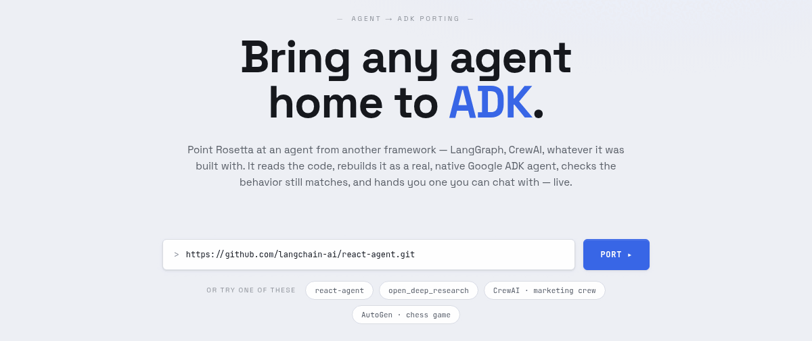

# Rosetta — port any agent to ADK with Gemini 3.7 Flash

| Author(s) |
| --------- |
| [Lavi Nigam](https://www.linkedin.com/in/lavinigam/) |

Point Rosetta at an agent repo built with **LangGraph, CrewAI or AutoGen**. It reads the
code, rebuilds it as a native [Google ADK](https://google.github.io/adk-docs/) agent,
self-heals the build until it is green, checks the port still behaves like the original,
and hands you a running agent you can chat with — in about a minute.

Every stage runs on a single model:
**[Gemini 3.7 Flash](https://ai.google.dev/gemini-api/docs/models)**.



## What it does


One model does all of it. What changes per stage is the **thinking budget**, not the
model: the high-volume repo read runs at `LOW` so the six analysts stay fast, while the
port planner and code generator think at `MEDIUM`. See `ROLE_THINKING` in
[`app/config.py`](app/config.py).

## Prerequisites

| Tool | Why | Install |
| --- | --- | --- |
| Python 3.11–3.13 | runtime | <https://www.python.org/downloads/> |
| `uv` | dependency + venv manager | <https://docs.astral.sh/uv/getting-started/installation/> |
| `git` | Rosetta clones the repos you point it at | <https://git-scm.com/downloads> |

Everything else, including
[`agents-cli`](https://github.com/google/agents-cli) (which scaffolds and lints the
generated ADK project), is installed by `make setup`.

Plus access to Gemini through **either** of the two backends below.

## Setup

```bash
git clone https://github.com/GoogleCloudPlatform/generative-ai.git
cd generative-ai/gemini/sample-apps/rosetta-agent-porter

make setup     # checks the tools above, installs deps, creates .env
```

Then open `.env` and configure **one** backend.

### Option A — Gemini API (Google AI Studio)

The quickest way to start. Get a key at
[aistudio.google.com/apikey](https://aistudio.google.com/apikey):

```bash
GOOGLE_API_KEY=your-api-key-here
```

### Option B — Gemini Enterprise Agent Platform

Use your own Google Cloud project:

```bash
gcloud auth application-default login
gcloud services enable aiplatform.googleapis.com --project=YOUR_PROJECT_ID
```

```bash
GOOGLE_CLOUD_PROJECT=your-project-id
GOOGLE_CLOUD_LOCATION=global
```

Rosetta picks the backend automatically: if `GOOGLE_API_KEY` is set it uses the Gemini
API, otherwise it uses Gemini Enterprise Agent Platform. Set `ROSETTA_BACKEND=ai-studio` or
`ROSETTA_BACKEND=agent-platform` to force one.
Variables exported in your shell take precedence over `.env`.

## Run it

```bash
make demo
```

Open <http://127.0.0.1:8030>, paste an agent repo URL and press **Port**. Try one of these:

- `https://github.com/langchain-ai/react-agent.git` — LangGraph, the quickest run
- `https://github.com/langchain-ai/open_deep_research` — LangGraph, multi-agent research
- `https://github.com/crewAIInc/crewAI-examples/tree/main/crews/marketing_strategy` — CrewAI
- `https://github.com/microsoft/autogen/tree/main/python/samples/agentchat_chess_game` — AutoGen

A monorepo subdirectory URL (`.../tree/<branch>/<sub/dir>`) works too.

The generated project is written to `workspace/ported/<name>/` — a complete, runnable ADK
project you can keep, `cd` into and run on its own.

### Without the UI

```bash
make port REPO=https://github.com/langchain-ai/react-agent.git   # headless port
make eval TARGET=react-agent-adk                                  # fidelity eval
make test                                                         # unit tests
make help                                                         # everything else
```

## How it works

Rosetta is itself an ADK multi-agent system — it uses ADK to port agents to ADK. The
analysis swarm is a real ADK `ParallelAgent`; the self-heal loop feeds verification
errors back into code generation until the build is green.

Every stage, end to end:

```text
repo URL ─▶ intake + framework detect      identifies LangGraph / CrewAI / AutoGen
        ─▶ parallel analysis swarm         6 agents read the repo at once:
                                           graph · prompts · tools · state · models · inputs
        ─▶ port plan                       maps source constructs to ADK, flags the tricky parts
        ─▶ scaffold                        a real ADK project via agents-cli
        ─▶ codegen                         writes app/*.py
        ─▶ verify + self-heal              ast → lint → import → runtime smoke → repair loop
        ─▶ launch                          adk api_server — the ported agent goes live
        ─▶ fidelity eval                   replays repo-derived inputs, LLM-as-judge scorecard
        ─▶ chat                            talk to the ported agent
```

Where that lives in the code:

| Path | What lives there |
| --- | --- |
| [`app/agents.py`](app/agents.py) | the agent roster: intake, the 6-way analysis swarm, planner, codegen, fixer |
| [`app/pipeline.py`](app/pipeline.py) | the orchestration, streamed to the UI as server-sent events |
| [`app/prompts.py`](app/prompts.py) | every prompt, including the ADK cheat-sheet that grounds codegen |
| [`app/config.py`](app/config.py) | the model, per-role thinking levels, backend selection |
| [`app/verify.py`](app/verify.py) | the static + runtime checks that drive the self-heal loop |
| [`app/evalgen.py`](app/evalgen.py) | fidelity eval: replays repo-derived inputs, grades with an LLM judge |
| [`serve.py`](serve.py) | FastAPI cockpit; proxies chat to the ported agent's `api_server` |
| [`frontend/index.html`](frontend/index.html) | the single-page UI |

Two details worth knowing if you read the code:

- **Model names are never hardcoded in the UI.** The frontend reads them from
  `GET /api/config`, so `app/config.py` stays the single source of truth.
- **Prompts use sentinels, not literals.** `__MODEL_SMART__`, `__BACKEND_RULES__` and
  friends are substituted from config at import time, so a generated project can never
  drift onto a model or backend the app is not actually using.

## Deploy to Cloud Run (optional)

```bash
make deploy GCP_PROJECT=your-project-id
```

Builds the container, creates a runtime service account with `roles/aiplatform.user`, and
deploys to Cloud Run using Gemini Enterprise Agent Platform — no API key in the container. The service is
deployed **private** (`--no-allow-unauthenticated`); the script prints the command to
grant yourself access. Put real authentication in front of it before exposing it to
anyone else.

## Costs

Rosetta makes many model calls per port (six parallel analysts, a planner, a code
generator, a repair loop and an LLM judge). On the Gemini API free tier you may hit rate
limits on the larger repos. See
[Gemini API pricing](https://ai.google.dev/gemini-api/docs/pricing) and
[Gemini Enterprise Agent Platform pricing](https://cloud.google.com/gemini-enterprise/pricing).

Delete generated projects and cloned repos when you are done:

```bash
rm -rf workspace/
```

## Limitations

- Ports are generated by a model. They are checked to build, import, run and behave like
  the original, but **review the code before using it for anything real**.
- Rosetta clones and reads whatever repository URL you give it. Only point it at
  repositories you trust.
- Fidelity scores come from an LLM judge on a handful of repo-derived inputs. Treat them
  as a smoke test, not a guarantee.
- The self-heal loop is capped (3 repairs by default). Very large or unusual agents can
  exhaust it.

## Disclaimer

This is not an officially supported Google product. It is sample code, provided as-is, to
demonstrate what Gemini 3.7 Flash and ADK can do together.
