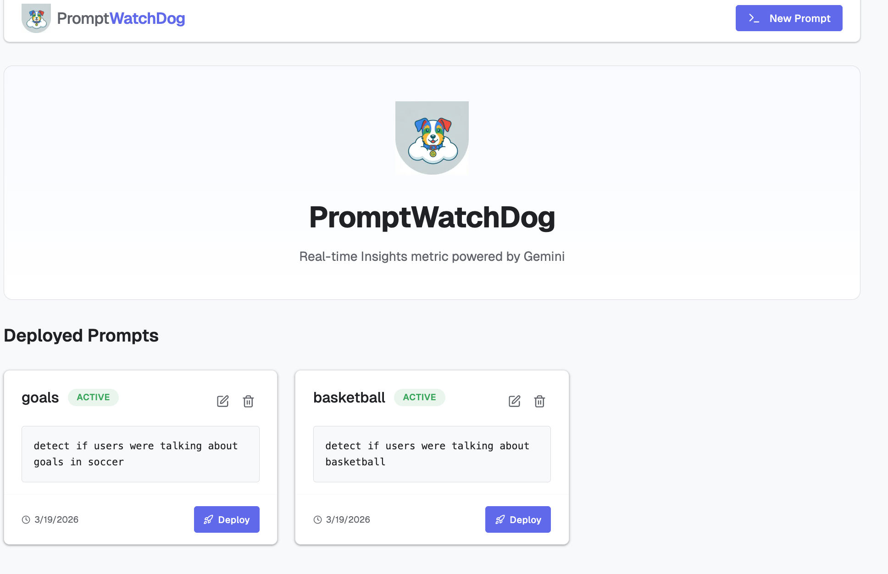
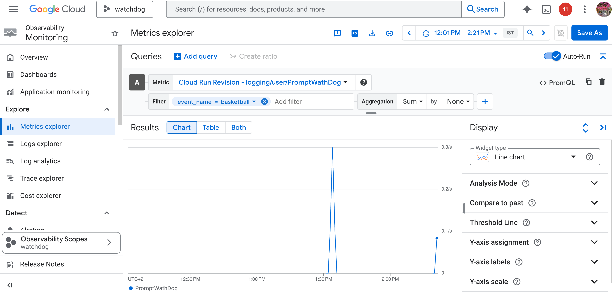
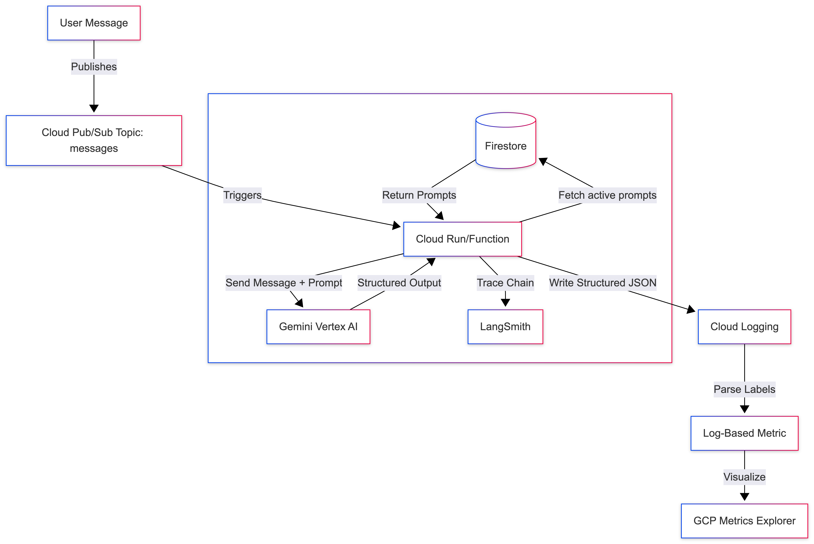

  # 🐶 PromptWatchDog

  

  <div align="center">

  [](https://www.python.org/downloads/release/python-3110/)
  [](https://cloud.google.com/)
  [](https://opensource.org/licenses/Apache-2.0)

  **Real-time Insights metric powered by Gemini**

  </div>

  ---

  ## 📖 Overview

  **PromptWatchDog** is a serverless, event-driven framework designed to monitor data streams using natural language prompts. Instead of rigid code-based metrics, you define what you want to track in English, and Gemini interprets the data in real-time.

  Key capabilities include:
  - **Event Ingestion**: Listens to messages on Google Cloud Pub/Sub.
  - **AI Analysis**: Uses **Gemini Pro** to process and classify incoming data payloads according to your prompt.
  - **Structured Insights**: Converts unstructured text/data into structured metrics logs.
  - **Serverless Scale**: Deploys on Google Cloud Functions (Gen2) for auto-scaling capabilities.

  <div align="center">
    
    
  </div>

  ## 🏗️ Project Structure

  ```bash
  ├── watchdog/
  │   ├── main.py              # Main Cloud Function/Cloud Run entry point & subscription logic
  │   ├── pyproject.toml       # Python dependencies & metadata
  │   ├── uv.lock              # Lockfile for dependency management
  │   └── simulate_stream.py   # Local testing script to simulate Pub/Sub events
  ├── dashboard/           # Next.js UI for managing prompts (Local Only)
  ├── static/
  │   └── banner.png           # Project assets
  ├── cloudbuild.yaml          # CI/CD configuration for Cloud Build
  ├── README.md                # Documentation
  └── .env                     # Local environment configuration
  ```

  ## 🏗️ Architecture

  Here is how the data flows from a user message to a live dashboard:

  

  ## 🧩 Key Components

  1.  **Message Bus (Pub/Sub)**: Acts as the buffer and trigger for the system. Messages published to the `messages` topic trigger the analysis.
  2.  **Orchestrator (LangChain)**: Manages the interaction between the raw data and the LLM, ensuring prompts are formatted correctly.
  3.  **Intelligence Engine (Gemini)**: The core "brain" that evaluates the data against the natural language metric definitions.
  4.  **Observer (Cloud Monitoring)**: Captures the structured output from Gemini as log-based metrics for dashboarding.
  5.  **Storage (Firestore)**: Stores the natural language prompts used by PromptWatchDog.

  ---

  ## 🚀 Getting Started

  ### Prerequisites

  - **Python 3.11+** installed locally.
  - **Node.js 18+** for the dashboard.
  - **Google Cloud Project** with billing enabled.
  - **gcloud CLI** authenticated and configured.
  - APIs Enabled: `vertexai`, `cloudfunctions`, `pubsub`, `run`, `cloudbuild`.

  ### Environment Setup

  1.  **Clone the repository**:
      ```bash
      git clone https://github.com/g-emarco/PromptWatchDog.git
      cd PromptWatchDog
      ```

  2.  **Create a `.env` file**:
      ```bash
      touch .env
      ```
      Add the following variables:
      ```env
      GCP_PROJECT=your-project-id
      GOOGLE_APPLICATION_CREDENTIALS=path/to/key.json
      FIRESTORE_DATABASE=your-firestore-db-name  # e.g., watchdog-prompts
      FIRESTORE_COLLECTION=prompts              # optional, defaults to 'prompts'
      ```

  3.  **Install Dependencies**:
      The project uses `uv` for Python dependency management.
      ```bash
      # For watchdog
      cd watchdog
      uv sync
      cd ..

      # For dashboard
      cd dashboard
      npm install
      cd ..
      ```

  ### Running Locally

  #### Testing the Watchdog (Simulation)
  To test the `watchdog` logic locally without deploying to GCP, use the simulation script:

  ```bash
  python watchdog/simulate_stream.py
  ```
  This script mocks the Pub/Sub event stream and uses controlled test data to verify the LLM's evaluation against your prompts.

  #### Running the Watchdog Service Locally
  The `watchdog` is built with the **Functions Framework**, allowing you to run it locally as a web service (Cloud Run emulator):

  ```bash
  cd watchdog
  functions-framework --target subscribe --signature-type cloudevent
  ```

  ---

  ## ☁️ Deployment

  The `watchdog` service is designed to be deployed as a **Cloud Run** service (via Cloud Functions Gen2).

  ### 1. Infrastructure Setup

  Initialize the required Google Cloud resources.

  **Enable APIs:**
  ```bash
  gcloud services enable \
    cloudbuild.googleapis.com \
    run.googleapis.com \
    secretmanager.googleapis.com \
    artifactregistry.googleapis.com \
    vertexai.googleapis.com \
    firestore.googleapis.com \
    eventarc.googleapis.com
  ```

  **Setup IAM:**
  ```bash
  export PROJECT_ID=$(gcloud config get-value project)
  export SA_NAME="vertex-ai-consumer"
  export SA_EMAIL="$SA_NAME@$PROJECT_ID.iam.gserviceaccount.com"

  # Create Service Account
  gcloud iam service-accounts create $SA_NAME --display-name="Vertex AI Consumer"

  # Grant roles
  gcloud projects add-iam-policy-binding $PROJECT_ID --member="serviceAccount:$SA_EMAIL" --role="roles/run.invoker"
  gcloud projects add-iam-policy-binding $PROJECT_ID --member="serviceAccount:$SA_EMAIL" --role="roles/aiplatform.user"
  gcloud projects add-iam-policy-binding $PROJECT_ID --member="serviceAccount:$SA_EMAIL" --role="roles/pubsub.subscriber"
  gcloud projects add-iam-policy-binding $PROJECT_ID --member="serviceAccount:$SA_EMAIL" --role="roles/eventarc.eventReceiver"
  gcloud projects add-iam-policy-binding $PROJECT_ID --member="serviceAccount:$SA_EMAIL" --role="roles/datastore.user"
  ```

  **Create Pub/Sub Topic:**
  ```bash
  gcloud pubsub topics create messages
  ```

  **Create Firestore Database:**
  ```bash
  gcloud firestore databases create --database=watchdog-prompts --location=us-east1
  ```

  ### 2. Deploy Function & Trigger

  Deploy the code as a Cloud Run function and set up the Eventarc trigger.

  ```bash 
  # Deploy the Cloud Run service from source
  gcloud run deploy prompt-watchdog \
    --region=us-east1 \
    --source=./watchdog \
    --function=subscribe \
    --service-account=$SA_EMAIL \
    --set-env-vars="FIRESTORE_DATABASE=watchdog-prompts" \
    --memory=8Gi \
    --cpu=8 \
    --no-allow-unauthenticated
  
  # Create an Eventarc trigger for the Pub/Sub topic
  gcloud eventarc triggers create prompt-watchdog-trigger \
    --location=us-east1 \
    --destination-run-service=prompt-watchdog \
    --destination-run-region=us-east1 \
    --event-filters="type=google.cloud.pubsub.topic.v1.messagePublished" \
    --transport-topic=messages \
    --service-account=$SA_EMAIL
  ```

  ### 3. Test the Deployment

  You can trigger the watchdog manually by publishing a sample message to the Pub/Sub topic:

  ```bash
  gcloud pubsub topics publish messages \
    --message='{"sender": "Alice", "text": "Hey, are you watching the Champions League tonight?"}'
  ```

  Check the Cloud Run logs or your structured metrics dashboard to see the LLM's evaluation of the prompt!

  ---

## 📊 Monitoring & Log-Based Metrics

PromptWatchDog emits structured JSON logs. Create **Log-Based Metrics** in Google Cloud Logging to track these events in real-time.

### The Pattern for Dynamic Monitoring

The core value proposition of PromptWatchDog! By leveraging log-based metrics and the **Metrics Explorer**, you can add prompts dynamically later without touching the code, and they will automatically light up in your dashboards.

Instead of creating a new metric or a new label for each prompt, you **must** create **one** unified metric with `watchdog_id` and `watchdog_name` labels. Google Cloud will automatically partition values by label, allowing you to filter and group by prompt ID or name dynamically without altering the metric schema!


#### Using `gcloud` and a Config File

1. Create a `metric-config.json`:
   ```json
   {
     "name": "watchdog_evaluations_total",
     "description": "Total count of watchdog evaluations",
     "filter": "jsonPayload.event=\"watchdog_evaluation\"",
     "metricDescriptor": {
       "metricKind": "DELTA",
       "valueType": "INT64",
       "labels": [
         {
           "key": "watchdog_id",
           "valueType": "STRING",
           "description": "The ID of the watchdog"
         },
         {
           "key": "watchdog_name",
           "valueType": "STRING",
           "description": "The name of the watchdog"
         },
         {
           "key": "matched",
           "valueType": "BOOL",
           "description": "Whether the condition matched"
         }
       ]
     },
     "labelExtractors": {
       "watchdog_id": "EXTRACT(jsonPayload.watchdog_id)",
       "watchdog_name": "EXTRACT(jsonPayload.watchdog_name)",
       "matched": "EXTRACT(jsonPayload.matched)"
     }
   }
   ```
2. Run the `gcloud` command:
   ```bash
   gcloud logging metrics create watchdog_evaluations_total --config-from-file=metric-config.json
   ```

#### Using the Google Cloud Console

1. In GCP, go to **Logging > Log-based Metrics**.
2. Click **Create Metric** (Counter).
3. Set the **Log filter** to: `jsonPayload.event="watchdog_evaluation"`
4. In the **Labels** section, add your dimensions:
   - **Label name**: `watchdog_id` -> **Field name**: `jsonPayload.watchdog_id`
   - **Label name**: `watchdog_name` -> **Field name**: `jsonPayload.watchdog_name`
   - **Label name**: `matched` -> **Field name**: `jsonPayload.matched`

### ✅ Verify the Metric Labels

Go back to **Logging > Log-based Metrics** and edit your metric. Ensure you see the labels defined exactly like this:

- **Label name**: `watchdog_name`
- **Field name**: `jsonPayload.watchdog_name`

### 📈 Metrics Explorer View

 Visualize these metrics in the Google Cloud Metrics Explorer. Group by `watchdog_name` to see performance across different watchdogs!


---

  ## 🖥️ Dashboard

  > **⚠️ CRITICAL WARNING**: The Next.js dashboard server (`dashboard/`) is designed to be run **LOCALLY ONLY**.

  **DO NOT DEPLOY THE DASHBOARD TO THE CLOUD.**

  The dashboard requires elevated permissions to:
  *   Run commands to create custom log-based metrics.
  *   Perform administrative operations in GCP.

  Running this locally follows the **Principle of Least Privilege**, ensuring that these powerful permissions are restricted to your local authenticated session and not exposed via a specialized service account in a deployed environment.

  

  ### Running the Dashboard Locally

  ```bash
  cd dashboard
  npm install
  npm run dev
  ```

  ---


  ## ⚠️ Disclaimer

  This is not an officially supported Google product. This project is not eligible for the Google Open Source Software Vulnerability Rewards Program.


  ## 👤 Author

  **Eden Marco** - *LLM Specialist @ Google Cloud*

  [](https://www.linkedin.com/in/eden-marco/)
  [](https://twitter.com/EdenEmarco177)

  ---