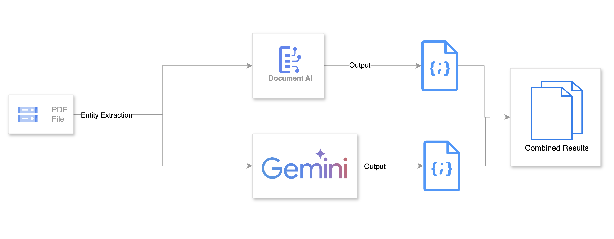

# Document AI and Gemini: Unlocking Entity Extraction Power

This repository contains a Python script that demonstrates how to harness the combined capabilities of Google Cloud's Document AI and Gemini API to extract entities from PDF documents. Explore the strengths and nuances of each API through a side-by-side comparison of their outputs, gaining valuable insights into their performance.

Code sample leverages official documentation to send an [online processing request](https://cloud.google.com/document-ai/docs/samples/documentai-process-document), [batch processing request](https://cloud.google.com/document-ai/docs/samples/documentai-batch-process-document#documentai_batch_process_document-python) and [handle the processing response](https://cloud.google.com/document-ai/docs/handle-response).

## Why Compare Document AI and Gemini?

In the realm of extracting valuable information from documents, Document AI and Gemini emerge as two powerful tools, each with its unique strengths and specialized capabilities.

### Document AI

Document AI is a specialized at extracting data from a wide variety of documents, including invoices, receipts, contracts, and more. It leverages advanced optical character recognition (OCR) and machine learning models to accurately identify and classify key information, transforming unstructured text into structured data.

#### Document AI Use Cases

- **Automating Invoice Processing**: Document AI can efficiently extract invoice details like vendor information, invoice number, line items, and total amounts, streamlining processes and reducing manual errors.
- **Streamlining Contract Analysis**: By identifying key clauses, dates, and parties involved in contracts, Document AI enables faster and more accurate legal document review.
- **Digitizing Medical Records**: Document AI can extract patient information, diagnoses, medications, and other crucial details from medical forms and records, facilitating efficient data management and analysis in the healthcare sector.

### Gemini

Gemini is a family of large language models known for its capabilities in natural language understanding and generation. It excels at comprehending the nuances of human language, enabling it to perform tasks such as summarization, translation, question answering, and even creative writing.

#### Gemini Use Cases

- **Creating Chatbots and Virtual Assistants**: Gemini's natural language processing prowess empowers it to engage in dynamic conversations, providing personalized customer support or acting as an intelligent assistant across various applications.
- **Generating Content**: Whether it's drafting emails, writing articles, or composing creative stories, Gemini can generate high-quality text based on given prompts or contexts.
- **Summarizing Complex Documents**: Gemini can distill lengthy documents into concise summaries, saving time and facilitating efficient information consumption.

#### Comparing Document AI and Gemini: Synergy and Specialization

While both tools offer entity extraction capabilities, their focus and strengths differ significantly.

- **Document AI**: Ideal for extracting data from specific document types with predefined schemas.
- **Gemini**: Best suited for extracting entities from unstructured text and understanding the nuances of natural language.

By comparing their results in entity extraction tasks, you gain insights into their unique approaches and potential trade-offs, enabling you to choose the right tool for specific needs.
Moreover, combining the power of Document AI and Gemini can lead to innovative solutions. For instance, you can use Document AI to extract structured information from documents and then leverage Gemini to generate natural language summaries or insights based on the extracted data.

## What You'll Gain

- Hands-on Experience: The included Python script provides a practical example of integrating Document AI and Gemini, allowing you to experiment with both APIs and explore their capabilities firsthand.
- Deeper Understanding: The comparison of API results will shed light on the strengths and potential trade-offs of each tool, helping you make informed decisions for future projects.
- Customization: The code serves as a foundation that you can adapt and extend for your own entity extraction needs, tailoring it to specific document types and entity types.

## Key Features

- Document AI Integration: The script utilizes Document AI's robust entity extraction capabilities, showcasing its ability to identify and classify key information within PDF documents.
- Gemini API Interaction: The script leverages Gemini's natural language understanding to extract entities based on a carefully crafted prompt, demonstrating its versatility.
- Side-by-Side Comparison: The output highlights the strengths and potential differences in entity extraction results from both APIs, providing valuable insights into their performance.

## Setup

1. **Install Dependencies**

   ```bash
   pip install --upgrade google-cloud-aiplatform
   pip install -q -U google-generativeai
   pip install -r requirements.txt

   ```

2. **Assumption**

This repository assumes, that this [codelab](https://www.cloudskillsboost.google/focuses/67855?parent=catalog) has been completed, that a dataset with the test documents is available and there exists a Document AI extractor.

Once it has been completed, additionally create two buckets, for batch processing, namely, temp and output.

```bash
TEMP_BUCKET_URI = f"gs://documentai-temp-{PROJECT_ID}-unique"

gsutil mb -l {LOCATION} -p {PROJECT_ID} {BUCKET_URI}

OUT_BUCKET_URI = f"gs://documentai-temp-{TEMP_BUCKET_URI}-unique"

gsutil mb -l {LOCATION} -p {PROJECT_ID} {OUT_BUCKET_URI}
```

## Diagram



## Code Overview

- `test_doc_ai.py`: This script orchestrates the entire process:

  - It first uses the Document AI API to process the PDF and extract entities.
  - Then, it utilizes the Gemini API with a tailored prompt to extract entities from the same PDF.
  - Finally, it compares the results from both APIs and prints a summary.

- `extractor.py`: Contains classes for interacting with the Document AI API for both online and batch processing.

- `entity_processor.py`: Defines classes for extracting entities from the Document AI output and the Gemini API response.

- `prompts_module.py`: Provides functions to generate prompts for entity extraction and comparison tasks for the Gemini API.

- `temp_file_uploader.py`: Handles uploading files to a temporary Google Cloud Storage location for processing.

## Notes

- Ensure that your Google Cloud project has the necessary APIs enabled (Document AI, Vertex AI, etc.).
- The script is configured to process a single PDF file. You can modify it to process multiple files or handle different input sources.
- The accuracy and performance of entity extraction may vary depending on the document complexity and the chosen API parameters.
- This script is intended for demonstration purposes. You can adapt and extend it to suit your specific use case and integrate it into your applications.
