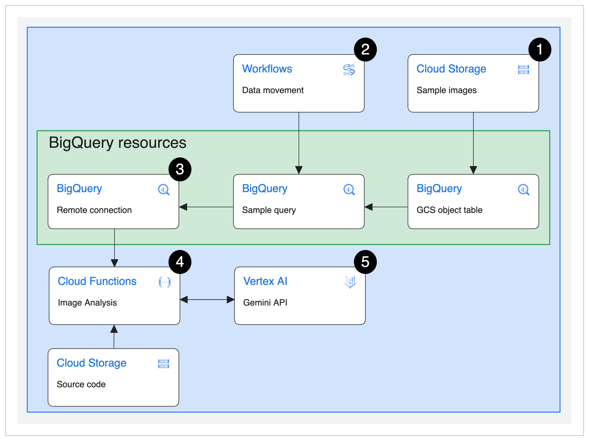
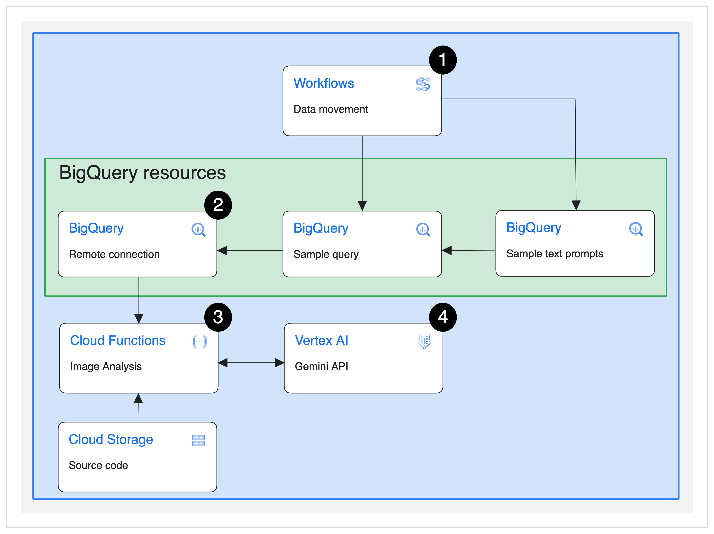

# Analyzing images and text with Gemini using BigQuery & Remote Functions

## Overview

This repo provides an example of how to use [Gemini](https://blog.google/technology/ai/gemini-api-developers-cloud/), Google's largest and most capable AI model, to analyze your BigQuery data. BigQuery and [Remote Functions](https://cloud.google.com/bigquery/docs/remote-functions) can be used to analyze images and text input using the [Vertex AI Gemini API](https://cloud.google.com/vertex-ai/docs/generative-ai/start/quickstarts/quickstart-multimodal) on Google Cloud. The following instructions should help you get started.

## Calling Gemini using SQL

This repo allows you to pass requests to Gemini using SQL and get the results back like you would for any other BigQuery query. This approach has several advantages:

- It allows users who are familiar with SQL to leverage the power of Gemini without needing to write additional code
- You can more easily analyze a large batch of data rather than having to make individual requests for each image or text prompt
- You don't need to export your data from BigQuery before you can analyze it with Gemini

## About this demo

We've created a Terraform module that deploys all the necessary resources to call the [Vertex AI Gemini API](https://cloud.google.com/vertex-ai/docs/generative-ai/start/quickstarts/quickstart-multimodal) using SQL in BigQuery.

After the module is deployed, you will have access to two [BigQuery Remote Functions](https://cloud.google.com/bigquery/docs/remote-functions):

- Analyze images and text (multimodal input) using `gemini_bq_demo_image`: This remote function takes an image from GCS as an input and prompts the Gemini Pro Vision model to create a brief description of the image
- Analyze text using `gemini_bq_demo_text`: This remote function takes text in a BigQuery table and uses the text directly as prompts for the Gemini Pro model to return a response

You will also have access to two BigQuery stored procedures which allow you to easy test each remote function using real image and text data:

- `image_query_remote_function_sp`: This SQL query uses the `gemini_bq_demo_image` remote function to send a list of image URIs stored in an object table (deployed as part of the module) along with a prompt to Gemini
- `text_query_remote_function_sp`: This SQL query uses the `gemini_bq_demo_text` remote function to send a sample BigQuery table with pre-written text prompts (deployed as part of the module) to Gemini

## Getting Started

### Deploying the infrastructure

**Note:** Though using a new GCP project for this example is not a requirement, it might be easiest to use a new GCP project for this. This makes cleanup much easier, as you can delete the whole project to ensure all assets are removed and it ensures no potential conflicts with existing resources. You can also remove resources by running `terraform destroy` after you deploy the resources, but it will also disable the associated APIs.

#### 1. Clone this repo in Cloud Shell

  You'll need to set your Google Cloud project in Cloud Shell, clone this repo locally first, and set the working directory to this folder using the following commands.

  ```shell
  gcloud config set project <PROJECT ID>
  git clone  https://github.com/GoogleCloudPlatform/generative-ai/
  cd ./generative-ai/gemini/use-cases/applying-llms-to-data/using-gemini-with-bigquery-remote-functions
  ```

#### 2. Enable the Cloud Resource Manager API

Check to make sure the [Cloud Resource Manager API](https://console.cloud.google.com/apis/library/cloudresourcemanager.googleapis.com) is enabled

#### 3. Intialize Terraform

First, initialize Terraform by running

  ```shell
  terraform init
  ```

#### 4. Review resources

Review the resources that are defined in the configuration:

  ``` shell
  terraform plan
  ```

#### 5. Deploy the Terraform script

  ```shell
  terraform apply
  ```

  When you're prompted to perform the actions, enter `yes`. Terraform will prompt you to provide your project ID and region. This sample has been tested using region `us-central1`. Terraform will display messages showing the progress of the deployment.

  After all the resources are created, Terraform displays the following message:

  ```shell
  Apply complete!
  ```

The Terraform output also lists the following additional information that you'll need:

- The link to open the BigQuery editor to invoke the `image_query_remote_function_sp` stored procedure that analyzes the sample images provided
- The link to open the BigQuery editor to invoke the `text_query_remote_function_sp` stored procedure that analyzes the sample text prompts provided

If you need to see your Terraform outputs again, simply enter `terraform output` into your command line.

## Analyzing sample data with your new deployment

Now that the resources have been deployed, your BigQuery Remote Functions are ready to be used in SQL queries.

### 1. Analyze text and images (multimodal)

Gemini will analyze the sample images when you invoke the `image_query_remote_function_sp` stored procedure. Simply click `Invoke stored procedure` for the stored procedure, then click `Run` for the resulting query to get the image descriptions generated by Gemini through your Remote Function.
<p align="center">
  
</p>

### 2. Analyze text only

Gemini will analyze the prewritten text prompts when you invoke the `text_query_remote_function_sp` stored procedure. Simply click `Invoke stored procedure`, then click `Run` in the resulting query to get the responses generated by Gemini through your Remote Function.
<p align="center">
  
</p>

## How it works

### Architecture Diagrams

#### Image analysis

<p align="center">
  
</p>

<ol>
  <li>Sample images are uploaded to a Cloud Storage bucket and a GCS object table is created in BigQuery</li>
  <li>Cloud Workflows creates a stored procedure in BigQuery that contains the sample query, which references the object table created in step 1 to pass images to the remote function for analysis using the Vertex AI Gemini API</li>
  <li>The stored procedure from step 2 is used to invoke the Cloud Function through a BigQuery connection</li>
  <li>The Cloud Function analyzes the sample images by passing them to the Vertex AI Gemini API (step 5) to get a brief description of the sample images and returns results from the Vertex AI Gemini API as query results</li>
</ol>

#### Text analysis

<p align="center">
  
</p>
<ol>
  <li>Cloud Workflows creates a stored procedure in BigQuery that contains the sample query and provisions the <code>sample_text_prompts</code> table, which contains sample text prompts to describe various landmarks. The sample query passes these prompts to the remote function for analysis using the Vertex AI Gemini API</li>
  <li>The stored procedure from step 2 is used to invoke the Cloud Function through a BigQuery connection</li>
  <li>The Cloud Function analyzes the text input from the sample text by passing them to the Vertex AI Gemini API (step 4) to get generate a text response to each prompt and returns results from the Vertex AI Gemini API as query results</li>
</ol>

## Pricing Estimation

Installing this demo (by running `terraform apply` in the Cloud Shell CLI) and running the stored stored procedures for text and image analysis 4 times each day will cost approximately $0.06 USD per month. See the [Google Cloud Pricing Calculator](https://cloud.google.com/products/calculator/#id=d3f64c61-9afb-4467-a6af-2bdd9540d489) for more details. The total monthly cost will vary as your usage varies, including how often you deploy and teardown this demo.

**NOTE**: Charges for Multimodal model consumption in Vertex AI take effect on January 15, 2024. We estimate running this demo 4 times per day will increase the total cost by *$3.73 USD per month*. See the [Vertex AI pricing page for Generative AI](https://cloud.google.com/vertex-ai/pricing#generative_ai_models) for full details. Below is a breakdown of this estimate:

- Text analysis
  - $0.02/month for Text Input
  - $0.23/month for Text Output

- Image analysis
  - $3.30/month for Image Input
  - $0.18/month for Text Output

Keep in mind that generative AI models like Gemini are non-deterministic, so associated costs will vary based on the output length and cannot be definitively estimated.

## Make it your own

You can adapt this demo for your own use case! Check out the instructions below for image and text analysis.

### Analyze images

You can get started analyzing any images you have uploaded to Cloud Storage by:

1. [Create a Cloud Storage object table](https://cloud.google.com/bigquery/docs/object-tables)

    If your bucket is stored in the same region that you deployed this demo, you should be able to reuse the existing BigQuery connection. If not, you will likely have to create a new one.

1. Modify the `context` variable on [line 40](https://github.com/shanecglass/gemini-remote-function/blob/0892e365feeec8dac6c6c3b3d67038e7964c3e65/function/image/main.py#L40C1-L41C1) of the Cloud Function

    You can do this by editing the `gemini-bq-demo-image` that was deployed. Click the Edit button at the top of the Function Details page, then click Next to see the in-line editor. Change the value of the `context` variable to provide tell Gemini what it should do with your images, then click Deploy.

    Check out [this sample notebook](https://github.com/GoogleCloudPlatform/generative-ai/blob/main/gemini/use-cases/intro_multimodal_use_cases.ipynb) for inspiration and ideas of what you can ask Gemini to do with an image.

1. Update the `image_query_remote_function_sp` stored procedure and run

    Update line 5 of the stored procedure to reference the object table you created in step 1 and run the query.

### Analyze text

You can get started by analyzing your own text inputs without having to modify the existing Cloud Function. Simply replace the `text_prompt` in line 3 of the `text_query_remote_function_sp` stored procedure with whatever text you want to analyze. You can enter a single string of text or you can reference a column of text prompts from a BigQuery table. If you are using a column from a BigQuery table, be sure to update the table reference on line 5 of the stored procedure.

## Clean up

After you are finished with the demo, you can delete all the resources you created with the following steps:

1. Update the `variables.tf` file

    Change the default value for the `force_destroy` variable from `false` to `true`. Change the default value for the `deletion_protection` variable from `false` to `true`.

1. Run `terraform apply`

    This applies the changes you made in step 1 to your resources so they can be easily deleted.

1. Delete the BigQuery dataset

    Run the following command in your CLI to delete the BigQuery dataset created:

    ```shell
        bq rm -r -f -d gemini_demo
    ```

1. Run `terraform destroy`

    This deletes all the remaining resources you created.
