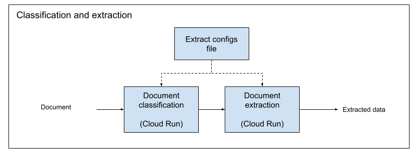
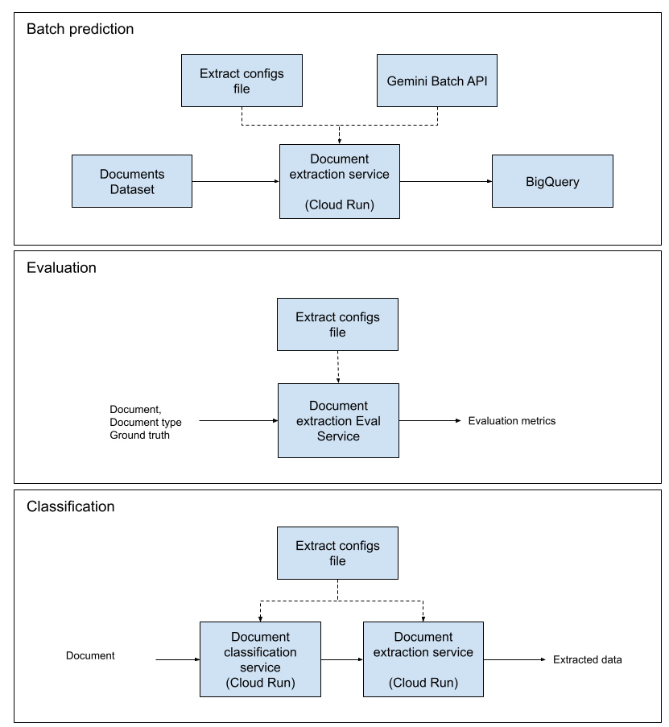

# Entity Extraction with Gemini

## About

This project provides a flexible solution for classifying and extracting structured
information from documents using Gemini family of models via the Vertex AI API. It
exposes this functionality through a simple Flask-based web server running on Cloud Run.

### When to use this solution

The use of Gemini API for document classification and entity extraction is especially
useful when the structure of the document varies from one document type to another or
when it is unknown. For more structured documents like complex forms, we recommend
taking a look into [Document AI](https://cloud.google.com/document-ai/docs/overview),
that provides powerful mechanisms for entity extraction and layout parsing.

## Overview

The core of this project is a Python script that takes a document and a configuration
ID as input. The configuration specifies which Gemini model to use, the name of the
document type, and a JSON schema of the fields to extract. The script then prompts the
Gemini model to extract the requested information from the document and return it as a
JSON object. It also allows you to classify a document based on a description of the
document type.

This is wrapped in a Flask web application, allowing you to easily integrate document
extraction capabilities into your own services via an HTTP API. We provide a script for
deployment to a service in Cloud Run.

## Features

- **AI-Powered Extraction**: Leverages the multimodal capabilities of Gemini models to
  understand, classify and extract data from documents.
- **Configurable Schemas**: Easily define different extraction schemas for various
  document types (e.g., reports, legal documents) in a central configuration file.
- **JSON Output**: The model is prompted to return structured data in JSON format,
  making it easy to parse and use in downstream applications.
- **Web API**: A simple Flask server exposes the extraction functionality through a
  `/extract` endpoint.
- **Google Cloud Integration**: Built to run on Google Cloud, utilizing Vertex AI for
  scalable and managed access to Gemini models.

## Architecture

The current solution includes the ability to classify documents and extract entities
based on the specific document type and the fields specified in the configuration using
the Gemini API (online).



## Prerequisites

- A Google Cloud Project with the Vertex AI API enabled.
- Google Cloud SDK installed and authenticated.
- A Google Cloud Storage bucket for hosting the documents to be processed.

## Setup and installation

1.  **Clone the repository:**

    ```bash
    git clone https://github.com/GoogleCloudPlatform/generative-ai.git
    cd generative-ai/gemini/use-cases/entity-extraction
    ```

2.  **Create and activate a Python virtual environment:**

    ```bash
    python3 -m venv venv
    source venv/bin/activate
    ```

3.  **Install dependencies:**

    ```bash
    pip install -r requirements.txt
    ```

4.  **Configure Google Cloud settings:**
    Open `.env` and update the following constant with your Google Cloud project
    details:
    ```bash
    GEMINI_PROJECT_ID="project-id-for-gemini-api"
    ```
    You can also update the other constants if needed.

## Testing

A simple test case is provided in `document_processing_test.py`.

To run the provided test:

```bash
python document_processing_test.py
```

This will call the relevant functions from `document_processing.py` with sample
documents and assert that the outputs match the expected JSON.

**Note:** Running the test will make live calls to the Vertex AI API and may incur
costs.

## Usage

### Deploying to Cloud Run

Open `.env` and update the following constants with your Google Cloud project details:

```bash
CLOUD_RUN_PROJECT_ID="project-id-for-cloud-run-deployment"
```

You can also update the other constants if needed.

To deploy the Flask application to Cloud Run, run:

```bash
sh deploy.sh
```

### Sending an Extraction Request

You can send a `POST` request to the `/extract` endpoint with a JSON payload
containing the `extract_config_id` and the `document_uri` (a GCS URI for the PDF).

Here is an example using `curl`. Replace with the URL that you get after you deploy the
service to Cloud Run,

```bash
curl -X POST https://YOUR-CLOUD-RUN-URL/extract \
-H "Content-Type: application/json" \
-H "Authorization: Bearer $(gcloud auth print-identity-token)" \
-d '{
    "extract_config_id": "form_10_q",
    "document_uri": "gs://cloud-samples-data/gen-app-builder/search/alphabet-investor-pdfs/2021Q1_alphabet_earnings_release.pdf"
}'
```

**Expected Response:**

```json
{
  "year": "2021",
  "quarter": "Q1",
  "company_name": "Alphabet Inc.",
  "ceo": "Sundar Pichai",
  "net_income_millions": "17930"
}
```

### Sending a Classification Request

You can send a POST request to the /classify endpoint with a JSON payload containing
the document_uri (a GCS URI for the PDF).
Here is an example using curl. Replace with the URL that you get after you deploy the
service to Cloud Run,

```bash
curl -X POST https://YOUR-CLOUD-RUN-URL/classify
-H "Content-Type: application/json"
-H "Authorization: Bearer $(gcloud auth print-identity-token)"
-d '{
    "document_uri": "gs://cloud-samples-data/gen-app-builder/search/alphabet-investor-pdfs/2021Q1_alphabet_earnings_release.pdf"
}'
```

**Expected Response:**

```json
{
  "class": "form_10_q"
}
```

### Sending a Classification and Extraction Request

You can send a POST request to the `/classify_and_extract` endpoint with a JSON payload
containing the document_uri. The service will first classify the document and then use
the corresponding extraction configuration.

```bash
curl -X POST https://YOUR-CLOUD-RUN-URL/classify_and_extract
-H "Content-Type: application/json"
-H "Authorization: Bearer $(gcloud auth print-identity-token)"
-d '{
    "document_uri": "gs://cloud-samples-data/gen-app-builder/search/alphabet-investor-pdfs/2021Q1_alphabet_earnings_release.pdf"
}'
```

**Expected Response:**

```json
{
  "year": "2021",
  "quarter": "Q1",
  "company_name": "Alphabet Inc.",
  "ceo": "Sundar Pichai",
  "net_income_millions": "17930"
}
```

## Configuration of entities for classification, extraction and prompts

### Entities

The classification and extraction behavior is controlled by the configuration file
`config.json`, which holds the configurations for different document types and the
fields to extract. To add a new document type or field, simply add new key-value pairs.

```json
"your_config_id": {
    "document_name": "A descriptive name for your document type",
    "document_mime_type": "application/pdf",
    "model": "gemini-2.5-flash",
    "fields": {
        "field_key_1": "Description of what to extract for this field",
        "field_key_2": "Another field description"
    }
},
```

Note that you can place the configuration file either locally or in a bucket. You can
define the location of the `CONFIG_PATH` variable in the `.env` file. If the constant
starts with `"gs://"`, the solution will look for the file in GCS, otherwise it will
look for it locally. Example:

```bash
CONFIG_PATH="config.json"
```

For classification, you can define the classes under the classification_config key.
The model will use the descriptions to classify the document.

```json
"classification_config": {
    "document_mime_type": "application/pdf",
    "model": "gemini-2.5-flash",
    "classes": {
        "class_name_1": "Description of the first document class",
        "class_name_2": "Description of the second document class"
    }
}
```

### Prompt

The constants `EXTRACT_PROMPT_TEMPLATE` and `CLASSIFY_PROMPT_TEMPLATE` in
`document_processing.py` are the templates for the prompts sent to the Gemini model.
You can customize it to improve extraction accuracy for your specific use case.

```python
EXTRACT_PROMPT_TEMPLATE = """\
    Based solely on this {document_name}, extract the following fields.
    If the information is missing, write "missing" next to the field.
    Output as JSON.

    Fields:\n
    {fields}
"""
```

## Further development

We are planning to add the following functionalities to this project:

- Support for Gemini Batch API to enable large-scale asynchronous processing of
  document extraction tasks. This will allow users to submit a batch of documents and
  receive the results when they are ready, which is ideal for high-volume, offline
  workflows.

- Integration with the Evaluation Service to assess the quality and accuracy
  of an evaluation dataset. This feature will provide a robust method for evaluating
  model performance and fine-tuning prompts to achieve better results.

Future architecture:


## Authors

| Authors                                        |
| ---------------------------------------------- |
| [Ariel Jassan](https://github.com/arieljassan) |
| [Ben Mizrahi](https://github.com/benmizrahi)   |

## Disclaimer

This repository itself is not an officially supported Google product. The code in this
repository is for demonstrative purposes only.
