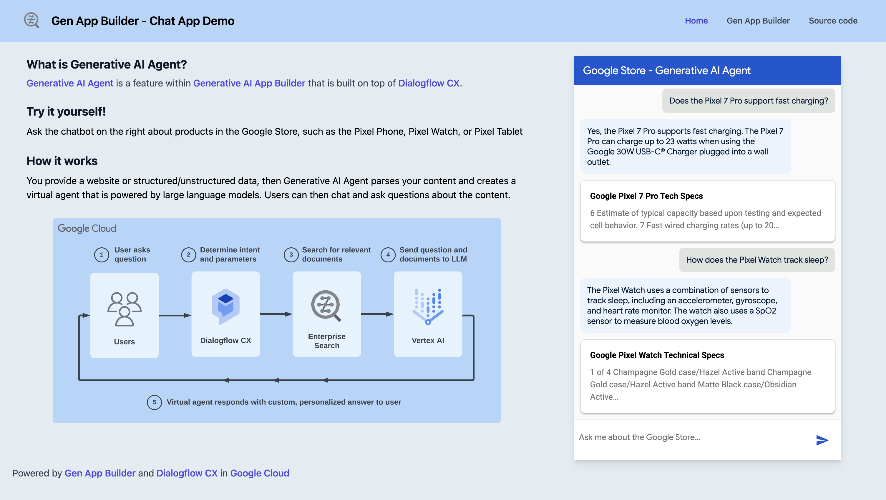

# Gen App Builder (Chat App)

## Overview

[Generative AI Agent](https://cloud.google.com/generative-ai-app-builder/docs/agent-intro)
is a feature within
[Generative AI App Builder](https://cloud.google.com/generative-ai-app-builder)
that is built on top of functionality in
[Dialogflow CX](https://cloud.google.com/dialogflow).



With Generative AI Agent, you can provide a website domain, structured data, or
unstructured data, then Generative AI Agent parses your content and creates a
virtual agent that is powered by data stores and large language models. Your
customers and end users can then have conversations with the agent and ask
questions about the content. Refer to the
[Generative AI Agent documentation](https://cloud.google.com/generative-ai-app-builder/docs/agent-usage)
and codelab to
[Create a Generative Chat App with Gen App Builder](https://codelabs.developers.google.com/codelabs/gen-app-builder-chat)
for more information.

## Steps to build the web app

1. Install [Node.js](https://nodejs.org/en) using your preferred method or
   package manager
1. From this directory, run `npm install`
1. Run `npm run build` to generate the static site in the `build` directory

## Steps to deploy the web app to Firebase

1. Navigate to the [Firebase console](https://console.firebase.google.com/)
1. Provision Firebase on a new or existing GCP project
1. In Firebase console, go to Hosting and add a new site (e.g.,
   `your-firebase-app-name`)
1. Install the [firebase CLI](https://firebase.google.com/docs/cli)
1. Run `firebase init` in the app root and follow the prompts to select
   `Hosting`, use the `build` directory, and confirm `N` to the followup
   questions about rewrites, deploys, and the 404 and index pages.
1. Run
   `firebase target:apply hosting your-firebase-app-name your-firebase-app-name`
   where `your-firebase-app-name` is the name of the Firebase Hosting site that
   you created in an earlier step
1. To configure the default deploy target, add a line to your `firebase.json`
   with the name of your Firebase Hosting site, such as:

   ```json
   {
     "hosting": {
       "target": "your-firebase-app-name",  # <--- Add this line
       "public": "build",
       "ignore": [
         "firebase.json",
         "**/.*",
         "**/node_modules/**"
       ]
     }
   }
   ```

1. Run `firebase deploy`

## Access the app

In your browser, navigate to your deployed app using a URL similar to:

[https://gen-app-builder-chat.web.app/](https://gen-app-builder-chat.web.app/)

Congratulations, you've successfully deployed the Gen App Builder - Chat App
Demo!

## Additional resources

You can continue learning about conversational AI and generative AI with
these guides and resources:

- [Documentation for Dialogflow CX](https://cloud.google.com/dialogflow/cx/docs)
- [Overview of Generative AI Agent](https://cloud.google.com/generative-ai-app-builder/docs/agent-intro)
- [Documentation for Generative AI Agent](https://cloud.google.com/generative-ai-app-builder/docs/agent-usage)
- [Documentation for Gen App Builder](https://cloud.google.com/generative-ai-app-builder/docs/introduction)
- [Generative AI in Google Cloud](https://cloud.google.com/ai/generative-ai)
