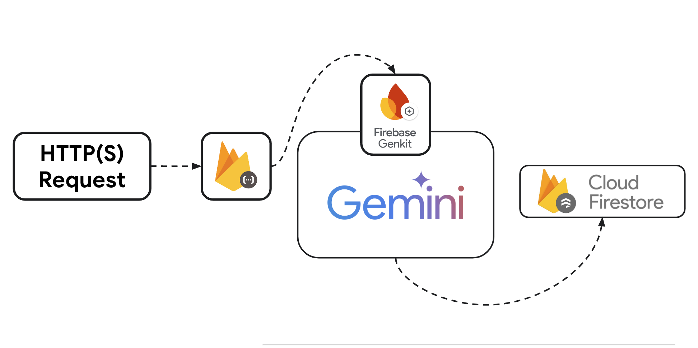

# Generate Synthetic Sales Database with Genkit

|           |                                           |
| --------- | ----------------------------------------- |
| Author(s) | [Aiko Zhao](https://github.com/aikozhaoz) |

This project leverages [Firebase Genkit](https://firebase.google.com/products/genkit) structured output alongside the [Gemini 2.0](https://blog.google/technology/ai/google-gemini-next-generation-model-february-2024/) model, to generate synthetic sales data for a fictional dog food company called `Bone Appetit`. The generated data is then stored in a Firestore database, row by row, for further analysis or AI/ML use in applications.

## Prerequisites

- Vertex AI for LLM
- Cloud Functions for deployment
- Firestore for database storage
- Firebase for application

## Overview



1. Setup:

- Import necessary libraries for AI (GenKit), Firebase, and data handling.
- Configure GenKit to use Google's Vertex AI and set logging preferences.

1. Data Structures:

- `Order class`: Defines the structure of each sales record (order ID, customer info, product, etc.).
- `menuItems`: A list of dog food products and their prices.
- `BoneAppetitSalesDatabaseSchema`: A strict schema (using Zod) to ensure generated data matches the expected format.

1. Data Generation:

   - `createBoneAppetitSalesRowSchema`: This is a GenKit flow. It takes a product as input, prompts the Gemini 2.0 model, and gets back structured JSON representing one sales record.
     - The prompt instructs the AI to create realistic data, including reviews that align with customer ratings.
   - `rateLimitedRunFlowGenerator`: This is a special function to control the pace of data generation. We don't want to overwhelm the AI or hit API limits. It yields Promises that resolve to new sales data, but with pauses if needed.

1. Firestore Storage:

- Batch write synthetic sales data to Firestore.

### How to deploy to Cloud Functions

```bash
firebase deploy
```

### How to test

```bash
curl -m 70 -X POST  [YourCloudFunctionHTTPEndpoint]   -H "Authorization: bearer $(gcloud auth print-identity-token)"   -H "Content-Type: application/json"
```
