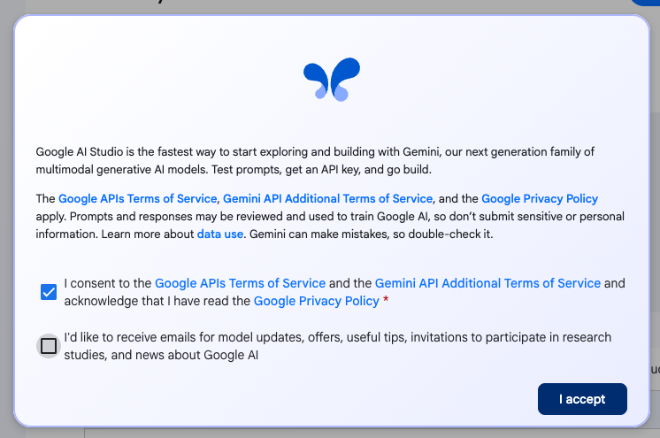
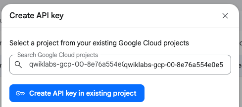
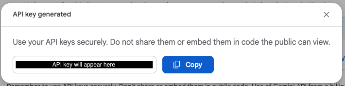

# Developing LLM Apps with Genkit for Python

This is an example of a simple chat webapp that uses the Gemini 2.0 Flash model and Genkit for Python.

## The context

You are a developer at a travel marketing company, and your sales department has decided that they need a new chat application to keep up with the bigger booking and search companies. They’ve also heard about generative AI, but they don’t know that much about it other than they’ve seen it do some trip generation in videos. Other departments have heard about this initiative, and they’re curious how this might also help their customer experience.

`app.py` demonstrates a simple implementation to solve for this use case.

`flowyapp.py` demonstrates the same use case using Genkit Flows.

## Getting Started

### Install Requirements

You'll want to install the requirements to get started. 

```bash
pip3 install -r requirements.txt
```

### Obtain a Gemini API Key
If you don't already have a Gemini API Key, you'll need to obtain one.

1. Navigate to <a href="https://aistudio.google.com/app/apikey" target="_blank">https://aistudio.google.com/app/apikey</a>

2. Click **Get an API**

    

3. Agree to the Google APIs Terms of Service by clicking **I accept**.

    

4. Click the **Create API key** button

    
5. In the **Create API key** popup, select your project and click the **Create API key in existing project** button.

    

6. Copy your API key by clicking the **Copy** button.

    

7. In the terminal, run the following command (replacing "YOUR_API_KEY" with the API key you copied **in quotes**):

    ```bash noWrap
    echo GEMINI_API_KEY="YOUR_API_KEY" > .env
    ```

    The line will resemble `echo GEMINI_API_KEY="12345abc" > .env` and will create a new `.env` file and add your API key to that file. 

#### Alternative: Using the Google Cloud Secret Manager
You could alternatively store your secrets in the Google Cloud [Secret Manager](https://cloud.google.com/security/products/secret-manager), secure and convenient storage system for API keys, passwords, certificates, and other sensitive data.

## Launching the webapp

To launch the webapp, run the following command: 

```bash
streamlit run app.py
```

or 

```bash
streamlit run flowyapp.py
```

### Launching the webapp in Coud Shell Editor
If you are working in cloud shell editor, you'll need to run the following command to start the Streamlit application and make it locally accessible within your Cloud Shell environment:

```bash
streamlit run app.py --browser.serverAddress=localhost --server.enableCORS=false --server.enableXsrfProtection=false --server.port 8080
```

or 

```bash
streamlit run flowyapp.py --browser.serverAddress=localhost --server.enableCORS=false --server.enableXsrfProtection=false --server.port 8080
```