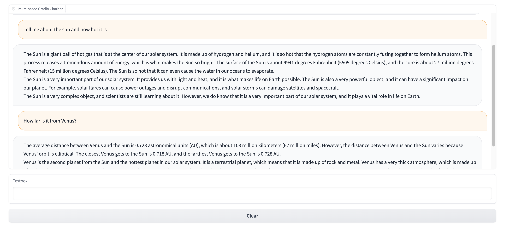

# palm-vertex-ai-chatbot
An example chatbot app with Gradio that uses the PaLM API in Google Cloud



## Usage

1. Clone this repository and `cd` into the directory.

2. Install the required dependencies:

   ```
   pip install -r requirements.txt
   ```

3. Run the app:

   ```
   python app.py
   ```

4. Navigate to `http://127.0.0.1:8080/` in your browser.

5. Start chatting with your PaLM-powered chatbot!
