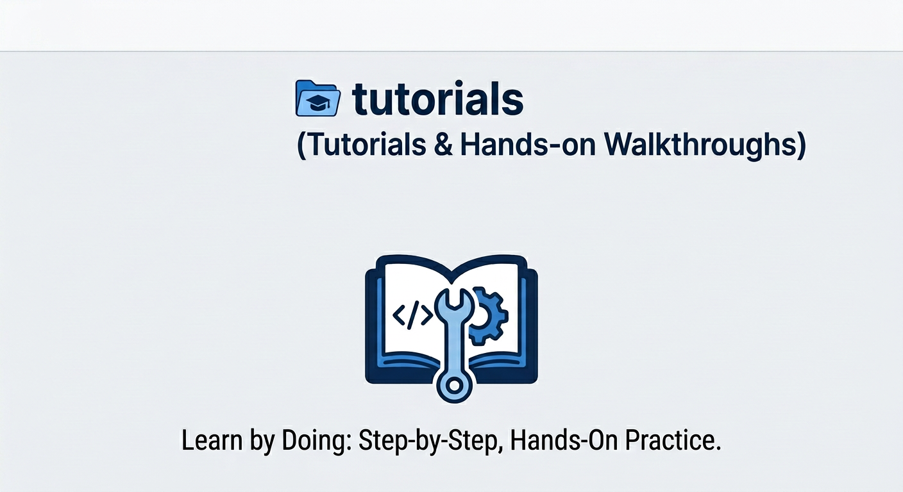

# Meta + Google Cloud: AI Co-Innovation Space - Tutorials
This repository offers a curated path of tutorials, beginning with the fundamentals and progressively advancing toward complex integrations between Meta’s Llama models and Google Cloud infrastructure.

---

## 📂 Repository Structure

| Module | Description |
| :--- | :--- |
| [**`01-adk-agentengine-vertexai-mass`**](./01-adk-agentengine-vertexai-mass) | In this tutorial, you will learn how to build a production-ready AI agent using the **Google Cloud Agent Development Kit (ADK)**. We will leverage **Llama 4** via Vertex AI’s **Model-as-a-Service (MaaS)** for serverless reasoning and deploy the final agent to the fully managed **Vertex AI Agent Engine** for enterprise-grade scalability. 

---

