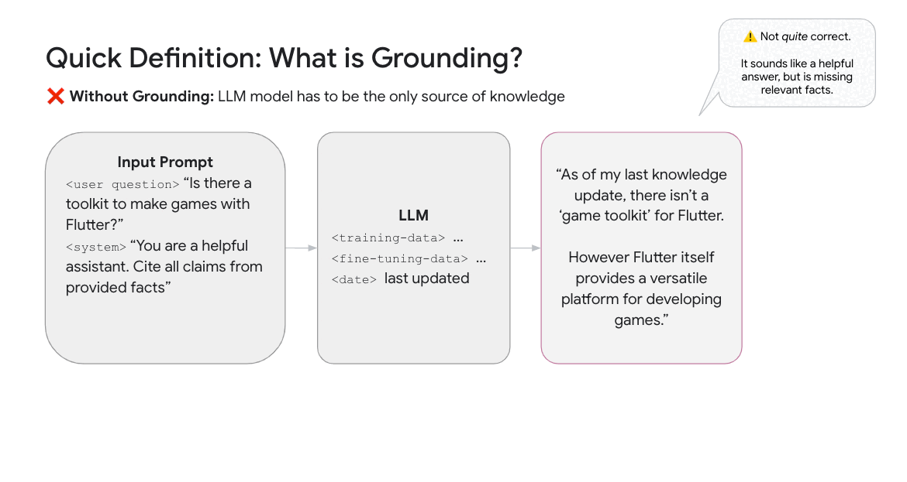

# RAG and Grounding

This directory provides a curated list of examples that explore Retrieval
Augmented Generation (RAG), grounding techniques, knowledge bases, grounded
generation, and related topics like vector search and semantic search.

All of these links are examples in this repository, but are indexed here for
your convenience.

## What is RAG and Grounding?

- Ungrounded generation relies on the LLM training data alone and is prone to
  hallucinations when it doesn't have all the right facts
- **Grounding** a LLM with relevant facts provides fresh and potentially
  private data to the model as part of it's input or prompt
- **RAG** is a technique which retrieves relevant facts, often via search, and
  provides them to the LLM

Using RAG and Grounding to improve generations and reduce hallucinations is
becoming commonplace. Doing so well and generating extremely high quality
results which are entirely grounded on the most relevant facts, potentially from
a very large corpus of information and at high scale - is an art. Vertex AI
provides a platform of tools and APIs which help you build and maintain a great
search engine and RAG application, and the evaluations needed to hill climb
"quality".

## Building a Grounded Generation Application

Grounded generation is crucial for enhancing the accuracy, factuality, and relevance of large language models (LLMs). By connecting LLMs to real-time data sources, including private enterprise data, grounding minimizes hallucinations and enables access to the latest information.

The [Vertex AI Search Grounded Generation Playground](../search/grounded-generation-playground/README.md) showcases this by offering a Next.js-based interface for experimenting with the Vertex AI Search Grounded Generation API. It differentiates itself through features like a chat interface with multi-turn grounding, side-by-side comparison of grounded and ungrounded responses, dynamic retrieval with an adjustable threshold for cost optimization, and support for various grounding sources, including Google Search, Vertex AI Search, and custom integrations. Explore the playground to experience the power of grounded generation and learn how to integrate it into your own applications. For detailed instructions and setup, refer to the [grounded-generation-playground setup instructions](../search/grounded-generation-playground/README.md).

## Measuring RAG/Grounding Quality

See
[this blog post: How to evaluate generated answers from RAG at scale on Vertex AI](https://medium.com/google-cloud/vqa-3-how-to-evaluate-generated-answers-from-rag-at-scale-on-vertex-ai-70bc397cb33d)
for a more in-depth walkthrough.

- **[evaluate_rag_gen_ai_evaluation_service_sdk.ipynb](../gemini/evaluation/evaluate_rag_gen_ai_evaluation_service_sdk.ipynb)**:
  Evaluates RAG systems using the Gen AI Evaluation Service SDK, offering both
  reference-free and reference-based evaluation methods with visualization.
- **[ragas_with_gemini.ipynb](../gemini/use-cases/retrieval-augmented-generation/rag-evaluation/ragas_with_gemini.ipynb)**:
  Evaluates RAG pipelines using the RAGAS framework and the Gemini Pro model
  for Q&A tasks.
- **[deepeval_with_gemini.ipynb](../gemini/use-cases/retrieval-augmented-generation/rag-evaluation/deepeval_with_gemini.ipynb)**:
  Evaluates Gemini Pro's performance on a question-answering task using
  DeepEval and the Gemini API in Vertex AI, including Pytest integration.

## Out of the Box RAG/Grounding

With
**[Vertex AI Search](https://cloud.google.com/generative-ai-app-builder/docs/)**,
you can build a RAG/Grounding system in a few clicks or a few lines of code and
be ready for scale with high quality results. Vertex AI Search is an end-to-end
Search engine builder, giving you Google quality search for your own data.

- **[Vertex AI Search - sample Web App](../search/web-app/)**: Take a look at
  this sample web app using Vertex AI Search, which is a flexible and easy to
  use "out of the box" solution for search & RAG/Grounding.
- **[bulk_question_answering.ipynb](../search/bulk-question-answering/bulk_question_answering.ipynb)**:
  Processes questions from a CSV and outputs the results (top documents and
  extractive answers) to a TSV file using Vertex AI Search.
- **[contract_analysis.ipynb](../search/retrieval-augmented-generation/examples/contract_analysis.ipynb)**:
  Demonstrates RAG for contract analysis using Palm2, LangChain, and a vector
  store, with a Gradio interface for querying contracts and retrieving answers
  with source references.
- **[question_answering.ipynb](../search/retrieval-augmented-generation/examples/question_answering.ipynb)**:
  Builds a question-answering system using Vertex AI Search and LangChain to
  retrieve information from unstructured documents and leverage LLMs for
  answering with citations.
- **[rag_google_documentation.ipynb](../search/retrieval-augmented-generation/examples/rag_google_documentation.ipynb)**:
  Builds a question-answering system from Google Cloud documentation using RAG
  and evaluates the impact of different parameter settings on model
  performance.
- **[rag_google_documentation.ipynb](../search/retrieval-augmented-generation/examples/rag_google_documentation.ipynb)**:
  Showcase specific RAG use cases
- **[search_data_blending_with_gemini_summarization.ipynb](../search/search_data_blending_with_gemini_summarization.ipynb)**:
  Demonstrates calling a search app that blends information from multiple
  stores (GCS, BQ, site) and summarizes search snippets and responses using
  the Gemini Pro model.
- **[vertexai_search_options.ipynb](../search/vertexai-search-options/vertexai_search_options.ipynb)**:
  Demonstrates three approaches for using Vertex AI Search: direct API usage,
  grounding with Gemini, and integration with LangChain.

Vertex AI Search can be configured to adapt to many different use cases and
data.

<!-- Link to Talk2Docs -->
<!-- Link to Examples from Hossain -->

## Orchestration with RAG Engine

[RAG Engine on Vertex AI](https://cloud.google.com/vertex-ai/generative-ai/docs/rag-overview) is a data framework for developing context-augmented large language model (LLM) applications. Context augmentation occurs when you apply an LLM to your data. This implements retrieval-augmented generation (RAG).

- **[intro_rag_engine.ipynb](../gemini/rag-engine/intro_rag_engine.ipynb)**: Introduction to RAG Engine
- Vector Database Choices
  - **[rag_engine_feature_store.ipynb](../gemini/rag-engine/rag_engine_feature_store.ipynb)**: How to use RAG Engine with [Vertex AI Feature Store](https://cloud.google.com/vertex-ai/docs/featurestore/latest/overview)
  - **[rag_engine_pinecone.ipynb](../gemini/rag-engine/rag_engine_pinecone.ipynb)**: How to use RAG Engine with [Pinecone](https://www.pinecone.io/)
  - **[rag_engine_vector_search.ipynb](../gemini/rag-engine/rag_engine_weaviate.ipynb)**: How to use RAG Engine with [Vertex AI Vector Search](https://cloud.google.com/vertex-ai/docs/vector-search/overview)
  - **[rag_engine_weaviate.ipynb](../gemini/rag-engine/rag_engine_weaviate.ipynb)**: How to use RAG Engine with [Weaviate](https://weaviate.io/)
- **[rag_engine_evaluation.ipynb](../gemini/rag-engine/rag_engine_evaluation.ipynb)**: Advanced RAG Techniques and Evaluation with RAG Engine

## Bring your own Search for RAG/Grounding

The Vertex AI Search - Grounded Generation API allows you to use a custom search
engine for RAG/Grounding. You can wrap any search engine with a cloud function
exposing a REST API and then plug it into the Grounded Generation API as a
`grounding_source`.

See the
[Grounded Generation API documentation](https://cloud.google.com/generative-ai-app-builder/docs/grounded-gen)
for more information.

Demo coming soon.

## Build your own Search for RAG/Grounding

You may want to build your own search engine for RAG/Grounding, perhaps because
you have a unique use case or perhaps because you want to use a specific search
engine, or perhaps there are constraints on what you can use.

We have many component APIs which can be used to build a RAG/Grounding pipeline
of your own.

- [Vertex AI APIs for building search and RAG](https://cloud.google.com/generative-ai-app-builder/docs/builder-apis)
  has a list of several APIs you can use in isolation or in combination

We have a managed service to assemble component using a LlamaIndex style SDK.

- [RAG Engine](https://cloud.google.com/vertex-ai/generative-ai/docs/rag-overview)
  allows you to assemble a RAG search using popular OSS framework and
  components from Google or Open Source

We have a few reference architectures you can use to build your own
RAG/Grounding pipeline from the ground up.

- [This end-to-end DIY RAG example in a notebook](https://github.com/GoogleCloudPlatform/applied-ai-engineering-samples/blob/main/genai-on-vertex-ai/retrieval_augmented_generation/diy_rag_with_vertexai_apis/build_grounded_rag_app_with_vertex.ipynb)
  written in LangChain and using some of these APIs
- The Google Cloud Architecture Center has reference architectures on
  [building a RAG infrastructure with GKE](https://cloud.google.com/architecture/rag-capable-gen-ai-app-using-gke)
  or
  [using alloydb and a few Vertex services](https://cloud.google.com/architecture/rag-capable-gen-ai-app-using-vertex-ai)

More coming soon.

## Build with a Vector Database

Vertex AI Vector Search (Formerly known as Matching Engine) is a highly scalable
and performant vector database which powers Vertex AI Search.

AlloyDB, BigQuery and Redis also have vector search capabilities, each with
different performance characteristics - though each of them is a general purpose
database and not purpose built for embeddings like Vector Search is.

Note that you can use a Vector Database for RAG/Grounding and for many other use
cases, like recommendation systems, clustering, and anomaly detection.

**[Document_QnA_using_gemini_and_vector_search.ipynb](../gemini/use-cases/retrieval-augmented-generation/Document_QnA_using_gemini_and_vector_search.ipynb)**
Demonstrates building a multimodal question-answering system using Gemini and
Vertex AI Vector Search for PDFs containing text and images, employing retrieval
augmented generation (RAG).

### Embeddings

The best explanation of embeddings I've seen

- **[intro_Vertex_AI_embeddings.ipynb](../gemini/qa-ops/intro_Vertex_AI_embeddings.ipynb)**:
  Introduces Vertex AI's text and multimodal embeddings APIs and demonstrates
  their use in building a simple e-commerce search application with text,
  image, and video queries.
- **[hybrid-search.ipynb](../embeddings/hybrid-search.ipynb)**: Demonstrates
  hybrid search (combining semantic and keyword search) using Vertex AI Vector
  Search.
- **[intro-textemb-vectorsearch.ipynb](../embeddings/intro-textemb-vectorsearch.ipynb)**:
  Demonstrates building semantic search capabilities using Vertex AI's text
  embeddings and vector search, grounding LLM outputs with real-world data.
- **[vector-search-quickstart.ipynb](../embeddings/vector-search-quickstart.ipynb)**:
  Provides a quickstart tutorial for Vertex AI Vector Search, guiding users
  through setting up, building, deploying, and querying a vector search index
  using sample product data.
- **[bq-vector-search-log-outlier-detection.ipynb](../embeddings/use-cases/outlier-detection/bq-vector-search-log-outlier-detection.ipynb)**:
  Demonstrates log anomaly detection and investigation using Vertex AI,
  BigQuery, and text embeddings to identify semantically similar past actions
  for outlier analysis.

### Gemini

- **[intro-grounding-gemini.ipynb](../gemini/grounding/intro-grounding-gemini.ipynb)**:
  Demonstrates grounding LLM responses in Google Search and Vertex AI Search
  using Gemini, improving response accuracy and reducing hallucinations.
- **[intro-grounding.ipynb](../language/grounding/intro-grounding.ipynb)**:
  Demonstrates using the Vertex AI grounding feature to improve LLM response
  accuracy and relevance by grounding them in Google Search or custom Vertex AI Search data stores.
- **[building_DIY_multimodal_qa_system_with_mRAG.ipynb](../gemini/qa-ops/building_DIY_multimodal_qa_system_with_mRAG.ipynb)**:
  Builds a custom multimodal question-answering system using mRAG.
- **[code_retrieval_augmented_generation.ipynb](../language/code/code_retrieval_augmented_generation.ipynb)**:
  Demonstrates RAG for code using Gemini, LangChain, FAISS, and the Vertex AI Embeddings API to enhance code generation by incorporating external
  knowledge from the Google Cloud Generative AI GitHub repository.
- **[langchain_bigquery_data_loader.ipynb](../language/orchestration/langchain/langchain_bigquery_data_loader.ipynb)**:
  Demonstrates using LangChain's BigQuery Data Loader to query BigQuery data,
  integrate it with a Vertex AI LLM, and build a chain to generate and execute
  SQL queries for targeted customer analysis.
- **[question_answering_documents.ipynb](../language/use-cases/document-qa/question_answering_documents.ipynb)**:
  Demonstrates three methods (stuffing, map-reduce, and map-reduce with
  embeddings) for building a question-answering system using the Vertex AI
  PaLM API to efficiently handle large document datasets.
- **[question_answering_documents_langchain.ipynb](../language/use-cases/document-qa/question_answering_documents_langchain.ipynb)**:
  Demonstrates building a question-answering system using LangChain and the Vertex AI PaLM API, comparing different methods (stuffing, map-reduce, refine)
  for handling large documents, and showcasing the improved efficiency of
  using similarity search with embeddings.
- **[question_answering_documents_langchain_matching_engine.ipynb](../language/use-cases/document-qa/question_answering_documents_langchain_matching_engine.ipynb)**:
  Demonstrates a question-answering system using LangChain, the Vertex AI PaLM API, and Matching Engine for retrieval-augmented generation, enabling
  fact-grounded responses with source citations.
- **[summarization_large_documents.ipynb](../language/use-cases/document-summarization/summarization_large_documents.ipynb)**:
  Demonstrates four methods (stuffing, MapReduce, MapReduce with overlapping
  chunks, and MapReduce with rolling summaries) for summarizing large
  documents using Vertex AI generative models, addressing challenges of
  exceeding context length limits.
- **[summarization_large_documents_langchain.ipynb](../language/use-cases/document-summarization/summarization_large_documents_langchain.ipynb)**:
  Demonstrates three LangChain methods (Stuffing, MapReduce, Refine) for
  summarizing large documents using Vertex AI models, comparing their
  effectiveness and limitations.
- **[llamaindex_workflows.ipynb](../gemini/orchestration/llamaindex_workflows.ipynb)** Using LlamaIndex Workflows to build an event driven RAG flow.

### Open Models

- **[cloud_run_ollama_gemma2_rag_qa.ipynb](../open-models/serving/cloud_run_ollama_gemma2_rag_qa.ipynb)**:
  Demonstrates deploying Gemma 2 on Google Cloud Run with GPU acceleration
  using Ollama and LangChain, building a RAG question-answering application.

## Agents on top of RAG

- **[tutorial_vertex_ai_search_rag_agent.ipynb](../gemini/reasoning-engine/tutorial_vertex_ai_search_rag_agent.ipynb)**:
  Demonstrates building and deploying a conversational search agent on Vertex AI using LangChain, a reasoning engine, and RAG with Vertex AI Search to
  query a movie dataset.
- **[tutorial_alloydb_rag_agent.ipynb](../gemini/reasoning-engine/tutorial_alloydb_rag_agent.ipynb)**:
  Demonstrates deploying a RAG application using LangChain, AlloyDB for
  PostgreSQL, and Vertex AI, covering setup, deployment, and cleanup.
- **[tutorial_cloud_sql_pg_rag_agent.ipynb](../gemini/reasoning-engine/tutorial_cloud_sql_pg_rag_agent.ipynb)**:
  Demonstrates deploying a RAG application using LangChain, Vertex AI, and
  Cloud SQL for PostgreSQL, enabling semantic search and LLM-based responses.

## Use Cases

These notebooks offer a valuable resource to understand and implement RAG and
grounding techniques in various applications. Feel free to dive into the
notebooks that pique your interest and start building your own RAG-powered
solutions.

- Examples of RAG in different domains

  - **[NLP2SQL_using_dynamic_RAG.ipynb](../gemini/use-cases/retrieval-augmented-generation/NLP2SQL_using_dynamic_RAG.ipynb)**
  - **[RAG_Based_on_Sensitive_Data_Protection_using_Faker.ipynb](../gemini/use-cases/retrieval-augmented-generation/RAG_Based_on_Sensitive_Data_Protection_using_Faker.ipynb)**
  - **[code_rag.ipynb](../gemini/use-cases/retrieval-augmented-generation/code_rag.ipynb)**
  - **[intra_knowledge_qna.ipynb](../gemini/use-cases/retrieval-augmented-generation/intra_knowledge_qna.ipynb)**
  - **[intro_multimodal_rag.ipynb](../gemini/use-cases/retrieval-augmented-generation/intro_multimodal_rag.ipynb)**
  - **[llamaindex_rag.ipynb](../gemini/use-cases/retrieval-augmented-generation/llamaindex_rag.ipynb)**
  - **[multimodal_rag_langchain.ipynb](../gemini/use-cases/retrieval-augmented-generation/multimodal_rag_langchain.ipynb)**
  - **[small_to_big_rag.ipynb](../gemini/use-cases/retrieval-augmented-generation/small_to_big_rag/small_to_big_rag.ipynb)**

- Build RAG systems using BigQuery
  - **[rag_qna_with_bq_and_featurestore.ipynb](../gemini/use-cases/retrieval-augmented-generation/rag_qna_with_bq_and_featurestore.ipynb)**
  - **[rag_vector_embedding_in_bigquery.ipynb](../gemini/use-cases/retrieval-augmented-generation/rag_vector_embedding_in_bigquery.ipynb)**
