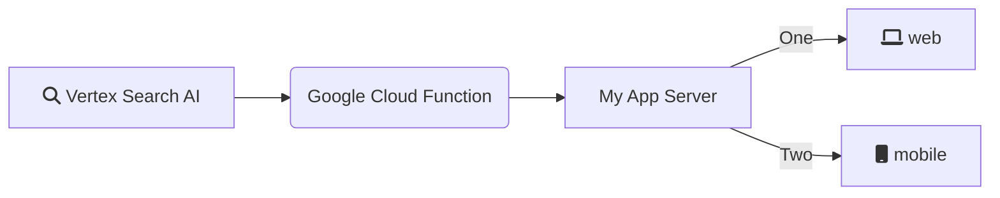

# Vertex AI Search accessed via Google Cloud Functions

This directory contains several versions of approximately the same
implementation.

The functions can be deployed to
[Cloud functions](https://cloud.google.com/functions/) and can be modified to
supports many different triggers and use cases. Each can also
[be deployed locally](https://cloud.google.com/functions/docs/running/overview)
which allows easy experimentation and iteration.

This example is powered by
[Vertex AI Search](https://cloud.google.com/generative-ai-app-builder/docs/enterprise-search-introduction)
which does many different things, including **Document & Intranet Search**,
**Recommendations** and **Grounding and RAG** out-of-the-box (For more
information, see the blog post
[Your RAG powered by Google Search](https://cloud.google.com/blog/products/ai-machine-learning/rags-powered-by-google-search-technology-part-1)).

If you want even more control see
[Vertex AI Search Component APIs](https://cloud.google.com/generative-ai-app-builder/docs/builder-apis),
but first explore the out-of-the-box offering because it's easy to setup.

This example is for the out-of-the-box Vertex AI Search supporting many
configurations and data types.

## Pre-requisites

Before you can use these functions to query Vertex AI Search, you need to create
and populate a search "data store"; read through instructions in
[get started with generic search](https://cloud.google.com/generative-ai-app-builder/docs/try-enterprise-search).
These functions could easily be adapted to other types of Vertex AI Search like
[generic recommendations](https://cloud.google.com/generative-ai-app-builder/docs/try-generic-recommendations),
[media search](https://cloud.google.com/generative-ai-app-builder/docs/try-media-search),
[media recommendations](https://cloud.google.com/generative-ai-app-builder/docs/try-media-recommendations),
[healthcare search](https://cloud.google.com/generative-ai-app-builder/docs/create-data-store-hc),
or even
[retail product discovery](https://cloud.google.com/solutions/retail-product-discovery#documentation).

You'll need to collect the following details from your search app data store:

```python
PROJECT_ID = "YOUR_PROJECT_ID"  # alphanumeric
LOCATION = "global"  # or an alternate location
DATA_STORE_ID = "YOUR_DATA_STORE_ID"  # not the app id, alphanumeric
```

Additionally you'll need to keep track of some of the choices you make when you
configure Vertex AI Search.

### Type of data source

<!-- textlint-disable -->

- UNSTRUCTURED
- STRUCTURED
- WEBSITE
- BLENDED

<!-- textlint-enable -->

```python
ENGINE_DATA_TYPE = UNSTRUCTURED
```

### Type of chunks to return

- DOCUMENT_WITH_SNIPPETS
- DOCUMENT_WITH_EXTRACTIVE_SEGMENTS
- CHUNK
- NONE

```python
ENGINE_CHUNK_TYPE = DOCUMENT_WITH_EXTRACTIVE_SEGMENTS
```

### Type of summarization

- NONE results only
- VERTEX_AI_SEARCH LLM add on provided by
[Vertex AI Search](https://cloud.google.com/generative-ai-app-builder/docs/enterprise-search-introduction)
<!-- NOT ready yet
- GENERATE_GROUNDED_ANSWERS use the
  [Generate grounded answers with RAG](https://cloud.google.com/generative-ai-app-builder/docs/grounded-gen)
  provided by
  [Vertex AI Search Builder APIs](https://cloud.google.com/generative-ai-app-builder/docs/builder-apis)
- GEMINI use one of the Gemini models to generate an answer from the results -->

```python
SUMMARY_TYPE = VERTEX_AI_SEARCH
```

## Architecture

1. Vertex AI Search is an API hosted on Google Cloud
2. You will call that API via a Google Cloud Function, which exposes its own API
3. Your users will the Google Cloud Function API, via your custom app or UI



## Use case: RAG / Grounding

Any time you have more source data than can fit into a LLM context window, you
could benefit from RAG (Retrieval Augmented Generation). The more data you have,
the more important search is - to get the relevant chunks into the prompt of the
LLM.

- **Retrieve** relevant search results, with text chunks (snippets or segments)
- **Augmented Generation** uses Gemini to generate an answer or summary grounded
  on the relevant search results

## Use case: Agent Tool (Knowledge Base)

A natural extension of RAG / Grounding is agentic behavior.

Whether creating a basic chatbot or a sophisticated tool using multi-agent
system, you're always going to need search based RAG. The better the search
quality the better the agent response based on your source data.

For more on agents, check out
[Vertex AI Agent Builder Use Cases](https://cloud.google.com/products/agent-builder?hl=en#common-uses)
and
[https://github.com/GoogleCloudPlatform/generative-ai](https://github.com/GoogleCloudPlatform/generative-ai).
