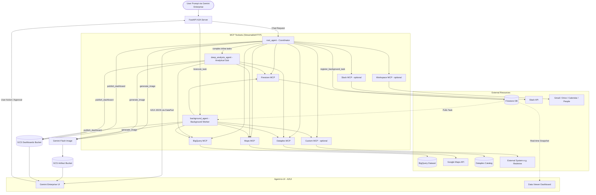
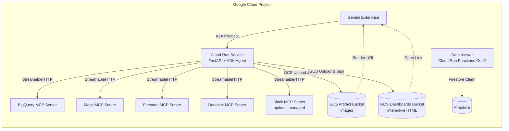

# GE Demo Generator

> **Disclaimer:** This is not an officially supported Google product. This open-source solution is intended to enhance the Google customer experience. Support and/or new releases are handled on a best-effort basis.

## What is the GE Demo Generator?

The **GE Demo Generator** is a low-code web application built on Google Apps Script (GAS) that instantly synthesizes fully functional, domain-specific custom demo environments for **Gemini Enterprise**. By inputting your client's unique business challenges, the tool dynamically provisions datasets, an AI agent with MCP toolsets, and a real-time operations dashboard — all tailored to their business workflow.

### 💡 Business Value
- **Hyper-Fast Pre-Sales**: Prepare hyper-personalized demonstrations within minutes instead of weeks.
- **Reality-Grounded Demos**: The tool provisions actual BigQuery analytics, Google Maps grounding, and Firestore persistence databases for a raw, living demo experience.

### ⚙️ Technical Features
- **Triple-Agent Autonomous Architecture**: Features a multi-agent execution framework powered by **Gemini 3.5 Flash** by default. Consists of a coordinator (`root_agent`) for chat, simple retrieval, and A2UI card rendering; an analytical sub-agent (`deep_analysis_agent`) for complex inline calculations; and a standalone background worker (`background_agent`) run asynchronously for long-running background tasks and recurring cron scheduled tasks. Models are configurable via `--model-analysis-agent` and `--model-root-agent` CLI flags.
- **Autonomous Workflow Pipelines & Guardrails**: Incorporates advanced background pipelines for both workflow-based operations (`SCAN -> ANALYZE -> PLAN -> EXECUTE -> VERIFY -> REPORT` with human-in-the-loop escalations) and deep analytical tasks. All background tasks are protected by an **Anti-Shallow Guard** self-check to ensure rigorous statistical results and extensive data tool coverage.
- **MCP Server Catalog**: A curated catalog of pre-configured MCP servers (Government & Legal, Finance, Social, Japan-Specific, Environment & Weather, Google Official) with one-click add, recipe bundles, and custom URL import.
- **A2UI (Agent-to-UI) Compliant**: Streams interactive Bento Grid layouts, Analytics Charts, and interactive confirmation cards using the A2UI SDK (`a2ui-agent-sdk`) via `<a2ui-json>` tags embedded in model responses. Integrates rich Welcome Card onboarding and step-by-step Workflow Execution Plan patterns.
- **A2A Protocol Server**: The synthesized agent runs as a FastAPI-based A2A server on Cloud Run, compatible with Gemini Enterprise agent registration, and features a standalone `/execute_task` worker for background processing.
- **Real-Time Persistence Layer**: The agent modifies Firestore via MCP, and a synthesized **Data Viewer** dashboard (Flask on Cloud Run Functions Gen2) watches Firestore collections and updates in real-time.
- **Automated Cloud Run Deployment**: Containerized deployment to Cloud Run (with `--min-instances 0` to control standby costs) and automated Discovery Engine registration for Gemini Enterprise compatibility.
- **Custom & Managed MCP Import**: Import third-party MCP servers from GitHub (bridged via `supergateway` stdio→StreamableHTTP) or integrate managed remote MCP servers (e.g., Slack with automated OAuth2 flow).
- **Image Generation**: Built-in `generate_image` tool produces professional infographics and business summary visuals via `gemini-3.1-flash-image-preview`.
- **Interactive Dashboards**: The agent can dynamically author and publish complete, interactive HTML dashboards (featuring responsive sorting tables, search filtering, Chart.js graphs, light/dark themes, and pure-JS tabs) via the `publish_dashboard` tool, hosted securely on Cloud Storage via signed URLs.
- **Context Caching**: `ContextCacheConfig` aggressively caches system instructions and A2UI schemas to reduce time-to-first-token.
- **Google Workspace MCP**: Optional integration with Gmail, Drive, Calendar, and People MCP servers via OAuth token passthrough.
- **Managed Autonomous Agent (Antigravity)**: Optionally provisions a Pre-GA **Managed Agents API** agent (Antigravity harness) the demo agent can delegate long-horizon autonomous tasks to — live web research, code execution in a cloud sandbox, and professional deliverables (presentation decks, documents, PDFs, and web reports) crafted with mounted **SKILL.md** packs, with live progress streamed into the chat. Enabled by default; provisioning adds ~10 minutes (hidden behind the rest of the setup) and requires only the Vertex AI Agent Platform API — no allowlist.
- **Workspace Authorization (No MCP)**: A lightweight alternative to Workspace MCP that adds Google sign-in for the demo user without any Developer-Preview allowlist. Combined with the Managed Agent, deliverables are saved to the user's Drive as native Google Slides / Docs / Sheets, and the autonomous agent acts on Gmail / Chat / Calendar via the open-source [Workspace CLI (gws)](https://github.com/googleworkspace/cli) inside its sandbox.
- **Customer Domain Research**: Gemini-powered company research via Google Search grounding — automatically identifies business challenges and agent-automatable workflows from a customer's domain.
- **Target Persona Selector**: Pick the demo's primary user (or describe a custom role) in the wizard — the selected persona becomes the protagonist of the generated scenario, demo guide, and agent instruction, keeping every step framed around that role's real workflow.
- **Cross-Department Scenario Fabric**: Generated demos model realistic organizational hand-offs — records carry `current_department` / `next_department` fields plus an append-only audit-trail history, the agent narrates department-boundary transitions, and the Data Viewer surfaces the process stage as a badge. Quantitative grounding derived from domain research keeps the synthetic numbers business-plausible, and a coverage self-check warns when the demo guide fails to showcase a requested capability. Disable everything at once with the `DISABLE_CROSSORG_PACK` Script Property.
- **Model Transparency**: Real-time model name announcement in the streaming response accordion for runtime visibility.
- **Premium Live Architecture Dashboard**: Displays a high-fidelity interactive target architecture diagram SVG during the synthesis step with active pulsing and success glowing states across BigQuery, Gemini Agent, and Cloud Run nodes. Features an animated Dynamic Tips Carousel rotating every 12 seconds, a real-time Elapsed Timer, and an Automatic Retry Mechanism (up to 2 retries) for Apps Script generation robustness.

---

## Table of Contents

- [What is the GE Demo Generator?](#what-is-the-ge-demo-generator)
- [1. Prerequisites](#1-prerequisites)
- [2. Repository Setup](#2-repository-setup)
- [3. Apps Script Project Setup](#3-apps-script-project-setup)
- [4. Deploying Code to Apps Script](#4-deploying-code-to-apps-script)
- [5. Google Cloud Project Setup](#5-google-cloud-project-setup)
- [6. Script Properties (Zero Hardcoding)](#6-script-properties-zero-hardcoding)
- [7. Manual API Authorization (Required Once)](#7-manual-api-authorization-required-once)
- [8. Prepare the Usage Log Spreadsheet](#8-prepare-the-usage-log-spreadsheet)
- [9. Web App Deployment](#9-web-app-deployment)
- [10. How the Generated Demo Works](#10-how-the-generated-demo-works)
- [11. Project Structure](#11-project-structure)
- [12. Cleanup](#12-cleanup)
- [13. Guided Walkthrough & Tutorial](#13-guided-walkthrough--tutorial)
- [14. System Architecture](#14-system-architecture)

---

## 1. Prerequisites

- [Node.js](https://nodejs.org/) installed
- [Clasp](https://github.com/google/clasp) installed globally (`npm install -g @google/clasp`)
- A Google Cloud Project with **Billing enabled**
- The following **Google Cloud APIs** enabled on your project:
  - Vertex AI Agent Platform API (`aiplatform.googleapis.com`)
  - BigQuery API (`bigquery.googleapis.com`)
  - Google Drive API (`drive.googleapis.com`)
  - Sheets API (`sheets.googleapis.com`)
  - Maps Platform APIs (Places, Geocoding, Routes)

---

## 2. Repository Setup

1. Clone the repository and navigate to the project directory:
   ```bash
   git clone https://github.com/GoogleCloudPlatform/generative-ai.git
   cd generative-ai/search/gemini-enterprise/ge-demo-generator
   ```

2. Install dependencies:
   ```bash
   npm install
   ```

3. Log in to Clasp (if not already):
   ```bash
   clasp login
   ```

---

## 3. Apps Script Project Setup

1. Create a new Google Apps Script project at [script.google.com](https://script.google.com).
2. Find the **Script ID**:
   - Open the Apps Script editor → **Project Settings** (Gear Icon) → **IDs** → copy the **Script ID**.
3. Create a **`.clasp.json`** file in the project root (`search/gemini-enterprise/ge-demo-generator/`) to point to your script and declare the `app` subdirectory (this file is Git-ignored):
   ```json
   {"scriptId": "YOUR_SCRIPT_ID", "rootDir": "app"}
   ```

---

## 4. Deploying Code to Apps Script

### Prerequisites

| Prerequisite | How to verify / install |
|---|---|
| **Node.js** | `node -v` — install from [nodejs.org](https://nodejs.org/) if missing |
| **Clasp CLI** | `clasp -v` — install with `npm install -g @google/clasp` if missing |
| **Clasp Login** | Run `clasp login` to authenticate with your Google account (required once) |
| **`.clasp.json`** | Must exist in the project root with your Script ID (see Step 3 above) |

### Push / Pull Commands

With the `.clasp.json` in place, use standard `clasp` commands:

```bash
# Push local code to the Apps Script project
clasp push

# Pull latest code from the Apps Script project
clasp pull

# Open the Apps Script project in your browser
clasp open
```

### Files Deployed to Apps Script

Since we declared `"rootDir": "app"` in `.clasp.json`, only files inside the `app/` directory are pushed. The deployed files are:
- `appsscript.json` — Manifest (scopes, services, webapp config)
- `Code.gs` — Backend logic
- `index.html` — Frontend SPA
- `SetupError.html` — Configuration error page

### Automating Deployments (deploy.sh)

If you have already created a web app deployment in Apps Script, you can bypass the manual versioning UI steps and automate pushing code and updating your active deployment in one step using the `deploy.sh` script:

```bash
DEPLOYMENT_ID="YOUR_WEB_APP_DEPLOYMENT_ID" bash deploy.sh
```

This script will:
1. Extract the `APP_VERSION` from `app/Code.gs`.
2. Push your latest local code via Clasp.
3. Create a new version in Apps Script described by the version string.
4. Update your active web app deployment to point directly to this newly created version.

---

## 5. Google Cloud Project Setup

### 5.1 Link Apps Script to Your Google Cloud Project

1. In the Apps Script editor, go to **Project Settings** (Gear Icon).
2. Under **Google Cloud Platform Project**, click **Change project**.
3. Enter your Google Cloud **Project Number** (not Project ID) and click **Set project**.

### 5.2 Enable Advanced Services

The `appsscript.json` manifest declares two Advanced Services that must be enabled:

| Service | Purpose |
|---|---|
| **BigQuery** (v2) | Used to verify public dataset tables during data generation |
| **Sheets** (v4) | Used to insert People Smart Chips in the usage log spreadsheet |

These are already declared in `appsscript.json` and will be auto-enabled when the script is first authorized.

---

## 6. Script Properties (Zero Hardcoding)

This codebase contains **no hardcoded parameters**. All configuration is managed via **Script Properties**.

### 6.1 Mandatory Properties

| Property | Description |
|---|---|
| `PROJECT_ID` | Your Google Cloud Project ID (e.g., `my-project-123`) |
| `LOG_SHEET_URL` | Full URL of the Google Spreadsheet for usage logging. Must contain a sheet named `Usage_Logs`. |

> **Important**: Both properties are checked at startup. If any are missing, the app displays a `SetupError.html` page with instructions instead of the main UI.

### 6.2 Optional Properties

| Property | Default | Description |
|---|---|---|
| `LOCATION` | `global` | Vertex AI Agent Platform API location (e.g., `us-central1`, `global`) |
| `MODEL` | `gemini-3.5-flash` | Gemini model name for data generation |
| `TEMPLATE_REPO` | this repository | Git URL the generated setup script fetches `agent_template/` from at run time |
| `TEMPLATE_REF` | `main` | Branch, tag, or commit SHA of the agent template. A branch/tag is resolved to a concrete commit SHA at script-generation time (each generated script is pinned to that SHA); set a 40-hex SHA to hard-pin |
| `TEMPLATE_SUBDIR` | `search/gemini-enterprise/ge-demo-generator/agent_template` | Repo path of the template directory |
| `GITHUB_TOKEN` | (unset) | GitHub personal access token used for GitHub API calls when importing custom MCP servers from a repository URL. Only needed for private repos or to avoid unauthenticated rate limits |
| `DISABLE_CROSSORG_PACK` | (unset) | Set to `1` to disable every cross-departmental prompt insertion (persona anchor, cross-department scenario fabric, process-state rules) at once — an admin rollback lever, not a user-facing option |

> **Note**: The three `TEMPLATE_*` properties override the defaults baked into
> `Code.gs`. Setting them lets a deployed app switch template sources (for
> example to a fork during development, or to this repository's latest release
> commit) without redeploying the Apps Script code.

### 6.3 Setting Properties

**Option A: Via Script Editor (Recommended for first-time setup)**

1. Open the Apps Script editor.
2. Find the `initializeProject` function.
3. Run it with your values:
   ```javascript
   initializeProject('your-project-id', 'https://docs.google.com/spreadsheets/d/xxx/edit');
   ```

**Option B: Via Project Settings UI**

1. Open the Apps Script editor.
2. Go to **Project Settings** (Gear Icon).
3. Scroll to **Script Properties**.
4. Add each property manually.

---

## 7. Manual API Authorization (Required Once)

Even with correct scopes in `appsscript.json`, you **must** manually authorize the script to access your data.

1. In the Apps Script editor, select the **`forceAuthorizeSpreadsheet`** function from the function dropdown.
2. Click **Run** (▶️).
3. A "Review Permissions" popup will appear. Follow the prompts to authorize access.
   - You may need to click **"Advanced" → "Go to [project name] (unsafe)"** if prompted with an "unverified app" warning.

> **Note**: The `forceAuthorizeSpreadsheet` function explicitly triggers authorization for Spreadsheet scopes by performing a safe read test.

---

## 8. Prepare the Usage Log Spreadsheet

1. Create a new Google Spreadsheet (or use an existing one).
2. Create a sheet named **`Usage_Logs`** with the following header row:

   | Timestamp | User Email | User Goal | AI Summary | Dataset ID | MCP Servers | Generation Time (s) |
   |---|---|---|---|---|---|---|

   > **Note**: The headers are automatically synced on each log write by `ensureLogSheetHeaders()`. You only need to create the sheet — the function will overwrite row 1 with the correct headers.

3. Copy the spreadsheet URL and set it as the `LOG_SHEET_URL` Script Property.

---

## 9. Web App Deployment

1. In the Apps Script editor, click **Deploy > New Deployment**.
2. Click the gear icon next to "Select type" and choose **Web App**.
3. Configure:
   - **Description**: e.g., `GE Demo Generator v1`
   - **Execute as**: `User accessing the web app`
   - **Who has access**: `Anyone` (or restrict as needed)
4. Click **Deploy**.
5. Copy the Web App URL — this is the URL your users will visit.

---

## 10. How the Generated Demo Works

When a user generates a demo through the web UI, the tool:

1. **Plans & Generates** synthetic business data (BigQuery tables, Firestore documents) using Gemini.
2. **Produces a Setup Script** (`setup-demo-xxx.sh`) that the user runs in **Cloud Shell**.
3. The setup script:
   - Creates a BigQuery dataset and loads CSV data
   - Provisions Firestore with operational documents
   - Deploys a **Data Viewer** web app (Flask on Cloud Run Functions Gen2)
   - Scaffolds an ADK agent project with MCP toolsets, A2UI support, and an A2A FastAPI server exposing a chat agent (`root_agent` and `deep_analysis_agent` sub-agent) and a background worker (`background_agent` via `/execute_task` runner)
   - Defaults to **Gemini 3.5 Flash** for all three agents, with support for model override via `--model-analysis-agent` and `--model-root-agent` CLI flags
   - Automatically builds a container image and deploys the Agent FastAPI server to **Cloud Run** (with `--min-instances 0` to control standby costs).
   - Provisions IAM bindings and environment configurations automatically.
   - Discovers any existing Gemini Enterprise Apps in your project and registers the newly deployed Cloud Run agent automatically.
   - When the **Managed Agent** option is enabled (default), provisions a Managed Agents API agent in two phases (creation is started early and awaited after deployment, hiding the ~8–10 min wait), uploads the deliverable craft skills from the fetched template to the dashboards bucket, and warms up the sandbox environment (pre-installing the deliverable toolchain and the Workspace CLI). The sandbox environment auto-expires after ~7 idle days; the agent re-provisions a fresh one on the next delegation.

For a detailed walkthrough, see [Section 13: Guided Walkthrough & Tutorial](#13-guided-walkthrough--tutorial).

---

## 11. Project Structure

```
ge-demo-generator/
├── app/
│   ├── appsscript.json      # Apps Script manifest (scopes, services, webapp)
│   ├── Code.gs              # Backend: data generation, setup script synthesis
│   ├── index.html           # Frontend: SPA with demo wizard UI + MCP catalog
│   ├── SetupError.html      # Error page shown when Script Properties are missing
│   └── package.json         # NPM script hooks
├── agent_template/          # Static agent runtime files (fetched by the setup
│   ├── adk_agent/           #  script at run time from a pinned repo ref):
│   │   └── app/             #  agent.py, tools.py, fast_api_app.py,
│   │       └── examples/    #  part_converters.py, A2UI example JSONs
│   ├── managed_agent/       #  Managed Agent provisioning helpers
│   ├── demo_skills/         #  Deliverable craft skills (SKILL.md packs)
│   └── viewer_app/          #  Data viewer (main.py + requirements.txt)
├── .clasp.json              # (git-ignored) Your Script ID config
├── AGENTS.md                # AI agent development guide
├── deploy.sh                # Clasp deployment orchestrator script
├── validate_examples.py     # Validates agent_template JSON + Python files
├── ge-demo-generator-lite/  # (Subproject) GE Demo Generator Lite — Workspace
│                            #  demo-data generator for Gemini Enterprise
│                            #  editions without custom-agent support
│   ├── appsscript.json
│   ├── Code.gs
│   ├── index.html
│   ├── SetupError.html
│   └── README.md
└── README.md                # This file (contains all documentation)
```

---

## 12. Cleanup

Generated demos can be fully cleaned up by running the setup script with the `--cleanup` flag:

```bash
bash setup-demo-xxx.sh --cleanup
```

This removes:
- BigQuery dataset and tables
- Google Maps API key
- Cloud Run services (main agent + Data Viewer)
- Firestore collection documents
- Dashboards Google Cloud Storage (GCS) Bucket (and all uploaded dashboard HTML snapshots)
- Gemini Enterprise agent registration & authorization resource
- Secret Manager secrets (for custom MCP and Slack OAuth tokens)
- Slack App notification (manual deletion at api.slack.com required)
- Local directories and uv caches

---

## 13. Guided Walkthrough & Tutorial
 
Welcome! This tutorial will guide you through the setup and execution of your synthesized Gemini Enterprise agent demo.
 
### 13.1 Prerequisites
 
Before we begin, ensure your Cloud Shell is targeting the correct project:
 
<walkthrough-test-code-block>
gcloud config set project {{project-id}}
</walkthrough-test-code-block>
 
---
 
### Step 1: Provision & Deploy the Demo Environment
 
The Demo Generator has synthesized a fully automated setup script for you. This script is responsible for:
- Provisioning the BigQuery dataset and loading synthetic data.
- Initializing the Firestore database with operational configurations.
- Creating the necessary IAM policies and service account roles.
- Building the container image and deploying the FastAPI Agent to **Cloud Run** in your project.
- Deploying the real-time **Data Viewer** dashboard to **Cloud Run Functions (Gen2)**.
- Attempting automatic registration of your agent inside **Gemini Enterprise**.
 
To run it:
1. Go back to the **ADK Agent Demo Generator** Web UI.
2. Under **Step 3: Deploy**, click the **Copy** button next to the **Setup Script**.
3. **Paste the command** into your Cloud Shell terminal window (at the bottom of your screen) and press **Enter**.
4. Confirm when prompted to verify the target Google Cloud project and proceed.
 
The deployment process will output status messages and logs. Once done, it will print **Quick Access Links** to your terminal.
 
---
 
### Step 2: Access the Chat Agent in Gemini Enterprise
 
If the setup script successfully registered the agent to an existing Gemini Enterprise App, it will print a direct console link:
 
1. Click the **Start Chatting in Gemini Enterprise** link printed at the end of the script output.
2. If manual registration is needed (because no Gemini Enterprise app was pre-configured), see [Step 5: Manual Agent Registration (If Needed)](#step-5-manual-agent-registration-if-needed).
3. Open the **Preview** panel in the Gemini Enterprise console and start interacting with your custom agent!
 
---
 
### Step 3: Access the Real-Time Data Viewer
 
If your demo setup includes database operations (like approving incidents or editing records), you can monitor updates in real time using the Data Viewer:
 
1. Locate the **Firestore Data Viewer** link printed in your terminal (under **Quick Access Links**).
2. Open this link in your browser. It points to a live Flask dashboard running as a Cloud Run Function.
3. Keep this tab open alongside your Gemini Enterprise chat window to witness the agent modifying database states in real time!
 
---
 
### Step 4: Try the Scenarios
 
Use the **Step 4: Run Live Demo** section in your Demo Generator Web UI for tailored prompts matching your business domain.
 
**Common Scenarios to Try:**
- **Analytical queries**: "Find all pending safety issues from last week using the BigQuery tool."
- **Maps grounding**: "Show where the incidents occurred on a map and estimate travel times."
- **State modification**: "Change the status of incident ID 104 to 'Under Investigation' and log our inspection notes." (Observe the Data Viewer update immediately!)
- **Complex workflows**: "Assign a nearby inspector to incident 104 and notify them."
 
---
 
### Step 5: Manual Agent Registration (If Needed)
 
If the setup script could not find an existing Gemini Enterprise App in your project, it will skip automatic registration. You can register the agent manually in the Google Cloud Console:
 
1. Go to the [Gemini Enterprise Console](https://console.cloud.google.com/gemini-enterprise/overview?project={{project-id}}).
2. Create or select an **App** (e.g., an Agent Engine/Discovery Engine app).
3. In the left-hand navigation pane, select **Agents**.
4. Click **Create Agent** / **Register Agent**.
5. Set the **Target URL** to your Cloud Run FastAPI app endpoint:
   `https://[YOUR_MAIN_AGENT_SERVICE_URL]/a2a/app`
   *(This URL is listed under **Quick Access Links** in your terminal).*
6. Fill in the agent name and description, select standard OAuth credentials if needed, and save.
7. Once saved, you can chat with the agent in the Preview panel.
 
---
 
### 13.2 Troubleshooting: Cloud Run Reliability
 
If your agent occasionally stops responding or feels slow in Cloud Run:
 
#### 1. Handling "Cold Starts"
Cloud Run may spin down instances after inactivity (cold starts). The first request after a break might take longer as it loads heavy libraries (like `pandas` or `scikit-learn`). 
- **Tip**: Sending the same prompt again usually works as the container is then "warm."
- **Solution**: For scaled usage, consider using a warmer service or reducing the number of heavy dependencies in your `requirements.txt`.
 
#### 2. BigQuery Token Lags
Retrieving fresh auth tokens for BigQuery can sometimes add latency.
- **Fix Applied**: Our generated `tools.py` now includes stability patches that cache tokens for 30 minutes to ensure smooth tool execution.
 
#### 3. Execution Timeouts
The default timeout for Cloud Run is 60 seconds. If your agent performs many sequential tool calls, it might hit this limit.
- **Optimization**: Use `gemini-3.1-pro-preview` for high-speed reasoning, and try to keep tool queries efficient.
 
#### 4. Cloud Run Deployment Failures (Org Policies)
If the setup fails to provision the Data Viewer application or the main Agent service:
- **Cause**: Many enterprise Google Cloud Projects restrict unauthenticated endpoints via organization policies (like `constraints/iam.allowedPolicyMemberDomains`).
- **Mitigation**: The setup script is designed to print a warning and proceed even if the **Data Viewer** deployment fails due to ingress policies. The main agent will still be deployed; you can access its logs in the Google Cloud Run console.
 
#### 5. 403 Permission Denied on Tool Invocation
If sub-agents fail to modify Firestore or pull from BigQuery:
- **Action**: Ensure the default Cloud Run Compute Service Account (`[PROJECT_NUMBER]-compute@developer.gserviceaccount.com`) has been successfully provisioned with the following roles:
  - `roles/mcp.toolUser`
  - `roles/datastore.user` (For Firestore)
  - `roles/bigquery.dataViewer` & `roles/bigquery.jobUser`
  - `roles/aiplatform.user`
 
---
 
### 13.3 Cleanup
 
When you are done with the demo, see [Section 12: Cleanup](#12-cleanup) for instructions on removing all provisioned resources.
 
---
 
### Need Help?
Refer to the sections above for comprehensive documentation, system architecture, and the developer guide.

---

## 14. System Architecture

This document describes the system architecture of the GE Demo Generator and the synthesized demo environments it produces.

---

### 14.1 Overview

The GE Demo Generator is a low-code accelerator built on Google Apps Script that allows Customer Engineers to instantly synthesize fully functional AI agent demo environments for any business domain. It generates domain-specific datasets, an ADK-based agent with MCP toolsets, and a real-time operations dashboard — all provisioned into the user's own Google Cloud project.

The system is divided into two main parts: the **Generator Dashboard** (the Apps Script web app) and the **Synthesized Demo Environment** (the Google Cloud resources created by the setup script).

---

### 14.2 Generator Dashboard (Apps Script)

#### Frontend (`index.html`)

A Tailwind-based Single Page Application (~388 KB, ~7,000 lines) that provides:

- **Demo Wizard**: Step-by-step UI to input business requirements, configure options (row count, table count, public dataset enrichment), and generate the demo.
- **Customer Domain Research**: Gemini-powered company research via Google Search grounding — automatically identifies business challenges and agent-automatable workflows from a customer's domain.
- **Data Preview**: Inline data tables and ER diagrams for the generated datasets.
- **Premium Live Synthesis Progress Dashboard**: Displays a high-fidelity interactive Google Cloud target architecture blueprint SVG during synthesis. It shows the active pulsing/success glowing states across BigQuery, Gemini Agent, and Cloud Run nodes with flowing SVG stream lines. Includes a context-sensitive animated **Dynamic Tips Carousel** rotating every 12 seconds, a real-time **Elapsed Timer**, and an **Automatic Retry Mechanism** (up to 2 retries) for robust Apps Script code generation and parsing recovery. Exposes active model name (`generatorModel`) for transparency.
- **Setup Script Export**: One-click copy of the generated bash setup script for Cloud Shell.
- **Demo Guide**: Auto-generated demo prompts tailored to the synthesized domain.
- **History Sidebar**: Personal and community demo history with favorites, restore, and delete functionality. Includes a Community Activity Feed showing real-time usage.
- **MCP Server Catalog**: A curated catalog of pre-configured MCP servers organized by category (Government & Legal, Finance & Markets, Social & Communication, Japan-Specific, Environment & Weather, Google Official), with one-click add, recipe bundles, and search/filter. Includes both sidecar (GitHub-based) and remote managed servers (e.g., Slack).
- **MCP URL Import**: Import third-party MCP servers from any GitHub repository via Gemini-powered analysis.
- **System Instruction Editor**: Edit the agent's business and technical instructions post-generation.
- **Onboarding & Feature Notifications**: First-run onboarding modal and feature notification system for new capabilities.
- **Social Proof & Engagement**: Weekly activity badge in the header, all-time usage statistics inline, Community Activity Feed in the right sidebar, and post-generation share link CTA.

#### Backend (`Code.gs`)

A monolithic Google Apps Script file (~17.7k lines, ~952 KB) that contains:

| Module | Key Functions | Description |
|---|---|---|
| **Configuration** | `CONFIG`, `checkConfiguration` | Script Property-driven config; startup validation |
| **Web App Entry** | `doGet` | Serves `index.html` or `SetupError.html` based on config state |
| **Data Generation** | `generateDemo`, `planAndGenerateData`, `buildPlanningPrompt` | Orchestrates the full generation pipeline using Gemini |
| **Public Dataset Discovery** | `discoverPublicDataset`, `verifyAndResolveTable` | Uses Google Search grounding to find and verify real BigQuery public datasets |
| **Data Validation** | `validateGeneratedData`, `validateAndRepairValue` | Schema-aware validation and auto-repair of generated CSV data |
| **Setup Script Synthesis** | `generateSetupScript` | Generates the bash setup script: Cloud resource provisioning, a pinned fetch of `agent_template/` (static agent code), per-demo config emission (`.env`, `generated_instruction.md`, `mcp_config.json`), Dockerfile assembly, and deployment logic. The template source is pinned via `TEMPLATE_REPO` / `TEMPLATE_REF` / `TEMPLATE_SUBDIR` in `CONFIG` (Script-Properties overridable); update `TEMPLATE_REF` to the release commit SHA whenever `agent_template/` changes |
| **History & Persistence** | `logUsageToSheet`, `saveToDrive`, `restoreDemo`, `getPersonalHistory`, `getGlobalHistory` | Usage logging (Sheets), backup (Drive), and restore |
| **Usage Statistics** | `getUsageStats` | Aggregated usage data (total/weekly demos, unique users, locations, recent activity feed) from the `Usage_Logs` sheet |
| **Favorites & Deletion** | `toggleFavorite`, `deleteHistoryItem` | Per-user favorites and owner-only history deletion |
| **Vertex AI Agent Platform Utilities** | `callVertexAI`, `callVertexAIWithSearch`, `executeWithRetry` | API calls with retry logic and Google Search grounding |
| **Customer Domain Research** | `researchCompanyByDomain`, `mergeTemplateWithCompanyInfo` | Google Search-grounded company research, challenge identification, and workflow discovery |
| **MCP Import & Analysis** | `analyzeMcpRepository` | Analyzes GitHub repos via `gemini-3.1-flash-lite` and integrates custom MCP servers as co-located sidecars in the agent container |

#### Error Handling (`SetupError.html`)

A standalone HTML page displayed when mandatory Script Properties (`PROJECT_ID`, `LOG_SHEET_URL`, `BACKUP_FOLDER_ID`) are missing. Provides instructions for both the `initializeProject()` function and manual Script Properties setup.

---

### 14.3 Synthesized Demo Environment (Google Cloud)

When the user runs the generated setup script in Cloud Shell, the following architecture is provisioned:

#### Data Layer

```
┌─────────────────────────────────────────────────┐
│  BigQuery                                       │
│  ├── Dataset: demo_<domain>_<suffix>            │
│  │   ├── Table 1 (e.g., sales_transactions)     │
│  │   ├── Table 2 (e.g., product_inventory)      │
│  │   └── Table 3 (e.g., customer_segments)      │
│  └── (Optional) Public Dataset Reference        │
│       e.g., bigquery-public-data.noaa_gsod.*    │
├─────────────────────────────────────────────────┤
│  Firestore                                      │
│  └── Collection: demo-<domain>-<suffix>-data    │
│       ├── Document 1 (operational record)       │
│       ├── Document 2 ...                        │
│       └── Document N                            │
└─────────────────────────────────────────────────┘
```

#### Agent Architecture

The synthesized agent uses a **triple-agent/multi-agent autonomous execution** architecture to achieve high-depth operational execution alongside optimal latency and cost. The architecture features three specialized agent instances, all utilizing **Gemini 3.5 Flash** by default for rapid response and high token efficiency:

```
┌──────────────────────────────────────────────────────────────┐
│  root_agent (LlmAgent — Coordinator)                         │
│  Model: gemini-3.5-flash (AGENT_MODEL_LITE)                  │
│  Role: Chat coordinator, simple queries, A2UI card builder    │
│  Instruction: Generated system prompt + A2UI schema          │
│               + Background-First Routing Rules               │
│                                                              │
│  Tools (shared):                                             │
│  ├── BigQuery MCP (execute_sql, list_tables, ..)             │
│  ├── Maps MCP (search_places, compute_routes,..)             │
│  ├── Firestore MCP (get_document, update_doc,..)             │
│  ├── generate_image (custom Python function)                 │
│  ├── Slack MCP (optional managed remote)                     │
│  ├── Custom MCP (optional, user-imported)                    │
│  └── Workspace MCP (optional OAuth passthrough)              │
│                                                              │
│  ┌──────────────────────────────────────────────────────┐    │
│  │  deep_analysis_agent (LlmAgent — Analytical Sub)     │    │
│  │  Model: gemini-3.5-flash (AGENT_MODEL)                │    │
│  │  Role: Complex inline multi-step reasoning            │    │
│  │  Tools: Same shared toolset                           │    │
│  │  Transfer: Returns to root_agent on completion        │    │
│  └──────────────────────────────────────────────────────┘    │
│                                                              │
│  Callbacks & Plugins:                                        │
│  ├── inject_image_callback & a2ui_metadata_callback          │
│  ├── ReflectAndRetryToolPlugin & LoggingPlugin               │
│  └── ContextCacheConfig (min_tokens=2048, ttl=3600s)         │
└──────────────────────────────────────────────────────────────┘

┌──────────────────────────────────────────────────────────────┐
│  background_agent (LlmAgent — Standalone Worker)              │
│  Model: gemini-3.5-flash (AGENT_MODEL)                       │
│  Role: Autonomous background operations & deep analysis       │
│  Instruction: Main instruction + Pipeline guardrails         │
│               + Anti-Shallow Guard (no UI / no transfers)    │
│  Tools: Shared toolset (excluding background management tools)│
│  Triggered by: /execute_task (Cloud Tasks or async cron job) │
└──────────────────────────────────────────────────────────────┘
```

**Routing logic**: 
- **Conversation / Greetings / Simple Retrieval**: Handled directly by the `root_agent`.
- **Background-First Routing (Analytical Requests)**: For complex analytical tasks (e.g., requests requiring cross-table correlation or statistical modeling), the `root_agent` MUST propose running it as a background task **first** via A2UI suggestion chips ("Run in Background" vs. "Run Inline"). 
  - If the user chooses **Background**: `root_agent` calls `register_background_task` with a detailed, structured task prompt, launching the `background_agent` asynchronously.
  - If the user chooses **Inline**: `root_agent` transfers the request inline to the `deep_analysis_agent` for processing.
- **Workflow Execution Mode**: When the user starts a structured business workflow (e.g. from a Workflow Execution Plan card), the routing rules bypass inline transfer and directly register the workflow task for background execution.

**Task Pipelines & Guardrails (background_agent)**:
The `background_agent` operates in one of two highly structured pipelines based on task classification:
1. **Workflow Pipeline**: Processes operational updates systematically: `SCAN -> ANALYZE -> PLAN -> EXECUTE -> VERIFY -> REPORT`. Employs risk thresholds where low-risk tasks are executed automatically and high-risk tasks are flagged for human-in-the-loop approval.
2. **Analytical Pipeline**: Conducts deep statistical reviews: `DATA COLLECTION -> EXPLORATORY -> DEEP STATISTICAL -> CROSS-REFERENCE -> SYNTHESIS -> COMPREHENSIVE REPORT`.
3. **Anti-Shallow Guard**: A strict programmatic checklist requiring the background worker to query multiple sources, perform sandboxed Python execution for statistical verification, cite hard numbers, and list 3+ high-impact business recommendations before submitting.

**Model configurability**: The setup script accepts `--model-analysis-agent <name>` and `--model-root-agent <name>` CLI flags to override the default model assignments. The selected models are persisted to the `.env` file and read via `AGENT_MODEL` / `AGENT_MODEL_LITE` environment variables at runtime.

**Context caching**: The `App` object is configured with `ContextCacheConfig` to cache system instructions and schemas when exceeding 2048 tokens, keeping the cache warm for 1 hour to maximize performance.

**Model transparency**: The FastAPI A2A server injects a `🧠 Model: <name>` status event into the streaming response the first time each agent processes a request, providing real-time visibility into which model is handling the interaction.

#### Image Generation

The `generate_image` tool uses `gemini-3.1-flash-image-preview` to generate professional infographics and business summary visuals. Generated images are stored in the session state and automatically injected into the LLM response via the `inject_image_callback`. In Cloud Run deployments, images are uploaded to a GCS artifact bucket for rendering in Gemini Enterprise.

#### Interactive Dashboard (publish_dashboard)

The agent is equipped with the `publish_dashboard` tool to dynamically generate self-contained, clickable HTML reports when the user requests a dashboard or executive overview.
- **Formatting Guidelines**: Dashboards are styled using CSS variables (to support light/dark modes dynamically) and feature custom search boxes, sorting tables, tabbed navigation, and hover-enabled Chart.js visualization. Charts are wrapped in fixed-height wrappers with `maintainAspectRatio: false` to ensure responsive, screen-constrained rendering.
- **Hosting and Security**: The FastAPI app stores generated dashboard HTML objects in a dedicated non-public Cloud Storage bucket. Access is restricted using v4 signed URLs generated by the service account's `roles/iam.serviceAccountTokenCreator` permission, with link validity limited to 7 days.

#### A2A Server (FastAPI)

The agent is served via a **FastAPI application** (`fast_api_app.py`) that implements the A2A (Agent-to-Agent) protocol:

- **A2A JSON-RPC endpoint** at `/a2a/<app-name>` for receiving tasks from Gemini Enterprise or other A2A clients.
- **Agent Card** served at `/.well-known/agent.json` with A2UI extension capabilities.
- **A2UI Stream Parser**: The A2UI SDK's `A2uiStreamParser` handles incremental JSON healing, component-level yielding, and schema validation during response streaming.
- **Token Extraction Middleware**: Captures OAuth tokens from HTTP headers or request body for Workspace MCP authentication passthrough.
- **GCS Artifact Service**: Stores generated images in GCS for Gemini Enterprise file rendering.
- **Model Announcement**: Emits model name in the streaming accordion header once per agent per request for runtime transparency.
- **Background Runner & `/execute_task` Endpoint**: Houses a secondary async runner (`background_app`) utilizing the `background_agent` that listens on `/execute_task` to process background operational pipeline workflows and scheduled cron task jobs.

#### Data Viewer Dashboard

A lightweight Flask application deployed as a **Cloud Run Function (Gen2)** that provides:

- Real-time polling of the Firestore collection
- Bento Grid card layout for each operational document
- KPI summary cards (Total Records, Requires Action, Resolved)
- Chart.js-powered status distribution chart
- Interactive audit trail / activity log
- Add, Update Status, and Delete operations

#### A2UI (Agent-to-UI) Protocol

The A2UI integration provides rich interactive UI components in Gemini Enterprise:

- **Schema Management**: `A2uiSchemaManager` with `BasicCatalog` provides schema validation and example injection into the system prompt.
- **Tag-Based Extraction**: The agent wraps UI payloads in `<a2ui-json>` tags. The stream parser extracts, heals, and validates these payloads.
- **DataPart Conversion**: A2UI JSON payloads are converted to A2A `DataPart` objects for proper rendering in Gemini Enterprise.
- **Interactive Components**: Cards, Columns, Rows, Buttons (with `sendText` actions), Dividers, Tabs, Text, Icons, Images, Modals, Forms (with `dataModelUpdate` for data binding), Lists, and suggestion chip bars.
- **Form Data Binding**: Interactive forms use `dataModelUpdate` messages for initial values and `path`-based bindings for TextField (supporting `shortText` and multi-line `longText`), Slider, CheckBox, and DateTimeInput components.
- **Welcome Onboarding Card**: Rendered on the first user interaction. Features a customized list of key capabilities using Icon + Text rows and action buttons designed to initiate immediate/background operations.
- **Workflow Execution Plan**: Standardized layout for batch operations. Features a mandatory subtitle declaring sequential pipeline step order, connector arrows (` ↓ `), numbered step prefixes (`Step N/M :`), real-time status icons (`play_arrow`, `check_circle`, `hourglass_empty`, `pan_tool`, `error`), and dual control rows (Execution Mode buttons and Control buttons). Employs a progress variant for real-time console status sync.
- **Context-Aware Suggestion Chips**: Section added at the end of every response using a dedicated Column schema (root -> Column [Divider, Section Title '💡 Next Actions', chipRow]) with context-aware labels to expand conversation paths.
- **Fallback**: If the stream parser fails, a regex-based fallback extracts A2UI blocks to prevent data loss.

---

### 14.4 MCP Server Integration

#### Built-in MCP Servers

| Server | Transport | Description |
|---|---|---|
| **BigQuery MCP** | StreamableHTTP | SQL execution (SELECT + full DML), schema exploration |
| **Google Maps MCP** | StreamableHTTP | Places, routes, geocoding |
| **Firestore MCP** | StreamableHTTP | Document CRUD, collection management |
| **Dataplex (Knowledge Catalog) MCP** | StreamableHTTP | Semantic asset discovery, entry lookup, and relationship context mapping |

#### MCP Server Catalog

The frontend includes a curated MCP catalog with servers organized into categories:

| Category | Servers |
|---|---|
| **Government & Legal** | US Government Open Data, US Legal & Legislation |
| **Finance & Markets** | Yahoo Finance |
| **Social & Communication** | LINE Bot, Slack (managed remote) |
| **Japan-Specific** | MLIT Data Platform, Japanese Tax Law, Japanese Labor Law, National Diet Proceedings |
| **Environment & Weather** | Weather Data |
| **Google Official** | Google Workspace MCP (Gmail, Drive, Calendar, People) |

The catalog also includes **recipe bundles** — pre-configured combinations of MCP servers for common demo scenarios (e.g., Public Data & Climate Analyst, Regulatory & Legislative Monitor, Japan Business Intelligence, Japan Climate & Logistics).

#### MCP Server Types

| Type | Transport | Provisioning |
|---|---|---|
| **Sidecar (GitHub)** | `supergateway` stdio→StreamableHTTP (`--sessionStateless`) | Cloned into Docker image, bridged via `supergateway` on a per-port basis |
| **Remote Managed (Slack)** | StreamableHTTP direct | OAuth2 flow during setup; token stored in Secret Manager |
| **Google Workspace** | StreamableHTTP direct | MCP OAuth with token passthrough from Gemini Enterprise |

#### Custom MCP Import (URL)

Users can import any GitHub-hosted MCP server by providing the repository URL. The system:
1. Fetches repository contents via Gemini-powered analysis (`gemini-3.1-flash-lite`)
2. Identifies the entrypoint, language, required environment variables, and capabilities
3. Generates the Dockerfile sidecar configuration and `supergateway` bridge commands
4. Supports deduplication to prevent adding the same server twice

---

### 14.5 Data Flow Architecture



---

### 14.6 Deployment Configuration

The setup script deploys the agent directly to Google Cloud Run and supports model overrides and automated cleanup via CLI flags:

```bash
# Default models (gemini-3.5-flash)
bash setup-demo-xxx.sh

# Override models
bash setup-demo-xxx.sh --model-analysis-agent gemini-3.1-pro-preview --model-root-agent gemini-3.1-flash-lite

# Cleanup
bash setup-demo-xxx.sh --cleanup
```

The script automates the full deployment flow:
1. **Cloud Run Deployment**: The FastAPI Agent is containerized and deployed to Cloud Run with `--min-instances 0` to avoid continuous running costs while ensuring availability.
2. **Gemini Enterprise Registration**: The script scans for existing Gemini Enterprise apps in your Google Cloud project (regions: `global`, `us`, `eu`) and automatically registers the Cloud Run agent service URL.

### Deployment Architecture



---

### 14.7 Synthesized Project Structure

After running the setup script, the following directory structure is created:

```
~/demo-<domain>-<suffix>/
├── setup-demo-<domain>-<suffix>.sh   # The setup script itself
├── .venv/                             # (Optional) Python virtual environment (for local autocomplete)
├── .env                               # Runtime environment variables
│                                      # (AGENT_MODEL, AGENT_MODEL_LITE, etc.)
├── .python-version                    # Python 3.11
├── pyproject.toml                     # ADK project metadata
├── requirements.txt                   # Python dependencies
├── Dockerfile                         # Container build definition
│                                      # (includes supergateway for custom MCP)
├── .dockerignore                      # Excludes .venv from Docker
├── adk_agent/
│   └── app/
│       ├── __init__.py
│       ├── agent.py                   # LlmAgent definitions (root_agent, deep_analysis_agent, background_agent)
│       │                              # + A2UI schema manager + ContextCacheConfig + plugins
│       ├── tools.py                   # MCP toolset factories + generate_image
│       │                              # + Workspace MCP + Slack MCP
│       ├── fast_api_app.py            # A2A server, background task runner, streaming, middleware
│       ├── part_converters.py         # A2A↔Gen AI type conversion utilities
│       └── examples/0.8/              # A2UI BasicCatalog example JSONs
└── viewer_app/
    └── main.py                        # Flask Data Viewer (deployed to Cloud Run Functions)
```

---

### 14.8 Execution Sequence

### Example: User updates a database record via the agent

1. **Prompt**: The user says in Gemini Enterprise: *"Approve safety issue #104 and log update notes."*
2. **A2A Routing**: Gemini Enterprise sends the message via A2A JSON-RPC to the Cloud Run FastAPI server.
3. **Model Announcement**: The server emits a `🧠 Model: gemini-3.5-flash` status event in the thinking accordion.
4. **Reasoning**: The `root_agent` identifies a write request and plans to use the Firestore MCP toolset.
5. **Confirmation**: The agent renders an A2UI confirmation card (via `<a2ui-json>` tags) showing before/after data with Approve/Reject buttons and a `dataModelUpdate` for pre-populated fields.
6. **User Approval**: The user clicks "Approve" in the interactive card, which sends a `sendText` action back to the agent.
7. **Tool Execution**: The agent invokes the Firestore MCP `update_document` tool.
8. **A2UI Cleanup**: The agent issues a `deleteSurface` command to remove the confirmation card, then renders a success summary card with follow-up suggestion chips.
9. **Real-time Sync**: The Data Viewer dashboard independently detects the Firestore change and updates its Bento Grid display.

---

### 14.9 Design Patterns & Stability Patches

### Schema Compatibility
- **`_safe_dereference_schema`**: Patches ADK's internal `_dereference_schema` function to handle complex nested JSON schemas with `$ref` and `$defs` — prevents validation errors when registering MCP tools with deeply nested schemas (e.g., Firestore). Includes JSON Pointer resolution for arbitrary `$ref` paths.
- **`_ensure_types`**: Transforms incorrectly formatted schema properties (e.g., string literals where objects are expected). Flattens `anyOf`/`oneOf` to the first non-null variant for Gemini API compatibility.

### Network & Session Stability
- **HTTP/2 Disable Patch**: Monkeypatches `httpx.AsyncClient` to force HTTP/1.1 connections, preventing intermittent connection resets with MCP servers.
- **MCP CancelScope Fix**: Patches `SessionContext._run()` to remove `asyncio.wait_for()` wrapper, fixing "Attempted to exit cancel scope in a different task" errors in AnyIO.
- **Graceful Error Handling**: `ADK_ENABLE_MCP_GRACEFUL_ERROR_HANDLING=1` environment variable enables ADK's built-in error recovery for MCP tool failures.
- **Extended Timeouts**: MCP connections use 300s read / 60s connect timeouts with async-safe token caching to handle sidecar cold starts.

### A2UI Rendering
- **Bento Layout Strategy**: All UI screens use compact grid layouts to prevent visual clutter in presentations.
- **A2UI Stream Parser**: Uses the SDK's `A2uiStreamParser` for incremental JSON healing, component validation, and streaming.
- **Regex Fallback**: When the stream parser fails on malformed JSON, a regex-based fallback extracts A2UI blocks to prevent data loss.
- **Artifact Text/Media Separation**: `fast_api_app.py` separates text and media parts — text is cleared on each tool call so only the final model turn's text appears in the artifact, while images and A2UI cards are always preserved.

### Deployment Resilience
- **Ingress Org-Policy Graceful Failure**: Setup scripts detect and gracefully handle organization policies that block unauthenticated Cloud Run endpoints (e.g., `constraints/iam.allowedPolicyMemberDomains`).
- **Static Agent Card**: The A2A server builds an `AgentCard` without connecting to MCP servers at startup, preventing hangs from slow/broken MCP connections. MCP tool connections happen lazily on first user request.
- **Parallel BQ Loading**: BigQuery table loading uses `xargs -P 5` for parallel CSV uploads.
- **Min Instances**: Cloud Run deployments use `--min-instances 0` to minimize standby costs for demo environments (users should expect occasional cold-start latency on the first request).
- **Supergateway Stateless Sessions**: Custom MCP sidecars use `supergateway --sessionStateless` to prevent process accumulation from multiple client connections.

### Token Management
- **Token Extraction Middleware**: A Starlette middleware captures OAuth tokens from multiple sources (Authorization header, x-authorization header, JSON body) and stores them in `builtins._workspace_oauth_token` for Workspace MCP authentication passthrough.
- **Async Token Cache**: MCP authentication tokens are cached with async-safe locking and automatic expiry refresh.

### Agent Resilience
- **Context Caching**: `ContextCacheConfig` caches the system instruction and A2UI schema (>= 4096 tokens) for 1 hour with 10-invocation revalidation, reducing time-to-first-token.
- **Events Compaction**: `EventsCompactionConfig` compacts event history every 20 events with a 3-event overlap to prevent context window overflow in long conversations.
- **ReflectAndRetryToolPlugin**: Automatically retries failed tool calls with error reflection, improving robustness against transient MCP failures.
- **Tool Name Deduplication**: `get_custom_mcp_toolsets` uses `tool_name_prefix` to prevent "Duplicate function declaration" errors when multiple MCP servers expose identical tool names.
- **Retry Options**: Both models are configured with `HttpRetryOptions` (8 attempts, exponential backoff 2s–60s) specifically targeting HTTP 429 (Resource Exhausted) errors.

---

