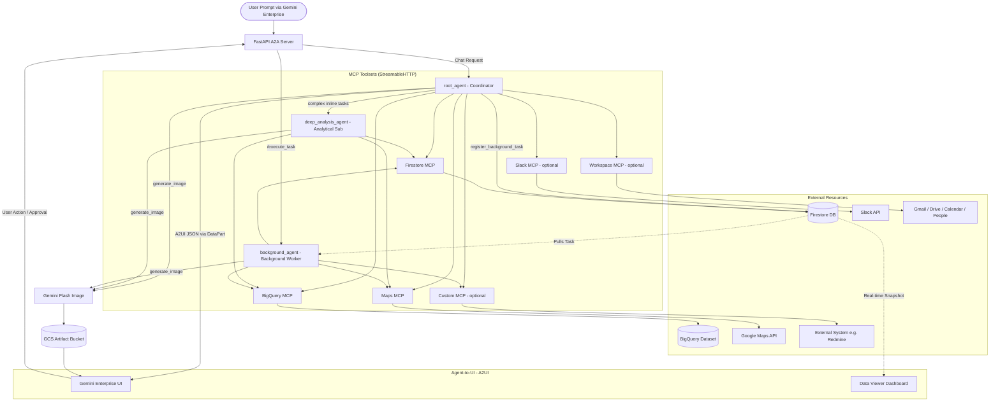
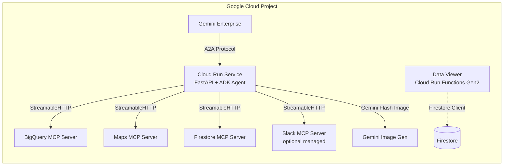

# GE Demo Generator

> **Disclaimer:** This is not an officially supported Google product. This open-source solution is intended to enhance the Google customer experience. Support and/or new releases are handled on a best-effort basis.

## What is the GE Demo Generator?

The **GE Demo Generator** is a low-code web application built on Google Apps Script (GAS) that instantly synthesizes fully functional, domain-specific custom demo environments for **Gemini Enterprise**. By inputting your client's unique business challenges, the tool dynamically provisions datasets, an AI agent with MCP toolsets, and a real-time operations dashboard — all tailored to their business workflow.

### 💡 Business Value
- **Hyper-Fast Pre-Sales**: Prepare hyper-personalized demonstrations within minutes instead of weeks.
- **Reality-Grounded Demos**: The tool provisions actual BigQuery analytics, Google Maps grounding, and Firestore persistence databases for a raw, living demo experience.

### ⚙️ Technical Features
- **Triple-Agent Autonomous Architecture**: Features a multi-agent execution framework powered by **Gemini 3.5 Flash** by default. Consists of a coordinator (`root_agent`) for chat, simple retrieval, and A2UI card rendering; an analytical sub-agent (`deep_analysis_agent`) for complex inline calculations; and a standalone background worker (`background_agent`) run asynchronously for long-running background tasks and recurring cron scheduled tasks. Models are configurable via `--model-analysis-agent` and `--model-root-agent` CLI flags.
- **Autonomous Workflow Pipelines & Guardrails**: Incorporates advanced background pipelines for both workflow-based operations (`SCAN -> ANALYZE -> PLAN -> EXECUTE -> VERIFY -> REPORT` with human-in-the-loop escalations) and deep analytical tasks. All background tasks are protected by an **Anti-Shallow Guard** self-check to ensure rigorous statistical results and extensive data tool coverage.
- **MCP Server Catalog**: A curated catalog of pre-configured MCP servers (Government & Legal, Finance, Social, Japan-Specific, Environment & Weather, Google Official) with one-click add, recipe bundles, and custom URL import.
- **A2UI (Agent-to-UI) Compliant**: Streams interactive Bento Grid layouts, Analytics Charts, and interactive confirmation cards using the A2UI SDK (`a2ui-agent-sdk`) via `<a2ui-json>` tags embedded in model responses. Integrates rich Welcome Card onboarding and step-by-step Workflow Execution Plan patterns.
- **A2A Protocol Server**: The synthesized agent runs as a FastAPI-based A2A server on Cloud Run, compatible with Gemini Enterprise agent registration, and features a standalone `/execute_task` worker for background processing.
- **Real-Time Persistence Layer**: The agent modifies Firestore via MCP, and a synthesized **Data Viewer** dashboard (Flask on Cloud Run Functions Gen2) watches Firestore collections and updates in real-time.
- **Three Deployment Targets**: Local (Cloud Shell `adk web`), Cloud Run (public URL with `--min-instances 1`), and Gemini Enterprise (automated Cloud Run + Discovery Engine registration).
- **Custom & Managed MCP Import**: Import third-party MCP servers from GitHub (bridged via `supergateway` stdio→StreamableHTTP) or integrate managed remote MCP servers (e.g., Slack with automated OAuth2 flow).
- **Image Generation**: Built-in `generate_image` tool produces professional infographics and business summary visuals via `gemini-3.1-flash-image-preview`.
- **Context Caching**: `ContextCacheConfig` aggressively caches system instructions and A2UI schemas to reduce time-to-first-token.
- **Google Workspace MCP**: Optional integration with Gmail, Drive, Calendar, and People MCP servers via OAuth token passthrough.
- **Customer Domain Research**: Gemini-powered company research via Google Search grounding — automatically identifies business challenges and agent-automatable workflows from a customer's domain.
- **Model Transparency**: Real-time model name announcement in the streaming response accordion for runtime visibility.
- **Premium Live Architecture Dashboard**: Displays a high-fidelity interactive target architecture diagram SVG during the synthesis step with active pulsing and success glowing states across BigQuery, Gemini Agent, and Cloud Run nodes. Features an animated Dynamic Tips Carousel rotating every 12 seconds, a real-time Elapsed Timer, and an Automatic Retry Mechanism (up to 2 retries) for Apps Script generation robustness.

---

## 1. Prerequisites

- [Node.js](https://nodejs.org/) installed
- [Clasp](https://github.com/google/clasp) installed globally (`npm install -g @google/clasp`)
- A Google Cloud Project with **Billing enabled**
- The following **Google Cloud APIs** enabled on your project:
  - Vertex AI Agent Platform API (`aiplatform.googleapis.com`)
  - BigQuery API (`bigquery.googleapis.com`)
  - Google Drive API (`drive.googleapis.com`)
  - Sheets API (`sheets.googleapis.com`)
  - Maps Platform APIs (Places, Geocoding, Routes)

---

## 2. Repository Setup

1. Clone the repository:
   ```bash
   git clone https://github.com/ryotat7/ge-demo-generator.git
   cd ge-demo-generator
   ```

2. Install dependencies:
   ```bash
   npm install
   ```

3. Log in to Clasp (if not already):
   ```bash
   clasp login
   ```

---

## 3. Apps Script Project Setup

1. Create a new Google Apps Script project at [script.google.com](https://script.google.com).
2. Find the **Script ID**:
   - Open the Apps Script editor → **Project Settings** (Gear Icon) → **IDs** → copy the **Script ID**.
3. Create a **`.clasp.json`** file in the project root (this file is Git-ignored):
   ```json
   {"scriptId": "YOUR_SCRIPT_ID"}
   ```

---

## 4. Deploying Code to Apps Script

### Prerequisites

| Prerequisite | How to verify / install |
|---|---|
| **Node.js** | `node -v` — install from [nodejs.org](https://nodejs.org/) if missing |
| **Clasp CLI** | `clasp -v` — install with `npm install -g @google/clasp` if missing |
| **Clasp Login** | Run `clasp login` to authenticate with your Google account (required once) |
| **`.clasp.json`** | Must exist in the project root with your Script ID (see Step 3 above) |

### Push / Pull Commands

With the `.clasp.json` in place, use standard `clasp` commands:

```bash
# Push local code to the Apps Script project
clasp push

# Pull latest code from the Apps Script project
clasp pull

# Open the Apps Script project in your browser
clasp open
```

### Files Deployed to Apps Script

The `.claspignore` file controls which files are pushed. Only these files are deployed:
- `appsscript.json` — Manifest (scopes, services, webapp config)
- `Code.gs` — Backend logic
- `index.html` — Frontend SPA
- `SetupError.html` — Configuration error page

---

## 5. Google Cloud Project Setup

### 5.1 Link Apps Script to Your Google Cloud Project

1. In the Apps Script editor, go to **Project Settings** (Gear Icon).
2. Under **Google Cloud Platform Project**, click **Change project**.
3. Enter your Google Cloud **Project Number** (not Project ID) and click **Set project**.

### 5.2 Enable Advanced Services

The `appsscript.json` manifest declares two Advanced Services that must be enabled:

| Service | Purpose |
|---|---|
| **BigQuery** (v2) | Used to verify public dataset tables during data generation |
| **Sheets** (v4) | Used to insert People Smart Chips in the usage log spreadsheet |

These are already declared in `appsscript.json` and will be auto-enabled when the script is first authorized.

---

## 6. Script Properties (Zero Hardcoding)

This codebase contains **no hardcoded parameters**. All configuration is managed via **Script Properties**.

### 6.1 Mandatory Properties

| Property | Description |
|---|---|
| `PROJECT_ID` | Your Google Cloud Project ID (e.g., `my-project-123`) |
| `LOG_SHEET_URL` | Full URL of the Google Spreadsheet for usage logging. Must contain a sheet named `Usage_Logs`. |

> **Important**: Both properties are checked at startup. If any are missing, the app displays a `SetupError.html` page with instructions instead of the main UI.

### 6.2 Optional Properties

| Property | Default | Description |
|---|---|---|
| `LOCATION` | `global` | Vertex AI Agent Platform API location (e.g., `us-central1`, `global`) |
| `MODEL` | `gemini-3.5-flash` | Gemini model name for data generation |

### 6.3 Setting Properties

**Option A: Via Script Editor (Recommended for first-time setup)**

1. Open the Apps Script editor.
2. Find the `initializeProject` function.
3. Run it with your values:
   ```javascript
   initializeProject('your-project-id', 'https://docs.google.com/spreadsheets/d/xxx/edit');
   ```

**Option B: Via Project Settings UI**

1. Open the Apps Script editor.
2. Go to **Project Settings** (Gear Icon).
3. Scroll to **Script Properties**.
4. Add each property manually.

---

## 7. Manual API Authorization (Required Once)

Even with correct scopes in `appsscript.json`, you **must** manually authorize the script to access your data.

1. In the Apps Script editor, select the **`forceAuthorizeSpreadsheet`** function from the function dropdown.
2. Click **Run** (▶️).
3. A "Review Permissions" popup will appear. Follow the prompts to authorize access.
   - You may need to click **"Advanced" → "Go to [project name] (unsafe)"** if prompted with an "unverified app" warning.

> **Note**: The `forceAuthorizeSpreadsheet` function explicitly triggers authorization for Spreadsheet scopes by performing a safe read test.

---

## 8. Prepare the Usage Log Spreadsheet

1. Create a new Google Spreadsheet (or use an existing one).
2. Create a sheet named **`Usage_Logs`** with the following header row:

   | Timestamp | User Email | User Goal | AI Summary | Dataset ID | MCP Servers | Generation Time (s) |
   |---|---|---|---|---|---|---|

   > **Note**: The headers are automatically synced on each log write by `ensureLogSheetHeaders()`. You only need to create the sheet — the function will overwrite row 1 with the correct headers.

3. Copy the spreadsheet URL and set it as the `LOG_SHEET_URL` Script Property.

---

## 9. Web App Deployment

1. In the Apps Script editor, click **Deploy > New Deployment**.
2. Click the gear icon next to "Select type" and choose **Web App**.
3. Configure:
   - **Description**: e.g., `GE Demo Generator v1`
   - **Execute as**: `User accessing the web app`
   - **Who has access**: `Anyone` (or restrict as needed)
4. Click **Deploy**.
5. Copy the Web App URL — this is the URL your users will visit.

---

## 10. How the Generated Demo Works

When a user generates a demo through the web UI, the tool:

1. **Plans & Generates** synthetic business data (BigQuery tables, Firestore documents) using Gemini.
2. **Produces a Setup Script** (`setup-demo-xxx.sh`) that the user runs in **Cloud Shell**.
3. The setup script:
   - Creates a BigQuery dataset and loads CSV data
   - Provisions Firestore with operational documents
   - Deploys a **Data Viewer** web app (Flask on Cloud Run Functions Gen2)
   - Scaffolds an ADK agent project with MCP toolsets, A2UI support, and an A2A FastAPI server exposing a chat agent (`root_agent` and `deep_analysis_agent` sub-agent) and a background worker (`background_agent` via `/execute_task` runner)
   - Defaults to **Gemini 3.5 Flash** for all three agents, with support for model override via `--model-analysis-agent` and `--model-root-agent` CLI flags
   - Offers three deployment targets:
     - **[1] Local**: Launches `adk web` on a local port
     - **[2] Cloud Run**: Builds a Docker image and deploys to Cloud Run with `--min-instances 1`
     - **[3] Gemini Enterprise**: Deploys to Cloud Run + registers the agent in Gemini Enterprise via the Discovery Engine API

For a detailed walkthrough, see [tutorial.md](tutorial.md).

---

## 11. Project Structure

```
ge-demo-generator/
├── appsscript.json          # Apps Script manifest (scopes, services, webapp)
├── Code.gs                  # Backend: data generation, setup script synthesis
├── index.html               # Frontend: SPA with demo wizard UI + MCP catalog
├── SetupError.html          # Error page shown when Script Properties are missing
├── package.json             # NPM scripts for clasp push/pull
├── .clasp.json              # (git-ignored) Your Script ID config
├── .claspignore             # Controls which files are pushed to Apps Script
├── tutorial.md              # Cloud Shell interactive tutorial
├── ARCHITECTURE.md          # System architecture documentation
├── AGENTS.md                # AI agent development guide
└── README.md                # This file
```

---

## 12. Cleanup

Generated demos can be fully cleaned up by running the setup script with the `--cleanup` flag:

```bash
bash setup-demo-xxx.sh --cleanup
```

This removes:
- BigQuery dataset and tables
- Google Maps API key
- Cloud Run services (main agent + Data Viewer)
- Firestore collection documents
- Gemini Enterprise agent registration & authorization resource
- Secret Manager secrets (for custom MCP and Slack OAuth tokens)
- Slack App notification (manual deletion at api.slack.com required)
- Local directories and uv caches

---

## 7. Guided Walkthrough & Tutorial

Welcome! This tutorial will guide you through the setup and execution of your synthesized BigQuery MCP Agent demo.

## Prerequisites

Before we begin, ensure you have the necessary APIs enabled and the correct project selected.

<walkthrough-project-setup>
</walkthrough-project-setup>

### 🛠️ Set Your Project
Ensure your Cloud Shell is targeting the correct project:

<walkthrough-test-code-block>
gcloud config set project {{project-id}}
</walkthrough-test-code-block>

---

## Step 1: Provision Demo Environment in Your Project

The Demo Generator has synthesized a custom setup script for you. This script is responsible for provisioning the BigQuery dataset and setting up the agent code within YOUR Google Cloud environment.

1. Go back to the **ADK Agent Demo Generator** Web UI.
2. Under **Step 3: Deploy**, click the **Copy** button next to the **Setup Script**.
3. **Paste the command** into the Cloud Shell terminal window (at the bottom of your screen) and press **Enter**.

> [!IMPORTANT]
> This app does not provision resources directly. Running this script is the required step to create the demo environment in your own project.

> **Note:** The script is uniquely named (e.g., `setup-demo-retail-inventory-831afa90.sh`) and creates a matching directory.

```bash
# Paste your setup command here in the terminal window below
```

---

## Step 2: Launch the Agent

Once the setup script from Step 1 finishes, it will display the exact command to launch your agent. **Please follow the instructions shown in your terminal.**

### 📎 Reference: How to launch manually

If you need to restart the agent or navigate manually, use these commands:

#### 1. Enter the Agent Directory
You must be in the `adk_agent` folder inside your new demo directory. Replace `[YOUR_DEMO_DIR]` with the folder name created in Step 1 (e.g., `my-ge-demo-831afa90`).

```bash
# General pattern:
cd [YOUR_DEMO_DIR]/adk_agent

# Tip: You can use this to find and enter the latest demo folder automatically:
cd $(ls -d demo-*/ | head -n 1)adk_agent
```

#### 2. Start the Server
Run the agent using the virtual environment installed by the script:

```bash
../.venv/bin/adk web --allow_origins="*"
```

---

## Step 3: Access the UI & Preview

Once you see `Uvicorn running on http://127.0.0.1:8000`:

1. Click the **Web Preview** button at the top right of the Cloud Shell window.
2. Select **Preview on port 8000**.
3. In the new tab, select the **app** and start a new session.

#### 💡 Real-Time Data Viewer Application
If your setup included the Bento Grid operations console, you can inspect Firestore updates in real time:
1. Open a new Cloud Shell terminal.
2. Run the following inside the synthesized directory:
   ```bash
   cd viewer_app
   # Start on alternative port, e.g., 8080
   python3 -m http.server 8080
   ```
3. Use the Web Preview button to check **port 8080** to launch the dashboard console.


---

## Step 4: Try the Scenarios

Use the **Step 4: Run Live Demo** section in your Demo Generator for tailored prompts.

**Example Prompts:**
- "Analyze sales trends using the BigQuery tool."
- "Correlate demographic data with real-world locations via Google Maps."
- "Update maintenance status on item #104 and post verification logs into Firestore."
- "Approve the flagged safety incident and update the operations grid instantly."


---

## Step 5: (Optional) Deploy to Gemini Enterprise

Ready to take your demo further? Deploy it to **Cloud Run** and register it as an official agent within **Gemini Enterprise**.

### 1. Enhance Your Project
Run this in your agent root directory (`adk_agent`):

```bash
uvx agent-starter-pack enhance
```

**Expected Interaction (Accept all defaults):**
> Continue with enhancement? [Y/n]: **Y**  
> Select base template (1): **[Enter]**  
> Select agent directory (1): **[Enter]**  
> select a deployment target: **1 (cloud_run)**  
> select a CI/CD runner: **1 (simple)**  

### 2. Deploy to Cloud Run
Once configured, copy and run the generated command. Use the **Update Existing** toggle if you wish to overwrite an existing agent resource, or **Create New** for a fresh deployment.

```bash
# Example command generated by Step 5:
# rm -f .resource_name && sed -i 's/name = "adk-agent"/name = "my-custom-agent"/' pyproject.toml && make deploy
```

### 3. Grant Execution Permissions
If your agent encounters a 403 error when calling BigQuery, run these commands to grant the necessary roles to the Cloud Run service account:

```bash
PI=$(gcloud config get-value project)
PN=$(gcloud projects list --filter="projectId:$PI" --format="value(projectNumber)")
SA="$PN-compute@developer.gserviceaccount.com"
# Grant roles to Cloud Run Service Agent
for ROLE in "roles/mcp.toolUser" "roles/bigquery.jobUser" "roles/bigquery.dataViewer" "roles/serviceusage.serviceUsageConsumer"; do
  gcloud projects add-iam-policy-binding $PI --member="serviceAccount:$SA" --role="$ROLE" --condition=None
done
```

### 4. Register to Gemini Enterprise
```bash
make register-gemini-enterprise
```

---

## 🛠️ Troubleshooting: Reliability in Cloud Run

If your agent occasionally stops responding or feels slow in Cloud Run:

### 1. Handling "Cold Starts"
Cloud Run may spin down instances after inactivity (cold starts). The first request after a break might take longer as it loads heavy libraries (like `pandas` or `scikit-learn`). 
- **Tip**: Sending the same prompt again usually works as the container is then "warm."
- **Solution**: For scaled usage, consider using a warmer service or reducing the number of heavy dependencies in your `requirements.txt`.

### 2. BigQuery Token Lags
Retrieving fresh auth tokens for BigQuery can sometimes add latency.
- **Fix Applied**: Our generated `tools.py` now includes stability patches that cache tokens for 30 minutes to ensure smooth tool execution.

### 3. Execution Timeouts
The default timeout for Cloud Run is 60 seconds. If your agent performs many sequential tool calls, it might hit this limit.
- **Optimization**: Use `gemini-3.1-pro-preview` for high-speed reasoning, and try to keep tool queries efficient.

### 4. 403 Insufficient Scope Errors
If you see "Request had insufficient authentication scopes" in the logs:
- **Solution**: Refresh your local credentials in Cloud Shell with mandatory scopes (Note: `maps-platform` is NOT a valid standalone scope; use `cloud-platform` instead):
  `gcloud auth application-default login --scopes="https://www.googleapis.com/auth/cloud-platform,https://www.googleapis.com/auth/bigquery,openid,https://www.googleapis.com/auth/userinfo.email"`
- **Required Action**: After running the command, you MUST **restart the agent** (Ctrl+C and run the launch command again) to clear the cached tokens.

### 5. Cloud Run Deployment Failures (Org Policies)
If the setup fails to provision the Data Viewer application or the main Agent service:
- **Cause**: Many enterprise Google Cloud Projects restrict unauthenticated endpoints via organization policies (like `constraints/iam.allowedPolicyMemberDomains`).
- **Mitigation**: The setup script is designed to print a warning and proceed even if the **Data Viewer** deployment fails due to ingress policies. You can still preview the multi-agent setup locally using `adk web` (Step 3).

### 6. 403 Permission Denied on Tool Invocation
If sub-agents fail to modify Firestore or pull from BigQuery:
- **Action**: Ensure the default Cloud Run Compute Service Account (`[PROJECT_NUMBER]-compute@developer.gserviceaccount.com`) has been successfully provisioned with the following roles:
  - `roles/mcp.toolUser`
  - `roles/datastore.user` (For Firestore)
  - `roles/bigquery.dataViewer` & `roles/bigquery.jobUser`
  - `roles/aiplatform.user`


---

## 🧹 Cleanup: Removing Demo Resources

When you're done with your demo, you can easily clean up all created resources by running the setup script with the `--cleanup` flag:

```bash
# Replace with your actual script name
bash setup-demo-xxx.sh --cleanup
```

This will remove:
- **BigQuery Dataset**: The demo dataset and all its tables
- **Maps API Key**: The auto-generated API key for Google Maps
- **Local Directory**: The demo folder in your Cloud Shell home

> **Note:** You'll be prompted for confirmation before any resources are deleted.

---

### Need Help?
Refer to the [GitHub Repository](https://github.com/ryotat7/ge-demo-generator) for documentation and architecture details.

---

## 8. System Architecture

This document describes the system architecture of the GE Demo Generator and the synthesized demo environments it produces.

---

## 1. Overview

The GE Demo Generator is a low-code accelerator built on Google Apps Script that allows Customer Engineers to instantly synthesize fully functional AI agent demo environments for any business domain. It generates domain-specific datasets, an ADK-based agent with MCP toolsets, and a real-time operations dashboard — all provisioned into the user's own Google Cloud project.

The system is divided into two main parts: the **Generator Dashboard** (the Apps Script web app) and the **Synthesized Demo Environment** (the Google Cloud resources created by the setup script).

---

## 2. Generator Dashboard (Google Apps Script Web App)

### 2.1 Frontend (`index.html`)

A Tailwind-based Single Page Application (~328 KB, ~5,700 lines) that provides:

- **Demo Wizard**: Step-by-step UI to input business requirements, configure options (row count, table count, public dataset enrichment), and generate the demo.
- **Customer Domain Research**: Gemini-powered company research via Google Search grounding — automatically identifies business challenges and agent-automatable workflows from a customer's domain.
- **Data Preview**: Inline data tables and ER diagrams for the generated datasets.
- **Premium Live Synthesis Progress Dashboard**: Displays a high-fidelity interactive Google Cloud target architecture blueprint SVG during synthesis. It shows the active pulsing/success glowing states across BigQuery, Gemini Agent, and Cloud Run nodes with flowing SVG stream lines. Includes a context-sensitive animated **Dynamic Tips Carousel** rotating every 12 seconds, a real-time **Elapsed Timer**, and an **Automatic Retry Mechanism** (up to 2 retries) for robust Apps Script code generation and parsing recovery. Exposes active model name (`generatorModel`) for transparency.
- **Setup Script Export**: One-click copy of the generated bash setup script for Cloud Shell.
- **Demo Guide**: Auto-generated demo prompts tailored to the synthesized domain.
- **History Sidebar**: Personal and community demo history with favorites, restore, and delete functionality. Includes a Community Activity Feed showing real-time usage.
- **MCP Server Catalog**: A curated catalog of pre-configured MCP servers organized by category (Government & Legal, Finance & Markets, Social & Communication, Japan-Specific, Environment & Weather, Google Official), with one-click add, recipe bundles, and search/filter. Includes both sidecar (GitHub-based) and remote managed servers (e.g., Slack).
- **MCP URL Import**: Import third-party MCP servers from any GitHub repository via Gemini-powered analysis.
- **System Instruction Editor**: Edit the agent's business and technical instructions post-generation.
- **Onboarding & Feature Notifications**: First-run onboarding modal and feature notification system for new capabilities.
- **Social Proof & Engagement**: Weekly activity badge in the header, all-time usage statistics inline, Community Activity Feed in the right sidebar, and post-generation share link CTA.

### 2.2 Backend (`Code.gs`)

A monolithic Google Apps Script file (~8,100 lines, ~389 KB) that contains:

| Module | Key Functions | Description |
|---|---|---|
| **Configuration** | `CONFIG`, `checkConfiguration` | Script Property-driven config; startup validation |
| **Web App Entry** | `doGet` | Serves `index.html` or `SetupError.html` based on config state |
| **Data Generation** | `generateDemo`, `planAndGenerateData`, `buildPlanningPrompt` | Orchestrates the full generation pipeline using Gemini |
| **Public Dataset Discovery** | `discoverPublicDataset`, `verifyAndResolveTable` | Uses Google Search grounding to find and verify real BigQuery public datasets |
| **Data Validation** | `validateGeneratedData`, `validateAndRepairValue` | Schema-aware validation and auto-repair of generated CSV data |
| **Setup Script Synthesis** | `generateSetupScript` | Generates a comprehensive bash script including all Cloud resources, agent code, Dockerfile, and deployment logic |
| **History & Persistence** | `logUsageToSheet`, `saveToDrive`, `restoreDemo`, `getPersonalHistory`, `getGlobalHistory` | Usage logging (Sheets), backup (Drive), and restore |
| **Usage Statistics** | `getUsageStats` | Aggregated usage data (total/weekly demos, unique users, locations, recent activity feed) from the `Usage_Logs` sheet |
| **Favorites & Deletion** | `toggleFavorite`, `deleteHistoryItem` | Per-user favorites and owner-only history deletion |
| **Vertex AI Agent Platform Utilities** | `callVertexAI`, `callVertexAIWithSearch`, `executeWithRetry` | API calls with retry logic and Google Search grounding |
| **Customer Domain Research** | `researchCompanyByDomain`, `mergeTemplateWithCompanyInfo` | Google Search-grounded company research, challenge identification, and workflow discovery |
| **MCP Import & Analysis** | `analyzeMcpRepository` | Analyzes GitHub repos via `gemini-3.1-flash-lite` and integrates custom MCP servers as co-located sidecars in the agent container |

### 2.3 Error Handling (`SetupError.html`)

A standalone HTML page displayed when mandatory Script Properties (`PROJECT_ID`, `LOG_SHEET_URL`, `BACKUP_FOLDER_ID`) are missing. Provides instructions for both the `initializeProject()` function and manual Script Properties setup.

---

## 3. Synthesized Demo Environment (Google Cloud)

When the user runs the generated setup script in Cloud Shell, the following architecture is provisioned:

### 3.1 Data Layer

```
┌─────────────────────────────────────────────────┐
│  BigQuery                                       │
│  ├── Dataset: demo_<domain>_<suffix>            │
│  │   ├── Table 1 (e.g., sales_transactions)     │
│  │   ├── Table 2 (e.g., product_inventory)      │
│  │   └── Table 3 (e.g., customer_segments)      │
│  └── (Optional) Public Dataset Reference        │
│       e.g., bigquery-public-data.noaa_gsod.*    │
├─────────────────────────────────────────────────┤
│  Firestore                                      │
│  └── Collection: demo-<domain>-<suffix>-data    │
│       ├── Document 1 (operational record)       │
│       ├── Document 2 ...                        │
│       └── Document N                            │
└─────────────────────────────────────────────────┘
```

### 3.2 Agent Architecture

The synthesized agent uses a **triple-agent/multi-agent autonomous execution** architecture to achieve high-depth operational execution alongside optimal latency and cost. The architecture features three specialized agent instances, all utilizing **Gemini 3.5 Flash** by default for rapid response and high token efficiency:

```
┌──────────────────────────────────────────────────────────────┐
│  root_agent (LlmAgent — Coordinator)                         │
│  Model: gemini-3.5-flash (AGENT_MODEL_LITE)                  │
│  Role: Chat coordinator, simple queries, A2UI card builder    │
│  Instruction: Generated system prompt + A2UI schema          │
│               + Background-First Routing Rules               │
│                                                              │
│  Tools (shared):                                             │
│  ├── BigQuery MCP (execute_sql, list_tables, ..)             │
│  ├── Maps MCP (search_places, compute_routes,..)             │
│  ├── Firestore MCP (get_document, update_doc,..)             │
│  ├── generate_image (custom Python function)                 │
│  ├── Slack MCP (optional managed remote)                     │
│  ├── Custom MCP (optional, user-imported)                    │
│  └── Workspace MCP (optional OAuth passthrough)              │
│                                                              │
│  ┌──────────────────────────────────────────────────────┐    │
│  │  deep_analysis_agent (LlmAgent — Analytical Sub)     │    │
│  │  Model: gemini-3.5-flash (AGENT_MODEL)                │    │
│  │  Role: Complex inline multi-step reasoning            │    │
│  │  Tools: Same shared toolset                           │    │
│  │  Transfer: Returns to root_agent on completion        │    │
│  └──────────────────────────────────────────────────────┘    │
│                                                              │
│  Callbacks & Plugins:                                        │
│  ├── inject_image_callback & a2ui_metadata_callback          │
│  ├── ReflectAndRetryToolPlugin & LoggingPlugin               │
│  └── ContextCacheConfig (min_tokens=2048, ttl=3600s)         │
└──────────────────────────────────────────────────────────────┘

┌──────────────────────────────────────────────────────────────┐
│  background_agent (LlmAgent — Standalone Worker)              │
│  Model: gemini-3.5-flash (AGENT_MODEL)                       │
│  Role: Autonomous background operations & deep analysis       │
│  Instruction: Main instruction + Pipeline guardrails         │
│               + Anti-Shallow Guard (no UI / no transfers)    │
│  Tools: Shared toolset (excluding background management tools)│
│  Triggered by: /execute_task (Cloud Tasks or async cron job) │
└──────────────────────────────────────────────────────────────┘
```

**Routing logic**: 
- **Conversation / Greetings / Simple Retrieval**: Handled directly by the `root_agent`.
- **Background-First Routing (Analytical Requests)**: For complex analytical tasks (e.g., requests requiring cross-table correlation or statistical modeling), the `root_agent` MUST propose running it as a background task **first** via A2UI suggestion chips ("Run in Background" vs. "Run Inline"). 
  - If the user chooses **Background**: `root_agent` calls `register_background_task` with a detailed, structured task prompt, launching the `background_agent` asynchronously.
  - If the user chooses **Inline**: `root_agent` transfers the request inline to the `deep_analysis_agent` for processing.
- **Workflow Execution Mode**: When the user starts a structured business workflow (e.g. from a Workflow Execution Plan card), the routing rules bypass inline transfer and directly register the workflow task for background execution.

**Task Pipelines & Guardrails (background_agent)**:
The `background_agent` operates in one of two highly structured pipelines based on task classification:
1. **Workflow Pipeline**: Processes operational updates systematically: `SCAN -> ANALYZE -> PLAN -> EXECUTE -> VERIFY -> REPORT`. Employs risk thresholds where low-risk tasks are executed automatically and high-risk tasks are flagged for human-in-the-loop approval.
2. **Analytical Pipeline**: Conducts deep statistical reviews: `DATA COLLECTION -> EXPLORATORY -> DEEP STATISTICAL -> CROSS-REFERENCE -> SYNTHESIS -> COMPREHENSIVE REPORT`.
3. **Anti-Shallow Guard**: A strict programmatic checklist requiring the background worker to query multiple sources, perform sandboxed Python execution for statistical verification, cite hard numbers, and list 3+ high-impact business recommendations before submitting.

**Model configurability**: The setup script accepts `--model-analysis-agent <name>` and `--model-root-agent <name>` CLI flags to override the default model assignments. The selected models are persisted to the `.env` file and read via `AGENT_MODEL` / `AGENT_MODEL_LITE` environment variables at runtime.

**Context caching**: The `App` object is configured with `ContextCacheConfig` to cache system instructions and schemas when exceeding 2048 tokens, keeping the cache warm for 1 hour to maximize performance.

**Model transparency**: The FastAPI A2A server injects a `🧠 Model: <name>` status event into the streaming response the first time each agent processes a request, providing real-time visibility into which model is handling the interaction.

### 3.3 Image Generation

The `generate_image` tool uses `gemini-3.1-flash-image-preview` to generate professional infographics and business summary visuals. Generated images are stored in the session state and automatically injected into the LLM response via the `inject_image_callback`. In Cloud Run deployments, images are uploaded to a GCS artifact bucket for rendering in Gemini Enterprise.

### 3.4 A2A Server (FastAPI)

The agent is served via a **FastAPI application** (`fast_api_app.py`) that implements the A2A (Agent-to-Agent) protocol:

- **A2A JSON-RPC endpoint** at `/a2a/<app-name>` for receiving tasks from Gemini Enterprise or other A2A clients.
- **Agent Card** served at `/.well-known/agent.json` with A2UI extension capabilities.
- **A2UI Stream Parser**: The A2UI SDK's `A2uiStreamParser` handles incremental JSON healing, component-level yielding, and schema validation during response streaming.
- **Token Extraction Middleware**: Captures OAuth tokens from HTTP headers or request body for Workspace MCP authentication passthrough.
- **GCS Artifact Service**: Stores generated images in GCS for Gemini Enterprise file rendering.
- **Model Announcement**: Emits model name in the streaming accordion header once per agent per request for runtime transparency.
- **Background Runner & `/execute_task` Endpoint**: Houses a secondary async runner (`background_app`) utilizing the `background_agent` that listens on `/execute_task` to process background operational pipeline workflows and scheduled cron task jobs.

### 3.5 Data Viewer Dashboard

A lightweight Flask application deployed as a **Cloud Run Function (Gen2)** that provides:

- Real-time polling of the Firestore collection
- Bento Grid card layout for each operational document
- KPI summary cards (Total Records, Requires Action, Resolved)
- Chart.js-powered status distribution chart
- Interactive audit trail / activity log
- Add, Update Status, and Delete operations

### 3.6 A2UI (Agent-to-UI) Protocol

The A2UI integration provides rich interactive UI components in Gemini Enterprise:

- **Schema Management**: `A2uiSchemaManager` with `BasicCatalog` provides schema validation and example injection into the system prompt.
- **Tag-Based Extraction**: The agent wraps UI payloads in `<a2ui-json>` tags. The stream parser extracts, heals, and validates these payloads.
- **DataPart Conversion**: A2UI JSON payloads are converted to A2A `DataPart` objects for proper rendering in Gemini Enterprise.
- **Interactive Components**: Cards, Columns, Rows, Buttons (with `sendText` actions), Dividers, Tabs, Text, Icons, Images, Modals, Forms (with `dataModelUpdate` for data binding), Lists, and suggestion chip bars.
- **Form Data Binding**: Interactive forms use `dataModelUpdate` messages for initial values and `path`-based bindings for TextField (supporting `shortText` and multi-line `longText`), Slider, CheckBox, and DateTimeInput components.
- **Welcome Onboarding Card**: Rendered on the first user interaction. Features a customized list of key capabilities using Icon + Text rows and action buttons designed to initiate immediate/background operations.
- **Workflow Execution Plan**: Standardized layout for batch operations. Features a mandatory subtitle declaring sequential pipeline step order, connector arrows (` ↓ `), numbered step prefixes (`Step N/M :`), real-time status icons (`play_arrow`, `check_circle`, `hourglass_empty`, `pan_tool`, `error`), and dual control rows (Execution Mode buttons and Control buttons). Employs a progress variant for real-time console status sync.
- **Context-Aware Suggestion Chips**: Section added at the end of every response using a dedicated Column schema (root -> Column [Divider, Section Title '💡 Next Actions', chipRow]) with context-aware labels to expand conversation paths.
- **Fallback**: If the stream parser fails, a regex-based fallback extracts A2UI blocks to prevent data loss.

---

## 4. MCP Server Integration

### 4.1 Built-in MCP Servers

| Server | Transport | Description |
|---|---|---|
| **BigQuery MCP** | StreamableHTTP | SQL execution (SELECT + full DML), schema exploration |
| **Google Maps MCP** | StreamableHTTP | Places, routes, geocoding |
| **Firestore MCP** | StreamableHTTP | Document CRUD, collection management |

### 4.2 MCP Server Catalog

The frontend includes a curated MCP catalog with servers organized into categories:

| Category | Servers |
|---|---|
| **Government & Legal** | US Government Open Data, US Legal & Legislation |
| **Finance & Markets** | Yahoo Finance |
| **Social & Communication** | LINE Bot, Slack (managed remote) |
| **Japan-Specific** | MLIT Data Platform, Japanese Tax Law, Japanese Labor Law, National Diet Proceedings |
| **Environment & Weather** | Weather Data |
| **Google Official** | Google Workspace MCP (Gmail, Drive, Calendar, People) |

The catalog also includes **recipe bundles** — pre-configured combinations of MCP servers for common demo scenarios (e.g., Public Data & Climate Analyst, Regulatory & Legislative Monitor, Japan Business Intelligence, Japan Climate & Logistics).

### 4.3 MCP Server Types

| Type | Transport | Provisioning |
|---|---|---|
| **Sidecar (GitHub)** | `supergateway` stdio→StreamableHTTP (`--sessionStateless`) | Cloned into Docker image, bridged via `supergateway` on a per-port basis |
| **Remote Managed (Slack)** | StreamableHTTP direct | OAuth2 flow during setup; token stored in Secret Manager |
| **Google Workspace** | StreamableHTTP direct | MCP OAuth with token passthrough from Gemini Enterprise |

### 4.4 Custom MCP Import (URL)

Users can import any GitHub-hosted MCP server by providing the repository URL. The system:
1. Fetches repository contents via Gemini-powered analysis (`gemini-3.1-flash-lite`)
2. Identifies the entrypoint, language, required environment variables, and capabilities
3. Generates the Dockerfile sidecar configuration and `supergateway` bridge commands
4. Supports deduplication to prevent adding the same server twice

---

## 5. Data Flow Architecture



---

## 6. Deployment Targets

The setup script offers three deployment options and supports model override via CLI flags:

```bash
# Default models
bash setup-demo-xxx.sh

# Override models
bash setup-demo-xxx.sh --model-analysis-agent gemini-3.1-pro-preview --model-root-agent gemini-3.1-flash-lite

# Cleanup
bash setup-demo-xxx.sh --cleanup
```

| Option | Description | Use Case |
|---|---|---|
| **[1] Local** | Launches `adk web` on a local port (8000 or 8080 in Cloud Shell) | Quick testing and iteration |
| **[2] Cloud Run** | Builds Docker image, deploys to Cloud Run with `--min-instances 1` | Shareable demo with a permanent URL, no cold start |
| **[3] Gemini Enterprise** | Cloud Run deployment + Discovery Engine agent registration | Production-grade agent accessible in Gemini Enterprise UI |

### Deployment Architecture (Option 3 — Gemini Enterprise)



---

## 7. Synthesized Project Structure

After running the setup script, the following directory structure is created:

```
~/demo-<domain>-<suffix>/
├── setup-demo-<domain>-<suffix>.sh   # The setup script itself
├── .venv/                             # Python virtual environment
├── .env                               # Runtime environment variables
│                                      # (AGENT_MODEL, AGENT_MODEL_LITE, etc.)
├── .python-version                    # Python 3.11
├── pyproject.toml                     # ADK project metadata
├── requirements.txt                   # Python dependencies
├── Dockerfile                         # Container build definition
│                                      # (includes supergateway for custom MCP)
├── .dockerignore                      # Excludes .venv from Docker
├── adk_agent/
│   └── app/
│       ├── __init__.py
│       ├── agent.py                   # LlmAgent definitions (root_agent, deep_analysis_agent, background_agent)
│       │                              # + A2UI schema manager + ContextCacheConfig + plugins
│       ├── tools.py                   # MCP toolset factories + generate_image
│       │                              # + Workspace MCP + Slack MCP
│       ├── fast_api_app.py            # A2A server, background task runner, streaming, middleware
│       ├── part_converters.py         # A2A↔Gen AI type conversion utilities
│       ├── examples/0.8/             # A2UI BasicCatalog example JSONs
│       └── app_utils/
│           ├── telemetry.py           # Cloud Trace setup
│           └── typing.py             # Pydantic models
└── viewer_app/
    └── main.py                        # Flask Data Viewer (deployed to Cloud Run Functions)
```

---

## 8. Execution Sequence

### Example: User updates a database record via the agent

1. **Prompt**: The user says in Gemini Enterprise: *"Approve safety issue #104 and log update notes."*
2. **A2A Routing**: Gemini Enterprise sends the message via A2A JSON-RPC to the Cloud Run FastAPI server.
3. **Model Announcement**: The server emits a `🧠 Model: gemini-3.5-flash` status event in the thinking accordion.
4. **Reasoning**: The `root_agent` identifies a write request and plans to use the Firestore MCP toolset.
5. **Confirmation**: The agent renders an A2UI confirmation card (via `<a2ui-json>` tags) showing before/after data with Approve/Reject buttons and a `dataModelUpdate` for pre-populated fields.
6. **User Approval**: The user clicks "Approve" in the interactive card, which sends a `sendText` action back to the agent.
7. **Tool Execution**: The agent invokes the Firestore MCP `update_document` tool.
8. **A2UI Cleanup**: The agent issues a `deleteSurface` command to remove the confirmation card, then renders a success summary card with follow-up suggestion chips.
9. **Real-time Sync**: The Data Viewer dashboard independently detects the Firestore change and updates its Bento Grid display.

---

## 9. Design Patterns & Stability Patches

### Schema Compatibility
- **`_safe_dereference_schema`**: Patches ADK's internal `_dereference_schema` function to handle complex nested JSON schemas with `$ref` and `$defs` — prevents validation errors when registering MCP tools with deeply nested schemas (e.g., Firestore). Includes JSON Pointer resolution for arbitrary `$ref` paths.
- **`_ensure_types`**: Transforms incorrectly formatted schema properties (e.g., string literals where objects are expected). Flattens `anyOf`/`oneOf` to the first non-null variant for Gemini API compatibility.

### Network & Session Stability
- **HTTP/2 Disable Patch**: Monkeypatches `httpx.AsyncClient` to force HTTP/1.1 connections, preventing intermittent connection resets with MCP servers.
- **MCP CancelScope Fix**: Patches `SessionContext._run()` to remove `asyncio.wait_for()` wrapper, fixing "Attempted to exit cancel scope in a different task" errors in AnyIO.
- **Graceful Error Handling**: `ADK_ENABLE_MCP_GRACEFUL_ERROR_HANDLING=1` environment variable enables ADK's built-in error recovery for MCP tool failures.
- **Extended Timeouts**: MCP connections use 300s read / 60s connect timeouts with async-safe token caching to handle sidecar cold starts.

### A2UI Rendering
- **Bento Layout Strategy**: All UI screens use compact grid layouts to prevent visual clutter in presentations.
- **A2UI Stream Parser**: Uses the SDK's `A2uiStreamParser` for incremental JSON healing, component validation, and streaming.
- **Regex Fallback**: When the stream parser fails on malformed JSON, a regex-based fallback extracts A2UI blocks to prevent data loss.
- **Artifact Text/Media Separation**: `fast_api_app.py` separates text and media parts — text is cleared on each tool call so only the final model turn's text appears in the artifact, while images and A2UI cards are always preserved.

### Deployment Resilience
- **Ingress Org-Policy Graceful Failure**: Setup scripts detect and gracefully handle organization policies that block unauthenticated Cloud Run endpoints (e.g., `constraints/iam.allowedPolicyMemberDomains`).
- **Static Agent Card**: The A2A server builds an `AgentCard` without connecting to MCP servers at startup, preventing hangs from slow/broken MCP connections. MCP tool connections happen lazily on first user request.
- **Parallel BQ Loading**: BigQuery table loading uses `xargs -P 5` for parallel CSV uploads.
- **Min Instances**: Cloud Run deployments use `--min-instances 1` to eliminate cold-start latency for demo presentations.
- **Supergateway Stateless Sessions**: Custom MCP sidecars use `supergateway --sessionStateless` to prevent process accumulation from multiple client connections.

### Token Management
- **Token Extraction Middleware**: A Starlette middleware captures OAuth tokens from multiple sources (Authorization header, x-authorization header, JSON body) and stores them in `builtins._workspace_oauth_token` for Workspace MCP authentication passthrough.
- **Async Token Cache**: MCP authentication tokens are cached with async-safe locking and automatic expiry refresh.

### Agent Resilience
- **Context Caching**: `ContextCacheConfig` caches the system instruction and A2UI schema (>= 4096 tokens) for 1 hour with 10-invocation revalidation, reducing time-to-first-token.
- **Events Compaction**: `EventsCompactionConfig` compacts event history every 20 events with a 3-event overlap to prevent context window overflow in long conversations.
- **ReflectAndRetryToolPlugin**: Automatically retries failed tool calls with error reflection, improving robustness against transient MCP failures.
- **Tool Name Deduplication**: `get_custom_mcp_toolsets` uses `tool_name_prefix` to prevent "Duplicate function declaration" errors when multiple MCP servers expose identical tool names.
- **Retry Options**: Both models are configured with `HttpRetryOptions` (8 attempts, exponential backoff 2s–60s) specifically targeting HTTP 429 (Resource Exhausted) errors.

---

## 9. AI Agent Development Guide (AGENTS.md)

> **Purpose**: Project-specific knowledge for AI coding agents (Antigravity, Cursor, Copilot, etc.)
> working on `Code.gs`. This document captures hard-won lessons from production escaping bugs,
> syntax errors, and architectural patterns unique to this codebase.

---

## 1. Architecture: Multi-Layer Code Generation

`Code.gs` is a Google Apps Script (JavaScript) file that **generates bash setup scripts**,
which in turn **generate Python source files** via heredocs. This creates a multi-layer
code generation pipeline where escaping errors are the #1 source of production failures.

```
Layer 1: Code.gs (JavaScript / GAS runtime)
  ↓  JS template literals or string concatenation
Layer 2: Bash setup script (setup-demo-xxx.sh)
  ↓  Heredocs (quoted or unquoted)
Layer 3: Python source files (agent.py, fast_api_app.py, tools.py, etc.)
  ↓  Runtime string operations
Layer 4: LLM system instruction (consumed by Gemini models)
```

### Viewer Escaping Chain (DIFFERENT from above!)

The Data Viewer template (`viewer_app/main.py`) has a **distinct 4-layer chain**
where Layer 3 is a Python triple-quoted string (`"""`) serving HTML, and Layer 4
is browser JavaScript — NOT an LLM instruction.

```
Layer 1: Code.gs (JavaScript / GAS runtime)
  ↓  JS template literal processes \\ → \
  ↓  (note: \n → actual newline!)
Layer 2: Bash quoted heredoc (<<'__VIEWER_MAIN__')
  ↓  Passes through verbatim (no expansion)
Layer 3: Python triple-quoted string (HTML_TEMPLATE = """...""")
  ↓  Python interprets \n → newline, \\ → \
  ↓  (This is the KEY difference from agent heredocs!)
Layer 4: Browser JavaScript execution
  ↓  JS interprets \n in string literals as newline
```

> [!CAUTION]
> The Python `"""` layer is an EXTRA escaping step. In agent heredocs (e.g.,
> `__AGENT_EOF__`), the Python file IS the final destination — Python runtime
> interprets `\n` directly. In the Viewer, Python `"""` renders HTML, and
> the **browser** must see `\n` (literal backslash + n) in the JS source.
> This means you need **4 backslashes** in Code.gs for the Viewer, vs **2**
> for agent heredocs.

### Key File Locations in Code.gs

| Heredoc | Delimiter | Type | Line Range (approx) | Generates |
|---------|-----------|------|---------------------|-----------|
| `.env` | `__ENV_EOF__` | Unquoted | ~L3095 | Runtime environment variables |
| `tools.py` | `__TOOLS_EOF__` | Quoted (`'...'`) | ~L3134-3864 | MCP toolset factories |
| `agent.py` | `__AGENT_EOF__` | Quoted (`'...'`) | ~L5236-5755 | Agent definitions |
| `part_converters.py` | `__PART_CONVERTERS_EOF__` | Quoted | ~L5755-6095 | A2A↔Gen AI converters |
| `fast_api_app.py` | `__FAST_API_EOF__` | Quoted (`'...'`) | ~L6107-6993 | A2A server + event loop |
| `viewer_app/main.py` | `__VIEWER_MAIN__` | Quoted (`'...'`) | ~L1841-2420 | Data Viewer Flask app (HTML + JS) |

> [!IMPORTANT]
> Line numbers shift frequently as the file evolves (~8300+ lines). Use `grep` to find
> the actual heredoc boundaries before editing.

---

## 2. Escaping Rules — MANDATORY Reading Before Any Edit

### 2.1 The Golden Rules

1. **NEVER use `\n` in a Python string literal inside a quoted heredoc.** Even though
   `cat <<'EOF'` suppresses shell expansion, the backslash-n sequence (`0x5c 0x6e`)
   causes Python `SyntaxError: unterminated string literal` when the file is written.
   **Use `chr(10)` instead.**

2. **NEVER use f-strings in Python code inside heredocs that also contain JS template
   literal expressions.** The `{variable}` syntax conflicts between Python f-strings
   and JS `${expression}`. **Use string concatenation (`+`) instead.**

3. **NEVER use `$` in Python code inside an UNQUOTED heredoc.** It will be interpreted
   as a shell variable. Quoted heredocs (`'EOF'`) are safe from `$` expansion, but
   unquoted heredocs are not.

4. **Count your backslash layers before writing.** Each layer doubles the backslashes.

5. **For bash line continuation (`\` + newline) in a JS template literal, use `\\` (two
   backslashes), NOT `\\\\` (four).** JS template literal `\\` → single `\` in output →
   valid bash line continuation. Four backslashes produce `\\` in the output, which bash
   interprets as a literal backslash, not a line continuation.

6. **`$()` in a JS template literal does NOT need escaping.** JS only interpolates `${}`.
   `$(command)` is passed through verbatim to the output. Do NOT write `\$()` — that
   produces a literal `\$` in bash, which prevents command substitution.

7. **NEVER use `{variable_name}` or `{{variable_name}}` in agent system instructions
   (base_instruction text).** ADK's `instructions_utils.inject_session_state` uses the
   regex `r'{+[^{}]*}+'` which matches **one or more** opening braces + content + **one
   or more** closing braces. Both `{var}` and `{{var}}` are matched and resolved against
   session state, causing `KeyError` at runtime. **Use `<variable_name>` or
   `[VARIABLE_NAME]` instead.**

8. **NEVER use backtick triplets (` ``` `) anywhere in Code.gs, including inside
   heredoc content, comments, or string literals.** The GAS script editor parses the
   entire file as JavaScript. Backtick triplets are interpreted as JS template literal
   delimiters, causing `SyntaxError: Unexpected identifier` on whatever follows.
   **Use `chr(96) * 3` in Python code to construct the backtick fence dynamically.**

9. **In the Data Viewer template (`__VIEWER_MAIN__`), use `\\\\n` (4 backslashes + n)
   for JS newlines, NOT `\\n` (2 backslashes + n).** The Viewer has an extra Python
   `"""` layer that agent heredocs don't have. 2 backslashes produce `\n` in the
   Python file, which Python `"""` interprets as a real newline (0x0a), breaking the
   browser's JS string literal. 4 backslashes produce `\\n` in the Python file,
   which Python renders as `\n` (literal characters), letting the browser JS
   correctly interpret it as a newline escape.
   **Alternatively, avoid `\n` entirely — use HTML structure (`<div>`) instead of
   string concatenation with newlines.**

10. **ALWAYS verify which JS template conditional block you are inside before inserting
    code.** Conditional blocks (`${ flag ? \`...\` : '' }`) can span hundreds of lines.
    Feature-independent code (Firestore init, common imports, shared utilities) must
    NEVER be placed inside a feature-flag conditional block. See **Section 10** for
    detection commands and incident history.

11. **NEVER use bare double quotes (`'"'`) in Python string literals inside heredoc
    content that is wrapped in a JS template literal.** The GAS JavaScript parser
    processes the entire file and can misinterpret quote nesting, causing
    `SyntaxError: Unexpected string`. **Use `chr(34)` instead.**
    Example: `_text.strip('"')` → `_text.strip(chr(34))`.

12. **NEVER use `\n` in Python COMMENTS inside a JS template literal heredoc.** The
    `\n` is processed by the JS template literal layer BEFORE it reaches the heredoc,
    producing a real newline (0x0a). This splits the comment across lines. Content
    after the newline has no `#` prefix and is parsed as executable Python — causing
    `SyntaxError` if it contains emoji or other invalid syntax. **Use plain-text
    descriptions instead of literal escape sequences in comments.**

13. **NEVER use unescaped single backticks (`` ` ``) inside JavaScript template literals in Code.gs.**
    `Code.gs` contains huge JS template literals that act as code generators (e.g., `getTechnicalInstruction_()`). Using raw backticks inside these blocks (for example, to highlight a word in a text description like `` `context` ``) will prematurely close the template literal, leading to compilation/clasp push failure: `SyntaxError: Unexpected identifier`.
    **Use plain text, quotes, or explicitly escape the backtick (`` \` ``) instead.**

### 2.2 Escaping by Heredoc Type

#### Quoted Heredoc (`cat <<'EOF'`)
- Shell does NOT expand `$`, `\`, or backticks
- Content is written **verbatim** to the target file
- ⚠️ BUT: If the heredoc content is inside a JS template literal, JS processes it first

#### Unquoted Heredoc (`cat <<EOF`)
- Shell DOES expand `$VAR`, `$(command)`, and backslash sequences
- `\n` becomes an actual newline, `\t` becomes a tab
- Use `\$` to write a literal `$` to the target file

### 2.3 Escaping Chain Examples

#### Example A: Newline character in Python string (inside quoted heredoc)

**WRONG** — causes `SyntaxError: unterminated string literal`:
```javascript
// In Code.gs, inside a <<'__FAST_API_EOF__' heredoc:
                              _fc_status_text = '\n'.join(_fc_lines)
```

**RIGHT** — shell-safe alternative:
```javascript
// In Code.gs, inside a <<'__FAST_API_EOF__' heredoc:
                              _fc_status_text = chr(10).join(_fc_lines)
```

> [!WARNING]
> This is the #1 most common bug in this codebase. It has caused **multiple production
> deployment failures**. The `\n` in `'\n'` is interpreted as a literal newline by some
> layer of the code generation pipeline, breaking the Python string literal across lines.

#### Example B: Newline in replace() (inside quoted heredoc)

**WRONG**:
```javascript
_sql[:200].replace('\n', ' ')
```

**RIGHT**:
```javascript
_sql[:200].replace(chr(10), ' ')
```

#### Example C: Python code that reads environment variables (inside quoted heredoc)

**SAFE** — no `$` or `{}` conflicts:
```javascript
// Inside <<'__AGENT_EOF__'
_viewer_url = os.environ.get("DATA_VIEWER_URL", "")
if _viewer_url:
    instruction += "URL: " + _viewer_url + "\\n"
```

> Note: `\\n` here (double-backslash-n) is correct — it's a JS escape that produces
> the literal characters `\n` in the bash script, which the quoted heredoc passes
> verbatim to Python, where `\n` is interpreted as a newline at runtime.

#### Example D: Shell variable in deployment commands (JS template literal)

```javascript
// In Code.gs (JS template literal for bash script):
deployCmd += `\nCR_ENV_VARS="${envVars.join(",")}"
if [ "\$VIEWER_DEPLOYED" = "true" ]; then
  CR_ENV_VARS="\$CR_ENV_VARS,DATA_VIEWER_URL=\$VIEWER_URL"
fi\n`;
```

Escaping chain:
- `${envVars.join(",")}` → JS interpolation at GAS runtime → baked-in string values
- `\$VIEWER_DEPLOYED` → `\$` prevents JS `${}` interpolation → literal `$` in bash → shell expands

#### Example E: Four-layer escaping for system instruction injection

```
Code.gs (JS):  "\\\\n\\\\n--- HEADER ---\\\\n"
    ↓ JS processes \\\\ → \\
Bash script:   "\\n\\n--- HEADER ---\\n"
    ↓ Quoted heredoc passes through
Python source: "\\n\\n--- HEADER ---\\n"
    ↓ Python runtime interprets \n
LLM sees:      (newline)(newline)--- HEADER ---(newline)
```

#### Example G: Regex patterns in Python raw strings (inside JS template literal + quoted heredoc)

Python `r'...'` raw strings do NOT process `\s` or `\n`, but the JS template literal
layer processes them BEFORE the content reaches the heredoc. In a JS template literal,
`\n` (single backslash) is interpreted as a newline character.

**WRONG** — JS interprets `\n` as newline, breaking the Python string literal:
```javascript
// In Code.gs, inside a JS template literal containing <<'__FAST_API_EOF__':
_pattern = _re.compile(r'(?:tool_code|python)\s*\n(.*?)')
```

Escaping chain: `\n` → JS produces newline char (0x0a) → heredoc writes 0x0a →
Python `r'...'` string literal is split across lines → `SyntaxError: unterminated string literal`

**RIGHT** — double backslashes survive JS processing:
```javascript
// In Code.gs:
_pattern = _re.compile(r'(?:tool_code|python)\\s*\\n(.*?)')
```

Escaping chain: `\\s` → JS produces `\s` → heredoc writes `\s` →
Python `r'...\s...'` → regex metacharacter for whitespace ✅

> [!WARNING]
> This is counter-intuitive because Python raw strings (`r'...'`) should preserve
> backslashes as-is. However, the JS template literal layer processes the content
> BEFORE it reaches the Python file, so JS escaping rules apply first.

#### Example H: Newline in JS string literal inside Data Viewer template

The Viewer template has an extra Python `"""` layer (see Section 1: Viewer Escaping
Chain). JS string literals containing `\n` must survive 4 layers.

**WRONG** — 2 backslashes: `SyntaxError: Invalid or unexpected token` in browser:
```javascript
// In Code.gs (JS template literal containing <<'__VIEWER_MAIN__' heredoc):
// Inside Python HTML_TEMPLATE = """...<script>...
body += '--- Description ---\\n' + text;
```

Escaping chain:
```
Code.gs:  \\n  (0x5c 0x5c 0x6e)
  ↓ JS template literal: \\ → \, n → n
bash:     \n   (0x5c 0x6e)
  ↓ Quoted heredoc: verbatim
Python:   \n   (0x5c 0x6e) inside """..."""
  ↓ Python runtime: \n → newline (0x0a)  ← BREAKS HERE
HTML:     actual newline in JS code → SyntaxError!
```

**RIGHT** — 4 backslashes:
```javascript
body += '--- Description ---\\\\n' + text;
```

Escaping chain:
```
Code.gs:  \\\\n  (0x5c 0x5c 0x5c 0x5c 0x6e)
  ↓ JS template literal: \\\\ → \\, n → n
bash:     \\n    (0x5c 0x5c 0x6e)
  ↓ Quoted heredoc: verbatim
Python:   \\n    (0x5c 0x5c 0x6e) inside """..."""
  ↓ Python runtime: \\ → \, n → n = literal \n (0x5c 0x6e)
HTML:     \n in JS source → browser interprets as newline ✅
```

**BEST** — avoid the problem entirely by using HTML structure:
```javascript
// Instead of '--- Description ---\\\\n' + text
html += '<div class="detail-field">' + key + ': ' + val + '</div>';
```

> [!CAUTION]
> This is the most insidious escaping bug in this codebase because the 2-backslash
> fix (`\\n`) works correctly for ALL other heredocs (agent.py, fast_api_app.py,
> etc.) where the Python file is the final destination. Only the Viewer template,
> which wraps JS inside Python `"""` inside a heredoc, requires 4 backslashes.

#### Example I: `\n` in Python comments (inside JS template literal + quoted heredoc)

Python comments (`#`) only cover text up to the end of the line. If a comment
contains `\n` inside a JS template literal, JS converts it to a real newline,
splitting the comment across two lines. The second line has NO `#` prefix and is
parsed as executable Python.

**WRONG** — JS interprets `\n` as newline, breaking the comment:
```javascript
// In Code.gs, inside a JS template literal containing <<'__FAST_API_EOF__':
            #   "---\n### 💡 Next Actions"
            #   "---\n\n💡 Next Actions"  (no # marks)
```

After JS processing, the Python file contains:
```python
            #   "---
### 💡 Next Actions"
            #   "---

💡 Next Actions"  (no # marks)
```

The lines starting with `💡` have no `#` prefix → `SyntaxError: invalid character '💡'`.

**RIGHT** — use plain-text descriptions instead of literal escape sequences:
```javascript
            #   "---" + newline + "### Next Actions"
            #   "---" + newlines + "Next Actions"  (no hash marks)
```

> [!WARNING]
> This is easy to overlook because comments feel "safe" — but the JS template literal
> layer processes ALL content (including comments) before it reaches the heredoc.
> Rule #1 (no `\n` in string literals) applies equally to comments.

#### Example J: Checking for triple-backtick code blocks inside Python code in Code.gs

When writing Python code inside a quoted heredoc (e.g., `__AGENT_EOF__`), you may need to search string content for markdown code blocks (such as ````python``). Writing literal backticks inside `Code.gs` is strictly forbidden by Rule 8.

**WRONG** — causes `SyntaxError: Unexpected identifier 'python'` during Clasp push:
```javascript
# In Code.gs, inside a <<'__AGENT_EOF__' heredoc:
if "```python" in part.text:
    return None
```

**RIGHT** — construct the backtick fence dynamically using character codes:
```javascript
# In Code.gs:
if (chr(96) * 3 + "python") in part.text:
    return None
```


### 2.4 ADK Instruction Template Engine Hazard

ADK's `instructions_utils.inject_session_state()` (called automatically before every
LLM request) scans the agent's `instruction` text with regex `r'{+[^{}]*}+'` and tries
to substitute matches from session state. If the variable is not found, it raises
`KeyError: 'Context variable not found: ...'`, which crashes the entire request.

**Critical details:**
- The `{+` quantifier means `{var}`, `{{var}}`, `{{{var}}}` are ALL matched
- Double-bracing (`{{var}}`) does NOT escape — it is still caught by the regex
- This applies to the `instruction` field of `LlmAgent` (and sub-agents)
- `[BRACKET]` and `<angle_bracket>` notations are safe

#### Example F: Placeholder in agent instruction (system prompt)

**WRONG** — causes `KeyError: 'Context variable not found: document_id'`:
```python
# In base_instruction (inside <<'__AGENT_EOF__' heredoc):
# Path: projects/.../documents/collection/{document_id}
```

**STILL WRONG** — `{{` is also matched by `{+`:
```python
# Path: projects/.../documents/collection/{{document_id}}
```

**RIGHT** — angle brackets are not interpreted by ADK:
```python
# Path: projects/.../documents/collection/<document_id>
```

#### Example K: Loop placeholders in A2UI instructions (system prompt)

**WRONG** — `{i}` is matched by ADK's template engine, causing `KeyError: 'Context variable not found: i'` at runtime:
```python
# In getTechnicalInstruction_ (inside Code.gs):
# "...bound to /form/item_{i}_name"
```

**RIGHT** — use plain `i` or brackets `[i]` to avoid engine matching:
```python
# In getTechnicalInstruction_:
# "...bound to /form/item_i_name"
```

### 2.5 Verification Checklist

Before submitting any change that touches Python code inside heredocs:

- [ ] Search for `'\n'` or `"\n"` (single-backslash-n in string literals) → replace with `chr(10)`
- [ ] Search for `'\t'` or `"\t"` → replace with `chr(9)` if inside a heredoc
- [ ] Search for `'\r'` or `"\r"` → replace with `chr(13)` if inside a heredoc
- [ ] Confirm no f-strings use `{` that could conflict with JS `${}`
- [ ] Confirm `$` usage: quoted heredoc = safe; unquoted heredoc = needs `\$`
- [ ] Search for `{word}` or `{i}` loop placeholders in agent `instruction` text (including `getTechnicalInstruction_`) → replace with `<word>`, `[WORD]`, or plain `i` / `[i]`
- [ ] Search for backtick triplets (` ``` `) → replace with `chr(96) * 3` in Python code
- [ ] Check regex patterns in raw strings (`r'...'`): `\s`, `\n`, `\t` need `\\s`, `\\n`, `\\t` for JS layer
- [ ] **Viewer template (`__VIEWER_MAIN__`)**: Any JS `\n` in string literals needs `\\\\n` (4 backslashes) due to the extra Python `"""` layer
- [ ] **Conditional block check**: Verify new code is not accidentally inside a `${ flag ? ... }` block (see Section 10)
- [ ] Search for `'"'` or `strip('"')` in Python code inside heredocs → replace `'"'` with `chr(34)`
- [ ] **Comments check**: Search for `\n`, `\t`, `\s` inside Python comments (`#`) — they are processed by JS just like code
- [ ] Run hex verification: `sed -n 'Lp' Code.gs | xxd` to check actual bytes

#### Automated Scan Command

Run this to find potential escaping issues in all Python heredoc blocks:

```bash
python3 -c "
with open('Code.gs', 'rb') as f:
    lines = f.readlines()
# Check for single-backslash-n (0x5c 0x6e) NOT preceded by another backslash
for i, line in enumerate(lines):
    for j in range(len(line)-1):
        if line[j] == 0x5c and line[j+1] in (0x6e, 0x74, 0x72):
            if j == 0 or line[j-1] != 0x5c:
                # Check if inside a Python string context (rough heuristic)
                text = line.decode('utf-8', errors='replace')
                if \"'\" in text or '\"' in text:
                    print(f'L{i+1}: {text.rstrip()}')
"
```

---

## 3. Dockerfile Code Generation Patterns

### 3.1 File Generation Inside Docker Images

Files that need to exist inside the Docker image (e.g., `_run.py` for MCP launchers)
**cannot** be created via local heredocs if the target directory only exists inside
the Docker image (created by `RUN git clone`).

**WRONG** — `custom_mcp_0/` doesn't exist locally:
```bash
cat <<'EOF' > custom_mcp_0/_run.py
import asyncio
...
EOF
```

**WRONG** — `printf` breaks due to multi-layer escaping:
```dockerfile
RUN printf 'import asyncio\nfrom...' > custom_mcp_0/_run.py
```

**RIGHT** — create locally, then COPY:
```bash
# In setup script (local filesystem):
cat <<'__RUN_PY_0_EOF__' > _run_0.py
import asyncio
from server import my_server
...
__RUN_PY_0_EOF__

# In Dockerfile:
COPY _run_0.py /app/custom_mcp_0/_run.py
```

### 3.2 Principle: Minimize Escaping Layers

When generating files that will end up inside Docker images:
1. **Prefer local heredoc + COPY** over `RUN printf` or `RUN echo`
2. **Prefer quoted heredocs** (`<<'EOF'`) to avoid shell expansion entirely
3. **Never use `.join('\\n')` in JS** to build Python code — the backslash-n
   will survive as literal characters, not actual newlines

---

## 4. Conditional Environment Variable Injection

When adding environment variables that depend on deployment success (e.g., `DATA_VIEWER_URL`):

### Pattern: Bash Variable Construction → `--set-env-vars`

```javascript
// In Code.gs JS template literal:
deployCmd += `\nCR_ENV_VARS="${envVars.join(",")}"
if [ "\$VIEWER_DEPLOYED" = "true" ]; then
  CR_ENV_VARS="\$CR_ENV_VARS,DATA_VIEWER_URL=\$VIEWER_URL"
fi\n`;
// Then use:
deployCmd += `--set-env-vars="\$CR_ENV_VARS"`;
```

**Key insight**: Build the env-vars string in a bash variable FIRST, then reference
it in the `gcloud` command. This avoids trying to conditionally modify a static
`--set-env-vars` flag.

---

## 5. Dynamic System Instruction Injection (agent.py)

When adding context-aware agent behavior that depends on environment variables:

### Pattern: Runtime String Concatenation (No f-strings)

```python
# Inside <<'__AGENT_EOF__' heredoc in Code.gs:
_viewer_url = os.environ.get("DATA_VIEWER_URL", "")
if _viewer_url:
    instruction += (
        "\\n\\n--- SECTION HEADER ---\\n"
        "Content: " + _viewer_url + "\\n"
        "More content.\\n"
        "--- END SECTION ---\\n"
    )
```

**Rules**:
1. Use `os.environ.get()` — no `$` characters that could conflict
2. Use string concatenation (`+`) — no f-strings that could conflict with JS `${}`
3. Use `\\n` (double-backslash) for newlines — JS `\\` → single `\` in bash → Python `\n`
4. Guard with `if _var:` — agent must remain completely unaware when the feature is absent

---

## 6. Common Pitfalls & Anti-Patterns

### ❌ Anti-Pattern: Background Process for Sequential Dependencies

If a downstream step needs the result of a deployment (e.g., a URL), do NOT deploy
in a background subshell:

```bash
# WRONG: URL is not available when needed later
(deploy_viewer) &
viewer_pid=$!
# ... later ...
wait $viewer_pid
VIEWER_URL=$(get_url)  # Race condition or ordering issues
```

```bash
# RIGHT: Sequential deployment guarantees URL availability
deploy_viewer
if [ $? -eq 0 ]; then
  VIEWER_URL=$(get_url)
  VIEWER_DEPLOYED=true
fi
```

### ❌ Anti-Pattern: Assuming `--ingress internal` Blocks All Traffic

`--ingress internal` allows traffic from within the same VPC/project,
including Gemini Enterprise A2A calls. Do NOT change to
`internal-and-cloud-load-balancing` without understanding the actual traffic path.
The agent has historically worked correctly with `internal`.

### ❌ Anti-Pattern: Multiple Iteration Fixes

If a fix requires understanding multi-layer escaping:
1. **Stop and trace the full chain** before writing code
2. Write the expected output at each layer
3. Verify with `xxd` hex dumps
4. Fix ALL occurrences at once, not one at a time

### ❌ Anti-Pattern: Python Fix Scripts with `\n` in Replacement Strings

When using a Python script to modify Code.gs (e.g., `content.replace(old, new)`),
be aware that Python's own string escaping applies to the replacement values:

```python
# WRONG — Python interprets \n as newline (0x0a), corrupting Code.gs:
new_code = "_re.compile(r'pattern\\\\s*\\\\n(.*?)')"  # \\\\n → \\ + newline!

# RIGHT — use raw bytes to avoid Python string escaping:
old = b"pattern\x5c\x73"   # literal bytes: \ s
new = b"pattern\x5c\x5c\x73"  # literal bytes: \\ s
content = content.replace(old, new)
```

**Rule**: When modifying Code.gs programmatically, always operate on **raw bytes**
(`rb`/`wb` mode) to prevent the fix script's own escaping from interfering.

---

## 7. Testing & Verification

### 7.1 Pre-Deploy Checks

1. **Syntax scan**: Run the automated scan command from Section 2.4
2. **Hex verification**: For any modified line in a heredoc, verify with `sed -n 'Lp' Code.gs | xxd`
3. **Git diff review**: `git diff Code.gs` — check every `\n` and `$` in the diff

### 7.2 Post-Deploy Checks

1. **Cloud Run logs**: Check for `SyntaxError` in startup logs
2. **MCP sidecar health**: Verify `✅ N/N MCP sidecars ready` message
3. **Agent card**: Hit `/.well-known/agent.json` to verify the service started
4. **Thinking accordion**: Verify model name display (`🧠 Model: ...`)

---

## 8. Reference: Heredoc Boundary Discovery

To find all heredoc boundaries in Code.gs:

```bash
grep -n "EOF\|__.*EOF" Code.gs | head -60
```

To check which heredoc a specific line belongs to:

```bash
# Find the nearest heredoc start BEFORE line N:
awk 'NR<=N && /<<.*EOF/' Code.gs | tail -1
```

---

## 9. Changelog of Escaping Incidents

| Date | Issue | Root Cause | Fix |
|------|-------|------------|-----|
| 2026-05-06 | `_run.py` `No such file or directory` | Local heredoc targeting Docker-only directory | Move to local file + `COPY` |
| 2026-05-06 | `_run.py` literal `\n` characters | `printf` multi-layer escaping | Replace `printf` with heredoc + `COPY` |
| 2026-05-07 | `SyntaxError: unterminated string literal` (L462) | `'\n'` in `.replace()` inside `__FAST_API_EOF__` | `chr(10)` |
| 2026-05-07 | `SyntaxError: unterminated string literal` (L480) | `'\n'.join()` inside `__FAST_API_EOF__` | `chr(10).join()` |
| 2026-05-07 | Data Viewer URL not propagated | Background deploy → race condition | Sequential deploy + conditional env-var injection |
| 2026-05-08 | `gcloud functions deploy` args treated as separate commands | `\\\\` (4 backslashes) in JS template literal → `\\` in bash (not a valid line continuation) | `\\` (2 backslashes) → JS produces `\` → valid bash line continuation |
| 2026-05-08 | `syntax error near unexpected token '('` | `\\$()` in JS template literal → `\$()` in bash (literal `$`, not command substitution) | `$()` directly — JS only interpolates `${}`, not `$()` |
| 2026-05-08 | `KeyError: 'Context variable not found: document_id'` | `{document_id}` in agent instruction matched by ADK template regex `r'{+[^{}]*}+'` | Replace `{document_id}` with `<document_id>` — angle brackets avoid ADK template engine |
| 2026-05-08 | Same KeyError persists after `{{document_id}}` fix | ADK regex `{+` matches **any** number of opening braces, so `{{var}}` is still caught | Confirmed: only non-brace notation (`<>`, `[]`) is safe |
| 2026-05-10 | `SyntaxError: Unexpected identifier 'tool_code'` (L6751) | Backtick triplets (` ``` `) in Python regex patterns and comments inside heredoc interpreted as JS template literals by GAS parser | Replace ` ``` ` with `chr(96) * 3` in Python; remove backtick triplets from comments |
| 2026-05-10 | `SyntaxError: unterminated string literal` (L301 in deployed fast_api_app.py) | `\s` and `\n` in Python regex raw string inside JS template literal: JS interpreted `\n` as newline character (0x0a), splitting the string literal | Double backslashes: `\\s*\\n` — JS processes `\\` → `\`, producing `\s*\n` in the Python file |
| 2026-05-13 | `Firestore not available (client=False, ...)` — background task tools fail | Firestore client init code placed inside `${ enableWorkspaceMcp ? ... }` conditional block from first commit (`6e331c7`). When `enableWorkspaceMcp=false`, init code was never emitted, leaving `builtins._firestore_client` unset | Move Firestore init outside the conditional block; add AGENTS.md Section 10 and Golden Rule #10 |
| 2026-05-18 | `SyntaxError: Unexpected string` (L7293) | `strip('"')` in Python code inside `__AGENT_EOF__` heredoc — GAS JS parser misinterpreted the bare double quote in the Python string literal | Replace `'"'` with `chr(34)` — avoids GAS parser quote-nesting confusion |
| 2026-05-19 | `SyntaxError: invalid character '💡' (U+1F4A1)` (L917 in deployed fast_api_app.py) | `\n` in Python comments inside JS template literal: JS converted `\n` to real newline (0x0a), splitting the comment across lines. Second line had no `#` prefix, exposing `💡 Next Actions` as executable Python code | Replace literal `\n` sequences in comments with plain-text descriptions (e.g., `"---" + newline + "### Next Actions"`) |
| 2026-05-21 | `SyntaxError: Unexpected identifier 'python'` (L7259) | Backtick triplets (` ``` `) used in Python code literal inside heredoc broke JS template literal delimiter in Code.gs during clasp push | Replace with dynamic string construction (`(chr(96) * 3 + "python")`) |

---

## 10. JS Template Conditional Block Boundaries

### The Problem

Code.gs uses JS template literal conditional blocks (`${ flag ? \`...\` : '' }`) to
conditionally include large sections of generated Python/Bash code. These blocks can
span **hundreds of lines**, making it easy to accidentally insert feature-independent
code inside a conditional block.

### 10.1 Golden Rule (also listed as Rule #10 in Section 2.1)

**ALWAYS verify which conditional block you are inside before inserting code.**
Feature-independent code (e.g., Firestore init, common imports, shared utilities)
must NEVER be placed inside a feature-flag conditional block.

### 10.2 How to Check Your Location

Before inserting code at line N, run:

```bash
# Find all conditional block starts BEFORE line N:
awk 'NR<=N && /\$\{.*\?.*`/' Code.gs | tail -3

# Find all conditional block ends AFTER line N:
awk 'NR>=N && /` : .*\}/' Code.gs | head -3
```

If the nearest block start has no matching block end before your insertion point,
**you are inside a conditional block**.

### 10.3 Known Long Conditional Blocks

| Flag | Block Start (approx) | Block End (approx) | Span |
|------|---------------------|-------------------|------|
| `enableWorkspaceMcp` (tools.py) | ~L4146 | ~L4460 | ~314 lines |
| `enableWorkspaceMcp` (agent.py) | ~L6569 | ~L6772 | ~203 lines |

> [!IMPORTANT]
> Line numbers shift frequently. Always use `grep` to find actual boundaries.

### 10.4 Incident History

| Date | What Happened | Lines Affected |
|------|---------------|----------------|
| 2026-05-13 | Firestore client init placed inside `enableWorkspaceMcp` block. When flag=false, `builtins._firestore_client` was never set, breaking all background task tools. | L4148 (should have been before L4132) |
