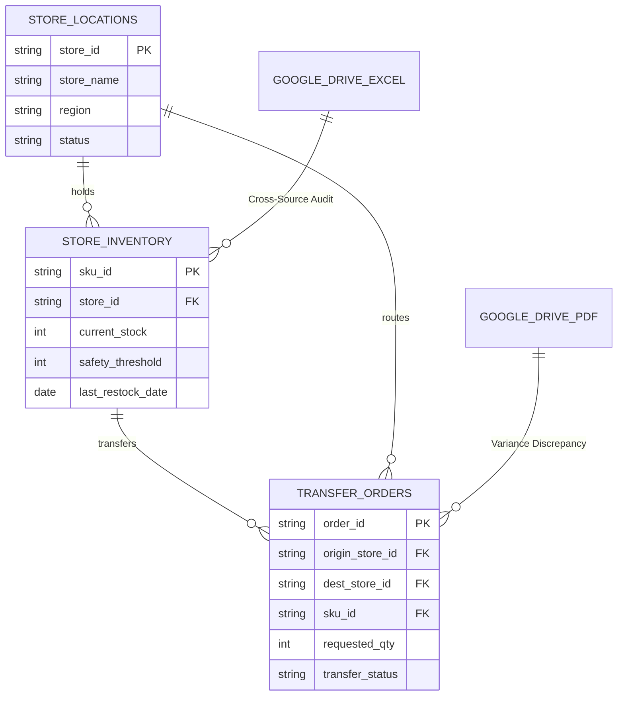

# Synthetic Data Generation, Public Dataset Grounding & Metadata Guide

This guide describes best practices for generating realistic synthetic enterprise datasets, enriching them with BigQuery public datasets, applying Knowledge Catalog (Dataplex) metadata, and linking data with external Google Drive files.

---

## 1. ER Diagram Design & Dataset Preview Pattern

Before generating and loading data, synthesize a visual **Mermaid Entity-Relationship (ER) diagram** and present it in chat alongside structured **Dataset Preview Tables**:

### 1.1 Mermaid ER Diagram Template


### 1.2 Table & Dataset Preview Guidelines
- **Table Count**: 2 to 4 domain-specific BigQuery tables (50–200 rows each) + 1 Firestore tasks collection + external Google Drive files.
- **Foreign Keys**: Strict referential integrity (e.g., all `store_id` in `store_inventory` exist in `store_locations`).
- **Dataset Summary Table (Total Record Counts)**: Always present a high-level summary table with total generated record counts:

  | Data Source | Type | Generated Count | Primary / Join Key | Business Purpose |
  | :--- | :--- | :--- | :--- | :--- |
  | `<entity_master>` | BigQuery Table | **45 rows** | `<entity>_id` (PK) | Master records, segmentation and status |
  | `<entity_state>` | BigQuery Table | **180 rows** | `<item>_id` (PK), `<entity>_id` (FK) | Current measured state per item, thresholds and history |
  | `<workflow_orders>` | BigQuery Table | **65 rows** | `order_id` (PK), `<item>_id` (FK) | Requested actions between entities and their progress |
  | `demo-xxx-tasks` | Firestore Collection | **12 tasks** | `task_id` (PK) | Async batch execution and approval queue |
  | `audit_report.pdf` | Google Drive File | **1 PDF (3 pages)** | `order_id` | Reconciliation report (5-15% deliberate variance) |
  | `external_ledger.xlsx` | Google Drive File | **80 rows (2 sheets)** | `<item>_id`, `<entity>_id` | External counterparty ledger (70%+ key overlap) |

  The table names, keys and purposes above are placeholders. Derive real ones from
  the selected domain, and write the Business Purpose column in the demo's language.

- **Sample Row Previews (with Record Counts)**: Render 3–5 representative sample rows per table in clean Markdown preview tables (or using `<carousel>` sliders), clearly displaying the **total count** in the title:
  ```markdown
  #### 📊 Table: `store_inventory` (Total: 180 rows | Preview Top 3)
  | sku_id | store_id | current_stock | safety_threshold | last_restock_date |
  | :--- | :--- | :--- | :--- | :--- |
  | `SKU-8821` | `LOC-001` | 42 | 50 | 2026-08-15 |
  | `SKU-8822` | `LOC-001` | 180 | 100 | 2026-08-18 |
  | `SKU-9904` | `LOC-002` | 12 | 30 | 2026-08-12 |
  ```
- **Cross-Source Binding Summary**: Explicitly display the entity relationship matrix showing how Drive files (PDF audit, Excel ledger, Scanned orders) join with BigQuery tables on primary/foreign keys.

### 1.3 Shared Core-System Data Model (MANDATORY)

Model the tables as a slice of the company's **core system of record** (ERP / CRM / WMS-like),
not as one team's private dataset. This is what makes the cross-departmental prompts in
`references/demo_prompts_guide.md` §1.2 answerable — without it they produce joins that
return nothing.

1. **A table two departments both use.** At least one transactional table is read and
   written by two or more departments for different purposes — orders created by Sales,
   fulfilled by Logistics, invoiced by Finance. Add an `owning_department` (or equivalent)
   dimension where it is natural.
2. **Department-owned rules as data.** At least one table (or clearly described catalog
   entry) holds rules, thresholds or checklists **owned by one department that another
   department's workflow must consult** — procurement approval rules that sales
   submissions are pre-checked against, credit limits owned by Finance that order intake
   must respect. The rules table still obeys the NO ISOLATED TABLES rule: include the key
   columns its rules apply to (`category_id`, `product_id`, `customer_rank`, `department`)
   named **exactly** as in the tables they reference.
3. **A cross-departmental audit seed.** At least one seeded discrepancy is invisible
   inside any single department's view and detectable only by joining across departmental
   usage contexts. This is the anomaly the cross-source prompt is designed to surface.

*Escape hatch*: for a genuinely single-department goal, scope all three to that department
and its closest supporting function rather than inventing departments.

### 1.4 Firestore Process State & Audit Trail

Each task document carries, alongside its status fields:

| Field | Meaning |
| :--- | :--- |
| `current_department` | The department currently holding the item |
| `next_department` | Where it goes after the current step; empty string when terminal |
| `history` | Array of audit entries — `timestamp`, `actor` (agent or person), `action`, `approver` (person name when a human approved, otherwise empty), `evidence_ids` (array of record IDs consulted) |

Seed 1-3 realistic history entries per document, so the operations console opens on
processes already in motion across departments rather than on an empty queue.

### 1.5 Operating Model Summary

Alongside the data, write a 2-4 sentence **operating model** description in **English**
(regardless of the demo's language — it briefs downstream autonomous workers, not the
audience): which departments are involved, what data and rules each owns, and where the
hand-off and approval boundaries fall.

---

## 2. Knowledge Catalog (Dataplex) Metadata Injection

To enable the agent to ground its analysis in metadata before composing queries (via `search_entries`, `lookup_entry`, `lookup_context`):

1. **Column Descriptions**: Must convey business meaning, units or currency (e.g. "amount in JPY", "duration in seconds"), allowed categorical values, and foreign-key relationships (e.g. "FK to products.product_id").
2. **Table Descriptions**: Must convey the grain (what one row represents), analytical purpose, and primary join keys.
3. **Application to BigQuery** — both are applied by `setup_and_deploy.sh` inside the
   parallel table-load loop; you do not run these by hand:
   ```bash
   # Column descriptions, from the schema JSON you authored
   bq update "${DATASET_ID}.${TABLE_NAME}" "data/${TABLE_NAME}_schema.json"
   # Table description, from the file build_data_catalog.py derived
   bq update --description "$(cat "data/${TABLE_NAME}_bqdescription.txt")" \
     "${DATASET_ID}.${TABLE_NAME}"
   ```
   The table description is not the raw `data/<table>_description.txt` you wrote: the
   catalog builder appends the measured facts line (`Rows: 100. Coverage: \`sale_date\`
   2026-08-13 -> 2026-08-22`) to it, so the entry Dataplex harvests states the same row
   count and coverage window the agent's prompt states. Write the grain sentence; the
   numbers are added for you, from the rows that actually get loaded.
4. **The same metadata is also the agent's prompt.** `scripts/build_data_catalog.py` runs
   at deploy time and folds `data/<table>_schema.json`, the optional one-line grain in
   `data/<table>_description.txt`, the row counts and the real min/max of every date column
   into `adk_agent/app/data_assets.md`. `agent.py` substitutes that into
   `[DATA_ASSET_CATALOG]`, and its routing rules ("answer from this prompt", "the catalog
   above IS your schema", "never re-derive what is written above") are only honest because
   it is there. A column you leave undescribed is a column the agent has to spend a round
   trip discovering in front of the audience.
   The date coverage in particular exists to kill a specific habit: without it the model
   opens a figure question with a `MIN(date), MAX(date)` probe to work out what period the
   synthetic data spans. Amplification is what makes that probe likely — hand-written hero
   rows cluster into one week, the amplified table spans a fiscal year — so the catalog is
   built *after* `amplify_data.py`, from the rows that actually get loaded.

---

## 3. Cross-Source Binding with External Google Drive Files

- **Structural Binding**: At least 70% of the primary keys in the external Excel file (`.xlsx`) and at least 3 specific record identifiers in the external PDF file MUST exist in the BigQuery tables.
- **Seeded Discrepancy (Audit Anomaly)**: 2-4 records in the external files have slight deviations (5-15% variance) from BigQuery records.
- **Google Drive Storage**: Files are saved directly to `GE Demo - <Company> (<Suffix>)` in the user's Google Drive.

---

## 4. BigQuery Public Dataset Grounding

Enrich synthetic datasets by cross-referencing real-world Google Cloud Public Datasets:

| Domain | Recommended Public Dataset | Sample Join Field |
|---|---|---|
| **Weather & Climate** | `bigquery-public-data.noaa_gsod.gsod2024` | Date + Station / Coordinates |
| **Retail & Search Demand** | `bigquery-public-data.google_trends.top_terms` | Date + Category / Keyword |
| **Demographics & Census** | `bigquery-public-data.census_bureau_acs` | Region / Zipcode |
| **Geographic & Mapping** | `bigquery-public-data.geo_us_boundaries` | Zipcode / State / City |

---

## 5. CSV Validation & Auto-Repair Script (`validate_csv.py`)

To prevent BigQuery `load` failures caused by unquoted commas, malformed dates, or mismatched numeric types, run `scripts/validate_csv.py` on generated CSV files before loading.
