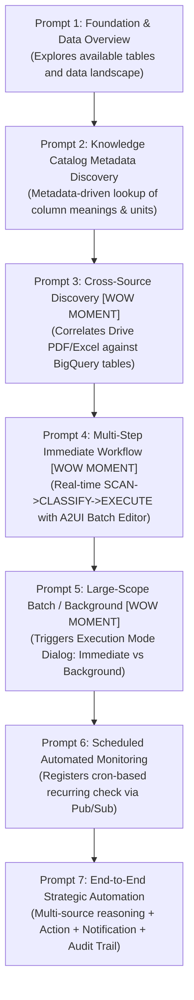

# 7 Structured Demo Prompts Specification & Demo Playbook Guide

The GE Demo Generator synthesizes exactly **7 structured demo prompts** that systematically showcase the AI agent's full operational spectrum in Gemini Enterprise: data exploration, Knowledge Catalog metadata grounding, cross-source anomaly detection, multi-step immediate operations, background batch execution, scheduled monitoring, and end-to-end strategic automation.

Read §1-§3 before writing any prompt. The slot table in §4 says what each prompt must
*do*; §1-§3 say what makes the seven of them a demo rather than seven unrelated queries.

---

## 1. The 7-Prompt Architecture & Progression

### 1.1 Narrative Arc (MANDATORY)

All 7 core prompts follow **ONE end-to-end business process instance** — one problematic
order, one flagged application, one disputed invoice — as it moves across the organization.
Each prompt builds on the state changes the previous one made, while still fulfilling its
slot's functional requirement. The arc is **woven through** the slots; it never replaces
them, and it does not reorder them.

The final core prompt closes the arc: the agent presents the full journey with
**quantified process outcomes** — before/after cycle time or lead time, items resolved,
hand-offs completed. A demo that ends on "here is a chart" has no ending.

### 1.2 Cross-Departmental Mandate (MANDATORY)

The agent is not one team's assistant. Frame it as the **company's process operator**,
working across departments on shared core-system data.

- **Type A (transactional operator)**: the task queue contains items whose resolution
  requires touching data owned by at least **two** departments. Each hand-off is a state
  transition the agent performs on behalf of the sending department and that is visible
  to the receiving one.
- **Type B (advisory/analytical)**: every insight quantifies impact across at least two
  departments, and each proposal is routed to the department that owns the decision.
- **Vary the organizational shape by industry** instead of reusing one template:
  manufacturing procurement → production → quality; banking sales-branch → underwriting
  → compliance; retail store → supply chain → finance. Two shapes worth reaching for:
  **approval pre-review** (the agent checks a submission against the *receiving*
  department's own rules before it is submitted) and **multi-department plan refinement**
  (a draft plan is validated against other departments' real data and thresholds, then
  routed to each owner for approval).
- **Escape hatch**: where the business problem genuinely involves one department, do not
  force departments into it. Model the hand-off with an adjacent supporting function
  (support → billing, support → product quality), or keep it single-team if even that
  feels unnatural. The user's goal always wins.

The data has to support this — see the shared core-system data model in
`references/data_generation.md` §1.3. Prompts that cross departments over a
single-department schema just produce joins that return nothing.

### 1.3 Foreground / Background Choreography (MANDATORY)

At least **two** core prompts must be *designed* so the agent's own confirmation flow
fires on stage: give those prompts tasks whose data contains threshold-crossing or
exception items, so the agent — following its own system instructions — presents an
approval card with options and evidence, waits for the one-click human decision, and
visibly changes the operational-database state.

This comes from **task design, not prompt wording**. The NO-EXPLICIT-HITL rule in §6
still holds: never write "wait for my approval" into a prompt. The decision beat comes
from what the data does under the agent's rules.

Reserve background execution for (a) long autonomous delegations, (b) large batch runs,
(c) scheduled jobs. Everything else runs in the foreground, showing reasoning and
intermediate results — a demo where the interesting work happens off-screen is a demo of
a progress bar.

---

## 2. Anchor Persona & Persona Rotation

**Persona rotation**: vary the tone and viewpoint across prompts (CFO, Ops Manager,
Regional Director, front-line Lead) so the playbook reads as an organization using the
agent, not one person querying it.

**Anchor Persona (when the user named a target persona in Phase 2)**: that persona is the
**protagonist** of the whole demo.

- The agent's business instruction defines it as *this persona's* process operator.
- Prompt 1 opens from this persona's daily situation.
- Any autonomous delegation deliverable is addressed to this persona's decision chain.
- Human-approval gates are decisions this persona (or their direct manager) owns.
- Rotate other personas **only as hand-off counterparts** — the roles the process flows
  to and from — never replacing the protagonist's thread.

**Precedence**: even when the scenario suggests a more natural protagonist (typically the
manager or supervisor of the function), the persona the user selected still wins. Keep it
as the protagonist and cast the natural one as a counterpart. Do not substitute a
similar-but-different job title.

---

## 3. Operator Watch Points

Every prompt in the delivered playbook carries a **watch point**: one short sentence
addressed to the person *running* the demo, not to the agent — what to look at on screen
while this prompt runs.

> *After the approval click, watch the item move to the next department on the operations
> console.*

Write it in the same language as the prompts. It is the difference between a demo where
the audience sees the payoff and one where it scrolls past.

---

## 4. Prompt Details, Categories & Persona Rotation

### Prompt 1: Foundation & Data Overview
- **Role / Persona**: Operational Team Lead / General User (or the Anchor Persona's own opening situation)
- **Objective**: Establish familiarity with the operational domain, examine overall metrics and active entities.
- **Constraints**: Generic phrasing only. No raw product names ("BigQuery", "Firestore") or raw table names.
- **Expected Agent Behavior**: Answers table/column questions from the in-prompt data-asset catalog with zero tool calls, and reaches for a single `execute_sql_readonly` only when the user asks for figures; presents a clean KPI summary A2UI Card.

---

### Prompt 2: Metadata & Knowledge Catalog Discovery
- **Role / Persona**: Data Governance Lead / Strategy Analyst
- **Objective**: Push the agent to consult Knowledge Catalog (Dataplex) metadata to understand column definitions, units, and business rules before formulating SQL.
- **Constraints**: Phrase generically: *"What data do we have available to analyze X and how are these metrics defined across our systems?"*
- **Expected Agent Behavior**: Calls `search_entries`, `lookup_entry`, or `lookup_context` to understand table relationships and metrics before writing SQL.

---

### Prompt 3: Cross-Source Discovery [WOW MOMENT]
- **Role / Persona**: Chief Financial Officer (CFO) / Internal Auditor
- **Objective**: Discover a hidden connection or discrepancy between the external Google Drive file (PDF audit report / Excel ledger) and the internal database.
- **Constraints**: Phrased as a high-level strategic question: *"What is the biggest untracked discrepancy across our recent supplier deliveries?"*
- **Expected Agent Behavior**: The agent queries BigQuery transaction tables, cross-references against the external audit file in Google Drive, identifies the 5-15% variance, and renders an Analytical Discrepancy Card with an executive summary image.

---

### Prompt 4: Multi-Step Dependent Immediate Workflow [WOW MOMENT]
- **Role / Persona**: Operations Manager / Plant Lead
- **Objective**: Execute a synchronous multi-step workflow for a small batch (< 10 items) demonstrating the interdependent chain: `SCAN -> CLASSIFY -> RESOLVE -> APPROVE -> EXECUTE -> AUDIT`.
- **Expected Agent Behavior**: Analyzes pending queue items, resolves SKU/item ambiguities, presents the **(J) Dynamic Multi-Entity Batch Editor** A2UI Card with interactive dropdown/chip selections, waits for user approval, and writes updates to Firestore/BigQuery.

---

### Prompt 5: Large-Scope Batch / Background Workflow [WOW MOMENT]
- **Role / Persona**: VP of Supply Chain / Enterprise Operations Director
- **Objective**: Trigger execution of a large-scale batch operation (covering 50+ records or quarterly history).
- **Expected Agent Behavior**: The agent recognizes the large scope and presents an **Execution Mode Selection Card**:
  - `[Run inline now]`
  - `[Run as a background task]`
  - `[Schedule it to run regularly]`

  (Chip labels are rendered in the conversation language; the English above is the reference wording.)
  When background mode is selected, dispatches the task to the `/execute_task` Cloud Run worker.

---

### Prompt 6: Scheduled Automated Monitoring Workflow
- **Role / Persona**: Chief Operating Officer (COO) / Compliance Director
- **Objective**: Set up recurring automated monitoring (e.g. daily at 09:00 AM) to scan for threshold breaches and auto-escalate critical tasks.
- **Expected Agent Behavior**: Explains the recurring monitoring logic, registers the scheduled cron trigger with Pub/Sub, and explains how the background worker will operate.

---

### Prompt 7: End-to-End Strategic Automation
- **Role / Persona**: Executive Committee / Chief Executive
- **Objective**: Comprehensive strategic execution combining multi-source analysis (BigQuery + Firestore + Drive files), conditional workflow resolution, executive notification drafting, and immutable audit logging.
- **Expected Agent Behavior**: Executes end-to-end reasoning, produces an Executive Summary Infographic (`gemini-3.1-flash-image`), updates operational records, and logs the complete audit trail.

---

### Cross-cutting slot requirement: the interactive dashboard

Exactly **one** of the 7 prompts asks the agent to build an interactive dashboard the user
**opens and explores in a browser**. The prompt text must carry an explicit
open-in-browser signal — *"an interactive dashboard I can open in my browser and click
into"*. Phrasing it as *"generate a dashboard that summarizes ..."* reads as an analysis
request and yields a static slide instead. Fold it into a natural overview or strategic
prompt so the total stays exactly 7.

---

## 5. Slot Overrides When Capabilities Are Enabled

### 5.1 Managed autonomous agent (`enableManagedAgent`, default on)

Two of the seven prompts must showcase autonomous delegation, following **both** patterns
— never merged into one prompt, since the demo needs two distinct autonomous moments:

- **Pattern A — web research + internal data synthesis**: the answer must be impossible
  without live web research (*"research the latest \<industry\> trends online and produce a
  competitive analysis against our own sales data"*).
- **Pattern B — complex long-horizon deliverable**: finished, downloadable business
  output whose production needs sequentially dependent phases (quantitative analysis →
  charts built from that analysis → professional assembly). Either **two complementary
  formats** from one analysis (board deck + 2-page field summary; proposal document +
  one-page web briefing) or a **working interactive tool** — a self-contained web app
  whose coefficients come from the real analysis, plus a short document explaining the
  model. State 1-2 quality conditions in plain business language (*"lead with the
  conclusion on the first page"*, *"every number sourced from our data or a citation"*);
  these make the agent's self-review-and-rebuild loop visible. Patterns A and B must use
  **different** deliverable formats.

**Slot assignment** (overrides the base distribution):

| Slot | Content |
| :--- | :--- |
| 5 | **Pattern B**, replacing the large-scope background workflow — the delegation itself runs in the background and demonstrates background execution plus completion announcements, so that story survives. |
| 7 | **Pattern A** woven into End-to-End Strategic Automation — web research plus internal synthesis *is* the end-to-end showcase. |
| 1 or 2 | The interactive dashboard prompt moves here, keeping its open-in-browser signal. It must not displace slot 5 or 7, and must not be dropped. |

**Cross-departmental deliverable (mandatory)**: the delegated mission synthesizes data
owned by at least two departments and addresses its deliverable to the department or
executive that owns the decision — framed as the journey summary of the narrative arc:
what happened in each department, where the process stalled, what was resolved. Because
Pattern A occupies the final core slot, its deliverable also carries the arc's finale
duty and must close with the quantified process outcomes from §1.1.

**Avoid overlap with lighter tools**: the agent also has fast inline SQL, quick analysis
and in-chat dashboards. A prompt answerable by querying the database and summarizing will
be answered inline, and the autonomous agent never appears. Both delegation prompts must
require at least one of: live web research, producing a downloadable file, or
building-and-running code.

### 5.2 Workspace (`enableWorkspaceAuth` or `enableWorkspaceMcp`)

At least one of the two autonomous prompts chains a Workspace action onto its deliverable,
so the demo shows both capabilities together: *"...build the executive deck, save it to my
Drive as Google Slides, and draft an email to the leadership team summarizing it"*, or
*"...post the summary with the document link to the \<team\> Chat space, then put a
30-minute review on my calendar"*. Keep the actions realistic for the persona, and prefer
**draft** email wording — the agent creates drafts, it does not send unless told to.

### 5.3 Computer use (`enableComputerUse`)

Pattern A additionally names **one** specific external page or portal and phrases that
part as an explicit browse request (*"browse \<site\> live for the latest ..."*), so the
agent drives a real browser in the chat before handing off to the autonomous agent. Keep
it to a single quickly-checkable page; the deep multi-source research still belongs to
the autonomous agent.

---

## 6. Slot Budget & Encore Prompts (arbitration)

The 7 core prompts keep the base distribution and any §5 overrides. When the enabled
capabilities cannot all fit into 7 slots without cramming several showcase missions into
one prompt, do **not** dilute or silently drop any of them — add up to **three encore
prompts** (positions 8-10) instead:

- Each encore showcases exactly **one** overflow capability, as an epilogue or
  alternate-angle scene of the *same* business narrative.
- An encore may build on the core story's state; the core story must **never** depend on
  an encore.
- Tag every encore by including the string `encore` in its tag list. Core prompts must
  not carry that tag.
- Total playbook length: exactly 7 core items plus 0 to 3 encore items.

---

## 7. Strict Negative Prompt Constraints
- **NO Raw Product Names**: Never mention "BigQuery", "Firestore", "Cloud Run", "Google Maps", or "GCP".
- **NO Raw Column / Table Names**: Never mention `production_batches`, `supplier_id`, or `discrepancy_score`.
- **NO Filenames**: No `market_report_2024`, no `.tsv`. Refer to external documents generically ("the supplier's audit report").
- **NO Explicit HITL Command**: Do NOT write *"Wait for my approval"* or *"Propose first"*. The agent autonomously implements confirmation workflows based on its system instructions — see §1.3 for how to earn the decision beat instead.
