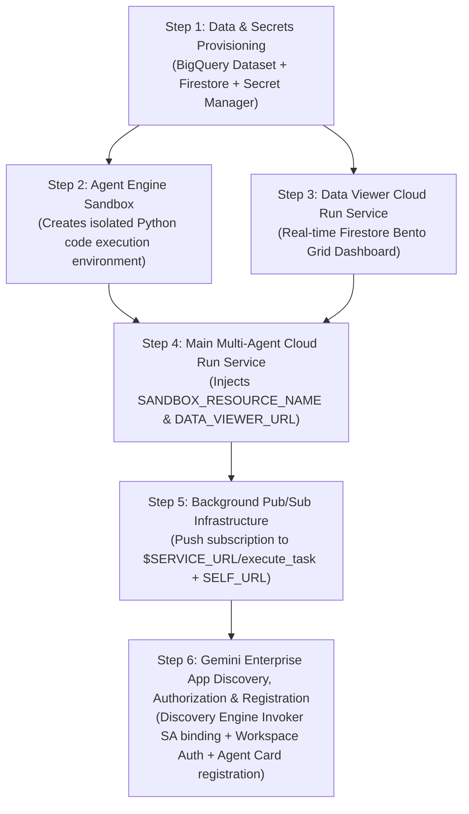

# Deployment Sequence, Dependency Graph & Infrastructure Reference

Deploying a synthesized GE Demo Environment requires adhering to a strict **6-step dependency graph**. The main Cloud Run service depends on resources created in earlier steps (Agent Engine Sandbox resource names, Data Viewer URL, BigQuery dataset IDs, Workspace OAuth Authorization IDs).

---

## 1. Strict Infrastructure Dependency Graph



---

## 2. Step-by-Step Provisioning Sequence

### Step 1: Data & Secrets Provisioning
```bash
PROJECT_ID=$(gcloud config get-value project)
PROJECT_NUMBER=$(gcloud projects describe "$PROJECT_ID" --format="value(projectNumber)")
REGION=${CLOUD_RUN_REGION:-"asia-northeast1"}

# BigQuery Dataset (Idempotent creation). US, not $REGION: the location is fixed
# at creation, the Discovery Engine BigQuery connector imports from a global
# datastore, and bigquery-public-data lives in US - a query cannot cross
# locations, and a single-region dataset has to be recreated, not moved.
bq show "${PROJECT_ID}:${DATASET_ID}" >/dev/null 2>&1 || bq --location=US mk -d "${PROJECT_ID}:${DATASET_ID}" 2>/dev/null || true

# Load CSVs
python3 scripts/validate_csv.py data/*.csv 2>/dev/null || true
for f in data/*.csv; do
  bq load --source_format=CSV --autodetect --skip_leading_rows=1 --replace "${DATASET_ID}.$(basename "$f" .csv)" "$f" || true
done
```

---

### Step 2: Agent Engine Sandbox Provisioning (CRITICAL DEPENDENCY)
The `background_agent` and `deep_analysis_agent` rely on an isolated, secure Python execution environment (`AgentEngineSandboxCodeExecutor`) for calculations and data verification.

> [!CAUTION]
> **Packaging Isolation Rule**: You MUST run `agent_engines.create()` from a clean temporary directory (`mktemp -d`). If executed from the project root containing `Dockerfile` or virtualenvs, the Agent Engine SDK attempts to bundle the entire CWD for container packaging, causing a complete freeze/hang.

<!-- -->

> **Exported-Variable Rule**: the `python3 - << EOF` heredoc runs in a child process. Variables must be
> **exported**, not merely assigned — `set -a; source .env; set +a` does this for the whole file. Without it
> every `os.environ.get()` below returns its default, `agent_engines.create()` runs against the wrong (or an
> empty) project, and the failure is invisible if the call is wrapped in `2>/dev/null || true`.

```bash
set -a; [ -f .env ] && source .env; set +a
export PROJECT_ID SERVICE_NAME

SANDBOX_TMPDIR=$(mktemp -d)
pushd "$SANDBOX_TMPDIR" > /dev/null

python3 - << '__SANDBOX_EOF__'
import os, sys, time, vertexai
from vertexai import types

client = vertexai.Client(project=os.environ.get('PROJECT_ID', ''), location='us-central1')

# 1. Create Agent Engine
print("Creating Agent Engine...")
agent_engine = client.agent_engines.create(
    config={'display_name': os.environ.get('SERVICE_NAME', 'demo') + '-sandbox'}
)
ae_name = agent_engine.api_resource.name

# 2. Create Code Execution Sandbox
print("Creating Code Execution Sandbox...")
sandbox_op = client.agent_engines.sandboxes.create(
    name=ae_name,
    config=types.CreateAgentEngineSandboxConfig(display_name='code-sandbox'),
    spec={'code_execution_environment': {}}
)
sandbox_name = sandbox_op.response.name

with open('/tmp/sandbox_output.txt', 'w') as f:
    f.write(f"{ae_name}|{sandbox_name}")
__SANDBOX_EOF__

popd > /dev/null
rm -rf "$SANDBOX_TMPDIR"

SANDBOX_DATA=$(cat /tmp/sandbox_output.txt)
rm -f /tmp/sandbox_output.txt
AGENT_ENGINE_NAME=$(echo "$SANDBOX_DATA" | cut -d'|' -f1)
SANDBOX_RESOURCE_NAME=$(echo "$SANDBOX_DATA" | cut -d'|' -f2)
```

---

### Step 3: Data Viewer Deployment (Cloud Run with --no-allow-unauthenticated + IAP)
```bash
gcloud run deploy "ge-viewer-${SERVICE_NAME}" \
  --source viewer_app \
  --region "$REGION" \
  --platform managed \
  --ingress all \
  --no-allow-unauthenticated \
  --set-env-vars="PROJECT_ID=${PROJECT_ID},FIRESTORE_COLLECTION=${FIRESTORE_COLLECTION},DEMO_ID=${DEMO_ID},DASHBOARD_TITLE=${DOMAIN_SLUG} Operations Console,SYSTEM_DESCRIPTION=Real-Time Operational Intelligence Dashboard"

# Enable IAP on Data Viewer
PROJECT_NUMBER=$(gcloud projects describe "$PROJECT_ID" --format="value(projectNumber)")
gcloud beta services identity create --service=iap.googleapis.com --project="$PROJECT_ID" >/dev/null 2>&1 || true
gcloud run services add-iam-policy-binding "ge-viewer-${SERVICE_NAME}" --region="$REGION" --member="serviceAccount:service-${PROJECT_NUMBER}@gcp-sa-iap.iam.gserviceaccount.com" --role="roles/run.invoker" --project="$PROJECT_ID"
gcloud beta run services update "ge-viewer-${SERVICE_NAME}" --region="$REGION" --iap --project="$PROJECT_ID"

# Grant deploying user access
DEPLOYER_EMAIL=$(gcloud config get-value account 2>/dev/null)
if [ -n "$DEPLOYER_EMAIL" ]; then
  gcloud beta iap web add-iam-policy-binding --project="$PROJECT_ID" --resource-type=cloud-run --region="$REGION" --service="ge-viewer-${SERVICE_NAME}" --member="user:$DEPLOYER_EMAIL" --role="roles/iap.httpsResourceAccessor"
fi

VIEWER_URL=$(gcloud run services describe "ge-viewer-${SERVICE_NAME}" --region="$REGION" --format="value(status.url)")
```

---

### Step 4: Main Multi-Agent Cloud Run Deployment
Now that `SANDBOX_RESOURCE_NAME` and `VIEWER_URL` are known, inject them into the main Cloud
Run service - along with everything else in the `.env` reference below.

> [!IMPORTANT]
> The templates read their feature flags from the environment at import time, so a variable
> that is not passed here is not "left at its default", it is **off**, and the matching tool
> answers `{"status": "unavailable"}` for the life of the demo. `setup_and_deploy.sh` builds
> the whole list in `$CR_ENV_VARS`; run it rather than assembling the flags by hand.

```bash
gcloud run deploy "$SERVICE_NAME" \
  --source . \
  --region "$REGION" \
  --platform managed \
  --memory 8Gi \
  --cpu 2 \
  --no-cpu-throttling \
  --cpu-boost \
  --min-instances "${MIN_INSTANCES:-0}" \
  --max-instances 1 \
  --timeout 1800 \
  --no-allow-unauthenticated \
  --ingress internal \
  --labels "created-by=adk" \
  --set-env-vars="$CR_ENV_VARS" \
  --quiet \
  $SECRETS_FLAG

SERVICE_URL=$(gcloud run services describe "$SERVICE_NAME" --region="$REGION" --format="value(status.url)")
```

Scale-to-zero is the default: an idle demo should not bill for a warm instance. The cost lands
entirely on the first message after an idle gap — a ~20s cold start, and occasionally an error
instead, because Cloud Run can refuse a request while the container is still starting. Export
`MIN_INSTANCES=1` before a live presentation to remove both. Offer it with its price: one
8 GiB / 2 vCPU instance is then billed continuously for as long as the demo exists, not just
during the presentation, so `0` stays the right default for a demo that is deployed now and
shown later.

The rest of the shape is not negotiable:

| Flag | Why |
|---|---|
| `--memory 8Gi` | sized for the sandbox and the data-generation paths; 2Gi OOMs under a large generation run |
| `--no-cpu-throttling`, `--cpu-boost` | without them the container loses CPU between streamed chunks and every turn crawls |
| `--max-instances 1` | the runtime relies on process-local state (per-session locks, the regenerate cache, the worker semaphore); one instance serves up to 80 concurrent requests, so this is not a throughput ceiling at demo scale |
| `--timeout 1800` | a deep inline analysis outlives a 600s request timeout |
| `--no-allow-unauthenticated`, `--ingress internal` | Gemini Enterprise reaches the service over Google-internal traffic; nothing needs public exposure |

---

### Step 5: Background Task Infrastructure & Post-Deploy Wire-up
Background runs travel over **Cloud Tasks**, not an in-process self-call. With
`--min-instances 0` a localhost fallback would die with the turn that started it and could
never wake a cold instance, so the queue is what makes long-running work survive at all.

```bash
SCHED_TOPIC="${SERVICE_NAME}-sched-topic"
gcloud pubsub topics create "$SCHED_TOPIC" --project="$PROJECT_ID" || true

gcloud pubsub subscriptions create "${SCHED_TOPIC}-push" \
  --topic="$SCHED_TOPIC" \
  --push-endpoint="$SERVICE_URL/execute_task" \
  --push-auth-service-account="${PROJECT_NUMBER}-compute@developer.gserviceaccount.com" \
  --ack-deadline=600 \
  --project="$PROJECT_ID" || true

# max-concurrent-dispatches matches the runtime's worker semaphore, so work waits in the
# queue rather than piling up inside one container.
gcloud tasks queues create "$WORKER_QUEUE" \
  --location="$WORKER_QUEUE_LOCATION" \
  --max-attempts=5 --max-concurrent-dispatches=2 --max-dispatches-per-second=5 \
  --min-backoff=15s --max-backoff=300s \
  --project="$PROJECT_ID" || true

# Applied after the deploy because none of these values exist before it.
gcloud run services update "$SERVICE_NAME" \
  --update-env-vars="SELF_URL=${SERVICE_URL},GEMINI_ENTERPRISE_APP_ID=${SELECTED_APP_ID},DATASTORE_LOCATION=${SELECTED_LOC}" \
  --region="$REGION" \
  --quiet || true
```

---

### Step 6: Gemini Enterprise Discovery, Authorization & Registration

1. **Discovery Engine Service Account IAM Policy**:
   ```bash
   gcloud run services add-iam-policy-binding "$SERVICE_NAME" \
     --region="$REGION" \
     --member="serviceAccount:service-${PROJECT_NUMBER}@gcp-sa-discoveryengine.iam.gserviceaccount.com" \
     --role="roles/run.servicesInvoker"
   ```

2. **Google Workspace OAuth Authorization Resource (when either `enableWorkspaceAuth` or `enableWorkspaceMcp` is on)**:
   *The authorization is what makes Gemini Enterprise attach the end user's OAuth token to each
   request, so the auth-only path needs it just as much as the MCP path.*
   ```bash
   AUTH_ID="${SERVICE_NAME}-auth"
   TOKEN=$(gcloud auth print-access-token)
   curl -X POST \
     -H "Authorization: Bearer $TOKEN" \
     -H "Content-Type: application/json" \
     -H "X-Goog-User-Project: $PROJECT_ID" \
     "https://discoveryengine.googleapis.com/v1alpha/projects/$PROJECT_ID/locations/global/authorizations?authorizationId=$AUTH_ID" \
     -d '{
       "name": "projects/'"$PROJECT_ID"'/locations/global/authorizations/'"$AUTH_ID"'",
       "serverSideOauth2": {
         "clientId": "'"$OAUTH_CLIENT_ID"'",
         "clientSecret": "'"$OAUTH_CLIENT_SECRET"'",
         "authorizationUri": "https://accounts.google.com/o/oauth2/v2/auth?access_type=offline&prompt=consent&response_type=code&scope=https%3A%2F%2Fwww.googleapis.com%2Fauth%2Fgmail.readonly%20https%3A%2F%2Fwww.googleapis.com%2Fauth%2Fgmail.compose%20https%3A%2F%2Fwww.googleapis.com%2Fauth%2Fgmail.modify%20https%3A%2F%2Fwww.googleapis.com%2Fauth%2Fdrive.readonly%20https%3A%2F%2Fwww.googleapis.com%2Fauth%2Fdrive.file%20https%3A%2F%2Fwww.googleapis.com%2Fauth%2Fcalendar.calendarlist.readonly%20https%3A%2F%2Fwww.googleapis.com%2Fauth%2Fcalendar.events.freebusy%20https%3A%2F%2Fwww.googleapis.com%2Fauth%2Fcalendar.events.readonly%20https%3A%2F%2Fwww.googleapis.com%2Fauth%2Fcalendar.events%20https%3A%2F%2Fwww.googleapis.com%2Fauth%2Fchat.spaces.readonly%20https%3A%2F%2Fwww.googleapis.com%2Fauth%2Fchat.memberships.readonly%20https%3A%2F%2Fwww.googleapis.com%2Fauth%2Fchat.messages.readonly%20https%3A%2F%2Fwww.googleapis.com%2Fauth%2Fchat.messages.create%20https%3A%2F%2Fwww.googleapis.com%2Fauth%2Fchat.users.readstate.readonly%20https%3A%2F%2Fwww.googleapis.com%2Fauth%2Fdirectory.readonly%20https%3A%2F%2Fwww.googleapis.com%2Fauth%2Fuserinfo.profile%20https%3A%2F%2Fwww.googleapis.com%2Fauth%2Fcontacts.readonly&client_id='"$OAUTH_CLIENT_ID"'&redirect_uri=https%3A%2F%2Fvertexaisearch.cloud.google.com%2Foauth-redirect",
         "tokenUri": "https://oauth2.googleapis.com/token"
       }
     }'
   ```
   `setup_and_deploy.sh` runs this for you (Job 3.3, right before registration), reading the
   client id/secret from the `ge-demo-oauth-client-id` / `ge-demo-oauth-client-secret` secrets.
   Three details are load-bearing:
   - **Authorizations always live in `global`**, whatever region the app is in.
   - A `409 ALREADY_EXISTS` must be followed by
     `PATCH .../authorizations/$AUTH_ID?updateMask=serverSideOauth2` — without the mask the
     write silently no-ops and the stale client secret stays.
   - **Read it back with a GET before using it.** `--authorization-id` pointing at a resource
     that does not exist makes registration fail with `404 NOT_FOUND`, and the demo then has no
     agent and no chat link at all. The script only passes the flag when the GET returns 200,
     and retries registration without it if the authorized attempt yields no agent — a demo with
     degraded Workspace tools beats a demo with no agent.

   `scripts/verify_and_heal.py` Layer 7 repairs all of this after the fact: it creates a missing
   authorization, re-runs `scripts/register_agent.py`, attaches `authorizationConfig` to an agent
   that lost it, and re-derives the direct chat link into `.ge_direct_url`.

3. **Register Agent to Gemini Enterprise**:
   ```bash
   agents-cli publish gemini-enterprise \
     --agent-card-url "${SERVICE_URL}/a2a/app/.well-known/agent-card.json" \
     --display-name "${COMPANY_NAME} Demo Agent" \
     --description "${DEMO_DESCRIPTION}" \
     --authorization-id="projects/$PROJECT_ID/locations/global/authorizations/$AUTH_ID"
   ```

4. **Direct Gemini Enterprise App URL**:
   `https://console.cloud.google.com/gemini-enterprise/locations/${SELECTED_LOC}/engines/${SELECTED_APP_ID}/overview/dashboard?project=${PROJECT_ID}`

---

## 3. `.env` Reference

`.env` sits at the scaffolded project root and is the only configuration input shared by
`setup_and_deploy.sh`, `scripts/cleanup.sh` and every helper script. Write it during Phase 4,
before the first deploy.

> [!IMPORTANT]
> **Exported-Variable Rule.** Both scripts wrap their `source .env` in `set -a` / `set +a`.
> The inline `python3 - << EOF` blocks run in child processes, so anything not exported is
> invisible to them and every `os.environ.get()` silently falls back to its default. If you
> write your own snippet that sources `.env`, do the same.

<!-- -->

> [!NOTE]
> **Values with spaces.** Both scripts load `.env` through a `load_env` helper that quotes
> bare values before sourcing them, because `COMPANY_NAME=Northwind Cold Chain` is not an
> assignment to plain `source` — it runs `Chain` as a command and, under `set -e`, kills the
> run on the first line of the file. Prefer writing the quotes yourself
> (`COMPANY_NAME="Northwind Cold Chain"`) — it is what any other `.env` reader expects — but
> the scripts no longer depend on it. Lines that already contain a `"` are passed through
> untouched, and a trailing `# comment` on an unquoted value is dropped, exactly as `source`
> would drop it.

### Written by you (Phase 4)

| Key | Default if unset | Used by | Notes |
|---|---|---|---|
| `PROJECT_ID` | `gcloud config get-value project` | both | Target Google Cloud project. |
| `REGION` | `CLOUD_RUN_REGION`, then `asia-northeast1` | both | Cloud Run / BigQuery region. |
| `SERVICE_NAME` | `ge-demo-agent` | both | Main Cloud Run service. Also derives `ge-viewer-${SERVICE_NAME}`, `${SERVICE_NAME}-sched-topic`, `${SERVICE_NAME}-auth`, and the `ds-${SERVICE_NAME}*` DataStore prefix. **Changing it after deploy orphans every one of those.** |
| `BIGQUERY_DATASET` | `demo_dataset` | both | Cleanup drops this dataset recursively. |
| `FIRESTORE_COLLECTION` | `demo_tasks` | both | Seeded by `scripts/setup_fs.py`, cleared by cleanup. |
| `COMPANY_NAME` | `Demo Enterprise` | setup | Display strings only. |
| `DOMAIN_SLUG` | `demo` | setup | Display strings and `DEMO_ID`. |
| `SUFFIX` | current epoch tail | setup | Uniqueness suffix. Pin it in `.env` so re-runs stay idempotent. |
| `CURRENCY_SYMBOL` | `$` | setup | Substituted into the A2UI examples' `[CURRENCY]` placeholder before the image build. Set it from the locale detected in Phase 1. |
| `DEMO_DISPLAY_NAME` | `${COMPANY_NAME} ${AGENT_ROLE}` | setup | Gemini Enterprise agent display name (concise 2–4 word domain role, e.g. `TWG Tea Retail Operations Director`). Directly maps to `agentShortName` in the Web UI (GAS) version. Registered in Gemini Enterprise as `${DEMO_DISPLAY_NAME} (${SERVICE_NAME})`. |
| `DEMO_DESCRIPTION` | Domain-specific mission summary | setup | Gemini Enterprise agent description (1–2 sentences summarizing business domain, core datasets, and operational goals). Directly maps to `oneSentenceSummary` in the Web UI (GAS) version. |
| `GCP_ACCOUNT` | `gcloud config get-value account` | setup | Deployer identity for IAM grants and IAP access. |
| `DEMO_ID` | `${DOMAIN_SLUG}-${SUFFIX}` | setup | Scoping key for every Firestore collection the runtime writes (`${DEMO_ID}_background_tasks`, `${DEMO_ID}_managed_agent_state`, ...). The Data Viewer resolves the same names, so agent and viewer must agree or the dashboard shows an empty console next to a working agent. |
| `DASH_BUCKET` | `${PROJECT_ID}-${DOMAIN_SLUG}-${SUFFIX}-dash` | setup | Deliverables bucket, created unconditionally and passed as `DASHBOARDS_BUCKET`. `publish_dashboard` and the autonomous agent's skill mount both read it. |
| `WORKER_QUEUE` | `${SERVICE_NAME}-worker` | setup | Cloud Tasks queue for background runs. |
| `WORKER_QUEUE_LOCATION` | `us-central1` | setup | Pinned independently of `REGION` so a demo in a region without Cloud Tasks still gets durable background work. |
| `MIN_INSTANCES` | `0` | setup | Set to `1` before a live presentation to avoid the ~20s cold start (and the occasional cold-start error) on the first message. Bills one 8 GiB / 2 vCPU instance continuously until the demo is deleted. |
| `GCS_BUCKET_NAME` | `${PROJECT_ID}-${DOMAIN_SLUG}-${SUFFIX}-docs` | both | Created and populated with `external_files/` in **both** modes (Job 3.2b, outside the `RAG_MODE` branch) — in `mcp` mode nothing indexes those documents, but the bucket is still the only copy that outlives the machine running the skill, and the completion banner links to it. In `rag` mode it is additionally the unstructured half of the index. Deleted recursively by cleanup in both modes. |
| `DATA_SCALE` | unset | setup | Row count to amplify the fact tables to before `bq load`, via `scripts/amplify_data.py` in Job 1.4. Unset loads the CSVs exactly as generated. `data/data_scale_spec.json`, when present, gives per-table targets and overrides this number. The step is deterministic and idempotent — the hero rows are stashed as `data/<table>.hero.csv` on the first run and every later run amplifies from the stash, never from already-amplified output — so it is safe whether or not the data phase already ran it. |

#### Feature flags

Written as `true`/`false` here, but **normalised to `1`/`0` by `bool01()` before being passed
to Cloud Run**. This matters: `tools.py` and `fast_api_app.py` compare these variables against
the literal string `"1"`, while `agent.py` also accepts `"true"`. Handing the `.env` spelling
straight through would therefore load a toolset with its auth injection switched off - a
half-enabled feature, which is harder to diagnose than a disabled one. Accepted truthy
spellings on input: `true`, `1`, `yes`, `on` (case-insensitive); anything else is off.

| Key | Default | Notes |
|---|---|---|
| `ENABLE_MANAGED_AGENT` | `true` | Autonomous delegation. Provisioning starts in Stage 0.5 and is awaited in Stage 3.4 (~8-10 min, overlapped with the rest of the deploy). Requires `scripts/managed_agent_instruction.txt`; if it is missing, or provisioning fails to start, the script disables the feature and deploys without it rather than shipping an agent whose delegation tools answer `{"status": "unavailable"}`. |
| `ENABLE_WORKSPACE_AUTH` | `false` | The commonly useful Workspace path (no allowlist needed), but **not** default-on: some organizations refuse to authorize an OAuth client they have not vetted, and there the sign-in fails for every demo user. Turn it on when the target org is known to permit it. |
| `ENABLE_WORKSPACE_MCP` | `false` | Advanced. The Google Workspace MCP servers are Developer Preview and the project must be allowlisted first, so enabling it blindly produces an agent whose Workspace tools 403 on every call. Also triggers the OAuth / Authorization flow in Step 6. |
| `ENABLE_COMPUTER_USE` | `false` | Also needs the Playwright block uncommented in **both** `requirements.txt` and the `Dockerfile`. The script pre-flights this and refuses to deploy a half-configured build. |
| `DATA_EXPLORATION_MODE` | `mcp` | Not a boolean, and not passed through `bool01()`. `mcp` provisions no search index and leaves the agent on the Knowledge Catalog + SQL path; `rag` runs `scripts/setup_datastores.py`, wires `GEMINI_ENTERPRISE_APP_ID` / `DATASTORE_LOCATION` / `DATASTORE_SCOPE_IDS`, and makes `search_datastore` the read path. The value is also passed straight through to Cloud Run, because `agent.py` reads it to pick its routing block and to decide whether to register `search_datastore` at all. One switch covers both connectors: the BigQuery side runs when `BIGQUERY_DATASET` is set and the GCS side when `GCS_BUCKET_NAME` is. The former `ENABLE_DATASTORE_BQ` / `ENABLE_DATASTORE_GCS` keys are gone - they only ever restated what the resource names already said. |
| `ENABLE_DATASTORE_FS` | `false` | When `DATA_EXPLORATION_MODE=rag`, provisions a semi-structured Discovery Engine DataStore (`ds-${SERVICE_NAME}-fs`) from `FIRESTORE_COLLECTION` via `FirestoreSource` (using GCS export staging). Enables semantic search over historical incident tickets, resolved remediation logs, and SOP archives. Note: live task mutations, approvals, and Operations Viewer synchronization continue to use Firestore MCP for sub-100ms real-time state tracking. |
| `ENABLE_DATASTORE_CONNECTORS` | unset | Deprecated alias, honoured only when `DATA_EXPLORATION_MODE` is unset: truthy maps to `rag`, anything else to `mcp`. Note the default flipped with the rename - this key used to default to `true`, so an old `.env` that never mentioned it got the index and a new one does not. |

When either Workspace flag is on, the deploy binds `OAUTH_CLIENT_ID` / `OAUTH_CLIENT_SECRET`
from Secret Manager (`ge-demo-oauth-client-id`, `ge-demo-oauth-client-secret`) rather than
passing them as plaintext env vars. If those secrets do not exist the script warns and
deploys without them.

### Written back by `setup_and_deploy.sh`

Appended after Stage 1 provisioning. Do not hand-edit; `scripts/cleanup.sh` reads them to
tear the sandbox down, and a missing `AGENT_ENGINE_NAME` leaves an Agent Engine billing.

| Key | Meaning |
|---|---|
| `AGENT_ENGINE_NAME` | `projects/.../reasoningEngines/...` of the provisioned Agent Engine. |
| `SANDBOX_RESOURCE_NAME` | Sandbox resource injected into Cloud Run as the code executor target. |
| `DATA_VIEWER_URL` | Deployed Data Viewer URL, injected into the main service. |
| `DEMO_ID`, `SUFFIX`, `WORKER_QUEUE`, `WORKER_QUEUE_LOCATION`, `DASH_BUCKET`, `DOMAIN_SLUG`, `GCS_BUCKET_NAME`, `MANAGED_AGENT_ID` | The names that are *derived* rather than supplied. `SUFFIX` defaults to a timestamp tail, so a teardown run later cannot recompute any of them - it would guess a different suffix and walk straight past the scheduler jobs, topics, task collections and the dashboards bucket. Written only when the key is not already present, so a pinned value in `.env` wins. |

### Runtime-only (set as Cloud Run env vars, not in `.env`)

Putting these in `.env` has no effect on the deployed container.

Injected by `setup_and_deploy.sh` at deploy time, derived from the keys above:
`GOOGLE_CLOUD_PROJECT`, `GOOGLE_CLOUD_LOCATION=global` (the Interactions API behind the
managed agent is global-only; a regional value 404s every delegated task),
`GEMINI_AUTHORIZATION_ID`, `DASHBOARDS_BUCKET`, `RUNTIME_SA_EMAIL` (the principal
`publish_dashboard` impersonates to sign URLs), `WORKER_QUEUE`, `WORKER_QUEUE_LOCATION`,
`ADK_ENABLE_MCP_GRACEFUL_ERROR_HANDLING=1`, `ADK_DISABLE_JSON_SCHEMA_FOR_FUNC_DECL=1`, the
five `ENABLE_*` flags in their `1`/`0` form, and `MANAGED_AGENT_ID` /
`MANAGED_AGENT_SKILLS_SOURCE` when the autonomous agent is on.

Applied afterwards in Stage 3.4, because they do not exist until the deploy has run:
`SELF_URL` (assigned by Cloud Run; without it the runtime cannot enqueue to Cloud Tasks and
background runs fall back to a localhost self-call that dies with the turn that started it),
`GEMINI_ENTERPRISE_APP_ID` and `DATASTORE_LOCATION` (discovered in Stage 3; they give
`search_datastore` its engine-wide search path), and `MANAGED_AGENT_ENV_ID` from the sandbox
warm-up. `DEFAULT_DATASTORE_ID` is deliberately left unset - searching the engine covers every
attached datastore, so the wiring survives connectors being added or removed later.

Tuning knobs with usable defaults, override only if needed: `AGENT_MODEL`,
`AGENT_MODEL_LITE`, `DASHBOARD_TITLE`, `SYSTEM_DESCRIPTION`, `COMPUTER_USE_*`, `INLINE_*`,
the remaining `WORKER_*` and `MANAGED_AGENT_*`.
