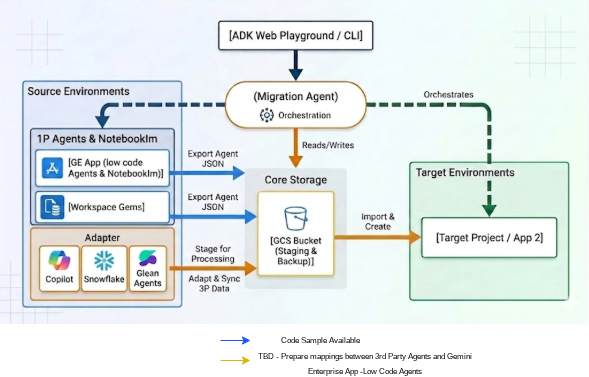

# 🚀 Gemini Enterprise Migration Agent

> Seamlessly migrate your low-code agents, Notebooklms and Custom Instructions (Gems) to Gemini Enterprise.

Built with the **Agent Development Kit (ADK)**, this specialized AI agent facilitates the migration of low code agents and notebooklm from one Gemini Enterprise App to another and from Google Workspace Gems to Gemini Enterprise app. It can be further extended to support migration of 3rd Party agents to Gemini Enterprise App via adapters(mappings between 3rd party agent and import format required by Gemini Enterprise App)

## Architecture

The following diagram illustrates the high-level architecture of the migration agent and its interactions with various services.



## 🛠️ Capabilities & Skills

### 🤖 Agent Migration
- **Discovery**: List and explore source low-code agents available for migration.
- **Direct Migration**: Seamlessly transfer agent definitions to target Gemini Enterprise engines.
- **GCS Staging**: Export definitions to Google Cloud Storage for isolated or staged migrations.

### 💎 Gem Migration
- **Gem Processing**: Extract Custom Instructions (Gems) from HTML dumps(takeout), mapping descriptions and grounding DataStore knowledge filters.

### 📚 Notebooklm migration
- **Instant Notebooks**: Create NotebookLM-style knowledge bases in the target project preserving source titles exactly.
- **Batch Ingestion**: Rapidly populate notebooks with sources from web URLs.

### 🛡️ Validation & Safety
- **Enterprise Separation of Concerns (`SKILL.md`)**: Fully decouple operational administrative configuration (Source/Target Project IDs, Engine IDs, DataStore Grounding Mappings) from agent execution logic.
- **Smart Introspection**: Automatically present clear capabilities lists and verify active DataStore mappings on greeting.
- **Safe Guardrails**: Enforce explicit Project and Engine IDs to prevent accidental data overwrites.

## 🚀 Getting Started

### 📋 Prerequisites
- **Python**: Version 3.10 or higher.
- **Google Cloud**: A project with the **Discovery Engine API** enabled.
- **Authentication**: Application Default Credentials (ADC) configured.

### 🛠️ Setup & Run

1. **Configure Environment**: Ensure your Google Cloud project is set up and Application Default Credentials (ADC) are configured. Make sure your `.env` file matches the format in `ge_migration_agent/.env.sample`. Additionally, configure your canonical migration parameters and DataStore mappings in `skills/SKILL.md`.

---

#### Option A: Run the Deterministic CLI via uv (Highly Recommended)
For 100% reliable, fast, and deterministic execution of migrations without any AI dependencies, use the newly added root entrypoint script:

```bash
# Show help and all available commands
uv run ./migrate.py --help

# List recently viewed NotebookLM notebooks in the source project
uv run ./migrate.py list-notebooks

# Migrate an entire notebook and all of its sources atomically preserving the exact title
uv run ./migrate.py migrate-notebook "my-notebook-title" --source-project 12345 --target-project 67890

# List all employee-made low-code agents in the source engine
uv run ./migrate.py list-agents --engine-id <SOURCE_ENGINE_ID>

# Migrate a low-code agent directly from source to target
uv run ./migrate.py migrate-agent "Quarterly Business Review Generator" --force

# Batch Import Gems from an offline Takeout HTML dump
uv run ./migrate.py import-gems sample_data/gemini_gems_data.html --target-project <TARGET_PROJECT_NUMBER> --target-engine <TARGET_ENGINE_ID>

# Export an agent definition to a Google Cloud Storage staging backup
uv run ./migrate.py export-agent-gcs "Quarterly Business Review Generator" --engine-id <SOURCE_ENGINE_ID> --bucket <GCS_BUCKET_NAME>

# Import an agent definition from GCS into your target environment
uv run ./migrate.py import-agent-gcs Quarterly Business Review_export.json --target-engine <TARGET_ENGINE_ID>
```

---

#### Option B: Run the Conversational AI Agent
For natural language guidance and conversational interactions, launch the ADK playground:

```bash
./ge_migration_agent/run_web_playground.sh
```

Open `http://localhost:8001` in your browser to chat with the agent. The agent is now powered by the exact same underlying deterministic core.

## 💡 Example Usage

Here is a sample session showing autonomous administrative greeting and low-code agent migration:

### Sample Session Traces

**User**:
> Hi / Help

**Agent**:
> I can assist you with migrating your Gemini Enterprise app low-code agents, NotebookLM notebooks, and Workspace Gems.
> 
> **Active Migration Configuration**:
> - Source Environment: Project <SOURCE_PROJECT_NUMBER> (`<SOURCE_PROJECT_ID>`), Engine `<SOURCE_ENGINE_ID>`
> - Target Environment: Project <TARGET_PROJECT_NUMBER> (`<TARGET_PROJECT_ID>`), Engine `<TARGET_ENGINE_ID>`
> - Verified DataStore Mappings: `ge-drive-all_<1776953145638_google_drive` -> `ge-drive-all_1780835769760_google_drive`

**User**:
> List all the human made agents in source

**Agent**:
> I found the following employee-made agents in your source environment: ... (Lists agents)

**User**:
> Migrate Quarterly Business Review Generator from source to target

**Agent**:
> The agent 'Quarterly Business Review Generator' has been successfully migrated to your target environment.

**User**:
> Please import the Gems from the file ./sample_data/gemini_gems_data.html in Target

**Agent**:
> The Gems from the file ./sample_data/gemini_gems_data.html have been successfully imported to your target environment.

## Project Structure
- `ge_migration_agent/`: Contains the core agent definition, tools, and execution scripts.
  - `agent.py`: Core ADK agent definition and tool implementations.
  - `run_web_playground.sh`: Script to start the persistent ADK web server.
- `skills/`: Holds enterprise migration configuration skills.
  - `SKILL.md`: Single source of truth for cross-environment migration parameters and administrative setup guide.
- `sample_data/`: Contains sample data files such as `gemini_gems_data.html` for batch Gems import.
