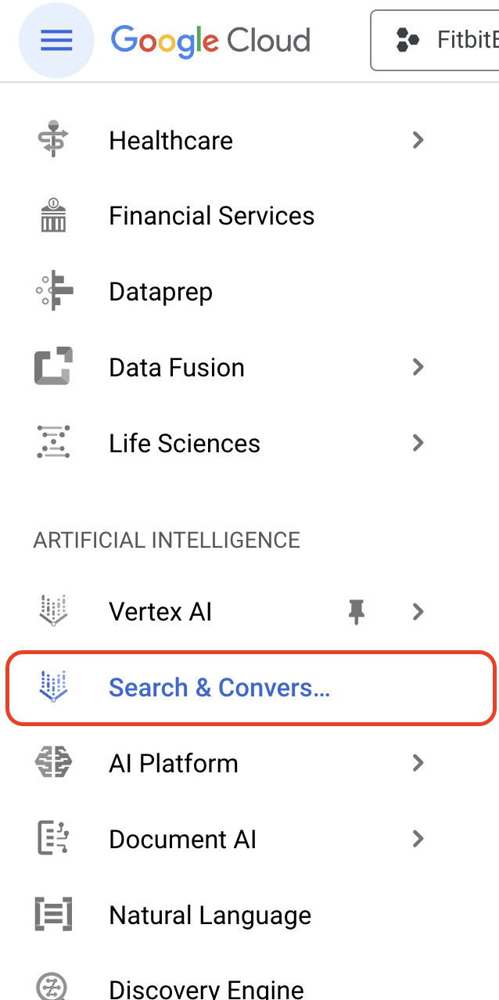
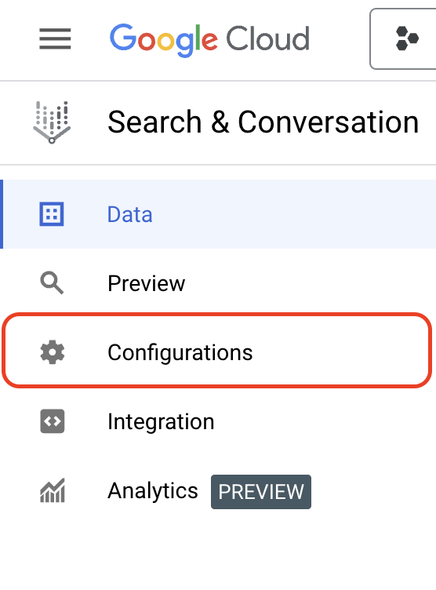
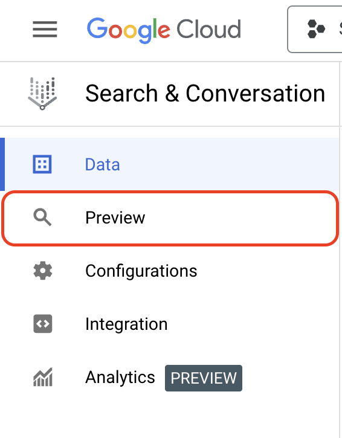

# Building a Vertex AI Search Engine


## Overview


In this lab, you use Vertex AI Search to create a Generative AI-powered search engine using unstructured data; Fitbit product manuals. 

This lab uses a small corpus of unstructured documents (PDFs) to minimize indexing time and to avoid needing Domain Verification (which is the case with Website-based Data Stores). As a result, the answers provided from the Search Engine are limited in scope to the small number of documents in the Data Store.


## Objectives


In this lab, you learn how to perform the following tasks:

* Use Vertex AI Search to create a Search App and Data Store based on unstructured documents (PDFs)
* Test the generated Search Engine 
* Explore generative features (Summarisation and Follow-up Questions)


## Task 1. Create a Search App and Data Store


Follow the steps to configure the Search App and Data Store. The Data Store uses PDF files stored in a public Cloud Storage bucket.

#### **Create the Search App**

1. Within the console, use the main menu or Search bar to navigate to **Search & Conversation**.

    

2. On the Welcome to Vertex AI Search and Conversation page, click **Continue and Activate the API**. After the API is activated, it will start the workflow for creating a new App.
3. For Type, select the **Search** option.
4. Under **Which features do you want to use in your app?**, ensure that **Enterprise edition features** and **Advanced LLM features** are selected.
5. For **App name**, input *Fitbit search*.
6. For **Location of your App**, keep as *global (Global)*.
7. Click **Continue**.

#### **Populate a Data Store**

1. For Data Stores, click **Create New Data Store**. This starts a second workflow for creating the Data Store.
2. For Source, select the **Cloud Storage** option.
3. Ensure Folder is selected and input the path to this (public) storage bucket. `gs://` is not required.

    ```
    github-repo/documents/fitbit-manuals/
    ```

4. Ensure **Unstructured documents** is selected and click **Continue**.
5. For Configuration, name the Data Store *Fitbit manuals* and click **Create**. The Data Store is created.
6. Back in the Create App workflow, select the newly created Data Store ("Fitbit manuals") and click **Create**.


## Task 2. Configure the Search Engine


While the Data Store is being generated (which takes a few minutes), you can configure the Search Engine.

#### **Explore Widget configuration options**

1. From the Search & Conversation menu, click **Configurations**. 

    

2. In the Widget tab, explore the options for Search type:

    * Search - gives a basic list of results
    * Search with an answer - includes an LLM-based summary based on the results
    * Search with follow-ups - allows the user to ask follow-up questions

3. Select **Search with follow-ups**.
4. Click **Save and Publish**.

**Note:** Autocomplete features are available, but the autocomplete models take about a day or so to start generating suggestions.


## Task 3. Verify the Data Store


1. In the Search & Conversation menu, select **Data**.
2. Note the **Number of documents** and the **Last import** information. 

    * If the Data Store has finished indexing, the number of documents should be non-zero and there should be a green check mark in the Last import field.
    * If the Data Store hasn't finished indexing, select the **Activity** tab.
    * Note the **Status** of the import activity.
    * While you wait for the import to complete, you can use the time to get a drink, do some breathing exercises, or read a book. 

3. Once the import is complete (indicated by the Number of documents being non-zero), proceed to the next task.   


## Task 4. Test the Search Engine


1. In the Search & Conversation menu, click **Preview**. This allows previewing and testing the search engine in a simple interface.

    

2. Ask questions about Fitbit products in the **Ask a new question** search box. Some suggested questions:

    * *What comes with the Charge 5?*
    * *How should I wear my Versa 3?*

    **Note:** Because of the configurations made in Task 2, there is a Generative-AI powered summary answer, and the ability to **Ask a follow up**. 

3. Suggested follow up questions:

    * *How should I wear it when I am exercising?*
    * *What colors does it come in?*


## Task 5. Free Play!


Note that the Search Engine will only return responses from the Data Store. Even though the summary is powered by LLMs, it should not answer questions using the LLM's general knowledge. 

Responses may change as the Search Experience and LLM continues to develop. Examples below:

| <strong>Prompt</strong> | <strong>Response</strong> |
| --- | --- |
| <em>Which models are waterproof?</em> | The Fitbit Versa 2 is waterproof up to 50 meters. |
| <em>Who founded Fitbit</em> | There is not enough information to answer the query. |
| <em>How much is the Fitbit Luxe?</em> | The Fitbit Luxe box includes... |

#### **Take it further**

Identify and refine additional use cases - either for Fitbit or for your own organization or customers. What corpus of data would be needed? For instance:

* Product Manuals and Data Sheets
* Public Website
* Private Intranet
* Product Databases
* Support Systems, CRMs, etc.


## Congratulations


You have created a GenAI-powered search engine using unstructured data.

### Next steps

* For more information, read through the  [documentation on Vertex AI Search](https://cloud.google.com/generative-ai-app-builder/docs/try-enterprise-search).
* Follow the official labs on Cloud Skills Boost / Partner Skills Boost.

 ![[/fragments/TrainingCertificationOverview]]

**Manual Last Updated Oct 26, 2023**

**Lab Last Tested Oct 26, 2023 **

mode


