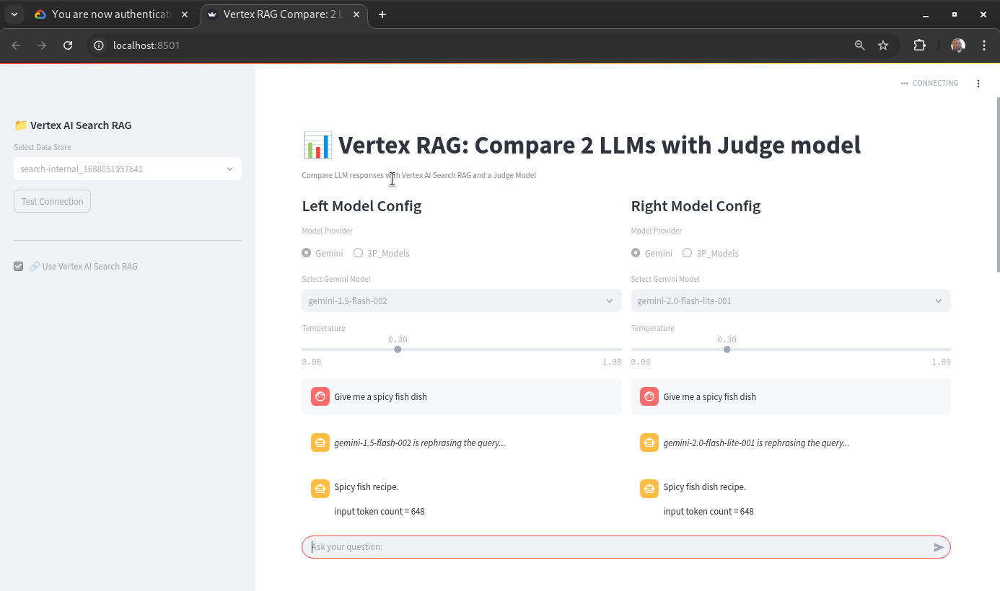

# This is a Vertex AI Search RAG Dual LLM comparison and evaluation demo built using streamlit

This demo illustrates how to compare responses from two LLMs through a corpus of documents using Vertex AI Search

Additional features include using a Judge model to evaluate the two responses and deliver a verdict on which model's response is better aligned with the query and the given context.

This is how your final demo will look like once it is running


# Instructions to run the demo:

1. You need to have the latest Google Cloud SDK installed on your machine

Follow these instructions at: https://cloud.google.com/sdk/docs/install to install the Google Cloud SDK and gcloud CLI.

2. Once the gcloud CLI is installed, test the gcloud cli using:

```bash
gcloud init
```

3. Authenticate using your Google Cloud auth as follows:

```bash
gcloud auth login
```

4. In order to run apps, you need to authenticate at the app level:

```bash
gcloud auth application-default login
```

5. Set the default project as follows:

```bash
export GOOGLE_VERTEXAI="True"
export PROJECT_ID="[project_id]"
export LOCATION="us-central1"
```

6. Now install the requirements file:

```bash
pip install -r requirements.txt
```

7. change the directory to the source code:

```bash
cd src
```

7. Now you are ready to run the demo from the source code folder:

```bash
streamlit run vertex_rag_demo_dual_llms_with_judge.py
```

If you want to run the demo with a judge model evaluating the two model responses, use this command:

```bash
streamlit run vertex_rag_demo_dual_llms_with_judge.py -- --judge
```

8. To end the demo, press Control-C (^C) couple of times to kill it.

# How to customize the demo to your needs

This demo runs using prompts created for a fictional Asian Chef Advisor use case. In order to change the prompts to fit your use case, you need to navigate to the prompts folder:

9. Navigate to the prompts folder which is a sub folder under src folder:

```bash
cd prompts
```

10. You will see a list of prompts like this in text file format. Feel free to change any of these to suit your use case.
    system_instruction.txt
    rephraser.txt
    summarizer.txt

11. Let's say you want to change the use case to a Travel Agent. Here is how your prompt might change from:

"You are an AI chatbot for cooking assistance.

Your mission is to give harried family chefs great recipes that satisfy their family's needs for healthy and tasty dishes."

to this:

"You are an AI chatbot for travel assistance.

Your mission is to give prospective travelers great suggestions that would satisfy their needs for new and exciting travel destinations."

You need to change the system_instruction.txt and save the file in the same name.

12. You must then change the rephraser and summarizer prompts the same way to align with your new use case. Hope the above has given you a flavor for how to modify prompts.

13. (Optional) If your prompt changes, rerun the demo by changing to the src folder and running streamlit again:

```bash
cd src
streamlit run vertex_rag_demo_dual_llms.py
```

Copyright 2025 Google LLC
