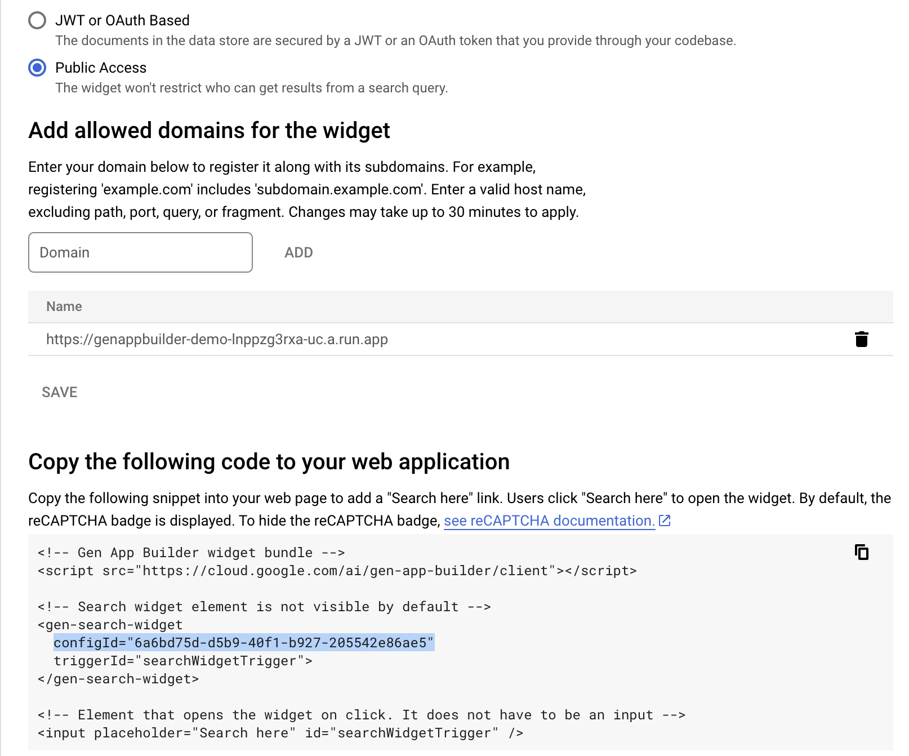

# Vertex AI Search Demo

> NOTE: Some of the features in this demo require allowlist access. If you would like early access, apply to become a [Trusted Tester for Google Cloud Generative AI][trustedtester].

This demo illustrates how to search through a corpus of documents using [Vertex AI Search][enterprisesearch] (formerly known as Enterprise Search).

Additional features include how to search the public Cloud Knowledge Graph using the [Enterprise Knowledge Graph][enterpriseknowledgegraph] API.

## Architecture

### Google Cloud Products Used

- [Vertex AI Search][enterprisesearch]
- [Vertex AI Search: Recommendations][try_recommendations]
- [Cloud Run][cloudrun]
- [Enterprise Knowledge Graph][enterpriseknowledgegraph]

## Setup

- Follow steps in [Get started with Vertex AI Search][try_search] for Unstructured Data.

  - Sample Data Sources used in the deployed demo:
    - [Contract Understanding Atticus Dataset (CUAD)](https://www.atticusprojectai.org/cuad)
      - `gs://cloud-samples-data/gen-app-builder/search/CUAD_v1`
    - [Alphabet Earnings Reports](https://abc.xyz/investor/)
      - `gs://cloud-samples-data/gen-app-builder/search/alphabet-investor-pdfs`

- Follow steps in [Get started with Vertex AI Search][try_search] for Websites

  - [Google Cloud site](https://cloud.google.com)
    - `https://cloud.google.com`

- Follow steps in [Get started with Recommendations][try_recommendations] for Unstructured Data.

  - Sample Data Sources used in the deployed demo:
    - [Natural language papers from ArXiv](https://arxiv.org)
      - `gs://cloud-samples-data/gen-app-builder/search/arxiv`

### Dependencies

1. [Install Python](https://www.python.org/downloads/)
2. Install the [Google Cloud SDK](https://cloud.google.com/sdk/docs/install)
3. Install the prerequisites:
   - `pip install -r requirements.txt`
4. Run `gcloud init`, create a new project, and
   [enable billing](https://cloud.google.com/billing/docs/how-to/modify-project#enable_billing_for_a_project)
5. Enable the Vertex AI Search API:
   - `gcloud services enable discoveryengine.googleapis.com`
6. Enable the Enterprise Knowledge Graph API:
   - `gcloud services enable enterpriseknowledgegraph.googleapis.com`
7. Enable Cloud Run:
   - `gcloud services enable run.googleapis.com`
8. Setup application default authentication, run:
   - `gcloud auth application-default login`

### Demo Deployment

1. Update the `consts.py` file with your own `PROJECT_ID` and `LOCATION`.

2. Configure Vertex AI Search

   - To use the prebuilt widget provided in the Cloud Console for Enterprise, Copy the `configId` from the `<gen-search-widget>` in the `Integration > Widget` tab.
     - 
     - Be sure to set authorization type as `Public Access` and add your web application url to the `Allowed Domains` once it's deployed.
     - Add the `configId` for your Search Engines to `WIDGET_CONFIGS` in `consts.py`
   - To use the Custom UI, add the datastore id for your search engine to `CUSTOM_UI_DATASTORE_IDS` in `consts.py`
     - This is the string after `/engines/` in the Cloud Console URL.
       - `https://console.cloud.google.com/gen-app-builder/engines/website-search-engine_1681248733152/...`
       - Datastore ID is `website-search-engine_1681248733152`

3. Configure Recommendations

   - Add the datastore id and engine id for your recommendations engine to `RECOMMENDATIONS_DATASTORE_IDs` in `consts.py`.
   - The datastore id is visible on the `Data > Details` page.
   - The engine id is the string after `/engines/` in the Cloud Console URL.
     - `https://console.cloud.google.com/gen-app-builder/engines/contracts-personalize_1687884886933/data/records`
     - Engine ID is `contracts-personalize_1687884886933`

4. Configure Image Search

   - Follow the instructions in the documentation to [enable image search](https://cloud.google.com/generative-ai-app-builder/docs/image-search#enable-advanced) for a website search engine.
      - NOTE: You must enable [Advanced Website Indexing](https://cloud.google.com/generative-ai-app-builder/docs/about-advanced-features#advanced-website-indexing) which requires [domain verification](https://cloud.google.com/generative-ai-app-builder/docs/domain-verification).
   - Add the datastore id for your search engine to `IMAGE_SEARCH_DATASTORE_IDs` in `consts.py`.

5. Deploy the Cloud Run app in your project.

   - `gcloud run deploy vertex-ai-search-demo --source .`

   - To test locally: `flask --app main run`

6. Visit the deployed web page
   - Example: [`https://vertex-ai-search-demo-lnppzg3rxa-uc.a.run.app`](https://vertex-ai-search.web.app/)

---

> Copyright 2023 Google LLC
> Author: Holt Skinner @holtskinner

[cloudrun]: https://cloud.google.com/run
[enterpriseknowledgegraph]: https://cloud.google.com/enterprise-knowledge-graph/docs/overview
[enterprisesearch]: https://cloud.google.com/enterprise-search
[try_recommendations]: https://cloud.google.com/generative-ai-app-builder/docs/try-personalize
[try_search]: https://cloud.google.com/generative-ai-app-builder/docs/try-enterprise-search
[trustedtester]: https://cloud.google.com/ai/earlyaccess/join
