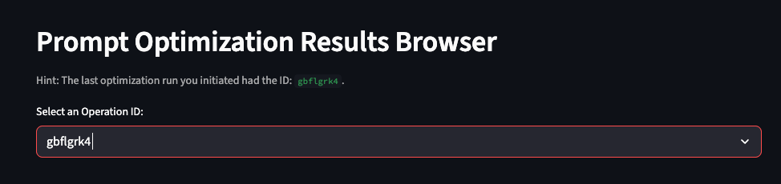

# LLM EvalKit

## Summary

LLMEvalKit is a tool designed to help developers evaluate and improve the performance of Large Language Models (LLMs) on specific tasks. It provides a comprehensive workflow to create, test, and optimize prompts, manage datasets, and analyze evaluation results. With LLMEvalKit, developers can conduct both human and model-based evaluations, compare results, and use automated processes to refine prompts for better accuracy and relevance. This toolkit streamlines the iterative process of prompt engineering and evaluation, enabling developers to build more effective and reliable LLM-powered applications.


**Authors: [Mike Santoro](https://github.com/Michael-Santoro), [Katherine Larson](https://github.com/kat-litinsky)**

## 🚀 Getting Started

There are two ways to work through a tutorial of this application one method is more stable one is less stable.

1. Scroll down to the Tutorial Section here.

2. Open this [notebook](https://github.com/GoogleCloudPlatform/generative-ai/blob/main/tools/llmevalkit/prompt-management-tutorial.ipynb) in colab running the application on a colab server.

## Overview

This tutorial provides a comprehensive guide to prompt engineering, covering the entire lifecycle from creation to evaluation and optimization. It's broken down into the following sections:

1.  **Prompt Management:** This section focuses on the core tasks of creating, editing, and managing prompts. You can:
    -   **Create new prompts:** Define the prompt's name, text, the model it's designed for, and any system instructions.
    -   **Load and edit existing prompts:** Browse a library of saved prompts, load a specific version, and make modifications.
    -   **Test prompts:** Before saving, you can provide sample input and generate a response to see how the prompt performs.
    -   **Versioning:** Each time you save a change to a prompt, a new version is created, allowing you to track its evolution and compare different iterations.

2.  **Dataset Creation:** A crucial part of prompt engineering is having good data to test and evaluate your prompts. This section allows you to:

    -   **Create new datasets:** A dataset is essentially a folder in Google Cloud Storage where you can group related files.
    -   **Upload data:** You can upload files in CSV, JSON, or JSONL format to your datasets. This data will be used for evaluating your prompts.

3.  **Evaluation:** Once you have a prompt and a dataset, you need to see how well the prompt performs. The evaluation section helps you with this by:

    -   **Running evaluations:** You can select a prompt and a dataset and run an evaluation. This will generate responses from the model for each item in your dataset.
    -   **Human-in-the-loop rating:** For a more nuanced evaluation, you can manually review the model's responses and rate them.
    -   **Automated metrics:** The tutorial also supports automated evaluation metrics to get a quantitative measure of your prompt's performance.

4.  **Prompt Optimization:** This section helps you automatically improve your prompts. It uses Vertex AI's prompt optimization capabilities to:

    -   **Configure and launch optimization jobs:** You can set up and run a job that will take your prompt and a dataset and try to find a better-performing version of the prompt.

5.  **Prompt Optimization Results:** After an optimization job has run, this section allows you to:

    -   **View the results:** You can see the different prompt versions that the optimizer came up with and how they performed.
    -   **Compare versions:** The results are presented in a way that makes it easy to compare the different optimized prompts and choose the best one.

6.  **Prompt Records:** This is a leaderboard that shows you the evaluation results of all your different prompt versions. It helps you to:

    -   **Track performance over time:** See how your prompts have improved with each new version.
    -   **Compare different prompts:** You can compare the performance of different prompts for the same task.

In summary, this tutorial provides a complete and integrated environment for all your prompt engineering needs, from initial creation to sophisticated optimization and evaluation.

## Tutorial: Step-by-Step

This section walks you through using the app.

### 0. Startup

First, clone the repository and set up the environment:

```bash
# Clone the repository
git clone https://github.com/GoogleCloudPlatform/generative-ai.git

# Navigate to the project directory
cd generative-ai/tools/llmevalkit

# Create a Python virtual environment
python -m venv venv

# Activate the virtual environment
source venv/bin/activate

# Install the required packages
pip install -r requirements.txt

# Run the Streamlit application
streamlit run index.py
```

Next, `cp src/.env.example src/.env` open the file and set `BUCKET_NAME` and `PROJECT_ID`

### 1. Prompt Management

In the Prompt Name field enter:

```
math_prompt_test
```

In the Prompt Data field enter:

```
Problem: {{query}}
Image: {{image}} @@@image/jpeg
Answer: {{target}}
```

In the Model Name field enter:
```
gemini-2.0-flash-001
```

In the System Instructions field enter:
```
Solve the problem given the image.
```

Click `Save`

Copy this text for testing:

```
{"query": "Hint: Please answer the question and provide the correct option letter, e.g., A, B, C, D, at the end.\nQuestion: As shown in the figure, CD is the diameter of \u2299O, chord DE \u2225 OA, if the degree of \u2220D is 50.0, then the degree of \u2220C is ()", "Choices":"\n(A) 25\u00b0\n(B) 30\u00b0\n(C) 40\u00b0\n(D) 50\u00b0", "image": "gs://github-repo/prompts/prompt_optimizer/mathvista_dataset/images/643.jpg", "target": "25\u00b0"}
```

🖱️ Click `Generate`.

### 2. Dataset Creation

Download a copy of the dataset. Then upload this file in the application.

**Dataset Name:** `mathvista`

You can preview the dataset at the bottom of the page.

To download the dataset, run this command:
```bash
gsutil cp gs://github-repo/prompts/prompt_optimizer/mathvista_dataset/mathvista_input.jsonl .
```

### 3. Evaluation

We will now run an evaluation, prior to doing any tweaking to get a baseline.

- **Existing Dataset:** 'mathvista'
- **Dataset File:** 'mathvista_input.jsonl'
- **Number of Samples:** '100'
- **Ground Truth Column Name:** 'target'
- **Existing Prompt:** 'math_prompt_test'
- **Version:** '1'

Click Load Prompt, and Upload and Get Response... ⏰ Wait!!

Review the responses.

- **Model-Based:** 'question-answering-quality'

Launch the Eval... ⏰ Wait!!

View the Evaluation Results, and save to prompt records. This will save this initial version to the prompt records for the baseline.

### 4. Prompt Optimization

🔧 Set-Up Prompt Optimization.

- **Target Model:** 'gemini-2.0-flash-001'
- **Existing Prompt:** 'math_prompt_test'
- **Version:** '1'

🖱️ Click Load Prompt.

- **Select Existing Dataset:** 'mathvista'
- **Select the File:** 'mathvista_input.jsonl'

🖱️ Click Load Dataset.

Preview the dataset.

🖱️ Click Start Optimization.

**Note:** If Interested in viewing the progress, Navigate to https://console.cloud.google.com/vertex-ai/training/custom-jobs

⏰ Wait!! This step will take about 20-min to run.

### 5. Prompt Optimization Results

View the Optimization Results.

The last run will be shown at the top of the screen. Pick this from the dropdown menu:



Review the results and select the highest scoring version and copy the instruction.

### 6. Navigate Back to Prompt for New Version

Load your existing prompt from before.

📋 Paste your new instructions from the prompt optimizer, and save new version.

### 7. Run new Evaluation

Repeat step 3 with your new version.

### 8. View the Records

Navigate to the leaderboard and load the results.

## License
```
Copyright 2025 Google LLC
Licensed under the Apache License, Version 2.0 (the "License");
you may not use this file except in compliance with the License.
You may obtain a copy of the License at
    https://www.apache.org/licenses/LICENSE-2.0
Unless required by applicable law or agreed to in writing, software
distributed under the License is distributed on an "AS IS" BASIS,
WITHOUT WARRANTIES OR CONDITIONS OF ANY KIND, either express or implied.
See the License for the specific language
```
