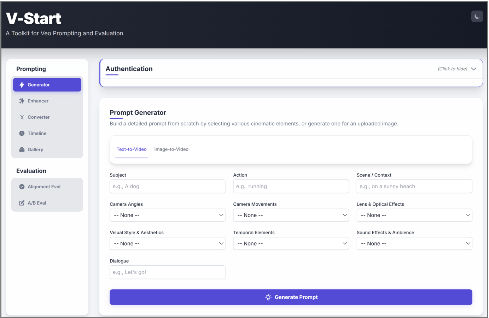
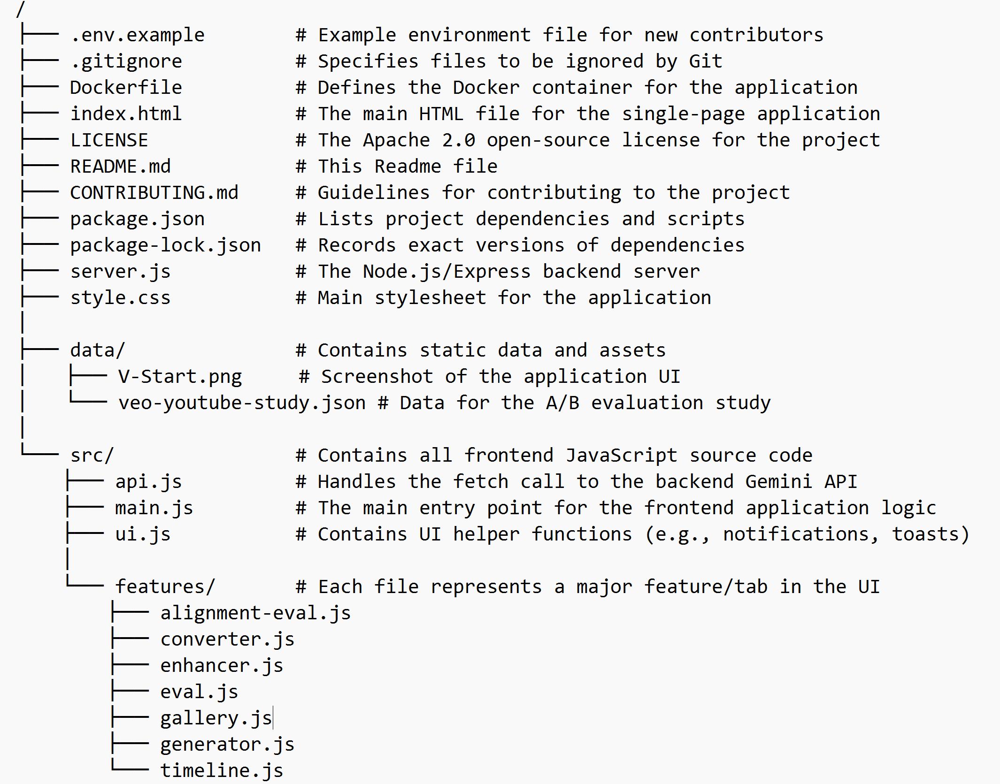

# V-Start: A Toolkit for Veo Prompting and Evaluation

[](LICENSE)

**Author: [Wafae Bakkali](https://github.com/WafaeBakkali)**

V-Start is an experimental toolkit that helps users easily and quickly create effective prompts for Veo and evaluate how well generated videos align with their intended prompts. The main goal is to simplify the process of creating high-quality videos with Veo.



## ✨ Features

V-Start is divided into two main categories: Prompting and Evaluation.

### Prompting Tools
* **Prompt Generator**: Generate expert-level prompts based on [the ideal structure for Veo](https://medium.com/google-cloud/veo-3-a-detailed-prompting-guide-867985b46018), with support for both Text-to-Video and Image-to-Video and options for short or long outputs. For Image-to-Video, a base description is automatically generated from the uploaded image, which can then be customized.
* **Prompt Enhancer**: Improve an existing prompt by leveraging Gemini to enhance its cinematic detail and effectiveness.
* **Prompt Converter**: Convert prompts between different formats, such as Plain Text, JSON, YAML or XML.
* **Timeline Prompting**: Create multi-shot scenes by sequencing multiple prompts, defining the start and end times for each action to build a detailed narrative.
* **Gallery**: Explore a curated library of high-quality video examples and copy their prompts for inspiration.

### Evaluation Tools
* **Alignment Eval**: An autorater that provides an objective score (0-100%) of how well a video matches its prompt. You can evaluate a single prompt-video pair or process multiple pairs in bulk by pasting data directly into the tool or uploading a CSV file from your local machine. The tool works by breaking the prompt into sub-questions, and Gemini uses its Visual Question Answering (VQA) capabilities to score the video's alignment. All results can be stored for further analysis.
* **Side-by-Side Comparison**: Compare videos side-by-side to gather human feedback. Participate in existing studies (like prompt format evaluation) or create your own for qualitative evaluation. Results can be stored for further analysis.

## 🛠️ Tech Stack

* **Backend**: Node.js with Express.js
* **Frontend**: HTML, CSS, and modern vanilla JavaScript (ES modules)
* **Styling**: Tailwind CSS (via CDN) with a custom dark mode theme.
* **Core AI**: Google Gemini API (specifically `gemini-2.5-pro`)
* **Deployment**: The application also includes a `Dockerfile` for containerization.

## 📂 Project Structure

The repository is organized as follows:



## Authentication Setup

V-Start supports two authentication methods for flexibility:

### Method 1: Google Cloud Access Token

This method uses your own Google Cloud Project.

1. **Set up a Google Cloud Project:**
   - Go to the [Google Cloud Console](https://console.cloud.google.com/)
   - Create a new project or select an existing one
   - Enable billing for your project

2. **Enable required APIs:**
   ```bash
   # Set your project ID
   export PROJECT_ID="your-gcp-project-id"
   gcloud config set project $PROJECT_ID
   
   # Enable Vertex AI API
   gcloud services enable aiplatform.googleapis.com
   ```

3. **Install and authenticate gcloud CLI:**
   - Install the [Google Cloud SDK](https://cloud.google.com/sdk/docs/install)
   - Authenticate with your Google account:
     ```bash
     gcloud auth login
     ```
   - Set your default project:
     ```bash
     gcloud config set project $PROJECT_ID
     ```

4. **Get your access token:**
   ```bash
   gcloud auth print-access-token
   ```
   
   **Note:** Access tokens expire after 1 hour. You'll need to run this command again to get a new token when it expires.

5. **Use in V-Start:**
   - In the V-Start UI, select "gcloud Access Token" as your authentication method
   - Enter your Project ID and the access token from step 4

### Method 2: Google AI Studio API Key

1. **Get your API Key:**
   - Go to [Google AI Studio](https://aistudio.google.com/app/apikey)
   - Sign in with your Google account
   - Click "Create API Key"
   - Choose "Create API key in new project" or select an existing project
   - Copy the generated API key

2. **Configure the application:**
   - Add the API key to your `.env` file (see Installation section below)
   - In the V-Start UI, select "API Key" as your authentication method

## 🚀 Getting Started (Local Development)

Follow these instructions to get a copy of the project up and running on your local machine.

### Prerequisites

* [Node.js](https://nodejs.org/) (v18 or later recommended)
* npm (usually comes with Node.js)
* Authentication setup (see Authentication Setup section above)

### Installation

1.  **Clone the repository:**

    ```bash
    git clone https://github.com/GoogleCloudPlatform/generative-ai.git
    cd vision/sample-apps/V-Start
    ```

2.  **Install NPM packages:**

    ```bash
    npm install
    ```

3.  **Set up your environment variables:**
    Create a file named `.env` in the root of the project by copying the example file.

    ```bash
    cp .env.example .env
    ```
    
    Open the `.env` file and add your Gemini API Key (if using Method 2):
    ```
    API_KEY=your_gemini_api_key_here
    ```
    
    **Note:** If you're only using the Access Token method, you can leave the API_KEY empty.

4.  **Run the server:**

    ```bash
    npm start
    ```

5.  Open your browser and navigate to `http://localhost:8080`.

## ☁️ Deployment to Cloud Run 

The recommended way to deploy this application is directly from source to Google Cloud Run, secured with Identity-Aware Proxy (IAP). When you deploy from source, Cloud Build automatically uses the `Dockerfile` in your repository to build and deploy your container.

### Prerequisites

* A Google Cloud Project with billing enabled.
* The [Google Cloud SDK](https://cloud.google.com/sdk/docs/install) (`gcloud` CLI) installed and authenticated.

### Step 1: Project Setup (One-Time)

Run these commands to set your project and enable the necessary APIs.

```bash
# Set your project ID
export PROJECT_ID="your-gcp-project-id"
gcloud config set project $PROJECT_ID

# Enable required services
gcloud services enable run.googleapis.com cloudbuild.googleapis.com artifactregistry.googleapis.com secretmanager.googleapis.com iap.googleapis.com
```

### Step 2: Secure Your API Key (One-Time)

Store your Gemini API key in Secret Manager.

```bash
# Create the secret
gcloud secrets create gemini-api-key --replication-policy="automatic"

# Add your API key value to the secret
printf "your_gemini_api_key_here" | gcloud secrets versions add gemini-api-key --data-file=-
```

### Step 3: Configure OAuth Consent Screen (One-Time)

This is required for IAP. In the Google Cloud Console, navigate to **APIs & Services → OAuth consent screen** and complete the setup wizard.

### Step 4: Deploy the Service

Deploy the application as a private service.

```bash
gcloud run deploy veo-start-app \
  --source . \
  --region us-central1 \
  --no-allow-unauthenticated \
  --set-env-vars="API_KEY=sm://${PROJECT_ID}/gemini-api-key/latest"
```

### Step 5: Grant Access Permissions

After deploying, make sure to enforce IAP by granting access permissions to authorized users or groups. For detailed instructions, please follow the official documentation.

**Official Guide**: [Securing Cloud Run services with IAP](https://cloud.google.com/iap/docs/enabling-cloud-run)

## License

This project is licensed under the Apache License, Version 2.0. See the [LICENSE](LICENSE) file for the full license text.

## 🤝 Contributing

Contributions are welcome! Please see the [CONTRIBUTING.md](CONTRIBUTING.md) file for guidelines on how to report bugs, suggest enhancements, or submit pull requests.