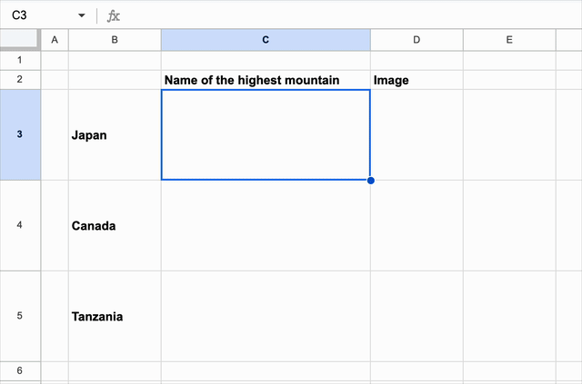

# HEY_LLM / IMAGEN

`HEY_LLM` and `IMAGEN` are custom Google Sheets functions that bring the power of large language models (LLMs) and image generation right into your spreadsheets. `HEY_LLM` connects your spreadsheet to Gemini and makes useful inferences over values in your spreadsheet. `IMAGEN` lets you generate images from text prompts directly within your cells, which you can render with Sheet's `IMAGE` function.



## Function usage

### HEY_LLM

```bash
=HEY_LLM(instruction, input, [context], [model])
```

`instruction` is a text that describes the task you want the Large Language Model (LLM) to perform, for example, "Name of the highest mountain in each country."

`input` is the input text you want to be processed according to the instruction, e.g. "Japan", "Canada".

_Optional:_ `context` is an optional cell range you can provide as context. For example, if the instruction is "Write copy to sell," you can provide a list of ad copies you find inspiring to specify the desired style.

_Optional:_ `model` is a Gemini model version to use. The default value is `gemini-1.5-flash`. See [Google models](https://cloud.google.com/vertex-ai/generative-ai/docs/learn/models) for available models.

If you don't need to specify `context` but want to specify `model`, pass an empty string to the third argument. For example, to use Gemini 1.5 Pro, the function would look like this:

```bash
=HEY_LLM(instruction, input, "", "gemini-1.5-pro")
```

### IMAGEN

```bash
=IMAGEN(prompt, [seed], [model], [aspectRatio])
```

`prompt` is a text that describes the image you want to generate.

_Optional:_ `seed` is a random seed number. Try change this number if you want to get different images.

_Optional:_ `model` is a Imagen model version to use. The default value is `imagen-3.0-fast-generate-001`. See [Generate images using text prompts](https://cloud.google.com/vertex-ai/generative-ai/docs/image/generate-images) for available models.

_Optional:_ `aspectRatio` is the aspect ratio of the generated image. The default value is `1:1`. See [Generate images using text prompts](https://cloud.google.com/vertex-ai/generative-ai/docs/image/generate-images) for available aspect ratio options.

Combine with `=IMAGE` to render the generated image in the spreadsheet.

```bash
=IMAGE(IMAGEN("Mount Fuji", 2, "imagen-3.0-generate-001", "16:9"))
```

## Prerequisites

Before you begin, you'll need to set up a few things:

### Install and set up [clasp](https://github.com/google/clasp): Clasp is a command-line tool that helps you manage Google Apps Script projects

- Install clasp globally: `npm install -g @google/clasp`
- Enable the Google Apps Script API: Visit [https://script.google.com/home/usersettings](https://script.google.com/home/usersettings) and enable the API.
- Log in with clasp: Run `clasp login` and follow the instructions to authenticate.

### Prepare a Google Cloud project and set up the OAuth2 consent screen

- Create a new project in Google Cloud Console or select an existing one.
- Navigate to "APIs & Services" > "OAuth consent screen".
- Configure the consent screen with the necessary information and publish it.

### Enable Google Drive API

- Navigate to "APIs & Services" > "Library"
- Search "Google Drive API" and hit "Enable"
  - Google Drive is used to store and host generated images.

## Create a spreadsheet with HEY_LLM and IMAGEN

### Create the spreadsheet and deploy the script

Navigate to this directory and run the following command to create a spreadsheet with `HEY_LLM` and `IMAGEN` installed. Replace `"YOUR_SHEET_NAME"` with the name you want for your spreadsheet (e.g., "My Awesome LLM Sheet").

```bash
TITLE="YOUR_SHEET_NAME" npm run create
```

### Get the Spreadsheet ID and Script ID

After running the command, you'll see URLs for the created spreadsheet and the GAS script:

```bash
Created new Google Sheet: https://drive.google.com/open?id=XXXXXX
Created new Google Sheets Add-on script: https://script.google.com/d/YYYYYY/edit
```

`XXXXXX` is your **Spreadsheet ID**, and `YYYYYY` is your **Script ID**.

You can also find these IDs in the `.clasp.json` file:

- `scriptId` is the Script ID.
- `parentId` contains the Spreadsheet ID.

### Set up OAuth2 Client ID and Secret

- Open the created spreadsheet.
- Go to "Extensions" > "YOUR_SPRINT_NAME" > "Use in this spreadsheet".
- You'll see a side menu with input boxes for "OAuth Client ID" and "OAuth Client Secret".
- Open a new browser tab and go to Google Cloud Console.
- Navigate to "APIs & Services" > "Credentials".
- Create a new OAuth2 Client ID with the "Web Application" application type.
  - You can skip this step if you reuse an existing OAuth2 Client.
- Select the generated Client ID and:
  - Copy and paste the Client ID and Client Secret to the input boxes in the Sheet extension side menu.
  - Add `https://script.google.com/macros/d/YYYYYY/usercallback` to "Authorized redirect URIs" in OAuth2 Client Settings. (replace `YYYYYY` with your Script ID).
- Go back to the spreadsheet menu and click "Authorize".
- You will see the success message if authorization is successful.

### Start using the functions

You can now use the `HEY_LLM` and `IMAGEN` functions in your spreadsheet!

## Updating the script

To update the existing spreadsheet and associated script file with the latest source code, create a `.clasp.json` file in the same directory as this readme file with the following content and run `npm run push`.

```json
{"parentId": ["XXXXXX"], "scriptId": "YYYYYY", "rootDir": "./src"}
```

where `XXXXXX` is the **Spreadsheet ID**, and `YYYYYY` is its associated **Script ID**.

## Disclaimer

This is not an officially supported Google product.

## Caveat

_Be cautious about who you grant edit access to this spreadsheet!_

`HEY_LLM` and `IMAGEN` use Google's Vertex AI platform, and sharing your spreadsheet with others could result in unexpected charges on your account.

This extension uses the [apps-script-oauth2](https://github.com/googleworkspace/apps-script-oauth2) library to manage OAuth2 tokens, and the tokens are stored as document properties following the recommendations of the library. Granting edit permissions to others lets them retrieve these tokens.

## Author

[@tushuhei](https://github.com/tushuhei)
